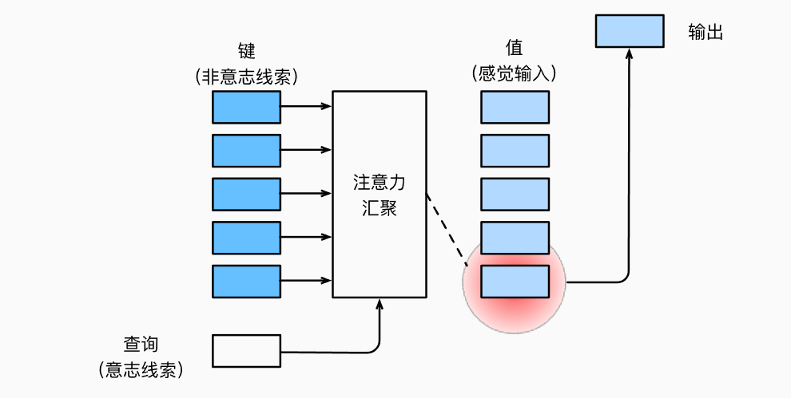
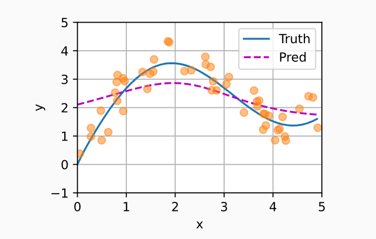
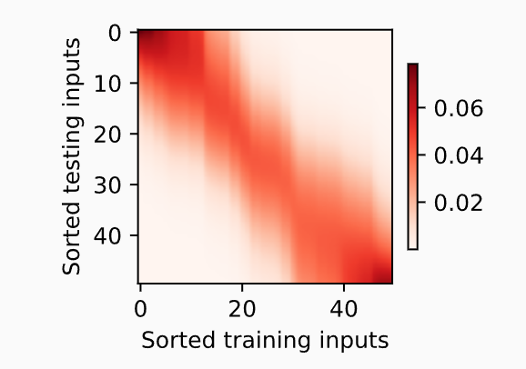
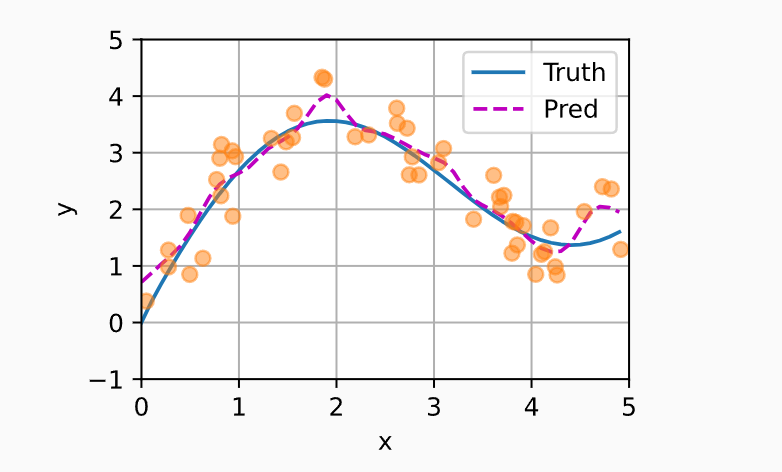
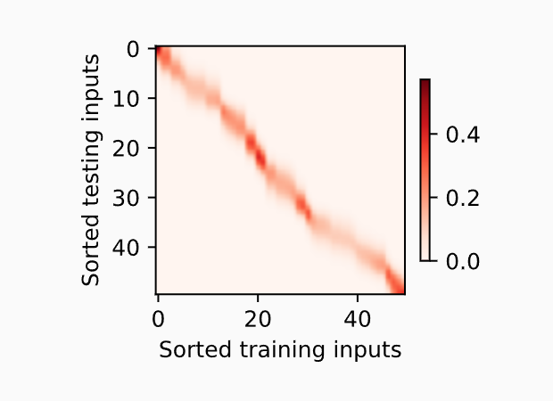

# 10.注意力机制

## 10.1.注意力提示

### 10.1.1.生物学中的注意力提示

注意力如何应用于视觉世界中的呢？这要从当今流行的双组件（two-component）的框架讲起，在这个框架中，受试者基于**非自主性提示**和**自主性提示**有选择地引导注意力的焦点。

***非自主性提示是基于环境中物体的突出行和易见性***。想象假设面前有5个物品，一份报纸、一篇论文、一杯咖啡、一本笔记本和一本书。所有印刷制品都是黑白的，但咖啡杯是红色的。换言之，这个咖啡杯在这种视觉环境中是突出和显眼的，不自觉的引起人们的注意，因此我们会把视线放在咖啡杯上。

喝完咖啡后，我们变得兴奋想读书，所以转过头，重新聚焦眼睛，然后看书。与之前由于突出性导致的选择不同，此时选择书是受到了认知和意识的控制，因此注意力在基于自主性提示去辅助选择时会更加谨慎。受试者主观意愿越大，选择的力量也越强大。

### 10.1.2.查询、键和值

自主性和非自主性的注意力提示解释了人类的注意力的方式，接下来看看如何通过这两种注意力提示，用神经网络来设计注意力机制的框架。

首先，考虑一个相对简单的情况，在这种情况下只会使用非自主性提示。要想将选择偏向于感官输入，则可以简单地使用参数化的全连接层，甚至是非参数化的最大汇聚层或平均汇聚层。

因此，”是否包含自主性提示“将注意力机制与全连接层或汇聚层区分开来。在注意力机制背景下，自主性提示被称为查询（query）。

给定任何查询，注意力机制通过注意力汇聚（attention pooling）将选择引导至感官输入（sensory inputs，例如中间特征表示）。在注意力机制中，这些感官输入被称为值（value）。更通俗的解释，每个值都与一个键（key）配对，这可以想象成感官输入的非自主性提示。如图所示，可以通过设计注意力汇聚方式，便于给定的查询（自主性提示）与键（非自主性提示）进行匹配，这将引导得出最匹配的值（感官输入）。



鉴于上面所提框架在图中的主导地位，因此这个框架下的模型将成为本章的中心。然而，注意力机制的设计有许多替代方案。例如可以设计一个不可微的注意力模型，该模型使用强化学习方法进行训练。

### 10.1.3.注意力的可视化

平均汇聚层可以被视为输入的加权平均值，其中各输入的权重是一样的。实际上，注意力汇聚得到的是加权平均的总和值，其中权重是在给定的查询和不同的键之间计算得出的。

```python
import torch
from d2l import torch as d2l
```

为了可视化注意力权重，需要定义一个show_heatmaps函数，在此不进行赘述。

### 10.1.4.小结

- 注意力机制和全连接层或者汇聚层的区别源于增加的自主提示。
- 注意力机制通过注意力汇聚使选择偏向于值（感官输入），其中包含查询（自主性提示）和键（非自主性提示）。键和值是成对的。


## 10.2.注意力汇聚：Nadaraya-Watson核回归

上节介绍了框架下的注意力机制的主要成分：查询（自主提示）和键（非自主提示）之间的交互形成了注意力汇聚；注意力汇聚有选择地聚合了值（感官输入）以生成最终的输出。

本节将介绍注意力汇聚的更多细节，以便从宏观上了解注意力机制在实践中的运作方式。具体来说，1964年提出的Nadaraya-Watson核回归模型是一个简单但完整的例子，可以用于演示具有注意力机制的机器学习。

```python
import torch
from torch import nn
from d2l import torch as d2l
```

### 10.2.1.生成数据集

考虑下面这个回归问题：给定的成对的”输入-输出“数据集$\{(x_1,y_1),...,(x_n,y_n)\}$，如何学习$f$来预测任意新输入$x$的输出$\hat{y}=f(x)$？

根据下面的非线性函数来生成一个人工数据集，其中加入的噪声项为$\epsilon$：
$$
y_i=2\sin(x_i)+x_i^{0.8}+\epsilon
$$
其中$\epsilon$服从均值为0和标准差为0.5的正态分布。在这里生成了50个训练样本和50个测试样本。为了更好地可视化之后的注意力模式，需要将训练样本进行排序。

```python
n_train=50
x_train,_ = torch.sort(torch.rand(n_train)*5)

def f(x):
    return 2 * torch.sin(x)+x**0.8
y_train = f(x_train)+torch.normal(0,0.5,(n_train,))
x_test = torch.arange(0,5,0.1)
y_truth = f(x_test)
n_test = len(x_test)
```

又通过函数`plot_kernel_reg(y_hat)`绘制所有的训练样本（圆圈），不带噪声项的真实数据生成函数$f$标记为`Truth`，学习得到的预测函数标记为`Pred`。代码这里省略。

### 10.2.2.平均汇聚

先使用最简单的估计器解决回归问题。基于平均汇聚来计算所有训练样本输出值的平均值：
$$
f(x)=\frac{1}{n}\sum_{i=1}^n y_i
$$
其中$x$是查询。显然这个估计器不够好，甚至结果与查询无关。

### 10.2.3.非参数注意力汇聚

显然，平均汇聚忽略了输入$x_i$。于是，Nadaraya提出了一个更好的想法，根据输入的未知对输出$y_i$进行加权：
$$
f(x)=\sum_{i=1}^n \frac{K(x-x_i)}{\sum_{j=1}^{n}K(x-x_j)}y_i\tag1
$$
其中$K$是核（kernel）。公式所描述的估计器被称为Nadaraya-Watson核回归（Nadaraya-Watson kernel regression）。

这里不再深入探讨核函数的细节，但受此启发，我们可以从注意力机制框架的角度重写，使其成为一个更加通用的注意力汇聚（attention pooling）公式：
$$
f(x) = \sum_{i=1}^{n}\alpha(x,x_i)y_i\tag2
$$
其中$x$是查询，$(x_i,y_i)$是键值对。注意力汇聚是$y_i$的加权平均，将查询$x$和键$x_i$之间的关系建模为注意力权重（attention weight）$\alpha(x,x_i)$，如(2)式所示，这个权重将被分配给每一个对应值$y_i$。

对于任何查询，模型在所有键值对注意力权重都是一个有效的概率分布，它是非负的，并且总和为1。

下面考虑一个高斯核（Gaussian kernel），其定义为：
$$
K(u)=\frac{1}{\sqrt{2\pi}}\exp(-\frac{u^2}{2})
$$
将高斯核代入可以得到：
$$
f(x) = \sum_{i=1}^{n}\alpha(x,x_i)y_i\\
=\sum_{i=1}^n \frac{\exp({-\frac{1}{2}}(x-x_i)^2)}{\sum_{j=1}^n\exp{(-\frac{1}{2}(x-x_j)^2)}}y_i\\
=\sum_{i=1}^n softmax(-\frac{1}{2}(x-x_i)^2)y_i\tag3
$$
在公式3中，如果一个键$x_i$越是接近给定的查询$x$，则分配给这个键对应值$y_i$的注意力权重就会越大，也就获得了更多的注意力。

值得注意的是，Nadaraya-Watson核回归是一个非参数模型。因此，公式3是非参数的注意力汇聚（nonparametric attention pooling）模型。

下图是基于这个非参数的注意力汇聚模型的预测结果，从绘制的结果会发现新的模型预测线是平滑的，并且比平均汇聚的预测更接近真实。



现在来观察注意力的权重。这里测试数据的输入相当于查询，而训练数据的输入相当于键。因为两个输入都是经过排序的，因此由观察可知”查询-键“对越接近，注意力汇聚的注意力权重就越高。



### 10.2.4.带参数注意力汇聚

非参数的Nadaraya-Watson核回归具有一致性（consistency）的优点：如果有足够的数据，此模型会收敛到最优结果。

> 非参数的Nadaraya-Watson核回归实际上就是会记住所有的键值对，模型复杂度随数据量增加而增加；在预测时，它会把查询和所有训练的键来比较，用核函数计算相似度，然后用相似度加权对应的值，得到预测度。

我们也可以把可学习的参数集成到注意力汇聚中。

例如，与公式3不同，在下面的查询$x$和键$x_i$之间的距离乘以可学习参数$w$：
$$
f(x)=\sum_{i=1}^n\alpha(x,x_i)y_i\\
=\sum_{i=1}^n \frac{\exp{(-\frac{1}{2}((x-x_i)w)^2)}}{\sum_{j=1}^n
\exp(-\frac{1}{2}((x-x_i)w)^2)}y_i\\
=\sum_{i=1}^{n}softmax(-\frac{1}{2}((x-x_i)^2)w)\tag4
$$
接下来，我们将通过训练这个模型来学习注意力汇聚的参数。

#### 10.2.4.1.批量矩阵乘法

接下来介绍深度学习框架中提供的批量矩阵乘法，以便更好地计算小批量数据的注意力。

假设第一个小批量矩阵包含$n$个矩阵$\mathbf{X}_1,...,\mathbf{X}_n$，形状为$a\times b$，第二个小批量包含$n$个矩阵$\mathbf{Y}_1,...,\mathbf{Y}_n$，形状为$b\times c$。它们的批量矩阵乘法得到$n$个矩阵$\mathbf{X}_1\mathbf{Y}_1,...,\mathbf{X}_n\mathbf{Y}_n$，形状为$a\times c$。因此，假定两个张量的形状分别是$(n,a,b)$和$(n,b,c)$，它们的批量矩阵乘法输出的形状为$(n,a,c)$。

```python
X = torch.ones((2,1,4))
Y = torch.ones((2,4,6))
torch.bmm(X,Y).shape
```

```cmd
torch.Size([2, 1, 6])
```

在注意力机制的背景中，我们可以使用小批量矩阵乘法来计算小批量数据中的加权平均值。

```python
weights = torch.ones((2,10))*0.1
values = torch.arange(20.0).reshape((2,10))
torch.bmm(weights.unsqueeze(1),values.unsqueeze(-1))
```

> unsqueeze(dim)的作用是在指定位置插入一个新的维度（大小为1）。
>
> 例如，weights的形状是(2,10)，unsqueeze(1)后，变为(2,1,10)。
>
> values的形状为(2,10)，unsqueeze(-1)后，变为(2,10,1)

#### 10.2.4.2.定义模型

基于公式4中带参数的注意力汇聚，使用小批量乘法定义Nadaraya-Watson核回归的带参数版本为：

```python
class NWKernelRegression(nn.Module):
    def __init__(self, **kwargs):
        super().__init__(**kwargs)
        self.w = nn.Parameter(torch.rand((1,), requires_grad=True))

    def forward(self, queries, keys, values):
        # queries和attention_weights的形状为(查询个数，“键－值”对个数)
        queries = queries.repeat_interleave(keys.shape[1]).reshape((-1, keys.shape[1]))
        self.attention_weights = nn.functional.softmax(
            -((queries - keys) * self.w)**2 / 2, dim=1)
        # values的形状为(查询个数，“键－值”对个数)
        return torch.bmm(self.attention_weights.unsqueeze(1),
                         values.unsqueeze(-1)).reshape(-1)
```

#### 10.2.4.3.训练

具体训练过程略，使用的是平方损失和SGD。

在训练完带参数的注意力汇聚模型后会发现：在尝试拟合带噪声的训练数据时，预测结果绘制的线不如先前的非参数模型平滑。



观察注意力图：



会发现，带参数的模型加入可学习参数后，曲线在注意力权重较大的区域变得更加不平滑。

### 10.2.5.小结

- Nadaraya-Watson核回归是具有注意力机制的机器学习典范。
- Nadaraya-Watson核回归的注意力汇聚是对训练数据中输出的加权平均。从注意力的角度来看，分配给每个值的注意力权重取决于将值所对应的键和查询作为输入的核函数。
- 注意力汇聚可以分为非参数型和带参数型。


## 10.3.注意力评分函数

