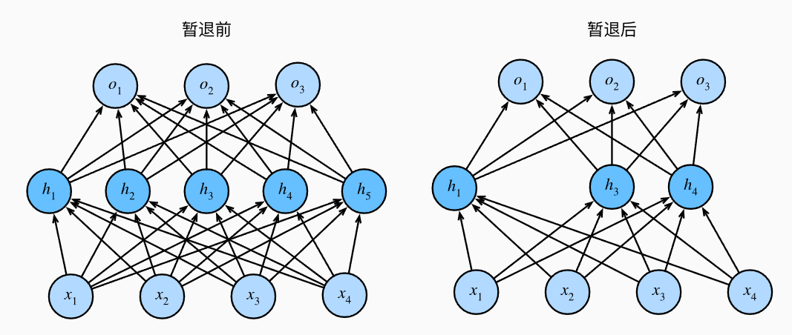

## 4.6 暂退法(Dropout)

### 4.6.1.重新审视过拟合

面对更多的特征而样本不足时，线性模型总是会过拟合；而给出更多样本而非特征时，线性模型不会过拟合。

线性模型泛化的可靠性是有代价的。线性模型没有考虑到特征之间的交互作用，对于每个特征，线性模型必须指定正或负的权重，而忽略了其他特征。

泛化性和灵活性之间的权衡被描述为*偏差-方差权衡* (bias-variance tradeoff)。线性模型有很高的偏差：他们只能表示一小类函数。然而，这些模型的方差很低：他们在不同的随机数据样本上可以得出相似的结果。

> 泛化性：对于训练数据效果好的模型，对于其他数据的效果程度。
>
> 灵活性：解释模型的能力。

深度神经网络位于*偏差-方差* 谱的另一端。与线性模型不同的是，神经网络不局限于单独查看每个特征，而是学习特征之间的交互。

> 这里可以理解为，线性模型的表达能力差，但是学习出来之后对于测试数据表现好，而深度神经网络相反。

即使有比特征多得多的样本，深度神经网络也可能过拟合。

> d2l的例子：2017年，一组研究人员通过在随机标记的图像上训练深度网络。 这展示了神经网络的极大灵活性，因为人类很难将输入和随机标记的输出联系起来， 但通过随机梯度下降优化的神经网络可以完美地标记训练集中的每一幅图像。 想一想这意味着什么？ 假设标签是随机均匀分配的，并且有10个类别，那么分类器在测试数据上很难取得高于10%的精度， 那么这里的泛化差距就高达90%，如此严重的过拟合。

深度网络的泛化性质令人费解，其数学基础仍然是悬而未决的研究问题。

### 4.6.2.扰动的稳健性

在探究泛化性之前，先来定义什么是“好”的预测模型。

我们期待“好”的预测模型能在未知的数据上有很好的表现：经典泛化理论认为，为缩小训练和测试性能之间的差距，应该以简单的模型为目标。简单性以较小维度的形式展现，参数的范数也代表了一种有用的简单性度量。

简单性的另一个角度是平滑性，即函数不应该对其输入的微小变化敏感。

> 例如对图像分类时，向像素添加一些随机噪声应该是基本无影响的。

1995年，克里斯托弗·毕晓普证明了 具有输入噪声的训练等价于Tikhonov正则化，这项工作用数学证实了“要求函数光滑”和“要求函数对输入的随机噪声具有适应性”之间的联系。

2014年，斯里瓦斯塔瓦等人就如何将毕晓普的想法应用于网络的内部层提出了一个想法：***在训练过程中，他们建议在计算后续层之前向网络每一层注入噪声***。因为当训练一个多层的深度网络时，注入噪声只会在输入-输出映射上增加平滑性。

这个想法被称为**暂退法**(dropout)。暂退法在前向传播过程中，计算每一内部层的同时注入噪声，这已经成为训练神经网络的常用技术。

这种方法之所以被称为**dropout**，因为从表面上看，是在训练过程中丢弃一些神经元。在整个训练过程的每一次迭代中，标准暂退法包括***在计算下一层之前将当前层中的一些节点置0***。

关键问题在于如何注入这种噪声。一种想法是以一种*无偏向* (unbiased)的方式注入噪声。这样固定住其他层时，每一层的期望值等于没有噪音的值。

在毕晓普的工作中，他将高斯噪声添加到线性模型的输入中。在每次训练迭代中，他将从均值为零的分布$\epsilon \sim \mathcal{N}(0,\sigma^2)$采样噪声加入到输入$\mathbf{x}$，从而产生扰动点$\mathbf{x}' = \mathbf{x} + \epsilon$，预期是$E[\mathbf{x}'] = \mathbf{x}$。

在标准暂退法正则化中，通过按保留的节点的分数进行规范化来消除每一层的偏差。每个中间活性值$h$以暂退概率$p$由随机变量$h'$代替，如下：
$$
\begin{split}\begin{aligned}
h' =
\begin{cases}
    0 & \text{ 概率为 } p \\
    \frac{h}{1-p} & \text{ 其他情况}
\end{cases}
\end{aligned}\end{split}
$$
根据此模型，其期望值不变，即$E[h'] = h$。

### 4.6.3.实践中的暂退法

假设一个带有1个隐藏层和5个隐藏单元的多层感知机。

当我们将暂退法应用于隐藏层，以$p$的概率将隐藏单元置为0时，结果可以看作一个只包含***原始神经元子集***的网络。

如图，删除了$h_2$和$h_5$，因此输出的计算不再依赖于$h_2$和$h_5$，并且他们各自的梯度在执行反向传播时也会消失。这样，输出层的计算不能过度依赖于$h_1,h_2,h_3,h_4,h_5$中的任何一个元素。



在测试时，通常不使用暂退法。给定一个训练好的模型和一个新的样本，我们不会丢弃任何节点，因此不需要标准化。

> 然而也有一些例外，在测试时使用暂退法可以用于估计神经网络预测的“不确定性”：如果通过许多不同的暂退法遮盖后得到的预测结果是一致的，可以说网络发挥更稳定。

### 4.6.4.从零开始实现

单层的暂退法函数比较简单，从均匀分布$U[0,1]$中抽取样本，样本数与这层神经网络的维度一致。然后保留对应样本大于p的节点，剩下的丢弃。

在下面的函数中，以dropout的概率丢弃张量输入$X$中的元素，将剩余部分除以$1.0-dropout$。

```python
import torch
from torch import nn
from d2l import torch as d2l

def dropout_layer(X, dropout):
    assert 0 <= dropout <= 1
    # 在本情况中，所有元素都被丢弃
    if dropout == 1:
        return torch.zeros_like(X)
    # 在本情况中，所有元素都被保留
    if dropout == 0:
        return X
    mask = (torch.rand(X.shape) > dropout).float()
    return mask * X / (1.0 - dropout)
```

#### 4.6.4.1.定义模型参数

以Fashion-MNIST数据集为例，定义有两个隐藏层的多层感知机，每个隐藏层包含256个单元。

```python
num_inputs, num_outputs, num_hiddens1, num_hiddens2 = 784, 10, 256, 256
```

#### 4.6.4.2.定义模型

我们可以将暂退法应用于每个隐藏层的输出（在激活函数之后），并且可以为每一层分别设置暂退率：常见的技巧是***在靠近输入层的地方设置较低的暂退概率***。下面的模型将第一个与第二个隐藏层的暂退概率分别设置为0.2与0.5，并且暂退法只在训练期间有效。

```python
dropout1, dropout2 = 0.2, 0.5

class Net(nn.Module):
    def __init__(self, num_inputs, num_outputs, num_hiddens1, num_hiddens2,
                 is_training = True):
        super(Net, self).__init__()
        self.num_inputs = num_inputs
        self.training = is_training
        self.lin1 = nn.Linear(num_inputs, num_hiddens1)
        self.lin2 = nn.Linear(num_hiddens1, num_hiddens2)
        self.lin3 = nn.Linear(num_hiddens2, num_outputs)
        self.relu = nn.ReLU()

    def forward(self, X):
        H1 = self.relu(self.lin1(X.reshape((-1, self.num_inputs))))
        # 只有在训练模型时才使用dropout
        if self.training == True:
            # 在第一个全连接层之后添加一个dropout层
            H1 = dropout_layer(H1, dropout1)
        H2 = self.relu(self.lin2(H1))
        if self.training == True:
            # 在第二个全连接层之后添加一个dropout层
            H2 = dropout_layer(H2, dropout2)
        out = self.lin3(H2)
        return out


net = Net(num_inputs, num_outputs, num_hiddens1, num_hiddens2)
```

#### 4.6.4.3.训练和测试

```python
num_epochs, lr, batch_size = 10, 0.5, 256
loss = nn.CrossEntropyLoss(reduction='none')
train_iter, test_iter = d2l.load_data_fashion_mnist(batch_size)
trainer = torch.optim.SGD(net.parameters(), lr=lr)
d2l.train_ch3(net, train_iter, test_iter, loss, num_epochs, trainer)
```

### 4.6.5.简洁实现

只需在每个全连接层之后添加一个Dropout层，将暂退概率作为唯一的参数传递给他的构造函数。训练时，Dropout层将根据指定的暂退概率随机丢弃上一层的输出（相当于下一层的输入）。测试时，Dropout层仅传递数据。

```python
net = nn.Sequential(nn.Flatten(),
        nn.Linear(784, 256),
        nn.ReLU(),
        # 在第一个全连接层之后添加一个dropout层
        nn.Dropout(dropout1),
        nn.Linear(256, 256),
        nn.ReLU(),
        # 在第二个全连接层之后添加一个dropout层
        nn.Dropout(dropout2),
        nn.Linear(256, 10))

def init_weights(m):
    if type(m) == nn.Linear:
        nn.init.normal_(m.weight, std=0.01)

net.apply(init_weights);
```

测试时：

```python
trainer = torch.optim.SGD(net.parameters(), lr=lr)
d2l.train_ch3(net, train_iter, test_iter, loss, num_epochs, trainer)
```

### 4.6.6. Summary

- 暂退法可以在前向传播过程中，计算每一内部层的同时丢弃一些神经元。
- 暂退法可以避免过拟合，通常与控制权重向量的维数和大小结合使用。
- 暂退法将活性值$h$替换为具有期望值$h$的随机变量。
- 暂退法仅在训练期间使用。


