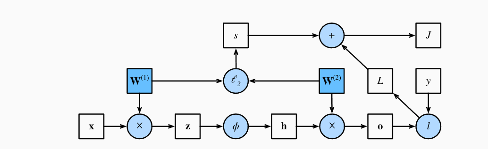
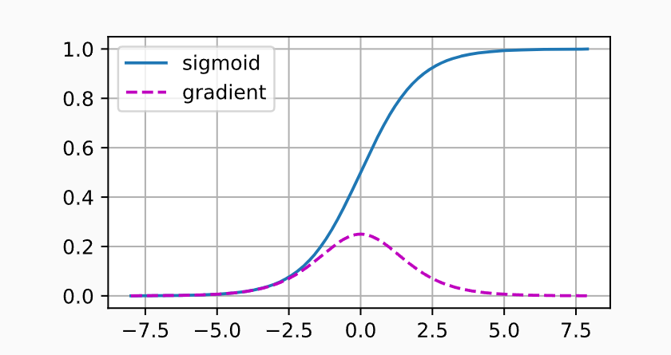

## 4.6 暂退法(Dropout)

### 4.6.1.重新审视过拟合

面对更多的特征而样本不足时，线性模型总是会过拟合；而给出更多样本而非特征时，线性模型不会过拟合。

线性模型泛化的可靠性是有代价的。线性模型没有考虑到特征之间的交互作用，对于每个特征，线性模型必须指定正或负的权重，而忽略了其他特征。

泛化性和灵活性之间的权衡被描述为*偏差-方差权衡* (bias-variance tradeoff)。线性模型有很高的偏差：他们只能表示一小类函数。然而，这些模型的方差很低：他们在不同的随机数据样本上可以得出相似的结果。

> 泛化性：对于训练数据效果好的模型，对于其他数据的效果程度。
>
> 灵活性：解释模型的能力。

深度神经网络位于*偏差-方差* 谱的另一端。与线性模型不同的是，神经网络不局限于单独查看每个特征，而是学习特征之间的交互。

> 这里可以理解为，线性模型的表达能力差，但是学习出来之后对于测试数据表现好，而深度神经网络相反。

即使有比特征多得多的样本，深度神经网络也可能过拟合。

> d2l的例子：2017年，一组研究人员通过在随机标记的图像上训练深度网络。 这展示了神经网络的极大灵活性，因为人类很难将输入和随机标记的输出联系起来， 但通过随机梯度下降优化的神经网络可以完美地标记训练集中的每一幅图像。 想一想这意味着什么？ 假设标签是随机均匀分配的，并且有10个类别，那么分类器在测试数据上很难取得高于10%的精度， 那么这里的泛化差距就高达90%，如此严重的过拟合。

深度网络的泛化性质令人费解，其数学基础仍然是悬而未决的研究问题。

### 4.6.2.扰动的稳健性

在探究泛化性之前，先来定义什么是“好”的预测模型。

我们期待“好”的预测模型能在未知的数据上有很好的表现：经典泛化理论认为，为缩小训练和测试性能之间的差距，应该以简单的模型为目标。简单性以较小维度的形式展现，参数的范数也代表了一种有用的简单性度量。

简单性的另一个角度是平滑性，即函数不应该对其输入的微小变化敏感。

> 例如对图像分类时，向像素添加一些随机噪声应该是基本无影响的。

1995年，克里斯托弗·毕晓普证明了 具有输入噪声的训练等价于Tikhonov正则化，这项工作用数学证实了“要求函数光滑”和“要求函数对输入的随机噪声具有适应性”之间的联系。

2014年，斯里瓦斯塔瓦等人就如何将毕晓普的想法应用于网络的内部层提出了一个想法：***在训练过程中，他们建议在计算后续层之前向网络每一层注入噪声***。因为当训练一个多层的深度网络时，注入噪声只会在输入-输出映射上增加平滑性。

这个想法被称为**暂退法**(dropout)。暂退法在前向传播过程中，计算每一内部层的同时注入噪声，这已经成为训练神经网络的常用技术。

这种方法之所以被称为**dropout**，因为从表面上看，是在训练过程中丢弃一些神经元。在整个训练过程的每一次迭代中，标准暂退法包括***在计算下一层之前将当前层中的一些节点置0***。

关键问题在于如何注入这种噪声。一种想法是以一种*无偏向* (unbiased)的方式注入噪声。这样固定住其他层时，每一层的期望值等于没有噪音的值。

在毕晓普的工作中，他将高斯噪声添加到线性模型的输入中。在每次训练迭代中，他将从均值为零的分布$\epsilon \sim \mathcal{N}(0,\sigma^2)$采样噪声加入到输入$\mathbf{x}$，从而产生扰动点$\mathbf{x}' = \mathbf{x} + \epsilon$，预期是$E[\mathbf{x}'] = \mathbf{x}$。

在标准暂退法正则化中，通过按保留的节点的分数进行规范化来消除每一层的偏差。每个中间活性值$h$以暂退概率$p$由随机变量$h'$代替，如下：
$$
\begin{split}\begin{aligned}
h' =
\begin{cases}
    0 & \text{ 概率为 } p \\
    \frac{h}{1-p} & \text{ 其他情况}
\end{cases}
\end{aligned}\end{split}
$$
根据此模型，其期望值不变，即$E[h'] = h$。

### 4.6.3.实践中的暂退法

假设一个带有1个隐藏层和5个隐藏单元的多层感知机。

当我们将暂退法应用于隐藏层，以$p$的概率将隐藏单元置为0时，结果可以看作一个只包含***原始神经元子集***的网络。

如图，删除了$h_2$和$h_5$，因此输出的计算不再依赖于$h_2$和$h_5$，并且他们各自的梯度在执行反向传播时也会消失。这样，输出层的计算不能过度依赖于$h_1,h_2,h_3,h_4,h_5$中的任何一个元素。


在测试时，通常不使用暂退法。给定一个训练好的模型和一个新的样本，我们不会丢弃任何节点，因此不需要标准化。

> 然而也有一些例外，在测试时使用暂退法可以用于估计神经网络预测的“不确定性”：如果通过许多不同的暂退法遮盖后得到的预测结果是一致的，可以说网络发挥更稳定。

### 4.6.4.从零开始实现

单层的暂退法函数比较简单，从均匀分布$U[0,1]$中抽取样本，样本数与这层神经网络的维度一致。然后保留对应样本大于p的节点，剩下的丢弃。

在下面的函数中，以dropout的概率丢弃张量输入$X$中的元素，将剩余部分除以$1.0-dropout$。

```python
import torch
from torch import nn
from d2l import torch as d2l

def dropout_layer(X, dropout):
    assert 0 <= dropout <= 1
    # 在本情况中，所有元素都被丢弃
    if dropout == 1:
        return torch.zeros_like(X)
    # 在本情况中，所有元素都被保留
    if dropout == 0:
        return X
    mask = (torch.rand(X.shape) > dropout).float()
    return mask * X / (1.0 - dropout)
```

#### 4.6.4.1.定义模型参数

以Fashion-MNIST数据集为例，定义有两个隐藏层的多层感知机，每个隐藏层包含256个单元。

```python
num_inputs, num_outputs, num_hiddens1, num_hiddens2 = 784, 10, 256, 256
```

#### 4.6.4.2.定义模型

我们可以将暂退法应用于每个隐藏层的输出（在激活函数之后），并且可以为每一层分别设置暂退率：常见的技巧是***在靠近输入层的地方设置较低的暂退概率***。下面的模型将第一个与第二个隐藏层的暂退概率分别设置为0.2与0.5，并且暂退法只在训练期间有效。

```python
dropout1, dropout2 = 0.2, 0.5

class Net(nn.Module):
    def __init__(self, num_inputs, num_outputs, num_hiddens1, num_hiddens2,
                 is_training = True):
        super(Net, self).__init__()
        self.num_inputs = num_inputs
        self.training = is_training
        self.lin1 = nn.Linear(num_inputs, num_hiddens1)
        self.lin2 = nn.Linear(num_hiddens1, num_hiddens2)
        self.lin3 = nn.Linear(num_hiddens2, num_outputs)
        self.relu = nn.ReLU()

    def forward(self, X):
        H1 = self.relu(self.lin1(X.reshape((-1, self.num_inputs))))
        # 只有在训练模型时才使用dropout
        if self.training == True:
            # 在第一个全连接层之后添加一个dropout层
            H1 = dropout_layer(H1, dropout1)
        H2 = self.relu(self.lin2(H1))
        if self.training == True:
            # 在第二个全连接层之后添加一个dropout层
            H2 = dropout_layer(H2, dropout2)
        out = self.lin3(H2)
        return out


net = Net(num_inputs, num_outputs, num_hiddens1, num_hiddens2)
```

#### 4.6.4.3.训练和测试

```python
num_epochs, lr, batch_size = 10, 0.5, 256
loss = nn.CrossEntropyLoss(reduction='none')
train_iter, test_iter = d2l.load_data_fashion_mnist(batch_size)
trainer = torch.optim.SGD(net.parameters(), lr=lr)
d2l.train_ch3(net, train_iter, test_iter, loss, num_epochs, trainer)
```

### 4.6.5.简洁实现

只需在每个全连接层之后添加一个Dropout层，将暂退概率作为唯一的参数传递给他的构造函数。训练时，Dropout层将根据指定的暂退概率随机丢弃上一层的输出（相当于下一层的输入）。测试时，Dropout层仅传递数据。

```python
net = nn.Sequential(nn.Flatten(),
        nn.Linear(784, 256),
        nn.ReLU(),
        # 在第一个全连接层之后添加一个dropout层
        nn.Dropout(dropout1),
        nn.Linear(256, 256),
        nn.ReLU(),
        # 在第二个全连接层之后添加一个dropout层
        nn.Dropout(dropout2),
        nn.Linear(256, 10))

def init_weights(m):
    if type(m) == nn.Linear:
        nn.init.normal_(m.weight, std=0.01)

net.apply(init_weights);
```

测试时：

```python
trainer = torch.optim.SGD(net.parameters(), lr=lr)
d2l.train_ch3(net, train_iter, test_iter, loss, num_epochs, trainer)
```

### 4.6.6. Summary

- 暂退法可以在前向传播过程中，计算每一内部层的同时丢弃一些神经元。
- 暂退法可以避免过拟合，通常与控制权重向量的维数和大小结合使用。
- 暂退法将活性值$h$替换为具有期望值$h$的随机变量。
- 暂退法仅在训练期间使用。


## 4.7.前向传播、反向传播和计算图

在之前计算梯度时，只调用了深度学习框架提供的反向传播函数。

梯度的自动计算（自动微分）简化了深度学习算法的实现。本节通过一些基本的数学和计算图，深入探讨反向传播的细节，首先将重点放在带权重衰减（L2正则化）的单隐藏层MLP上。

### 4.7.1.前向传播

前向传播(forward propagation或forward pass)指的是：按顺序（从输入层到输出层）计算和存储神经网络中每层的结果。

简单起见，假设输入样本是$\mathbf{x}\in \mathbb{R}^d$，并且假设隐藏层不包含偏置。

这里的中间变量是：
$$
\mathbf{z}= \mathbf{W}^{(1)} \mathbf{x},
$$
其中$\mathbf{W}^{(1)} \in \mathbb{R}^{h \times d}$是隐藏层的权重参数。将中间变量$\mathbf{z}\in \mathbb{R}^h$通过激活函数$\phi$后，得到长度为$h$的隐藏激活向量：
$$
\mathbf{h}= \phi (\mathbf{z}).
$$
隐藏变量$h$是一个中间变量。假设输出层的参数只有权重$\mathbf{W}^{(2)} \in \mathbb{R}^{q \times h}$，我们可以得到输出层变量，是一个长度为$q$的向量：
$$
\mathbf{o}= \mathbf{W}^{(2)} \mathbf{h}.
$$
假设损失函数为$l$，样本标签为$y$，我们可以计算单个数据样本的损失项，
$$
L = l(\mathbf{o}, y).
$$
根据$L_2$正则化的定义，给定超参数$\lambda$，正则化项为：
$$
s = \frac{\lambda}{2} \left(\|\mathbf{W}^{(1)}\|_F^2 + \|\mathbf{W}^{(2)}\|_F^2\right),
$$

> 矩阵的Frobenius范数是将矩阵展平为向量后应用的$L_2$范数。

模型在给定数据样本的正则化损失为：
$$
J=L+s
$$
在下面的讨论中，将$J$称为目标函数。

### 4.7.2.前向传播计算图

该图是上述网络的计算图，正方形表示变量，圆圈表示操作符。

左下角表示输入，右上角表示输出。




注意到，数据流箭头的方向主要是向右和向上的。

### 4.7.3.反向传播

反向传播(backward propagation或backpropagation)指的是***计算神经网络参数梯度的方法***。

该方法根据微积分中的链式规则，按相反的顺序从输出层到输入层遍历网络。该算法存储了计算某些参数梯度时所需的任何中间变量（偏导数）。

假设有函数$\mathsf{Y}=f(\mathsf{X})$和$\mathsf{Z}=g(\mathsf{Y})$，其中输入和输出$\mathsf{X},\mathsf{Y},\mathsf{Z}$是任意形状的张量。

根据链式法则，可以计算$\mathsf{Z}$关于$\mathsf{X}$的导数
$$
\frac{\partial \mathsf{Z}}{\partial \mathsf{X}} = \text{prod}\left(\frac{\partial \mathsf{Z}}{\partial \mathsf{Y}}, \frac{\partial \mathsf{Y}}{\partial \mathsf{X}}\right).
$$

> 在这里使用prod运算符在执行必要的操作（如换位和交换输入位置）后将其参数相乘。对于向量，只是简单的矩阵-矩阵乘法。对于高维张量，我们使用适当的对应项。prod运算符指代了这些所有的符号。

再次以该计算图为例


其中，单隐藏层简单网络的参数是$\mathbf{W}^{(1)}$和$\mathbf{W}^{(2)}$.

反向传播的目的是计算梯度$\partial{J}/ \partial{\mathbf{W^{(1)}}}$和$\partial J/\partial \mathbf{W}^{(2)}$。为此应用链式法则，依次计算每个中间变量和参数的梯度。计算的顺序与前向传播中执行的顺序相反，因为需要从计算图的结果开始，并朝着参数的方向努力。第一步是计算目标函数$J=L+s$相对于损失项$L$和正则项$s$的梯度。
$$
\frac{\partial{J}}{\partial{L}}=1\ and\ \frac{\partial{J}}{\partial{s}}=1
$$
接下来，计算目标函数关于输出层变量$\mathbf{o}$的梯度：
$$
\frac{\partial{J}}{\partial{\mathbf{o}}}=prod(\frac{\partial{J}}{\partial{L}},\frac{\partial{L}}{\partial{\mathbf{o}}})=\frac{\partial{L}}{\partial{\mathbf{o}}} \in \ \mathbb{R}^q
$$
接下来，我们计算正则化项相对于两个参数的梯度：
$$
\frac{\partial{s}}{\partial{\mathbf{W}}^{(1)}}=\lambda{\mathbf{W}^{(1)}}\ and  \ \frac{\partial{s}}{\partial{\mathbf{W}^{(2)}}}=\lambda{\mathbf{W}^{(2)}}
$$
接着计算出最接近输出层的模型参数的梯度$\partial J/\partial \mathbf{W}^{(2)} \in \mathbb{R}^{q \times h}$
$$
\frac{\partial J}{\partial \mathbf{W}^{(2)}}= \text{prod}\left(\frac{\partial J}{\partial \mathbf{o}}, \frac{\partial \mathbf{o}}{\partial \mathbf{W}^{(2)}}\right) + \text{prod}\left(\frac{\partial J}{\partial s}, \frac{\partial s}{\partial \mathbf{W}^{(2)}}\right)= \frac{\partial J}{\partial \mathbf{o}} \mathbf{h}^\top + \lambda \mathbf{W}^{(2)}.
$$
为了获得关于$\mathbf{W}^{(1)}$的梯度，需要沿着输出层到隐藏层反向传播。

关于隐藏层输出的梯度$\partial J/\partial \mathbf{h} \in \mathbb{R}^h$如下：
$$
\frac{\partial J}{\partial \mathbf{h}}
= \text{prod}\left(\frac{\partial J}{\partial \mathbf{o}}, \frac{\partial \mathbf{o}}{\partial \mathbf{h}}\right)
= {\mathbf{W}^{(2)}}^\top \frac{\partial J}{\partial \mathbf{o}}.
$$
由于激活函数$\phi$是按元素计算的，计算中间变量$\mathbf{z}$的梯度$\partial J/\partial \mathbf{z} \in \mathbb{R}^h$需要使用按元素乘法运算符，用$\odot$表示：
$$
\frac{\partial J}{\partial \mathbf{z}}
= \text{prod}\left(\frac{\partial J}{\partial \mathbf{h}}, \frac{\partial \mathbf{h}}{\partial \mathbf{z}}\right)
= \frac{\partial J}{\partial \mathbf{h}} \odot \phi'\left(\mathbf{z}\right).
$$
最终可以得到$\partial J/\partial \mathbf{W}^{(1)} \in \mathbb{R}^{h \times d}$：
$$
\frac{\partial J}{\partial \mathbf{W}^{(1)}}
= \text{prod}\left(\frac{\partial J}{\partial \mathbf{z}}, \frac{\partial \mathbf{z}}{\partial \mathbf{W}^{(1)}}\right) + \text{prod}\left(\frac{\partial J}{\partial s}, \frac{\partial s}{\partial \mathbf{W}^{(1)}}\right)
= \frac{\partial J}{\partial \mathbf{z}} \mathbf{x}^\top + \lambda \mathbf{W}^{(1)}.
$$

### 4.7.4.训练神经网络

在训练神经网络时，前向传播和反向传播相互依赖，对于前向传播，沿着依赖的方向遍历计算图并计算其路径上的所有变量。然后将其应用于反向传播，计算顺序与计算图相反。

以上述简单网络为例：一方面，在前向传播期间计算正则化项$s = \frac{\lambda}{2} \left(\|\mathbf{W}^{(1)}\|_F^2 + \|\mathbf{W}^{(2)}\|_F^2\right),$取决于模型参数$\mathbf{W}^{(1)}$$\mathbf{W}^{(2)}$的当前值，这些值由优化算法根据最近迭代的反向传播给出。另一方面，反向传播期间参数的梯度计算取决于前向传播给出的隐藏变量$\mathbf{h}$的当前值。

在训练神经网络时，初始化模型参数后，交替使用前向传播和反向传播，利用反向传播给出的梯度来更新模型参数。

值得注意的是，反向传播重复利用前向传播中存储的中间值以避免重复计算，这带来的影响是需要保留中间值直到反向传播完成。这也是训练比单纯的预测需要更多内存（显存）的原因之一。

此外，这些中间值的大小与网络层的数量和批量大小成正比，因此使用更大的批量来训练更深层次的网络更容易导致内存不足。

### 4.7.5.小结

- 前向传播在神经网络定义的计算图中按顺序计算和存储中间变量，顺序是从输入层到输出层。
- 反向传播顺序相反（从输出层到输入层），计算和存储神经网络的中间变量和参数的梯度。


## 4.8. 数值稳定性和模型初始化

### 4.8.1.梯度消失和梯度爆炸

考虑一个具有$L$层、输入$\mathbf{x}$和输出$\mathbf{o}$的深层网络。每一层$l$由变换$f_l$定义，该变换的参数为权重$\mathbf{W}^{(l)}$，其隐藏变量是$\mathbf{h}^{(l)}$，令$\mathbf{h}^{(0)} = \mathbf{x}$。则网络可以表示为：
$$
\mathbf{h}^{(l)} = f_l (\mathbf{h}^{(l-1)}) \text{ 因此 } \mathbf{o} = f_L \circ \ldots \circ f_1(\mathbf{x}).
$$
如果所有隐藏变量和输入都是向量，则$\mathbf{o}$关于任何一组参数$\mathbf{W}^{(l)}$的梯度写为：
$$
\partial_{\mathbf{W}^{(l)}} \mathbf{o} = \underbrace{\partial_{\mathbf{h}^{(L-1)}} \mathbf{h}^{(L)}}_{ \mathbf{M}^{(L)} \stackrel{\mathrm{def}}{=}} \cdot \ldots \cdot \underbrace{\partial_{\mathbf{h}^{(l)}} \mathbf{h}^{(l+1)}}_{ \mathbf{M}^{(l+1)} \stackrel{\mathrm{def}}{=}} \underbrace{\partial_{\mathbf{W}^{(l)}} \mathbf{h}^{(l)}}_{ \mathbf{v}^{(l)} \stackrel{\mathrm{def}}{=}}.
$$
该梯度是$L-l$个矩阵$\mathbf{M}^{(L)} \cdot \ldots \cdot \mathbf{M}^{(l+1)}$与梯度向量$\mathbf{v}^{(l)}$的乘积。

我们容易受到数值下溢问题的影响，当将太多的概率乘在一起时，这些问题经常会出现。在处理概率时，一个常见的技巧是切换到对数空间，将数值表示的压力从尾数转移到指数。但上面的问题更加严重，矩阵$\mathbf{M}^{(l)}$可能具有各种各样的特征值，可能很小也可能很大，因此他们的乘积可能非常大也可能非常小。

不稳定梯度带来的风险不止在于数值表示，也威胁到优化算法的稳定性。我们可能面临一些问题：

- 梯度爆炸(gradient exploding)：参数更新过大，破坏了模型的稳定收敛
- 梯度消失(gradient vanishing)：参数更新过小，每次更新时几乎不会移动，导致模型无法学习。

#### 4.8.1.1.梯度消失

sigmoid函数($\frac{1}{1+exp{(-x)}}$)曾经流行，因为他类似于阈值函数。

早期的人工神经网络受到生物神经网络的启发，神经元要么完全激活要么完全不激活的想法很有吸引力。然而这是导致梯度消失的常见原因。

sigmoid函数的图像如下：



当sigmoid函数的输入很大或很小时，他的梯度都会消失。此外，当反向传播经过很多层时，除非sigmoid函数的输入接近于0，否则整个乘积的梯度可能会消失。当网络有很多层时，在某一层切断梯度是很难避免的。

因此，更稳定的ReLU系列函数已经成为默认选择。

#### 4.8.1.2.梯度爆炸

> 这里的意思就是很多个小矩阵，经过矩阵乘法之后也会很大，可能造成溢出

#### 4.8.1.3.打破对称性

神经网络设计中的另一个问题是其参数化所固有的对称性。

以一个简单的多层感知机为例，有一个隐藏层和两个隐藏单元。这种情况下，可以对第一层的权重$\mathbf{W}^{(1)}$进行重排列，并且对输出层的权重进行重排列，可以获得相同的函数。第一个隐藏单元和第二个隐藏单元没有什么区别。换言之，***每一层的隐藏单元之间具有排列对称性***。         

假设输出层将上述两个隐藏单元的多层感知机转换为仅一个输出单元，如果将隐藏层的所有参数初始化为$\mathbf{W}^{(1)} = c$，$c$为常量，在这种情况下，前向传播时，两个隐藏单元采用相同的输入和参数，产生相同的激活，该激活被送往输出单元。反向传播期间，根据$\mathbf{W}^{(1)}$对输出单元进行微分，得到一个梯度，其元素都取相同的值，所以在基于梯度的迭代之后，$\mathbf{W}^{(1)}$的所有元素仍采取相同的值，这样迭代永远不会打破对称性。隐藏层的行为就像是只有一个单元。

值得注意的是，小批量随机梯度下降不会打破这种对称性，但dropout正则化可以。

### 4.8.2.参数初始化

解决或减轻上述问题的一种方法是进行参数初始化，优化期间的注意和适当的正则化也可以进一步提高稳定性。

#### 4.8.2.1.默认初始化

在前面的部分中，一直采取正态分布来初始化权重值。如果不指定初始化方法，框架会使用默认的随机初始化方法，对于中等难度的问题，这种方法通常有效。

#### 4.8.2.2.Xavier初始化

考虑一个**没有非线性**的全连接层输出$o_i$的尺度分布。对于该层$n_{in}$输入$x_j$及其相关权重$w_{ij}$，输出由下式给出：
$$
o_{i} = \sum_{j=1}^{n_\mathrm{in}} w_{ij} x_j.
$$
权重$w_{ij}$都是从同一分布中独立抽取的。此外，假设该分布具有零均值和方差$\sigma^2$。但这并不意味着分布必须是高斯的，只要均值和方差都存在即可。

现在假设$x_j$的输入也具有零均值和方差$\gamma^2$，并且它们独立于$w_{ij}$且彼此独立，在这种情况下：
$$
\begin{split}\begin{aligned}
    E[o_i] & = \sum_{j=1}^{n_\mathrm{in}} E[w_{ij} x_j] \\&= \sum_{j=1}^{n_\mathrm{in}} E[w_{ij}] E[x_j] \\&= 0, \\
    \mathrm{Var}[o_i] & = E[o_i^2] - (E[o_i])^2 \\
        & = \sum_{j=1}^{n_\mathrm{in}} E[w^2_{ij} x^2_j] - 0 \\
        & = \sum_{j=1}^{n_\mathrm{in}} E[w^2_{ij}] E[x^2_j] \\
        & = n_\mathrm{in} \sigma^2 \gamma^2.
\end{aligned}\end{split}
$$
保持方差不变的一种方法是设定$n_{in}\sigma^2=1$。现在考虑反向传播过程，使用与前向传播相同的推断，可以看到，除非$n_{out}\sigma^2=1$，否则梯度的方差可能会增大，其中$n_{out}$是该层输出的数量。

这两个条件不可能同时满足。

退而求其次，选择满足：
$$
\begin{aligned}
\frac{1}{2} (n_\mathrm{in} + n_\mathrm{out}) \sigma^2 = 1 \text{ 或等价于 }
\sigma = \sqrt{\frac{2}{n_\mathrm{in} + n_\mathrm{out}}}.
\end{aligned}
$$
这就是现在标准且使用的Xavier初始化的基础。通常，Xavier初始化从均值为0，方差为$\sigma^2 = \frac{2}{n_\mathrm{in} + n_\mathrm{out}}$的高斯分布中采样权重。

我们也可以将其改为选择从均匀分布中抽取权重时的方差。注意均匀分布$U(-a, a)$的方差为$\frac{a^2}{3}$，将$\frac{a^2}{3}$代入到$\sigma^2$的条件中，将得到初始化值域：
$$
U\left(-\sqrt{\frac{6}{n_\mathrm{in} + n_\mathrm{out}}}, \sqrt{\frac{6}{n_\mathrm{in} + n_\mathrm{out}}}\right).
$$
上述数学推理的假设”不存在非线性“在神经网络中很容易被违反，但Xavier初始化方法在实践中被证明是有效的。

---


这里d2l里讲的不是很清楚。

$n_{in}$：该层的输入维度数量

$n_{out}$:该层的输出数量（神经元数量）

这里的Xavier初始化方法的主要功能是：不论在前向传播或是反向传播中，每层输出的方差不要变化过于剧烈。

- 方差稳定的意义是什么？

1. **梯度消失和爆炸**：在深度网络中，梯度消失和梯度爆炸是一个常见的问题。如果每一层都将方差放大，那么在多层网络中，梯度可能会很快增长至非常大的值（爆炸），或者减小至接近零（消失）。Xavier 初始化试图使得每一层的输出的方差接近于其输入的方差，从而避免梯度消失或梯度爆炸的问题。
2. **加速收敛**：Xavier 初始化使得每一层的输出的方差接近于其输入的方差，从而使得每一层的梯度的方差接近于 1。这样，每一层的参数更新的幅度就不会相差太大，从而加速收敛。

> Xavier初始化只是一种初始化权重参数的方式，随着梯度下降，$\sigma = \sqrt{\frac{2}{n_\mathrm{in} + n_\mathrm{out}}}$式不再满足，因此需要其他的处理

### 4.8.3.小结

- 在初始化参数时需谨慎，以防止梯度消失与梯度爆炸。
- 需要使用启发式初始化方法来确保梯度既不太大也不太小。
- ReLU激活函数缓解了梯度消失问题。
- 随机初始化是保证优化前打破对称性的关键。
- Xavier初始化表明，对于每一层，输出的方差不受输入数量的影响，任何梯度的方差不受输出数量的影响。


## 4.9.环境与分布偏移

### 4.9.1.分布偏移的类型

首先考虑数据分布可能发生变化的各种方式，以及为挽救模型性能可能采取的措施。

假设训练数据从某个分布$p_S(\mathbf{x},y)$中采样，但测试数据将包含从不同分布$p_T(\mathbf{x},y)$中抽取的未标记样本。如果没有任何关于$p_S$和$p_T$之间相互关系的假设，就不可能学习到一个分类器。

考虑一个二元分类问题区分猫、狗。如果分布可以以任意方式偏移，考虑最病态的情况，输入的分布保持不变：$p_S(\mathbf{x})=p_T{\mathbf{x}}$，但标签全部翻转：$p_S(y | \mathbf{x}) = 1 - p_T(y | \mathbf{x})$。而此时，输入$p(\mathbf{x})$的分布没有任何变化，我们无法区分这种情景与完全没有变化的情景。

但在对未来数据可能会发生变化的限制性假设下，这些算法可以检测这种偏移，甚至可以动态调整以提高原始分类器的精度。

#### 4.9.1.1.协变量偏移

协变量偏移是最为广泛研究的分布偏移。

这里假设：虽然输入的分布可能随时间而改变，但标签函数（即条件分布$P(y|(\mathbf{x}))$没有改变。称这种情况为协变量偏移(covariate shift)，因为这个问题是由于协变量（特征）分布的变化而产生的。

在我们认为$\mathbf{x}$导致$y$的情况下，协变量偏移是一种自然假设。

假设在区分猫和狗的问题中，训练集由真实照片组成，而测试集只包含卡通图片。

在一个与测试集的特征有本质不同的数据集上进行训练，如果没有方法来适应新领域，可能会造成问题。

#### 4.9.1.2.标签偏移

标签偏移(label shift)描述了与协变量偏移相反的问题。假设标签边缘概率$P(y)$可以改变

 

> 我看不懂这一节，不看了


## 4.10. Kaggle实战房价预测

kaggle链接：[House Prices - Advanced Regression Techniques | Kaggle](https://www.kaggle.com/c/house-prices-advanced-regression-techniques/overview)

思路：借鉴[Kaggle竞赛——房价预测_kaggle房价预测-CSDN博客](https://blog.csdn.net/m0_53062159/article/details/140087067)

### 4.10.1.pandas函数

这里的数据集是CSV格式，先学几个与CSV有关的pandas函数。

1. ``` python
   df=pd.read_csv(filepath)
   ```

   将CSV读取成DataFrame。

2. ```python
   DataFrame.to_csv(path)
   ```

   将DataFrame对象保存为CSV文件。

3. ```python
   df.head(n)/df.tail(n)
   ```

   查看前/后几行数据

4. ```pyt
   df.info()
   ```

   快速查看数据表结构和缺失情况

5. ```python
   df.describe()
   ```

   查看数值列的统计摘要

6. ```python
   df.isnull().sum()
   ```

   查看每一列的缺失值数量

   sum()是按列求和

7. ```python
   df.fillna()/df.dropna()
   ```

   填充或删除缺失值

8. ```python
   df['col'].astype(type)
   ```

   更改数据类型

### 4.10.2.特征分析

导入数据集

```python
import pandas as pd
train = pd.read_csv("data/train.csv")
test = pd.read_csv("data/test.csv")
ID = test['Id']
print("训练集大小:",train.shape)
print("测试集大小:",test.shape)
features = pd.concat([train.iloc[:,1:-1],test.iloc[:,1:]],ignore_index=True)
# print(features.iloc[0:4,:])
# print()
# print(features.iloc[-3:,:])
print(features.shape)
```

读取数据，训练集大小: (1460, 81)，测试集大小: (1459, 80)，训练集多一列是因为多了`SalePrice`。将`train`中的第一列(ID)和最后一列(SalePrice)删去，将test中的第一列删去，拼接得到所有特征数据。

### 4.10.3.数据预处理

特征有各种各样的数据类型，在建模前首先要对数据进行预处理。

首先，将所有缺失的值替换为相应特征的平均值，然后为了将所有特征放在同一尺度上，我们将特征重新缩放到零均值和单位方差（即方差为1）以标准化数据。
$$
x \leftarrow \frac{x - \mu}{\sigma},
$$
其中$\mu$和$\sigma$分别代表均值和标准差。处理后，特征具有零均值和单位方差。

> 这里d2l对于零均值和单位方差的证明有点问题，我的证明如下：
>
> 零均值：$E[\frac{x-\mu}{\sigma}] = \frac{\mu - \mu}{\sigma} = 0$。
>
> 对于方差：$E[(x-\mu)^2] =  \sigma^2$，且方差$E[(x-\mu)^2]=E[x^2]-2\mu E[x]+\mu^2 = E[x^2]-2\mu^2+\mu^2=E[x^2]-\mu^2$
>
> 则$E[x^2]=\sigma^2+\mu^2$
>
> 则
> $$
> E[(\frac{x-\mu}{\sigma}-0)^2]=E[\frac{x^2-2\mu x+\mu^2}{\sigma^2}]=\frac{1}{\sigma^2}(E[x^2]-2\mu E[x]+\mu ^2)\\
> \frac{1}{\sigma^2}(\sigma^2+\mu^2-2\mu^2+\mu^2)=\frac{1}{\sigma^2}(\sigma^2)=1
> $$
> 得证。

直观地说，标准化数据有两个原因，首先他方便优化，其次，因为不知道哪些特征是相关的，所以不想让惩罚分配给一个特征的系数比其他任何特征的系数更大。

