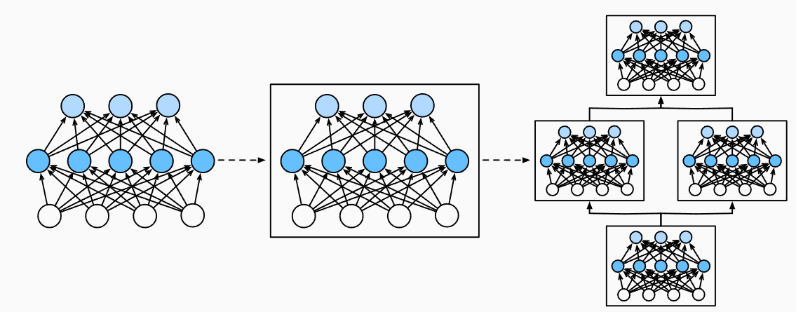

## 5.1.层和块

首次介绍神经网络时，我们关注的是具有单一输出的线性模型，整个模型只有一个输出。单个神经网络：

- 接受一些输入
- 生成相应的标量输出
- 具有一组相关参数，更新这些参数可以优化某目标函数

当考虑有多个输出的网络时，利用矢量化算法来描述整层神经元。

与单个神经元类似，层：

- 接受一组输入
- 生成相应的输出
- 由一组可调整参数描述。

对于多层感知机而言，整个模组及其组成层都是这种架构。整个模型接受原始输入（特征），生成输出（预测），并包含一些参数（所有组成层的参数集合）。同样，每个单独层接受输入（由前一层提供），生成输出（到下一层的输入），并且具有一组可调参数，这些参数根据从下一层反向传播的信号进行更新。

研究讨论“比单个层大”但“比整个模组小”的组件更有价值。例如，在CV中广泛流行的ResNet-152架构就有数百层，这些层是由层组（groups of layers)的重复模式组成。

为了实现这些复杂的网络，引入了神经网络块的概念。块（block）可以描述单个层、由多个层组成的组件或整个模型本身。使用块进行抽象的一个好处是可以将一些块组合成更大的组件，这一过程通常是递归的。如图，多个层被组合成块，形成更大的模型。



从编程的角度看，块由类（class）表示。它的任何子类都必须定义一个将其输入转换为输出的前向传播函数，并且必须存储任何必须的参数。

注意：有些块不需要计算任何参数。

为了计算梯度，块必须具有反向传播函数，在定义自己的块时，由于自动微分提供了一些后端实现，只需考虑前向传播函数和必须的参数。

在构造自定义块之前，先回顾多层感知机的代码。下面的代码生成一个网络，其中包含一个具有256个单元和ReLU激活函数的全连接隐藏层，然后是具有10个隐藏单元且不带激活函数的全连接输出层。

```python
import torch
from torch import nn
from torch.nn import functional as F
net = nn.Sequential(nn.Linear(20,256),nn.ReLU(),nn.Linear(256,10))
X = torch.rand(2,20)
net (X)
```

这个例子中，通过实例化nn.Sequential来构建模型，层的执行顺序是作为参数传递的。

换言之，nn.Sequential定义了一种特殊的Module，即在Pytorch中表示一个块的类，维护了一个由Module组成的有序列表。注意到，两个全连接层都是Linear类的实例，Linear类本身就是Module的子类。另外，目前为止我们一直通过net(X)调用模型来获得模型的输出，这实际上是`net.__call__(X)`的简写。这个前向传播函数非常简单：他将列表中每个块连接起来，每个块的输出作为下一个块的输入。

### 5.1.1.自定义块

在实现自定义块之前，先简要总结一下每个块必须提供的基本功能。

1. 将输入数据作为其前向传播函数的参数。
2. 通过前向传播函数来生成输出。注意：输出的形状可能与输入形状不同。
3. 计算其输出关于输入的梯度，可通过反向传播函数访问，通常是自动的。
4. 存储和访问前向传播计算所需的参数
5. 根据需要初始化模型参数

在下面的代码中，我们从零开始编写一个块，包含一个MLP，具有256个隐藏单元的隐藏层和一个10维输出层。下面的MLP类继承了表示块的类。我们的实现只需要提供我们自己的构造函数和前向传播函数。

```python
class MLP(nn.Module):
    def __init__(self):
        super().__init__()
        self.hidden = nn.Linear(20,256)
        self.out = nn.Linear(256,10)
    def forward(self,X):
        return self.out(F.relu(self.hidden(X)))       
```

前向传播函数以X为输入，计算带有激活函数的隐藏表示，并输出其未规范化的输出值。在这个MLP实现中，两个层都是实例变量。

接着实例化多层感知机的层，每次调用前向传播函数时调用这些层。在`__init__`函数中，通过父类的`__init__`函数省区了重复编写模板代码的麻烦。然后实例化两个全连接层，分别为self.hidden和self.out。

除非我们实现一个新的层，否则不必担心反向传播函数或参数初始化，系统将会自动生成。

### 5.1.2.顺序块

现在仔细看Sequential类是如何工作的。回想一下，Sequential的设计是为了把其他模块串起来，为了构建自己的简化MySequential，只需设计两个关键函数：

1. 将块逐个追加到列表中的函数
2. 一种前向传播函数，用于将输入按追加块的顺序传递给块组成的链条。

```python
class MySequential(nn.Module):
    def __init__(self,*args):
        super().__init__()
        for idx,module in enumerate(args):
            self._modules[str(idx)] = module
    def forward(self,X):
        for block in self._modules.values():
            X = block(X)
            return X
```

`__init__`函数将每个模块逐个添加到有序字典`_modules`中。使用`_modules`的主要优点是：在模块的参数初始化的过程中，系统知道在`_modules`字典中查找需要初始化参数的子块。

现在使用MySequential类重新实现MLP：

```python
net = MySequential(nn.Linear(20,256),nn.ReLU(),nn.Linear(256,10))
net(X)
```

### 5.1.3.在前向传播函数中执行代码

Sequential类使模型构造变简单，允许我们组合新的架构而不必定义自己的类。

然而并非所有架构都是简单的顺序架构。当需要更强的灵活性时，我们需要定义自己的块。

到目前为止，我们网络中所有的操作都对网络的激活值及网络的参数起作用。然而，有时我们可能希望合并既不是上一层的结果也不是可更新参数的项，称之为常数参数（constant parameter）。

例如需要一个计算函数$f(\mathbf{x},\mathbf{w}) = c \cdot \mathbf{w}^\top \mathbf{x}$的层，其中$\mathbf{x}$是输入，$\mathbf{w}$是参数，$\mathbf{c}$是优化过程中没有更新的指定常量。因此实现了一个FixedHiddenMLP类，如下：

```python
class FixedHiddenMLP(nn.Module):
    def __init__(self):
        self.rand_weight = torch.rand((20,20),requires_grad=False)
        self.Linear = nn.Linear(20,20)
    def forward(self,X):
        X = self.linear(X)
        X = F.relu(torch.mm(X,self.rand_weight) +1)
        X = self.linear(X)
        while X.abs().sum()>1:
            X /= 2
        return X.sum()
```

也可以混合搭配各种组合块

```python
class NestMLP(nn.Module):
    def __init__(self):
        super().__init__()
        self.net = nn.Sequential(nn.Linear(20,64),nn.ReLU(),
                                nn.Linear(64,32),nn.ReLU())
        self.Linear = nn.Linear(32,16)
    def forward(self,X):
        return self.linear(self.net(X))
chimera = nn.Sequential(NestMLP(),nn.Linear(16.20),FixedHiddenMLP())
chimera(X)
```

### 5.1.4.Summary

- 一个块可以由许多层组成；一个块可以由许多块组成。
- 块可以包含代码
- 块负责大量的内部处理，包含参数初始化与反向传播
- 层和块的顺序连接由Sequential块处理

> 根据课程视频补充：
>
> 任何一个层或神经网络在Pytorch里都是Module的子类
>
> Module有两个比较重要的函数，一个是`__init__`，另一个是`forward`

## 5.2.参数管理

选择了架构并且设置了超参数后，就进入了训练阶段。目标是找到使损失函数最小化的模型参数值。经过训练后，我们将使用这些参数来进行未来的预测。此外，有时我们希望能够提取参数，以便在其他环境复用。

本节将介绍以下内容：

- 访问参数，用于调试、诊断和可视化
- 参数初始化
- 在不同模型组件间共享参数

先看一下具有单隐藏层的MLP

```python
import torch
from torch import nn
net = nn.Sequential(nn.Linear(4,8),nn.ReLU(),nn.Linear(8,1))
X = torch.rand(size=(2,4))
net(X)
```

### 5.2.1.参数访问

在通过Sequential类定义模型时，我们可以通过索引来访问模型的任意层。就像模型是一个列表已有，每层的参数都在其属性中。如下，可以检查第二个全连接层的参数：

```python
print(net[2].state_dict())
```

假设输出结果是：

```cmd
OrderedDict([('weight', tensor([[-0.0427, -0.2939, -0.1894,  0.0220, -0.1709, -0.1522, -0.0334, -0.2263]])), ('bias', tensor([0.0887]))])
```

输出结果表示：这个全连接层有两个参数，分别是该层的权重和偏置。两者都存储为float32（单精度浮点数）。值得注意的是，参数名称允许唯一标识每个参数，即使在包含数百个层的网络中也是如此。

#### 5.2.1.1.目标参数

每个参数都可以表示为参数类的一个实例。要对参数执行任何操作，首先需要访问底层的数值。

下面的代码从第二个全连接层提取偏置，提取后返回的是一个参数类实例，并进一步访问该参数的值

```python
print(type(net[2].bias))
print()
print(net[2].bias)
print()
print(net[2].bias.data)
```

```cmd
<class 'torch.nn.parameter.Parameter'>

Parameter containing:
tensor([-0.2683], requires_grad=True)

tensor([-0.2683])
```

参数是复合的对象，包含值、梯度和额外信息。除了值之外，我们还可以访问每个参数的梯度。在上面的网络中，由于还没有调用反向传播，所以参数的梯度处于初始状态。

```python
print(net[2].bias.grad==None)
```

```cmd
True
```

#### 5.2.1.2.一次性访问所有参数

当需要处理更复杂的块（如嵌套块）时，情况可能会变得复杂，因为需要递归整个树来提取每个子块的参数。

```python
net = nn.Sequential(nn.Linear(4,8),nn.ReLU(),nn.Linear(8,1))
print(*[(name,param.shape) for name,param in net[0].named_parameters()])
print(*[(name,param.shape) for name,param in net.named_parameters()])
```

```pytorch
('weight', torch.Size([8, 4])) ('bias', torch.Size([8]))
('0.weight', torch.Size([8, 4])) ('0.bias', torch.Size([8])) ('2.weight', torch.Size([1, 8])) ('2.bias', torch.Size([1]))
```

这里提供另一种访问网络参数的方式：

```python
net.state_dict()['2.bias'].data
```

```cmd
tensor([0.0572])
```

#### 5.2.1.3.从嵌套块收集参数

现在观察如果多个块相互嵌套，参数命名约定是如何工作的。

首先定义一个生成块的函数，然后将这些块组合到更大的块中。

```python
def block1():
    return nn.Sequential(nn.Linear(4,8),nn.ReLU(),
                        nn.Linear(8,4),nn.ReLU())
def block2():
    net = nn.Sequential()
    for i in range(4):
        net.add_module(f'block{i}',block1())
    return net    
rgnet = nn.Sequential(block2(),nn.Linear(4,1))
rgnet(X)
```

> ```python
> net.add_module(f'block{i}',block1())
> ```
>
> 这个方法是往Sequential中加入block，第一个参数是字符串，代表这个module的名字，第二个是加入的module

```python
print(rgnet)
```

```cmd
Sequential(
  (0): Sequential(
    (block0): Sequential(
      (0): Linear(in_features=4, out_features=8, bias=True)
      (1): ReLU()
      (2): Linear(in_features=8, out_features=4, bias=True)
      (3): ReLU()
    )
    (block1): Sequential(
      (0): Linear(in_features=4, out_features=8, bias=True)
      (1): ReLU()
      (2): Linear(in_features=8, out_features=4, bias=True)
      (3): ReLU()
    )
    (block2): Sequential(
      (0): Linear(in_features=4, out_features=8, bias=True)
      (1): ReLU()
      (2): Linear(in_features=8, out_features=4, bias=True)
      (3): ReLU()
    )
    (block3): Sequential(
      (0): Linear(in_features=4, out_features=8, bias=True)
      (1): ReLU()
      (2): Linear(in_features=8, out_features=4, bias=True)
      (3): ReLU()
    )
  )
  (1): Linear(in_features=4, out_features=1, bias=True)
)
```

因为层是分层嵌套的，所以可以像通过嵌套列表索引一样访问它们。

如下，访问第一个主要的块中第二个子块的第一层的偏置项。

```python
rgnet[0][1][0].bias.data
```

### 5.2.2.参数初始化

知道了如何访问参数后，现在关注如何正确地初始化参数。

深度学习框架提供默认随机初始化，也允许我们自定义初始化方法，满足我们通过其他规则实现初始化权重。

默认情况下，Pytorch会根据一个范围均匀地初始化权重和偏置矩阵，这个范围是根据输入和输出维度计算出的。Pytorch的`nn.init`模型提供了多种预置初始化方法。

#### 5.2.2.1.内置初始化

首先调用内置的初始化器。下面的代码将所有权重参数初始化为标准差为0.01的高斯随机变量，并将bias设置为0。

```python
def init_normal(m):
    if type(m) == nn.Linear:
        nn.init.normal_(m.weight,mean=0,std=0.01)
        nn.init.zeros_(m.bias)
net.apply(init_normal)
```

还可以将所有参数初始化为给定常数，比如初始化为1。

```python
def init_constant(m):
    if type(m) == nn.Linear:
        nn.init.constant_(m.weight,1)
        nn.init_zeros(m.bias)
net.apply(init_constant)        
```

还可以对某些块应用不同的初始化方法。如下，使用Xavier初始化方法初始化第一个神经网络层，然后将第三个神经网络层初始化为常量值42。

```python
def init_xavier(m):
    if type(m) == nn.Linear:
        nn.init.xavier_uniform_(m.weight)
def init_42(m):
    if type(m) == nn.Linear:
        nn.init.constant_(m.weight,42)
net[0].apply(init_xavier)
net[2].apply(init_42)
```

#### 5.2.2.2.自定义初始化

深度学习框架有时未提供我们需要的初始化方法，下面的例子中，使用以下分布为任意权重参数$w$定义初始化方法：
$$
\begin{split}\begin{aligned}
    w \sim \begin{cases}
        U(5, 10) & \text{ 可能性 } \frac{1}{4} \\
            0    & \text{ 可能性 } \frac{1}{2} \\
        U(-10, -5) & \text{ 可能性 } \frac{1}{4}
    \end{cases}
\end{aligned}\end{split}
$$

```python
def my_init(m):
    if type(m) == nn.Linear:
        print("Init",*[(name,param.shape) for name,param in m.named_parameters()][0])
        nn.init.uniform_(m.weight,-10,10)
        m.weight.data *= m.weight.data.abs()>=5
net.apply(my_init)
```

也可以直接设置参数：

```python
net[0].weight.data[:] += 1
net[0].weight.data[0,0] = 42
```

### 5.2.3.参数绑定

有时我们希望在多个层间共享参数：我们可以定义一个稠密层，然后使用它的参数来设置另一个层的参数。

```python
shared = nn.Linear(8,8)
net = nn.Sequential(nn.Linear(4,8),nn.ReLU()
                   shared,nn.ReLU(),
                   shared,nn,ReLU(),
                   nn.Linear(8,1))
net(X)
```

第三个和第五个神经网络层的参数是绑定的。 它们不仅值相等，而且由相同的张量表示。如果改变其中一个参数，另一个参数也会改变。

由于模型参数包含梯度，因此在反向传播期间，第二个隐藏层和第三个隐藏层的梯度会叠加到一起。


## 5.3.延后初始化

pytorch的Linear类不支持延后初始化，但有nn.LazyLinear这样的模块支持。

这节跳过

## 5.4.自定义层

### 5.4.1.不带参数的层

首先，构建一个没有任何参数的自定义层。下面的CenteredLayer类要从其输入中减去均值。

```python
import torch
from torch import nn
class CenteredLayer(nn.Module):
    def __init__():
        super().__init__()
    def forward(self,X):
        return X - X.mean()
```

> 自定义层和自定义网络没有本质区别，因为层和网络都是nn.Module的子类

### 5.4.2.带参数的层

下面定义具有参数的层，这些参数可以通过训练进行调整。我们使用内置函数创建参数，这些函数提供一些基本的管理功能，如：管理访问、初始化、共享、保存和加载模型参数。这样的好处是不需要为每个层都编写自定义的序列化程序。

参数都是Parameter类的实例。

现在自定义一个全连接层，该层需要两个参数：权重和偏置。在这个实现中，我们使用修正线性单元作为激活函数。该层需要两个参数：`in_units`、`units`分别代表输入数和输出数。

```python
import torch.nn.functional as F
class My_Linear(nn.Module):
    def __init__(self,in_units,units):
        super().__init__()
        self.weight = nn.Parameter(torch.randn(in_units,units))
        self.bias = nn.Parameter(torch.randn(units))
    def forward(self,X):
        linear = torch.matmul(X,self.weight.data) + self.bias
        return F.relu(linear)
```

> `torch.mm`和`torch.matmul`的区别在于，`torch.mm`是二维矩阵乘法，但`torch.matmul`适用于任意维度。

接下来我们实例化My_Linear类并访问其模型参数

```python
linear = My_Linear(5,3)
linear.weight
```

```cmd
Parameter containing:
tensor([[ 0.7208,  0.2104, -0.1605],
        [ 1.1298,  1.7063,  1.4797],
        [-0.8733,  1.0015,  0.5375],
        [ 0.1359, -1.3887, -1.5400],
        [ 0.3312, -0.5747,  2.3418]], requires_grad=True)
```

也可以使用自定义层前向传播

```python
linear(torch.rand(2,5))
```

> `torch.rand` 生成的是 **[0, 1) 区间的均匀分布随机数**，而 `torch.randn` 生成的是 **均值为 0、标准差为 1 的标准正态分布随机数**。

### 5.4.3.Summary

- 可以通过基本层类设计自定义层，允许我们定义灵活的新层，其行为与深度学习框架中的任何现有层不同
- 自定义层定义完成后，即可在任意环境和网络架构中调用
- 层可以有局部参数，参数通过内置函数创建（通过`nn.Parameter`）

## 5.5.读写文件

讨论如何保存训练的模型。

### 5.5.1.加载和保存张量

对于单个张量，可以直接调用`load`和`save`函数分别读写。这两个函数都要求提供一个名称，`save`要求将要保存的变量作为输入。

```python
import torch
from torch import nn
from torch.nn import functional as F
x = torch.arange(4) #长为4的向量
torch.save(x,'x-file') #x-file是文件名

x2 = torch.load('x-file')
```

> 这里的x-file无后缀

也可以存储一个张量列表，然后把他读回内存

```python
y = torch.zeros(4)
torch.save([x,y],'x-files')
x2 , y2 = torch.load('x-files')
print((x2,y2))
```

```cmd
(tensor([0, 1, 2, 3]), tensor([0., 0., 0., 0.]))
```

甚至可以写入或读取从字符串映射到张量的字典。

```python
mydict = {'x':x,'y':y}
torch.save(mydict,'mydict')
my_dict2 = torch.load('mydict')
print(my_dict2['x'])
```

```cmd
{'x': tensor([0, 1, 2, 3]), 'y': tensor([0., 0., 0., 0.])}
```

### 5.5.2.加载和保存模型参数

深度学习框架提供内置函数来保存和加载整个网络。需要注意的是：这将保存模型的参数而不是整个模型。

```python
class MLP(nn.Module):
    def __init__(self):
        super().__init__()
        self.hidden = nn.Linear(20,256)
        self.output = nn.Linear(256,10)
net = MLP()
X = torch.randn(size = (2,20))
Y = net(X)
```

接下来将模型参数存在`'mlp.params'`的文件中

```python
torch.save(net.state_dict(),'mlp.params')
```

为了恢复模型，不止需要MLP的参数，还需要MLP的定义。

```python
clone = MLP()
clone.load_state_dict(torch.load('mlp.params'))
```

先`torch.load`把张量字典从文件中取出来，再用`load_state_dict`把state_dict覆盖掉。

### 5.5.3.小结

- `save`和`load`函数可用于张量对象的文件读写
- 可以通过参数字典保存和加载网络的全部参数
- 保存模型时，save只能保存模型参数，模型定义需要另外保存。


