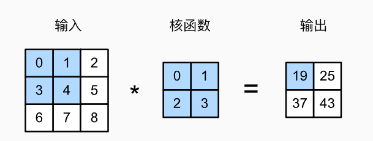
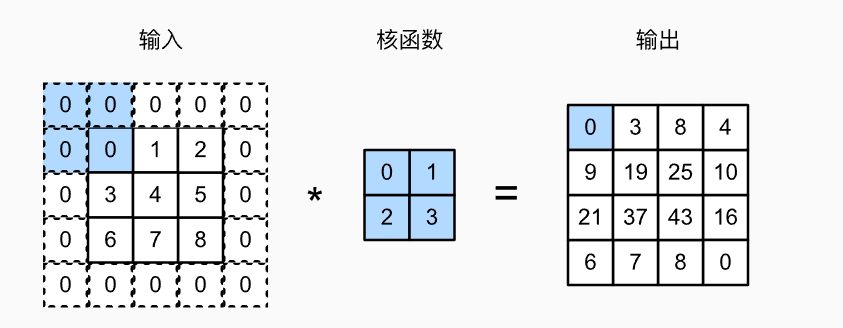
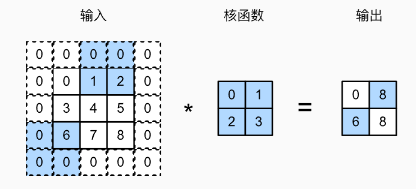
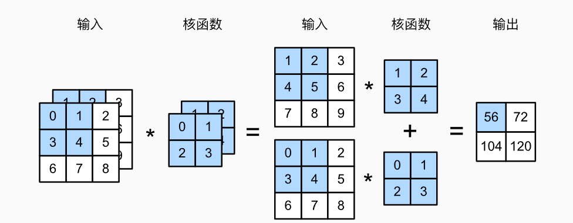
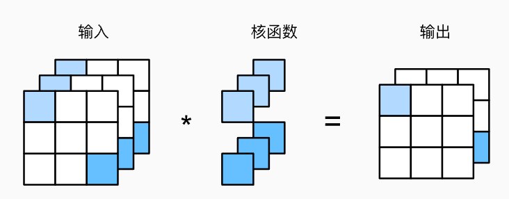
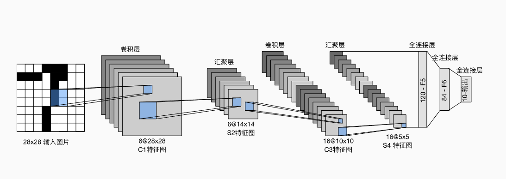

# 6.卷积神经网络

## 6.1.从全连接层到卷积

### 6.1.1.不变性

假设我们想从一张图片中找到某个个体，合理的假设是：无论哪种方法找到这个物体，都应该和物体的位置无关。

卷积神经网络正是将***空间不变性***（spatial invariance）的这一概念系统化，从而基于这个模型使用较少的参数来学习有用的表示。

将上述想法总结一下，从而帮助我们设计适合于计算机视觉的神经网络架构：

1. 平移不变性(translation invariance)：不管检测对象出现在图像中的哪个位置，神经网络的前面几层应该对相同的图像区域具有相似的反应。
2. 局部性(locality)：神经网络前面几层应该只探索输入图像的局部区域，而不过度在意图像中相隔较远区域的关系。

### 6.1.2.多层感知机的限制

重新考察多层感知机

将输入和输出变形为矩阵（宽度、高度）

将权重变形成一个四维的张量

> 这里我的理解是：原本是一个输入的长度到输出的长度的变化，现在是一个输入的高宽变成一个输出的高宽的变化。
>
> 这里的$i,j$代表输出的点在矩阵中的位置，$k,l(或者a,b)$代表输入的点在矩阵中的位置，原本一维时，$w_{i,j}$代表输入点$j$对输出点$i$的影响。而到了二维多层感知机时，$w_{i,j,k,l}$代表的是输入点$k,l$对输出点$i,j$的影响，所以是四维的

则全连接层可以形式化地表示为：
$$
h_{i,j}=\sum_{k,l}w_{i,j,k,l}x_{k,l}=\sum_{a,b}v_{i,j,a,b}x_{i+a,j+b}
$$
$V$是$W$的重新索引，因为这两个四阶张量元素之间存在一一对应关系。我们只需使$k=i+a,l=j+b$，由此可得：$v_{i,j,a,b}=w_{i,j,i+a,j+b}$。索引$a$和$b$通过在正偏移和负偏移之间移动覆盖了整个图像。对于输出中，任意给定位置$(i,j)$处的值$h_{i,j}$，可以通过在$x$中以$(i,j)$为中心对像素加权求和得到，加权使用的权重为$v_{i,j,a,b}$

#### 6.1.2.1.平移不变性

现在引用上述第一个原则：平移不变性。

这意味着检测对象在输入$X$中的平移应该且仅应该导致输出$H$中的平移，而不改变值。也就是说，$V$实际上不依赖于$i,j$的值，即$v_{i,j,a,b}=v_{a,b}$，因此将公式简化为：
$$
h_{i,j} = \sum_{a,b}{v_{a,b}x_{i+a,j+b}}
$$
这就是卷积。我们在使用系数$v_{a,b}$对位置$(i,j)$附近的像素$(i+a,j+b)$进行加权，得到$h_{i,j}$。这一简化使得参数大大减少。

#### 6.1.2.2.局部性

如上所述，为了收集用来训练参数$h_{i,j}$的相关信息，我们不应偏离到距离$(i,j)$很远的地方。这意味着在$|a|>\Delta$或者$|b|>\Delta$的范围之外，我们可以设置$v_{a,b}=0$。因此可以将$h_{i,j}$重写为：
$$
h_{i,j}=\sum_{a=-\Delta}^\Delta\sum_{b=-\Delta}^{\Delta}v_{a,b}x_{i+a,j+b}
$$
简而言之，这描述的是一个卷积层(convolutional layer)，卷积神经网络是包含卷积层的一种特殊神经网络。

在深度学习社区中，$V$被称之为***卷积核***(convolutional kernel)或者***滤波器***(filter)，亦或很简单的称之为卷积层的权重，通常该权重是可学习的参数。

当图像处理的局部区域很小时，卷积神经网络与多层感知机的训练差异是巨大的。参数大幅减少的代价是，我们的特征现在是平移不变的，并且当确定每个隐藏活性值时，每一层只包含局部的信息。

以上所有的权重学习都将依赖于这种假设。当这种假设与现实相符时，我们就能得到样本有效的模型，并且这些模型能很好地泛化到未知数据中。但如果这种假设与现实不符，我们的模型可能很难拟合训练数据。

### 6.1.3.卷积

在进一步讨论之前，先简要回顾一下为什么上面的操作被称为卷积。

在数学中，两个函数（比如$f, g: \mathbb{R}^d \to \mathbb{R}$之间的卷积被定义为：
$$
(f * g)(\mathbf{x}) = \int f(\mathbf{z}) g(\mathbf{x}-\mathbf{z}) d\mathbf{z}.
$$
也就是说，卷积就是把一个函数”翻转“并移位$x$时，测量$f$和$g$之间的重叠。当为离散变量时，积分就变成求和。

例如，对于由索引为$\mathbb{Z}$的、平方可和的、无限维向量集合种抽取的元素，我们得到以下定义：
$$
(f * g)(i) = \sum_a f(a) g(i-a).
$$
对于二维张量，则为$f$的索引$(a,b)$和$g$的索引$(i-a,j-b)$上对应的加和：
$$
(f * g)(i, j) = \sum_a\sum_b f(a, b) g(i-a, j-b).
$$
这与上面得到的式子形式类似，主要区别在于：这里不是使用$(i+a,j+b)$而是使用差值。但这种区别是表面的。

我们上面的定义：
$$
h_{i,j}=\sum_{a=-\Delta}^\Delta\sum_{b=-\Delta}^{\Delta}v_{a,b}x_{i+a,j+b}
$$
更正确地描述了互相关(cross-correlation)。

### 6.1.4.通道

然而这种方法有个问题：我们忽略了一张图片通常包含三个通道/三原色。实际上图片并非二维张量，而是一个由高度、宽度和颜色组成的三维张量。

比如包含$1024 \times 1024 \times 3$个像素，前两个轴与像素的空间位置有关，而第三个轴可以看作每个像素的多维表示。因此，我们将$X$索引为$[X]_{i,j,k}$。由此，卷积相应地调整为$[V]_{a,b,c}$，而不是$[V]_{a,b}$。

此外，由于输入图像是三维的，我们的输出（隐藏表示）$H$也最好采用三维张量。换言之，对于每一个空间位置，我们想采用一组而不是一个隐藏表示。这样一组隐藏表示可以想象成一些互相堆叠的二维网络。因此，我们也可以把隐藏表示想象为一系列具有二维张量的通道(channel)，这些通道有时也被称为***特征映射***(feature maps)，因为每个通道都向后续层提供一组空间化的学习特征。直观上可以想象在靠近输入的底层，一些通道专门识别边缘，另一些专门识别纹理。

为支持输入$\mathbf{X}$和隐藏表示$\mathbf{H}$中的多个通道，我们可以在$\mathbf{V}$中添加第四个坐标，即$[\mathbf{V}]_{a,b,c,d}$，综上所述：
$$
[\mathsf{H}]_{i,j,d} = \sum_{a = -\Delta}^{\Delta} \sum_{b = -\Delta}^{\Delta} \sum_c [\mathsf{V}]_{a, b, c, d} [\mathsf{X}]_{i+a, j+b, c},
$$
其中隐藏表示$\mathbf{H}$的索引$d$表示输出通道，而随后的输出将继续以三维张量$\mathbf{H}$作为输入进入下一个卷积层。所以，该式可定义具有多个通道的卷积层，其中$\mathbf{V}$是该卷积层的权重。

> 之前的形式是：
> $$
> h_{i,j}=\sum_{a=-\Delta}^\Delta\sum_{b=-\Delta}^{\Delta}v_{a,b}x_{i+a,j+b}
> $$
> 这里的$\mathbf{X}$、$\mathbf{H}$都加了一个坐标，是因为多了一个维度，$\mathbf{V}$加了两个坐标，其中一个是因为多了一个输入的维度，另一个是因为选择输出的维度。

### 6.1.5.小结

- 图像平移不变性使我们以相同的方式处理局部图像而不在乎他的位置。
- 局部性意味着计算相应的隐藏表示只需一小部分局部图像像素。
- 在图像处理中，卷积层通常需要比全连接层更少的参数，但仍能获得高效用模型。
- CNN是一类特殊的神经网络，可以包含多个卷积层。
- 多个输入和输出通道使模型在每个空间位置可以获取图像的多方面特征。


## 6.2.图像卷积

由于卷积神经网络的设计是用于探索图像数据，故本节将会以图像为例。

### 6.2.1.互相关运算

严格讲，卷积层是错误的叫法，他表示的运算实际是互相关运算(cross-correlation)，而不是卷积运算。在卷积层中，输入张量和核张量通过互相关运算产生输出张量。

首先，先忽略通道（第三维），先关注如何处理二维图像数据和隐藏表示。如图，输入是高度为3、宽度为3的二维张量（即形状$3 \times 3$）。卷积核为$2 \times 2$，卷积核窗口（或卷积窗口）的形状由内核的高度和宽度决定（即$2 \times 2$）。




在二维互相关运算中，卷积窗口从输入张量的右上角开始，从左向右、从上到下滑动。当卷积窗口滑动到一个新位置时，包含在该窗口中的部分张量与卷积核张量进行按元素相乘，得到的张量再求和得到一个单一的标量值，由此算出了这一位置的输出张量值。

注意：输出大小略小于输入大小。这是因为卷积核的宽度和高度大于1，而卷积核只与图像中每个大小完全合适的位置做互相关运算。所以输出大小等于输入大小$n_h \times n_\omega$减去卷积核大小$k_h \times k_\omega$，即：
$$
(n_h - k_h+1) \times (n_\omega - k_\omega+1)
$$
接下来，我们在`corr2d`函数中实现该过程，该函数接受输入张量$X$和卷积核张量$K$,并返回输出张量$Y$。

```python
import torch
from torch import nn
def corr2d(X,K):
    h,w = K.shape
    Y = torch.zeros((X.shape[0] - h + 1),(X.shape[1] - w + 1))
    for i in range(Y.shape[0]):
        for j in range(Y.shape[1]):
            Y[i,j] = (X[i:i+h , j:j + w] * K).sum()
    return Y        
```

### 6.2.2.卷积层

卷积层对输入和卷积核权重进行互相关运算，并在添加标量偏置之后产生输出。所以，卷积层中的两个被训练的参数是卷积核权重和标量偏置。

在训练基于卷积层的模型时，我们也随机初始化卷积核权重。

基于上面定义的`corr2d`函数实现二维卷积层，在`__init__`构造函数中，将`weight`和`bias`声明为两个模型参数。前向传播函数调用`corr2d`函数并添加偏置。

```python
class Conv2D(nn.Module):
    def __init__(self,kernel_size):
        super().__init__()
        self.weight = nn.Parameter(torch.rand(kernel_size))
        self.bias = nn.Parameter(torch.zeros(1))
    def forward(self,x):
        return corr2d(x,self.weight) + self.bias
```

高度和宽度分别为$h$和$w$的卷积核可以被称为$h \times w$卷积或$h \times w$卷积核，我们也将带有$h \times w$卷积核的卷积层称为$h\times w$卷积层。

### 6.2.3.图像中目标的边缘检测

如下是一个卷积层的简单应用：通过找到像素变化的位置，来检测图像中不同颜色的边缘。首先构造一个$6\times 8$像素的黑白图像。中间四列为黑色(0)，其余像素为白色(1)。

```python
X = torch.ones((6,8))
X[:,2:6] = 0
```

接下来，构造一个高度为1、宽度为2的卷积核K。当进行互相关运算时，如果水平相邻的两元素相同，则输出为0，否则为非零。

```python
K = torch.tensor([[1.0,-1.0]])
```

现在对参数$X$(输入)和$K$(卷积核)执行互相关运算。输出$Y$中的1代表白色到黑色的边缘，-1表示黑色到白色的边缘，其他情况的输出为0。

```python
Y = corr2d(X,K)
```

```cmd
tensor([[ 0.,  1.,  0.,  0.,  0., -1.,  0.],
        [ 0.,  1.,  0.,  0.,  0., -1.,  0.],
        [ 0.,  1.,  0.,  0.,  0., -1.,  0.],
        [ 0.,  1.,  0.,  0.,  0., -1.,  0.],
        [ 0.,  1.,  0.,  0.,  0., -1.,  0.],
        [ 0.,  1.,  0.,  0.,  0., -1.,  0.]])
```

如果图像转置，则无法检测。

### 6.2.4. 学习卷积核

当有了更复杂数值的卷积核，或者连续的卷积层，手动设计滤波器是不现实的。

现在我们看，是否可以通过仅查看"输入-输出"来学习由X生成Y的卷积核。我们先构造一个卷积层，并将其卷积核初始化为随机张量。接下来在每次迭代中，比较Y与卷积层输出的平方误差，然后计算梯度来更新卷积核。简单起见，这里使用内置的二维卷积层并忽略偏置。

```python
# 构造一个二维卷积层，具有一个输出通道和形状为(1,2)的卷积核
conv2d = nn.Conv2d(1,1,kernel_size=(1,2),bias=False)
# 这个二维卷积层使用四维输入和输出格式（批量大小，通道，高度，宽度）
# 批量大小和通道数都为1
X = X.reshape((1,1,6,8))
Y = Y.reshape((1,1,6,7))
lr = 3e-2 
for i in range(10):
    Y_hat = conv2d(X)
    l = (Y_hat - Y)**2
    conv2d.zero_grad()
    l.sum().backward()
    conv2d.weight.data[:] -= lr * conv2d.weight.grad
    if (i+1)%2 == 0:
        print(f"epoch{i+1},loss{l.sum():.3f}")
```

```cmd
epoch 2,loss 11.983
epoch 4,loss 2.914
epoch 6,loss 0.859
epoch 8,loss 0.296
epoch 10,loss 0.112
```

```python
print(conv2d.weight.data.reshape(1,2))
```

```cmd
tensor([[ 0.9726, -0.9929]])
```

与定义的卷积核接近。

### 6.2.5.互相关和卷积

实际上，互相关运算与卷积运算并不相同：
$$
二维交叉相关：\ \ \ \ \ \ \ \
y_{i,j} = \sum_{a=1}^h\sum_{b=1}^{w}w_{a,b}x_{i+a,j+b}\\
二维卷积：   \ \ \ \ \ \ \ \
y_{i,j} = \sum_{a=1}^h\sum_{b=1}^{w}w_{-a,-b}x_{i+a,j+b}
$$
为了得到正式的卷积运算输出，我们需要执行严格定义的卷积运算。但这两者之间差别不大，我们只需水平和垂直翻转二维卷积核张量，然后对输入张量执行互相关运算。

值得注意的是，由于卷积核是从数据中学习到的，因此无论这些层执行严格的卷积运算还是互相关运算，卷积层的输出都不会受到影响。

为了说明这一点，假设卷积层执行互相关运算并学习前述的卷积核，该卷积核这里用$K$表示。假设其他条件不变，当这个层执行严格的卷积时，学习的卷积核$K'$在水平和垂直翻转之后将与$K$相同。也就是说，当卷积层对输入和$K'$执行严格卷积运算时，将得到与互相关运算相同的输出。

为了与深度学习文献中的标准术语保持一致，我们将继续把“互相关运算”称为卷积运算。

对于卷积核张量上的权重，我们称其为元素。

### 6.2.6.特征映射和感受野

如6.1.4.节中所述，输出的卷积层有时被称为特征映射，因为它可以被视为一个输入映射到下一层的空间维度的转换器。在CNN中，对于某一层的任意元素$x$，其***感受野***(receptive field)是指***前向传播期间可能影响$x$计算的所有元素(来自所有先前层)***。

感受野可能大于输入的实际大小，继续用该图解释感受野。


给定$2\times 2$卷积核，阴影输出元素值19的感受野是输入阴影部分的四个元素。假设之前输出为$Y$，其大小为$2\times 2$，现在我们在其后附加一个卷积层，该卷积层以$Y$为输入，输出单个元素$z$。在这种情况下，$Y$上的$z$的感受野包括$Y$的所有四个元素，而输入的感受野包括最初所有九个输入元素。因此，当一个特征图中的任意元素需要检测更广区域的输入特征时，我们可以构建一个更深的网络。

### 6.2.7.小结

- 二维卷积层的核心计算是二维互相关运算。最简单的形式是，对二维输入数据和卷积核执行互相关运算，然后添加一个偏置。
- 学习卷积核时，无论使用严格卷积运算或是互相关运算，卷积层的输出不会受太大影响。
- 当需要检测输入特征中更广区域时，我们可以构建一个更深的卷积网络。
- 卷积核大小是超参数。


## 6.3.填充和步幅

假设输入形状为$n_h\times n_w$，卷积核形状为$k_h\times k_w$，则输出形状是$(n_h - k_h+1)\times (n_w-k_w+1)$。因此，卷积的输出形状取决于输入形状和卷积核形状。

有时，在应用连续的卷积后，最终得到的输出大小远小于输入大小，这是由于卷积核的高度、宽度一般大于1。如此一来，原始图像的边界丢失了许多有用的信息，而填充是解决此问题最有效的方法。

有时，我们希望大幅降低图像的宽度和高度，步幅可以在这种情况下提供帮助。

### 6.3.1.填充

如上所述，应用多层卷积时常常丢失边缘像素。由于我们通常使用小卷积核，因此对于任何单个卷积，我们可能只会丢失几个像素。但随着我们应用许多连续卷积层，累计丢失的像素数就多了。解决这个问题的简单方法就是***填充***(padding)：在输入图像的边界填充元素（通常填充元素是0）。

如图，将$3\times 3$输入填充到$5\times 5$，那么它的输出就增加为$4\times 4$。



通常，如果我们添加$p_h$行填充（大约一半在顶部，一半在底部）和$p_w$列填充（左侧大约一半，右侧大约一半），则输出形状为：
$$
(n_h-k_h+p_h+1)\times (n_w-k_w+p_w+1)
$$
意味着输出的高度和宽度将分别增加$p_h$和$p_w$。

在许多情况下，我们需要设置$p_h=k_h-1$和$p_w=k_w-1$，使输入和输出具有相同的高度和宽度。这样可以在构建网络时更容易预测每个图层的输出形状。

假设$k_h$是奇数，我们将在高度的两侧填充$p_h/2$行。如果$k_h$是偶数，则一种可能性是在输入顶部填充$\lceil p_h/2\rceil$行，在底部填充$\lfloor p_h/2\rfloor$行。填充宽度两侧的规则相同。

卷积神经网络中卷积核的高度和宽度通常为奇数，例如1、3、5、7。选择奇数的好处是，保持空间维度的同时，可以在底部和顶部、左侧和右侧填充相同数量的行/列。

此外，使用奇数的核大小和填充大小也提供了书写上的便利。对于任何二维张量X,当满足：

1. 卷积核的大小是奇数；
2. 所有边的填充行数和列数相同；
3. 输出与输入具有相同高度和宽度

则可以得出：输出$Y[i,j]$是通过以输入$X[i,j]$为中心，与卷积核进行互相关计算得到的。

比如下面的例子中，创建一个高、宽为3的二维卷积层，并在所有侧边填充一个像素。则输入与输出的形状相同。

```python
import torch
from torch import nn
def comp_conv2d(conv2d,X):
    # 这里的(1,1)表示批量大小和通道数都是1
    X = X.reshape((1,1)+X.shape)
    Y = conv2d(X)
    return Y.reshape(Y.shape[2:])
conv2d = nn.Conv2d(1,1,kernel_size = 3,padding = 1)
X = torch.rand(size = (8,8))
comp_conv2d(conv2d,X).shape
```

```cmd
torch.Size([8, 8])
```

当卷积核的高度和宽度不同时，我们可以填充不同的高度和宽度，使输出和输入具有相同的高度和宽度。如下：

```python
conv2d = nn.Conv2d(1,1,kernel_size=(5,3),padding = (2,1))
```

### 6.3.2.步幅

在计算互相关时，卷积窗口从输入张量的左上角开始，向右、下滑动。在前面的例子中，我们默认每次滑动一个元素。但有时为了高效计算或是缩减采样次数，卷积窗口可以跳过中间位置每次滑动多个元素。

我们将每次滑动元素的数量称为***步幅***（stride）。如图，采取垂直步幅为3，水平步幅为2的二维互相关运算：



着色部分是输出元素以及用于输出计算的输入和内核张量元素。

可以看到，计算输出中第一列的第二个元素和第一行的第二个元素，卷积窗口分别向下滑动三行/向右滑动两列。但当卷积窗口继续向右滑动两列时，没有输出，因为输入元素无法填充窗口。

通常，当垂直步幅为$s_h$，水平步幅为$s_w$时，输出形状为：
$$
\lfloor(n_h - k_h +p_h+s_h)/s_h \rfloor \times \lfloor(n_w-k_w+p_w+s_w)/s_w \rfloor
$$
如果我们设置了$p_h = k_h- 1$和$p_w = k_w-1$，则输出形状简化为：
$$
\lfloor(n_h +s_h-1)/s_h \rfloor \times \lfloor(n_w +s_w-1)/s_w \rfloor
$$
更进一步，如果输入的高度和宽度可以被垂直和水平步幅整除，则输出形状将为：
$$
(n_h/s_h) \times (n_w/s_w)
$$

>$\lfloor (n_h+s_h-1)/s_h \rfloor= n_h/s_h+\lfloor(1-\frac{1}{s_h})\rfloor \\=n_h/s_h$
>
>水平方向同理

下面将高度和宽度的步幅设置为2，从而将输入的高度和宽度减半：

```python
conv2d = nn.Conv2d(1,1,kernel_size = 3,padding = 1,stride = 2)
X = torch.rand(size = (8,8))
comp_conv2d(conv2d,X).shape
```

```cmd
torch.Size([4,4])
```

接下来看一个稍微复杂的例子：

```python
conv2d  = Conv2d(1,1,kernel_size=(3,5),padding =(0,1),stride=(3,4))
comp_conv2d(conv2d,X).shape
```

```cmd
torch.Size([2,2])
# (8-3+0+3)/3=2,(8-5+1+4)/3=2
```

为了简洁起见，当输入高度和宽度的两侧填充数量分别是$p_h$和$p_w$时，我们称之为填充$(p_h,p_w)$，当$p_h=p_w=p$时，填充是$p$。同理，当高度和宽度上的步幅分别为$s_h$和$s_w$时，我们称之为步幅$(s_h,s_w)$。特别地，当$s_h=s_w=s$时，我们称步幅为$s$。默认情况下，填充为0步幅为1，实践中很少采用不一致的步幅或填充。

### 6.3.3.小结

- 填充和步幅都是卷积层的超参数。

- 填充可以增加输出的高度和宽度，通常用来使输出与输入具有相同的高和宽。
- 步幅可以减小输出的高和宽。
- 填充和步幅可以有效地调整数据的维度。


## 6.4.多输入多输出通道

目前为止，仅展示了单个输入和单个输出通道的简化例子，这使得我们可以将输入、卷积核和输出可以看作二维张量。当我们添加通道时，我们的输入和隐藏表示都变成了三维张量。例如每个RGB输入图像具有$3 \times h \times w$的形状。我们将这个大小为3的轴称为***通道***（channel）维度。

### 6.4.1.多输入通道

当输入包含多个通道时，需要构造一个与输入数据具有相同输入通道数的卷积核，以便与输入数据进行互相关运算。

假设输入的通道数为$c_i$，那么卷积核的输入通道数也需要$c_i$。如果卷积核的窗口形状是$k_h \times k_w$，那么当$c_i=1$时，我们可以将卷积核看作形状为$k_h \times k_w$的二维张量。

当$c_i>1$时，卷积核的每个输入通道将包含形状为$k_h \times k_w$的张量。将这些张量$c_i$连结在一起可以得到形状为$c_i \times k_h \times k_w$的卷积核。由于输入和卷积核都有$c_i$个通道。我们可以对每个通道输入的二维张量和卷积核的二维张量进行互相关运算，再对通道求和得到二维张量。这是多通道输入和多输入通道卷积核之间进行二维运算的结果。

如图：



接下来我们实现多输入通道互相关运算。简而言之，所做的是对每个通道进行互相关运算然后将结果累加：

```python
import torch
from d2l import torch as d2l
def corr2d_multi_in(X,K):
    return sum(d2l.corr2d(x,k) for x,k in zip(X,K))
```

### 6.4.2.多输出通道

在最流行的神经网络架构中，随着神经网络层数的加深，我们常会增加输出通道的维数，通过减少空间分辨率以获得更大的通道深度。

直观地讲，我们可以将每个通道看作对不同特征的响应。但实际情况可能更复杂，因为每个通道不是独立学习的，而是为了共同使用而优化的。因此多输出通道并不仅仅是学习多个单通道的检测器。

> 每个输出通道可以识别特定模式
>
> 输入通道核 识别并组合输入中的模式

用$c_i$和$c_o$分别表示输入和输出通道的数目，并让$k_h$和$k_w$为卷积核的高度和宽度。为了获得多个通道的输出，我们可以为每个输出通道创建一个形状为$c_i \times k_h \times k_w$的卷积核张量，这样卷积核的形状应该是$c_o\times c_i\times k_h\times k_w$。在互相关运算中，每个输出通道先获取所有输入通道，再以对应该输出通道的卷积核计算出结果。

```python
def corr2d_multi_in_out(X,K):
    return torch.stack([corr2d_multi_in(X,k) for k in K],0)
```

### 6.4.3. 1x1卷积层

$1\times 1$卷积，即$k_h=k_w=1$，看起来意义不大，因为卷积的本质是有效提取相邻像素间的相关特征，而$1\times 1$显然没有这种作用。尽管如此，$1\times 1$卷积层仍然十分流行，经常包含在复杂深层网络的设计中，下面来解读他的实际作用。

因为使用了最小窗口，$1\times 1$卷积层失去了在高度和宽度维度上识别相邻元素间互相作用的能力。其实$1\times1$卷积的唯一计算发生在通道上。

如图，展示了使用$1\times1$卷积层与3个输入通道和2个输出通道的互相关运算：



这里输入和输出具有相同的高度和宽度，输出中的每个元素都是从输入图像中同一位置的元素的线性组合。我们可以将$1\times1$卷积层看作在每个像素位置应用全连接层，以$c_i$个输入值转换为$c_o$个输出值。

因为这仍是一个卷积层，所以跨像素的权重是一致的。同时，$1\times1$卷积层所需要的权重维度为$c_o\times c_i$，再额外添加一个偏置。

> $1\times 1$卷积层的作用是融合不同输入通道的信息
>
> 相当于输入形状为$c_i\times n_hn_w$，权重为$c_o\times c_i$的全连接层

### 6.4.4.小结

- 输出通道数是卷积层的超参数
- 每个输入通道都有独立的二维卷积核，所有通道结果相加得到一个输出通道结果
- 每个输出通道有独立的三维卷积核
- 当以每像素为基础应用时，$1\times1$卷积层相当于全连接层
- $1\times1$卷积层常用于调整网络层的通道数量和控制模型复杂性

对于二维卷积层：

- 输入$\mathbf{X}$：$c_i\times n_h \times n_w$
- 核$\mathbf{W}$：$c_o\times c_i\times k_h \times k_w$
- 偏差$\mathbf{B}$：$c_o$
- 输出$\mathbf{Y}$：$c_o\times m_h\times m_w$


## 6.5.汇聚层

通常当我们处理图像时，希望逐渐降低隐藏表示的空间分辨率、聚集信息，这样随着我们在神经网络中层叠的上升，每个神经元对其敏感的感受野（输入）就越大。

我们的机器学习任务通常跟全局图像的问题有关，所以我们最后一层的神经元应该对整个输入的全局敏感。通过逐渐聚合信息，生成越来越粗糙的映射，最终实现学习全局表示的目标，同时将卷积图层的所有优势保留在中间层。

此外，当检测较底层的特征时，我们通常希望这些特征保持某种程度的平移不变性。例如，如果我们拍摄黑白之间轮廓清晰的图像X，并将整个图像向右移动一个像素，则新图像的输出可能大不相同。在现实中，随着拍摄角度的移动，任何物体几乎不可能发生在同一像素上。

本节介绍汇聚(pooling)层，它具有双重目的：降低卷积层对位置的敏感性，同时降低对空间采样表示的敏感性。

### 6.5.1.最大汇聚层和平均汇聚层

与卷积层类似，汇聚层运算符由一个固定形状的窗口组成，该窗口根据其步幅大小在输入的所有区域上滑动，为窗口（称为汇聚窗口）遍历的每个位置计算一个输出。

不同于卷积层中的输入与卷积核的互相关运算，汇聚层不包含参数。池运算是确定性的，我们通常计算汇聚窗口中所有元素的最大值或平均值。这些操作分别称为最大汇聚层(maximum pooling)和平均汇聚层(average pooling)。

在这两种情况下，与互相关运算符一样，汇聚窗口从输入张量的左上角开始，从左往右、从上往下的在输入张量内滑动。在汇聚窗口到达的每个位置，它计算该窗口中输入子张量的最大值或平均值。

汇聚窗口形状为$p \times q$的汇聚层称为$p \times q$汇聚层，汇聚操作称为$p\times q$汇聚。

下面的`pool2d`函数，我们实现汇聚层的前向传播。

```python
import torch
from torch import nn
def pool2d(X, pool_size,mode='max'):
    p_h , p_w = pool_size
    Y = torch.zeros((X.shape[0]-p_h+1,X.shape[1]-p_w+1))
    for i in range(Y.shape[0]):
        for j in range(Y.shape[1]):
            if mode == 'max':
                Y[i,j] = X[i:i+p_h,j:j+p_w].max()
            else mode == 'avg':
                Y[i,j] = X[i:i+p_h,j:j+p_w].max()
    return Y            
```

### 6.5.2.填充和步幅

与卷积层一样，汇聚层也可以改变输出形状。和以前一样，我们可以通过填充和步幅以获得所需的输出形状。

下面我们用深度学习框架内置的二维最大汇聚层来演示汇聚层中填充和步幅的使用。我们首先构造了一个输入张量X,它有四个维度，其中样本数和通道数都是1。

```python
X = torch.arange(16,dtype = torch.float32).reshape((1,1,4,4))
```

默认情况下，深度学习框架中的步幅与汇聚窗口的大小相同（意味着无重叠），因此，如果我们使用形状为$(3,3)$的汇聚窗口，那么默认情况下，我们得到的步幅形状为$(3,3)$。

```python
pool2d = nn.MaxPool2d(3)
pool2d(X)
```

```cmd
tensor([[[[10.]]]])
```

填充和步幅也可以手动设定：

```python
pool2d = nn.MaxPool2d(3,padding=1,stride=2)
pool2d(X)
```

```cmd
tensor([[[[ 5.,  7.],
          [13., 15.]]]])
```

我们也可以设定一个任意大小的矩形汇聚窗口，并分别设定填充和步幅的高度和宽度。

```python
pool2d = nn.MaxPool2d((2,3),stride=(2,3),padding=(0,1))
pool2d(X)
```

```cmd
tensor([[[[ 5.,  7.],
          [13., 15.]]]])
```

> 公式：$\lfloor(n_{in}-n_{window}+p+s)/2 \rfloor$

### 6.5.3.多个通道

在处理多通道输入数据时，汇聚层在每个输入通道上单独运算，而不是像卷积层一样在通道上对输入进行汇总。因此汇聚层的输出通道数和输入通道数相同。


### 6.5.4.小结

- 对于给定输入元素，最大汇聚层会输出该窗口内的最大值，平均汇聚层会输出该窗口内的平均值。
- 汇聚层的主要优点之一是减轻卷积层对位置的过度敏感。
- 汇聚层的输出通道和输入通道一致。
- 汇聚层同样有窗口大小、填充和步幅作为超参数。


# 6.6.卷积神经网络(LeNet)

前几节，我们学习构建了一个完整卷积神经网络的所需组件。

回想一下，之前我们将softmax回归模型和多层感知机模型应用于Fashion-MINIST数据集的服装图片，为了能够应用softmax回归和MLP，我们首先将每个28x28的图片展平为784维的固定长度的一维向量，然后用全连接层进行处理。

现在掌握了卷积层，我们可以在图像中保留空间结构，同时模型更简洁，所需参数更少。

本节将介绍LeNet，它是最早发布的卷积神经网络之一，目的是识别图像中的手写数字。

### 6.6.1.LeNet

总体来看，LeNet（LeNet-5）由两个部分组成：

- 卷积编码器：由两个卷积层组成；
- 全连接层密集块：由三个全连接层组成。

如图：



每个卷积块的基本单元是一个卷积层、一个sigmoid函数和平均汇聚层。

> ReLU和最大汇聚层更有效，但在那个年代还没出现。

每个卷积层采用$5\times5$卷积核和一个sigmoid激活函数，这些层将输入映射到多个二维特征输出，通常同时增加通道的数量。第一卷积层有6个输出通道，而第二个卷积层有16个输出通道。每个$2\times2$池操作（步幅为2）通过空间下采样将维数减少4倍。卷积的输出形状由批量大小、通道数、高度、宽度决定。

> (28-2+0+2)/2=14

为了将卷积块的输出传递给稠密块，我们必须在小批量里展平每个样本。换言之，我们将这个四维输入转换成全连接层期望的二维输入。

这里的二维表示，第一个维度索引小批量中的样本，第二个维度给出每个样本的平面向量表示。

LeNet的稠密块有三个全连接层，分别有120、84、10个输出，因为在执行分类任务，所以输出层的10维对应于最后输出结果的数量。

用深度学习框架来实现：

```python
import torch
from torch import nn
net = nn.Sequential(
    nn.Conv2d(1,6,kernel_size = 5,padding = 2),
    nn.Sigmoid(),
    nn.AvgPool2d(kernel_size = 2,stride = 2),
    nn.Conv2d(6,16,kernel_size=5),
    nn.Sigmoid(),
    nn.AvgPool2d(kernel_size=2,stride=2),
    nn.Flatten(),
    nn.Linear(16*5*5,120),
    nn.Sigmoid(),
    nn.Linear(120,84),
    nn.Sigmoid(),
    nn.Linear(84,10)
)
```

我们对原始的模型做了一些改动，去掉了最后一层的高斯激活，除此之外这个网络与最初的LeNet-5一致。

接下来检查通过每一层后的张量形状：

```python
X = torch.rand(size = (1,1,28,28),dtype = torch.float32)
for layer in net:
    X = layer(X)
    print(layer.__class__.__name__,'output shape:\t',X.shape)
```

```cmd
Conv2d output shape:     torch.Size([1, 6, 28, 28])
Sigmoid output shape:    torch.Size([1, 6, 28, 28])
AvgPool2d output shape:  torch.Size([1, 6, 14, 14])
Conv2d output shape:     torch.Size([1, 16, 10, 10])
Sigmoid output shape:    torch.Size([1, 16, 10, 10])
AvgPool2d output shape:  torch.Size([1, 16, 5, 5])
Flatten output shape:    torch.Size([1, 400])
Linear output shape:     torch.Size([1, 120])
Sigmoid output shape:    torch.Size([1, 120])
Linear output shape:     torch.Size([1, 84])
Sigmoid output shape:    torch.Size([1, 84])
Linear output shape:     torch.Size([1, 10])
```

结果与预期一致。

### 6.6.2.模型训练

现在看看LeNet在Fashion-MNIST数据集上的表现。

```python
batch_size = 256
train_iter,test_iter = d2l.load_data_fashion_mnist(batch_size = batch_size)
```

为了进行评估，需要对之前描述的`evaluate_accuracy`函数进行轻微修改。由于完整的数据集位于内存中，因此在模型使用GPU计算数据集之前，需要复制到显存中。

```python
def evaluate_accuracy_gpu(net,train_iter,device = None):
    if isinstance(net,nn.Module):
        net.eval()
        if not device:
            device = next(iter(net.parameters())).device
    metric = d2l.Accumulator(2)
    with torch.no_grad():
        for X,y in data_iter:
            if isinstance(X,list):
                X = [x.to(device) for x in X]
            else:
                X = X.to(device)
            y = y.to(device)
            metric.add(d2l.accuracy(net(X),y),y.numel())
    return metric[0]/metric[1]        
```

> `isinstance`用来判断一个`object`是不是一个类的实例

为了使用GPU，还需要一点改动。与3.6.中定义的`train_epoch_ch3`不同，在进行正向和反向传播之前，需要将每一小批量数据移动到我们的指定设备上。

以下训练函数从高级API创建的模型作为输入，并进行相应的优化，使用`Xavier`随机初始化模型参数，使用交叉熵损失函数和小批量随机梯度下降。

```python
#@save
def train_ch6(net, train_iter, test_iter, num_epochs, lr, device):
    """用GPU训练模型(在第六章定义)"""
    def init_weights(m):
        if type(m) == nn.Linear or type(m) == nn.Conv2d:
            nn.init.xavier_uniform_(m.weight)
    net.apply(init_weights)
    print('training on', device)
    net.to(device)
    optimizer = torch.optim.SGD(net.parameters(), lr=lr)
    loss = nn.CrossEntropyLoss()
    animator = d2l.Animator(xlabel='epoch', xlim=[1, num_epochs],
                            legend=['train loss', 'train acc', 'test acc'])
    timer, num_batches = d2l.Timer(), len(train_iter)
    for epoch in range(num_epochs):
        # 训练损失之和，训练准确率之和，样本数
        metric = d2l.Accumulator(3)
        net.train()
        for i, (X, y) in enumerate(train_iter):
            timer.start()
            optimizer.zero_grad()
            X, y = X.to(device), y.to(device)
            y_hat = net(X)
            l = loss(y_hat, y)
            l.backward()
            optimizer.step()
            with torch.no_grad():
                metric.add(l * X.shape[0], d2l.accuracy(y_hat, y), X.shape[0])
            timer.stop()
            train_l = metric[0] / metric[2]
            train_acc = metric[1] / metric[2]
            if (i + 1) % (num_batches // 5) == 0 or i == num_batches - 1:
                animator.add(epoch + (i + 1) / num_batches,
                             (train_l, train_acc, None))
        test_acc = evaluate_accuracy_gpu(net, test_iter)
        animator.add(epoch + 1, (None, None, test_acc))
    print(f'loss {train_l:.3f}, train acc {train_acc:.3f}, '
          f'test acc {test_acc:.3f}')
    print(f'{metric[2] * num_epochs / timer.sum():.1f} examples/sec '
          f'on {str(device)}')
```

现在训练和评估LeNet-5模型。

```python
lr, num_epochs = 0.9, 10
train_ch6(net, train_iter, test_iter, num_epochs, lr, d2l.try_gpu())
```

> 这段代码在终端中不能很好地运行，因为animator只能在ipynb中运行，因此无法得到曲线图

### 6.6.3.小结

- CNN是一类使用卷积层的网络。
- 在卷积神经网络中，我们组合使用卷积层、非线性激活函数和汇聚层。
- 为了构造高性能的卷积神经网络，我们通常对卷积层进行排列，逐渐降低其表示的空间分辨率，同时增加通道数。
- 在传统的卷积神经网络中，卷积块编码得到的表征在输出之前需由一个或多个全连接层处理。


