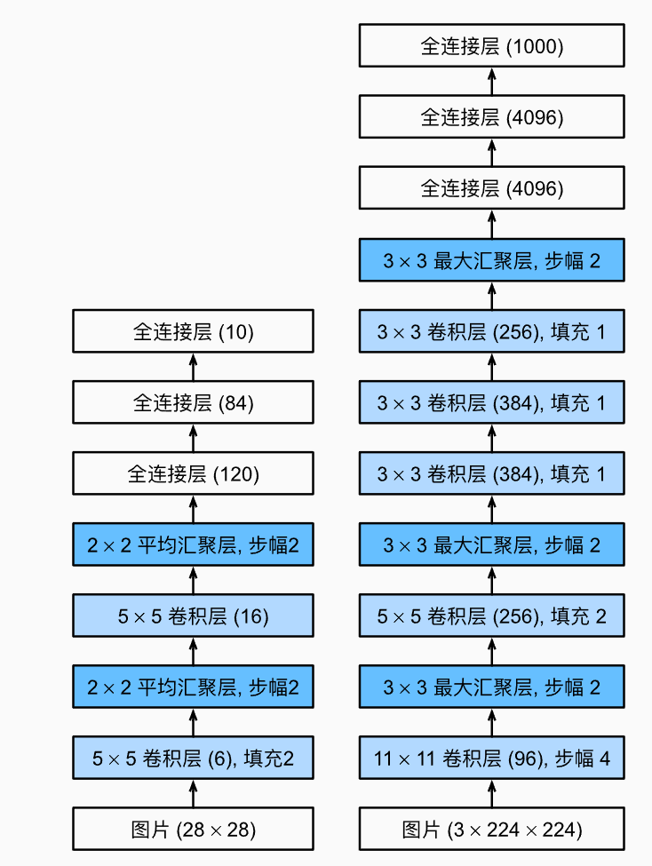
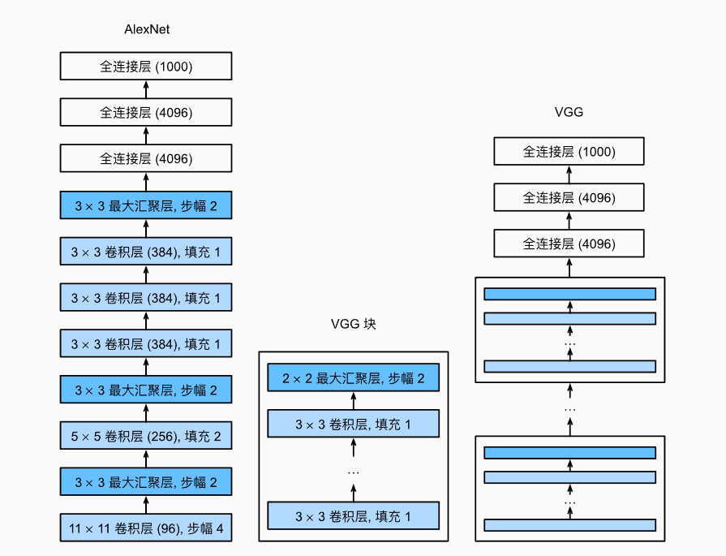

# 7.现代卷积神经网络

上一章介绍了CNN的基本原理，本章介绍现代的CNN架构。

许多现代CNN的研究都是建立在这一章的基础上的，本章中的每一个模型都曾一度占据主导地位，其中许多模型都是ImageNet竞赛的优胜者。

包括：

- AlexNet:第一个在大规模视觉竞赛中击败传统计算机视觉模型的大型神经网络。
- 使用重复块的网络(VGG)：利用许多重复的神经网络块。
- 网络中的网络(NiN)：重复使用由卷积层和$1\times1$卷积层（用来代替全连接层）来构建深层网络。
- 含并行连结的网络（GoogLeNet）：使用并行连结的网络，通过不同窗口大小的卷积层和最大汇聚层来并行抽取信息。
- 残差网络（ResNet）：通过残差块构建跨层的数据通道，是CV中最流行的体系框架。
- 稠密连接网络（DenseNet）：计算成本很高，但带来了更好的效果。

## 7.1.深度卷积神经网络（AlexNet）

LeNet提出后，LeNet虽然在小数据集上取得了很好的效果，但在更大、更真实的数据集上训练卷积神经网络的性能和可行性还有待研究。在上世纪90年代到2012年之间的大部分时间里，神经网络常被其他机器学习方法超越，如支持向量机（SVM）。

在CV中，直接将神经网络与其他机器学习方法进行比较也许不公平。这是因为，CNN的输入是由原始像素值或是经过简单预处理（居中、缩放等）的像素值组成的。但在使用传统机器学习方法时，从业者不会讲原始像素作为输入。在传统机器学习方法中，CV流水线是由人手工精心设计的特征流水线组成的，对于这些传统方法，大部分的进展来自于对特征有了更聪明的想法，并且学习到的算法往往归于事后的解释。

虽然上世纪90年代就有了一些神经网络加速卡，但算力不足以开发有大量参数的深层多通道卷积神经网络。此外，当时数据集仍然相对较小。除了这些障碍，训练神经网络的一些关键技巧仍然缺失，如启发式参数初始化、SGD的变体、非挤压激活函数和有效的正则化奇数。

### 7.1.1.学习特征

另一种预测这个领域发展的方法是观察图像特征的提取方法。在2012年前，图像特征都是机械地计算出来的，设计一套新的特征函数、改进结果并撰写论文盛极一时。

另一种想法是：特征本身应该被学习。此外，他们还认为，在合理地复杂性前提下，特征应该由多个共同学习的神经网络层组成，每个层有可学习的参数。在机器视觉中，最底层可能检测边缘、颜色和纹理。事实上，Alex等人提出了一种新的CNN变体AlexNet。

在网络的最底层，模型学习到了一些类似于传统滤波器的特征抽取器。AlexNet的更高层建立在这些底层表示的基础上，以表示更大的特征。而更高的层可以检测整个物体。最终的隐藏单元可以学习图像的综合表示，从而使不同类别的数据易于区分。

尽管一直有研究者试图学习视觉数据的逐级表征，然而一直未有突破。深度卷积神经网络突破出现在2012年，可归因于两个关键因素。

#### 7.1.1.1.缺少的成分：数据

包含许多特征的深度模型需要大量的有标签数据，才能显著优于基于凸优化的传统方法。然而限于早期计算机有限的存储和有限的研究预算，大部分研究只基于小的公开数据集。

这一状况在2010年前后兴起的大数据浪潮中得到改善，2009年，ImageNet数据集发布，并发起ImageNet挑战赛，要求研究人员从100万个样本中训练模型，以区分1000个不同类别的对象。这种规模是空前的，推动了计算机视觉和机器学习研究的发展。

#### 7.1.1.2.缺少的成分：硬件

深度学习对计算资源的要求很高，训练可能需要几百个迭代轮数，每次迭代都需要通过代价高昂的许多线性代数层传递数据。

然而，用GPU训练神经网络改变了这一格局。图形处理器（GPU）早年用来加速图形处理，使电脑游戏玩家受益。GPU可优化高吞吐量的$4\times 4$矩阵和向量乘法，从而服务于基本的图形任务。这些数学运算与卷积层的计算十分相似。

回到2012年的重大突破，当Alex等人实现了可以在GPU硬件上运行的深度卷积神经网络时，一个重大突破出现了。他们意识到CNN中的计算瓶颈：卷积和矩阵乘法，都是这可以在硬件上并行化的操作。

### 7.1.2.AlexNet

2012年，AlexNet的出现首次证明了学习到的特征可以超越手工设计的特征，一举打破了计算机视觉研究的现状。AlexNet使用了8层卷积神经网络，并以很大的优势赢得了2012年ImageNet图像识别挑战赛。

AlexNet和LeNet的架构非常相似，如图，左侧为LeNet，右侧为AlexNet，本节中提供的是一个精简版的AlexNet，去除了原本的需要两个小型GPU同时运算的特点。



AlexNet和LeNet设计理念相似，但存在显著差异：

1. AlexNet相比LeNet-5深得多。由八层组成：五个卷积层、两个全连接隐藏层和一个全连接输出层。
2. AlexNet使用ReLU而不是Sigmoid作为其激活函数。

#### 7.1.2.1.模型设计

在AlexNet的第一层，卷积窗口的形状是$11\times 11$。由于ImageNet中大多数图像的宽和高比MNIST图像的多10倍以上，因此，需要一个更大的卷积窗口来捕获目标。

第二层卷积窗口形状缩减为$5\times 5$，然后是$3\times3$。此外，在第一层、第二层和第五层卷积层之后，加入窗口形状为$3\times 3$，步幅为2的最大汇聚层。而且AlexNet的卷积通道数目是LeNet的10倍。

在最后一个卷积层后有两个全连接层，分别有4096个输出。这两个巨大的全连接层有将近1GB的模型参数。早期GPU显存有限，原版AlexNet采用了双数据流设计，但现在GPU显存充裕，很少需要跨GPU分解模型。

在两个隐藏全连接层后加入了Dropout层。

#### 7.1.2.2.激活函数

AlexNet将sigmoid激活函数改为更简单的ReLU激活函数。

- 一方面，ReLU函数的计算更简单，不需要像sigmoid激活函数一样进行复杂的求幂运算。

- 另一方面，当使用不同的参数初始化方法时，ReLU激活函数使训练模型更加容易。当sigmoid激活函数的输出非常接近于0或1时，这些区域的梯度几乎为0，反向传播无法继续更新模型参数。相反，ReLU激活函数在正区间梯度总是1。因此，如果模型参数没有正确初始化，sigmoid函数可能在正区间得到几乎为0的梯度，从而使模型无法得到有效的训练。

#### 7.1.2.3.容量控制和预处理

AlexNet通过暂退法控制全连接层的模型复杂度，而LeNet只使用了权重衰减。

为了进一步扩充数据，AlexNet在训练时增加了大量的图像增强数据，如翻转、裁切和变色，使模型更加健壮，更大的样本量有效地减少了过拟合。

现在构造一个适用于`Fashion-MNIST`的类AlexNet：

```python
net = nn.Sequential(
    nn.Conv2d(1,96,kernel_size=11,stride=4,padding=1),
    nn.ReLU(),
    nn.MaxPool2d(kernel_size=3,stride=2),
    nn.Conv2d(96,256,kernel_size=5,padding=2),
    nn.ReLU(),
    nn.MaxPool2d(kernel_size=3,stide=2),
    nn.Conv2d(256,384,kernel_size=3,padding=1),
    nn.ReLU(),
    nn.Conv2d(384,384,kernel_size=3,padding=1),
    nn.ReLU(),
    nn.Conv2d(384,384,kernel_size=3,padding=1),
    nn.ReLU(),
    nn.MaxPool2d(kernel_size=3,stride=2),
    nn.Flatten(),
    nn.Linear(6400,4096),nn.ReLU(),
    nn.Dropout(p=0.5),
    nn.Linear(4096,4096),nn.ReLU(),
    nn.Dropout(p=0.5),
    nn.Linear(4096,10)
)
```

### 7.1.5.小结

- AlexNet的架构和LeNet相似，但使用了更多的卷积层和更多的参数来拟合大规模的ImageNet数据集，是更大更深的LeNet。其参数个数是10倍，计算复杂度约为260倍。
- 在AlexNet中引入了Dropout、ReLU、最大池化层和数据增强。
- 今天，AlexNet已经被更有效的架构超越，但它是从浅层网络到深层网络的关键一步

## 7.2.使用块的网络（VGG）

AlexNet证明深层神经网络卓有成效，但没有提供一个通用的模板来指导设计新的网络。接下来我们将介绍一些常用于设计深度神经网络的启发式概念。

与芯片设计中工程师从放置晶体管到逻辑单元再到逻辑块的过程类似，神经网络的架构设计也逐渐变得抽象。研究人员开始从单个神经元的角度思考问题发展到整个层，又转向块，重复层的模式。

### 7.2.1.VGG块

经典卷积神经网络的基本组成部分是下面的序列：

1. 带填充以保持分辨率的卷积层
2. 非线性激活函数，如ReLU
3. 汇聚层（pooling），如最大汇聚层

一个VGG块与之类似，由一系列卷积层组成，后面再加上用于空间下采样的最大汇聚层。在最初的VGG论文中，作者使用了填充为1的$3\times 3$卷积层（以保持宽度高度不变），和步幅为2的$2\times2$最大汇聚层（每个块后的分辨率减半）。下面的代码中，我们定义了一个名为`vgg_block`的函数实现一个VGG块。

```python
import torch
from torch import nn
def vgg_block(num_convs,in_channels,out_channels):
    layers=[]
    for _ in range(num_convs):
        layers.append(nn.Conv2d(in_channels,out_channels,kernel_size=3,padding=1))
        layers.append(nn.ReLU())
        in_channels = out_channels
    layers.append(nn.MaxPool2d(kernel_size=2,stride=2))
    return nn.Sequential(*layers)
```

### 7.2.2.VGG网络

与AlexNet、LeNet一样，VGG网络可以分为两部分：第一部分主要由卷积层和汇聚层组成，第二部分由全连接层组成。

如图：



VGG神经网络连接了几个`vgg_block`函数中定义的VGG块。其中有超参数变量`conv_arch`，该变量指定列每个VGG块里卷积层个数与输出通道数。全连接层模式与AlexNet中相同。

原始VGG网络有5个卷积块，其中前两个块各有一个卷积层，后三个快包含两个卷积层。

第一个模块有64个输出通道，每个后续模块将输出通道数量翻倍，直到该数字达到512。由于该网络含有8个卷积层和3个全连接层，因此常被称为VGG-11。

```python
conv_arch = ((1,64),(1,128),(2,256),(2,512),(2,512))
```

下面的代码实现了VGG-11，可以通过conv_arch上执行for循环来简单实现：

```python
def VGG(conv_arch):
    conv_blks = []
    in_channels = 1
    for num_convs,out_channels in conv_arch:
        conv_blks.append(vgg_block(num_convs,in_channels,out_channels))
        in_channels = out_channels
    return nn.Sequential(
        *conv_blks,
        nn.Flatten(),
        nn.Linear(out_channels*7*7,4096),
        nn.ReLU(),
        nn.Dropout(p=0.5),
        nn.Linear(4096,4096),
        nn.ReLU(),
        nn.Dropout(p=0.5),
        nn.Linear(4096,10)
    )    
conv_arch = ((1, 64), (1, 128), (2, 256), (2, 512), (2, 512))
net = VGG(conv_arch)
```

接下来构造一个高度、宽度为224的单通道数据样本，以观察每个层输出的形状。

```python
X = torch.randn(size = (1,1,224,224))
for blk in net:
    X = blk(X)
    print(blk.__class__.__name__,'output shape:\t',X.shape)
```

```cmd
Sequential output shape:         torch.Size([1, 64, 112, 112])
Sequential output shape:         torch.Size([1, 128, 56, 56])
Sequential output shape:         torch.Size([1, 256, 28, 28])
Sequential output shape:         torch.Size([1, 512, 14, 14])
Sequential output shape:         torch.Size([1, 512, 7, 7])
Flatten output shape:    torch.Size([1, 25088])
Linear output shape:     torch.Size([1, 4096])
ReLU output shape:       torch.Size([1, 4096])
Dropout output shape:    torch.Size([1, 4096])
Linear output shape:     torch.Size([1, 4096])
ReLU output shape:       torch.Size([1, 4096])
Dropout output shape:    torch.Size([1, 4096])
Linear output shape:     torch.Size([1, 10])
```

与预期一致。

### 7.2.3.训练模型

因为用的d2l的内置方法，这里跳过。

### 7.2.4.小结

- VGG-11使用可复用的卷积块构造网络。不同的VGG模型可通过每个块中卷积层和输出通道数量的差异来定义。
- 不同的卷积块个数和超参数可以得到不同复杂度的变种。
- VGG论文中尝试了各种架构，他们特别发现深层且窄的卷积（即$3\times3$）比较浅层且宽的卷积更有效。

## 7.3.网络中的网络（NiN）

LeNet、AlexNet和VGG都有一个共同的设计模式：通过一系列的卷积层和汇聚层来提取空间结构特征；然后通过全连接层对特征的表征进行处理。AlexNet和VGG对LeNet的改进主要在于如何扩大和加深这两个模块。

或者，可以想象在这个过程的早期使用全连接层。然而，如果使用了全连接层，可能会完全放弃表征的空间结构。网络中的网络（NiN）提供了一个简单的解决方案：在每个像素的通道上分别使用MLP。

### 7.3.1.NiN块

卷积层的输入和输出由四维张量组成，张量每个轴分别对应样本、通道、高度、宽度。另外，全连接层的输入和输出通常是分别对应于样本和特征的二维张量。NiN的想法是在每个像素位置（针对每个高度和宽度）应用一个全连接层。

如果我们将权重连接到每个空间位置，我们可以将其视为$1\times 1$卷积层。从另一个角度看，即将空间维度中的每个像素视为单个样本，

