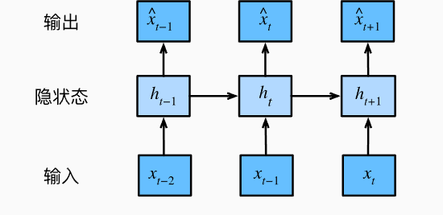
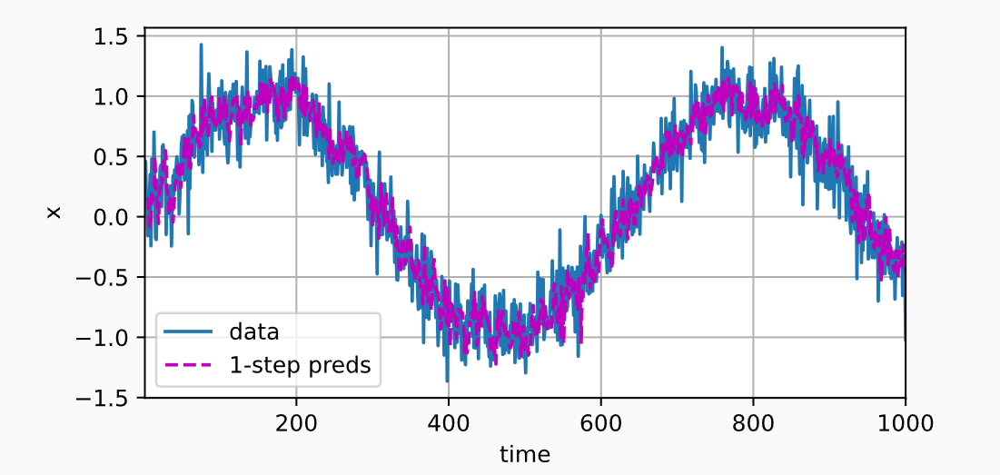
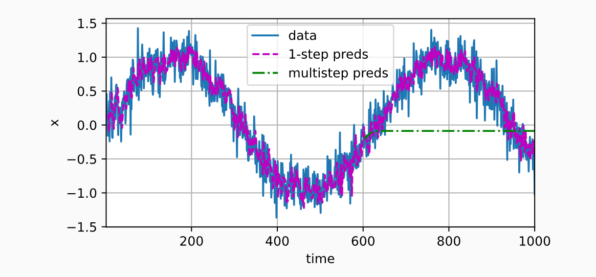
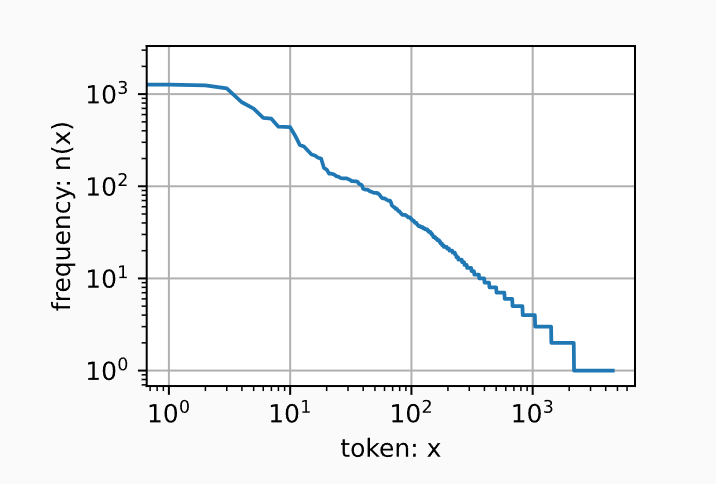
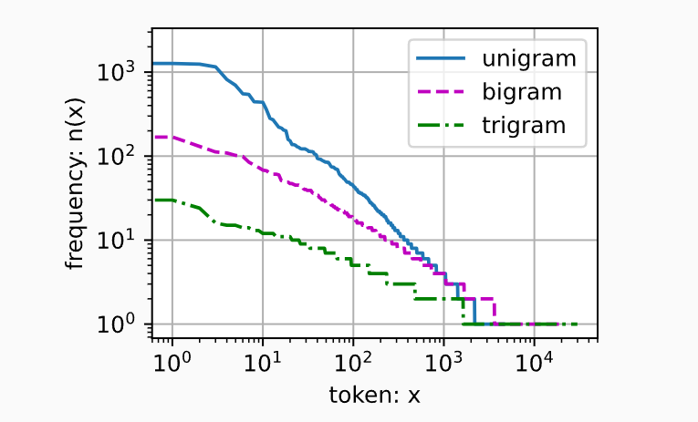
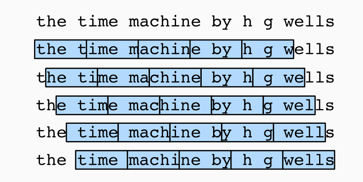

# 8.循环神经网络

目前为止，遇到过两种类型的数据：表格数据与图像数据。对于图像数据，我们设计了专门的卷积神经网络架构来为这种特殊的数据结构建模。

最重要的是，目前为止我们默认数据都来自于某种分布，并且所有样本都是独立同分布的。然而大多数的数据并非如此。例如，文章中的单词是按照顺序写的，如果顺序被随机地重排，就很难理解文章的原始意思。同样，视频中的图像帧、对话中的音频信号以及网站上的浏览行为都是有顺序的。因此，针对此类数据而设计特定的模型，效果可能会更好。

另一个问题来自这样一个事实：我们不仅可以接收一个序列作为输入，而是还可能期望继续猜测这个序列的后续。例如，一个任务是继续预测$2,4,6,8,10,...$。这在时间序列分析中是十分常见的，可以用来预测股市的波动等。同理，我们需要能够处理这些数据的特定模型。

简而言之，如果卷积神经网络能很好地处理空间信息，本章的循环神经网络（recurrent neural network，RNN）则可以更好地处理序列信息。RNN通过引入状态变量存储过去的信息与当前的输入，从而可以确定当前的输出。

许多使用RNN的例子都是基于文本数据的，因此本章将重点介绍语言模型。

在对序列数据进行更详细的回顾后，我们将介绍文本预处理的实用技术。然后，我们将讨论语言模型的基本概念，并将此讨论作为循环神经网络设计的灵感。最后，我们描述了循环神经网络的梯度计算方式，以探讨训练此类网络时可能遇到的问题。

## 8.1.序列模型

### 8.1.1.统计工具


处理序列数据需要统计工具和新的深度神经网络架构。简单起见，以如图所示股票价格为例。

其中，用$x_t$表示价格，即在时间步（time stamp）$t \in Z^+$时，观察到的价格$x_t$。应该注意到的是，$t$对于本文的序列通常是离散的，并在整数或其子集上变化。假设一个交易员想在$t$日的股市中表现良好，于是通过以下途径预测$x_t$：
$$
x_t \sim P(x_t \mid x_{t-1}, \ldots, x_1).
$$

#### 8.1.1.1.自回归模型

为了实现这个预测，交易员可以使用回归模型。仅有一个主要问题：输入数据的数量。输入$x_{t-1},...,x_1$本身因$t$而异。也就是说，输入数据的数量这个数字将会跟随我们遇到的数据量的增加而增加，因此需要一个近似方法来使这个计算变得更容易处理。本章后面的大部分内容将围绕着如何有效估计$P(x_t|x_{t-1},...,x_1)$展开。简单来说，归结分为以下两种策略：

1. 假设在现实情况下相当长的序列$x_{t-1},...,x_1$可能是不必要的，因此我们只需要满足某个长度为$\tau$的时间跨度，即使用观测序列$x_{t-1},...,x_{t-\tau}$。当下获得的最直接的好处就是参数的数量总是不变的，至少在$t>\tau$时如此，这就使得我们能够训练一个上面提及的深层网络。这种模型被称为***自回归模型***（auto regressive models），因为它们是对自己执行回归。
2. 第二种策略，如下图所示，是保留一些对过去预测的总结$h_t$，并且同时更新预测$\hat{x_t}$和总结$h_t$。这就产生了基于$\hat{x_t}=P(x_t\mid h_t)$估计$x_t$，以及公式$h_t=g(h_{t-1},x_{t-1})$更新的模型。由于$h_t$从未被观测到，这类模型也被称为***隐变量自回归模型***（latent auto regressive models）。



这两种情况都有一个显而易见的问题：如何生成训练数据？一个经典的方法是使用历史观测来预测下一个未来观测。显然，我们不指望时间会停滞不前。然而，一个常见的假设是虽然特定值$x_t$可能会改变，但是序列本身的动力学不会改变。这样的假设是合理的，因为新的动力学一定受新的数据影响，而我们不可能用目前所掌握的数据来预测新的动力学。统计学家称不变的动力学为静止的（stationary）。因此，整个序列的估计值都将通过以下的方式获得：
$$
P(x_1, \ldots, x_T) = \prod_{t=1}^T P(x_t \mid x_{t-1}, \ldots, x_1).
$$
注意，如果我们处理的是离散的对象（如单词），而不是连续的数字，则上述的考虑仍然有效。唯一的差别是，对于离散的对象，我们需要使用分类器而不是回归模型来估计$P(x_t \mid x_{t-1},...,x_1)$。

#### 8.1.1.2.马尔可夫模型

回想一下，在自回归模型的近似法中，我们使用$x_{t-1},...,x_\tau$而不是$x_{t-1},...,x_1$来估计$x_t$。只要这种是近似精确的，我们就说序列满足马尔可夫条件（Markov condition）。特别是，如果$\tau = 1$，得到一个一阶马尔可夫模型（first-order Markov model），$P(x)$由下式给出：
$$
P(x_1,...,x_T) = \prod_{t=1}^TP(x_t \mid x_{t-1})当P(x_1\mid x_0)=P(x_1)
$$
当假设$x_t$仅是离散值时，这样的模型特别棒，因为在这种情况下，使用动态规划可以沿着马尔可夫链精确地计算结果。例如我们可以高效地计算$P(x_{t+1}\mid x_{t-1})$：
$$
P(x_{t+1}\mid x_{t-1})=\frac{\sum_{x_t}P(x_{t+1},x_t,x_{t-1})}{P(x_{t-1})}\\
=\frac{\sum_{x_t}P(x_{t+1}\mid x_t,x_{t-1})P(x_t,x_{t-1})}{P(x_{t-1})}\\
={\sum_{x_t}P(x_{t+1}\mid x_t,x_{t-1})P(x_t\mid x_{t-1})}\\
=\sum_{x_t}{P(x_{t+1}\mid x_t)P(x_t\mid x_{t-1})}
$$
在推导过程中，利用到了一阶马尔可夫模型的$P(x_{t+1}\mid x_t,x_{t+1})= P(x_{t+1}\mid x_t)$。

隐马尔科夫模型中的动态规划超过了本节的范围，而动态规划的计算工具已在控制算法与强化学习算法广泛使用。

#### 8.1.1.3.因果关系

原则上，将$P(x_1,...,x_T)$倒序展开也没什么问题。基于条件概率公式，总是可以写出：
$$
P(x_1,...,x_T) =\prod_{t=T}^1P(x_t\mid x_{t+1},...,x_T)
$$
事实上，如果基于一个马尔可夫模型，我们还可以得到一个反向的条件概率分布。然然在很多情况下，数据存在一个自然的方向，即在时间上是前进的。

很明显，未来的事件不能影响过去。因此，如果我们改变$x_t$，可能会影响未来发生的事情$x_{t+1}$，但不能反过来。也就是说，如果我们改变$x_t$，基于过去的分布不会改变。因此，解释$P(x_{t+1}\mid x_t)$比解释$P(x_t\mid x_{t+1})$更容易。例如，在某些情况下，对于某些可加性噪声$\epsilon$，显然我们可以找到$x_{t+1}=f(x_t)+\epsilon$，而反之则不行。

### 8.1.2.训练

使用正弦函数和一些可加性噪声来生成序列数据，时间步为$1,2,...,1000$。

```python
import torch
from torch import nn
T = 1000
time = torch.arrange(1,T+1,dtype=torch.float32)
x = torch.sin(0.01*time) + torch.normal(0,0.2,(T,))
```

接下来将这个序列转换为模型的特征-标签（feature-label）对。基于嵌入维度$\tau$，我们将数据映射为数据对$y_t=x_t$和$\mathbf{x}_t=[x_{t-\tau},...,x_{t-1}]$。这比我们提供的数据样本少了$\tau$个，因为我们没有足够的历史记录来描述前$\tau$个数据样本。一个简单的解决方法是：如果有足够长的序列就丢弃这几项；另一个方法是用零填充序列。

在这里，我们仅用前600个“特征-标签”对进行训练：

```python
tau = 4
features = torch.zeros((T - tau, tau))
for i in range(tau):
    features[:, i] = x[i: T - tau + i]
labels = x[tau:].reshape((-1, 1))

batch_size, n_train = 16, 600
# 只有前n_train个样本用于训练
train_iter = d2l.load_array((features[:n_train], labels[:n_train]),
                            batch_size, is_train=True)
```

在这里，使用一个简单的训练架构：一个具有两个全连接层的多层感知机，使用ReLU损失函数和平方损失。

```python
def init_weights(m):
    if type(m) ==nn.Linear:
        nn.init.xavier_uniform_(m.weight)
def get_net():
    net = nn.Sequential(
        nn.Linear((4,10)),
        nn.ReLU(),
        nn.Linear((10,1))
    )
    net.apply(init_weights)
    return net
loss = nn.MSELoss(reduction='none')
```

后续训练部分省略。

```cmd
epoch 1, loss: 0.076846
epoch 2, loss: 0.056340
epoch 3, loss: 0.053779
epoch 4, loss: 0.056320
epoch 5, loss: 0.051650
```

### 8.1.3.预测

由于训练损失很小，我们期望模型有很小的工作效果。

首先，检查模型预测下一个时间步的能力，也就是单步预测（one-step-ahead prediction）。

```python
onestep_preds = net(features)
```

结果如图：



即使预测的时间步超过了600+4（n_train+tau），其结果依然可靠。

但有一个问题是，如果数据观察序列的时间步只到了604，我们需要一步步向前：
$$
\begin{split}\hat{x}_{605} = f(x_{601}, x_{602}, x_{603}, x_{604}), \\
\hat{x}_{606} = f(x_{602}, x_{603}, x_{604}, \hat{x}_{605}), \\
\hat{x}_{607} = f(x_{603}, x_{604}, \hat{x}_{605}, \hat{x}_{606}),\\
\hat{x}_{608} = f(x_{604}, \hat{x}_{605}, \hat{x}_{606}, \hat{x}_{607}),\\
\hat{x}_{609} = f(\hat{x}_{605}, \hat{x}_{606}, \hat{x}_{607}, \hat{x}_{608}),\\
\ldots\end{split}
$$
通常，对于直到$x_t$的观测序列，其在时间步$t+k$处的预测$\hat{x}_{t+k}$称为k步预测（k-step-ahead-prediction）。

由于这里的序列观察到了$x_{604}$，它的k步预测是$\hat{x}_{604+k}$。接下来使用预测的数据来进行多步预测：

```python
multistep_preds = torch.zeros(T)
multistep_preds[:n_train + tau] = x[:n_train+tau]
for i in range(n_train+tau,T):
    multistep_preds[i] = net(
        multistep_preds[i-tau:i].reshape((1,-1))
    )
```



如图所示，绿色的预测并不理想。经过几个预测步骤后，预测的结果很快会衰减到一个常数。这是由于错误的积累：假设在步骤1后，我们积累了一些错误$\epsilon_1 = \bar\epsilon$。于是，步骤2的输入被扰动了$\epsilon_1$，结果积累的误差是依照次序的$\epsilon_2=\bar \epsilon+c\epsilon_1$，其中c是某个常数。后续的预测以此类推。因此，误差可能会相当快地偏离真实的观测结果。

经过测试后，可以发现4步预测看起来效果不错，但超过这个跨度的任何预测几乎都是无效的。

### 8.1.4.小结

- 时序模型中，当前数据跟之前观察到的数据相关。
- 自回归模型使用自身过去数据来预测未来。
- 马尔可夫模型假设当前只与最近少数数据相关，从而简化模型。
- 潜变量模型使用潜变量来概括历史信息。


## 8.2.文本预处理

对于序列数据处理问题，我们评估了所需统计工具和预测时面临的挑战。这样的数据存在许多种形式，文本是最常见例子之一。一篇文章可以被简单地看作一串单词序列，甚至是一串字符序列。本节将解析文本的常见预处理步骤，通常包括：

1. 将文本作为字符串加载到内存中。
2. 将字符串拆分为词元（如单词和字符）。
3. 建立一个词表，将拆分的词元映射到数字索引。
4. 将文本转换为数字索引，方便模型操作。

本节用到的包：

```python
import collections
import re
```

### 8.2.1.读取数据集

首先从H.G.Well的时光机器中加载文本。这是个相当小的语料库，仅有30000多个单词，现实的文档集合可能会包含数十亿个单词。

下面的函数将数据集读取到由多条文本行组成的列表中，其中每条文本都是一个字符串。简单起见，这里忽略了标点符号与字母大写。

```python
#@save
d2l.DATA_HUB['time_machine'] = (d2l.DATA_URL + 'timemachine.txt',
                                '090b5e7e70c295757f55df93cb0a180b9691891a')

def read_time_machine():  #@save
    """将时间机器数据集加载到文本行的列表中"""
    with open(d2l.download('time_machine'), 'r') as f:
        lines = f.readlines()
    return [re.sub('[^A-Za-z]+', ' ', line).strip().lower() for line in lines]

lines = read_time_machine()
print(f'# 文本总行数: {len(lines)}')
print(lines[0])
print(lines[10])
```

### 8.2.2.词元化

下面的tokenize函数，将文本行列表（lines）作为输入，列表中的每个元素是一个文本序列（如一个文本行）。每个文本序列又被拆分成一个词元列表，词元（token）是文本的基本单位。最后，返回一个由词元列表组成的列表，其中每个词元都是一个字符串（string）。

> 在英文语境里，词元一般要么是词（word），要么是字符（character）。

```python
def tokenize(lines, token='word'):  #@save
    """将文本行拆分为单词或字符词元"""
    if token == 'word':
        return [line.split() for line in lines]
    elif token == 'char':
        return [list(line) for line in lines]
    else:
        print('错误：未知词元类型：' + token)

tokens = tokenize(lines)
for i in range(11):
    print(tokens[i])
```

```python
['the', 'time', 'machine', 'by', 'h', 'g', 'wells']
[]
[]
[]
[]
['i']
[]
[]
['the', 'time', 'traveller', 'for', 'so', 'it', 'will', 'be', 'convenient', 'to', 'speak', 'of', 'him']  
['was', 'expounding', 'a', 'recondite', 'matter', 'to', 'us', 'his', 'grey', 'eyes', 'shone', 'and']     
['twinkled', 'and', 'his', 'usually', 'pale', 'face', 'was', 'flushed', 'and', 'animated', 'the']        
```

### 8.2.3.词表

词元的类型是字符串，而模型需要的输入是数字，因此这种类型不方便模型使用。

现在构建一个字典，通常也叫词表（vocabulary），用来将字符串类型的词元映射到从0开始的数字索引中。

我们先将训练集中所有文档合并在一起，对它们的唯一词元进行统计，得到的统计结果称之为语料（corpus）。然后根据每个唯一词元的出现频率，为其分配一个数字索引。很少出现的词元通常被移除，这可以降低复杂性。

另外，语料库中不存在或已删除的任何词元都将映射到一个特定的未知词元“<unk>”。

我们可以选择增加一个列表，用于保存被保留的词元，例如：填充词元”<pad>“，序列开始词元"<bos>"，序列结束”<eos>“。

```python
class Vocab:  #@save
    """文本词表"""
    def __init__(self, tokens=None, min_freq=0, reserved_tokens=None):
        if tokens is None:
            tokens = []
        if reserved_tokens is None:
            reserved_tokens = []
        # 按出现频率排序
        counter = count_corpus(tokens)
        self._token_freqs = sorted(counter.items(), key=lambda x: x[1],
                                   reverse=True)
        # 未知词元的索引为0
        self.idx_to_token = ['<unk>'] + reserved_tokens
        self.token_to_idx = {token: idx
                             for idx, token in enumerate(self.idx_to_token)}
        for token, freq in self._token_freqs:
            if freq < min_freq:
                break
            if token not in self.token_to_idx:
                self.idx_to_token.append(token)
                self.token_to_idx[token] = len(self.idx_to_token) - 1

    def __len__(self):
        return len(self.idx_to_token)

    def __getitem__(self, tokens):
        if not isinstance(tokens, (list, tuple)):
            return self.token_to_idx.get(tokens, self.unk)
        return [self.__getitem__(token) for token in tokens]

    def to_tokens(self, indices):
        if not isinstance(indices, (list, tuple)):
            return self.idx_to_token[indices]
        return [self.idx_to_token[index] for index in indices]

    @property
    def unk(self):  # 未知词元的索引为0
        return 0

    @property
    def token_freqs(self):
        return self._token_freqs

def count_corpus(tokens):  #@save
    """统计词元的频率"""
    # 这里的tokens是1D列表或2D列表
    if len(tokens) == 0 or isinstance(tokens[0], list):
        # 将词元列表展平成一个列表
        tokens = [token for line in tokens for token in line]
    return collections.Counter(tokens)
```

```python
vocab = Vocab(tokens)
print(list(vocab.token_to_idx.items())[:10])
```

```cmd
[('<unk>', 0), ('the', 1), ('i', 2), ('and', 3), ('of', 4), ('a', 5), ('to', 6), ('was', 7), ('in', 8), ('that', 9)]
```

由于进行了排序，高频词的索引更小。

```python
for i in [0,10]:
    print("文本：",tokens[i])
    print("索引",vocab[tokens[i]])
```

```cmd
文本： ['the', 'time', 'machine', 'by', 'h', 'g', 'wells']
索引 [1, 19, 50, 40, 2183, 2184, 400]
文本： ['twinkled', 'and', 'his', 'usually', 'pale', 'face', 'was', 'flushed', 'and', 'animated', 'the']
索引 [2186, 3, 25, 1044, 362, 113, 7, 1421, 3, 1045, 1]
```

### 8.2.4.整合

在使用上述函数时，我们将所有功能打包到load_corpus_time_machine函数。该函数返回corpus（词元索引列表）和vocab（时光机器语料库的词表）。这里做出的改变是：

1. 为了简化后续章节训练，使用字符而非单词进行词元化。
2. 返回的corpus仅处理为单个列表，而非使用多词元列表构成的一个列表。

```python
def load_corpus_time_machine(max_tokens=-1):
    lines = read_time_machine()
    tokens = tokenize(lines,'char')
    vocab = Vocab(tokens)
    corpus = [vocab[token] for line in tokens for toke in line]
    if max_tokens>0:
        corpus = corpus[:max_tokens]
    return corpus,vocab
```

> 首先将文本词元化，接着将词元化的文本变成词表，然后把所有词元映射成索引得到corpus。

### 8.2.5.小结

- 文本是序列数据的最常见形式之一。
- 为了对文本进行预处理，我们常将文本拆分为词元，构建词表将词元字符串映射为数字索引，并将文本数据转换为词元索引以供模型操作。


## 8.3.语言模型和数据集

在上一节，我们了解了如何把文本数据映射为词元，以及将这些词元可以视为一系列离散的观测，例如单词或字符。

假设长度为$T$的文本序列中的词元依然是$x_1,x_2,...,x_T$。于是，$x_t(1\leq t \leq T)$可以被认为是文本序列在时间步$t$处的观测或标签。

在给定这样的文本序列时，***语言模型（language model）的目标是估计序列的联合概率***：
$$
P(x_1,x_2,...,x_T)
$$
例如，只需要一次抽取一个词元$x_t \sim P(x_t\mid x_{t-1},...,x_1)$，一个理想的语言模型可以基于模型本身生成自然文本。从这样的模型中提取的文本都将作为自然语言来传递。只需要基于前面的对话片段中的文本就能生成一个有意义的对话，但显然距离设计这样的系统还很遥远。

尽管如此，语言模型依然在语音识别、文档摘要生成算法等领域中有应用。

### 8.3.1.学习语言模型

第一个问题是如何对文档，或是一个词元序列进行建模。

假设在单词级别对文本数据进行词元化，从基本概率规则开始：
$$
P(x_1,x_2,...,x_T)=\prod^T_{t=1}P(x_t\mid x_1,...,x_{t-1})
$$
例如，包含了四个单词的一个文本序列的概率是：
$$
P(deep,learning,is,good)=P(deep)\times P(learning\mid deep)\\ \times P(is\mid deep,learning)\times P(good\mid deep,learning,is)
$$
为了训练语言模型，我们需要计算单词的概率，以及给定前面几个单词后出现某个单词的条件概率。这些概率本质就是模型的参数。

首先，假设训练数据集是一个大型的文本语料库。

训练数据集中词的概率可以根据给定词的相对词频来计算。例如，可以将估计值$\hat P(deep)$计算为任何以单词“deep”开头的句子的概率。一种稍微不太精确的方法是统计单词“deep“在数据集中的出现次数，然后将其除以整个语料库中的单词总数。这种方法效果不错，特别是对于频繁出现的单词。

接下来，可以尝试估计：
$$
\hat P(learning\mid deep)=\frac{n(deep,learning)}{n(deep)}
$$
其中$n(x)$和$n(x,x')$分别是单个单词和连续单词对的出现次数。

但由于连续单词对"deep learning"的出现频率要低得多，所以估计这类单词正确的概率要困难得多。特别是对于不常见的单词组合，想要找到足够的出现次数来获得准确的估计可能都不容易。

而对于三个或更多的单词组合，情况会变更糟。许多合理的三单词组合可能是存在的，但在数据集中却找不到。除非我们提供某种解决方案。将这些单词组合指定为非零计数，否则将无法在语言模型中使用它们。如果数据集很小，或者单词非常罕见，那么这类单词出现一次的机会可能都找不到。

一种常见的策略是执行某种形式的拉普拉斯平滑（Laplace smoothing），具体方法是在所有计数中添加一个小常量。用$n$表示训练集中的单词总数，用$m$表示唯一单词的数量。此解决方案有助于处理单元素问题，例如通过：
$$
\hat P(x)=\frac{n(x)+\epsilon_1/m}{n+\epsilon_1}\\
\hat P(x'\mid x)=\frac{n(x,x')+\epsilon_2\hat P(x')}{n(x)+\epsilon_2}\\
\hat P(x''\mid x,x')=\frac{n(x,x',x'')+\epsilon_3\hat P(x'')}{n(x,x')+\epsilon_3}
$$
其中，$\epsilon_1,\epsilon_2,\epsilon_3$是超参数。以$\epsilon_1$为例：当$\epsilon_1=0$时，不应用平滑；当$\epsilon_1$接近正无穷时，$\hat P(x)$接近均匀概率分布$\frac{1}{m}$。

然而，这样的模型很容易变得无效。原因在下面的词频分析部分可见。

### 8.3.2.马尔可夫模型与$n$元语法

在讨论包含深度学习的解决方案之前，我们需要了解更多的概念和术语。

回想一下对于马尔可夫模型的讨论，并且应用于语言模型。如果$P(x_{t+1}\mid x_t,...,x_1)=P(x_{t+1}\mid x_t)$，则序列上的分布满足一阶马尔可夫性质。阶数越高，对应的依赖关系越长。这种性质推导出了许多可以应用于序列建模的近似公式：
$$
P(x_1,x_2,x_3,x_4)=P(x_1)\times P(x_2)\times P(x_3)\times P(x_4)\\
P(x_1,x_2,x_3,x_4)=P(x_1)\times P(x_2\mid x_1)\times P(x_3\mid x_2)\times P(x_4\mid x_3)\\
P(x_1,x_2,x_3,x_4)=P(x_1)\times P(x_2\mid x_1)\times P(x_3\mid x_1,x_2)\times P(x_4\mid x_2,x_3)
$$
涉及一个、两个、三个变量的概率公式分别被称为一元语法（unigram）、二元语法（bigram）和三元语法（trigram）模型。

> 一元语法的$\tau=0$，二元$\tau=1$，三元$\tau=2$

当序列很长时，文本量不够大，很可能$n(x_1,...,x_T)\leq1$，使用马尔可夫假设可以缓解这个问题。

### 8.3.3.自然语言统计

根据time machine数据集构建词表，并打印10个最常用的单词。

```python
import random
import torch
from d2l import torch as d2l
tokens = d2l.tokenize(d2l.read_time_machine())

corpus = [token for line in tokens for token in line]
vocab = d2l.Vocab(corpus)
print(vocab.token_freqs[:10])
```

```cmd
[('the', 2261), ('i', 1267), ('and', 1245), ('of', 1155), ('a', 816), ('to', 695), ('was', 552), ('in', 541), ('that', 443), ('my', 440)]
```

最流行的词看起来比较无聊，这些词通常被称为停用词（stop words），因此可以被过滤掉。尽管如此，它们本身仍然是有意义的，我们仍然会在模型中使用它们。

> stop words的含义是，不会对整个文本理解产生太大作用的词。

可以画图看每个token出现的概率(x_scale与y_scale用的都是log)：



词频（更严谨的说，是词的出现次数）以一种明确的方式衰减。将前几个单词作为例外消除后，剩余的所有单词大致遵循双对数坐标图上的一条直线。这意味着单词的频率满足齐普夫定律（Zipf's law），即对第$i$个最常用单词的频率$n_i$为：
$$
n_i \propto \frac{1}{i^\alpha},
$$
等价于：
$$
\log n_i = -\alpha\log i+c
$$
其中$\alpha$是刻画分布的指数，$c$是常数。

这告诉我们，想要通过计数统计和平滑来建模单词是不可行的，因为这样建模会大大高估尾部单词（也就是不常用单词）的频率。

接下来，看看其他词元组合（二元、三元语法）的频率是否会与一元语法表现出相同的行为模式。

```python
bigram_tokens = [pair for pair in zip(corpus[:-1],corpus[1:])]
bigram_vocab = d2l.Vocab(bigram_tokens)
print(bigram_vocab.token_freqs[:10])
```

```cmd
[(('of', 'the'), 309), (('in', 'the'), 169), (('i', 'had'), 130), (('i', 'was'), 112), (('and', 'the'), 109), (('the', 'time'), 102), (('it', 'was'), 99), (('to', 'the'), 85), (('as', 'i'), 78), (('of', 'a'), 73)]
```

在十个最频繁的词对中，有九个是由两个停用词组成的，只有一个与"the time"有关。

接下来进一步看看三元语法的频率是否表现出相同的行为方式：

```python
trigram_tokens = [triple for triple in zip(corpus[:-2],corpus[1:-1],corpus[2:])]
trigram_vocab = d2l.Vocab(trigram_tokens)
print(trigram_vocab.token_freqs[:10])
```

```cmd
[(('the', 'time', 'traveller'), 59), (('the', 'time', 'machine'), 30), (('the', 'medical', 'man'), 24), (('it', 'seemed', 'to'), 16), (('it', 'was', 'a'), 15), (('here', 'and', 'there'), 15), (('seemed', 'to', 'me'), 14), (('i', 'did', 'not'), 14), (('i', 'saw', 'the'), 13), (('i', 'began', 'to'), 13)]
```

直观对比三种模型中的词元频率：



可以观察出：

1. 除了一元语法词，单词序列也遵循齐普夫定律，单指数$\alpha$更小。
2. 词表中$n$元组的数量不大，说明语言中存在相当多结构，给了我们应用模型的希望。
3. 很多$n$元组很少出现，使得拉普拉斯平滑很不适合语言建模。作为替代，我们将使用基于深度学习的模型。

### 8.3.4.读取长序列数据

由于序列数据本质上是连续的，因此我们在处理这个数据时，需要解决这个问题。

在8.1节中，当序列太长不能被模型一次性全部处理时，我们可能希望拆分这样的序列方便模型读取。

在介绍该模型之前，先看一下整体策略。假设我们将使用神经网络来训练语言模型，模型中的网络一次处理具有预定义长度（例如n个时间步）的一个小批量序列。现在的问题是，如何随机生成一个小批量数据的特征与标签以供读取。

由于文本序列可以是任意长的，于是任意长的序列可以被我们划分为具有相同时间步数的子序列。当训练神经网络时，这样的小批量子序列将被输入到模型中。假设网络一次只处理具有$n$个时间步的子序列。下图画出了从原始文本序列获得子序列的所有不同的方式，n=5，并且每个时间步的词元对应一个字符。



因为我们可以选择任意偏移量来指示初始位置，所以我们有相当大的自由度。对于上图的子序列，选择哪一个都同样的好。然而，如果只选择一个偏移量，那么用于训练网络的、所有可能的子序列的覆盖范围是有限的。因此，我们可以从随机偏移量开始划分序列，以同时获得覆盖性（coverage）和随机性（randomness）。

下面，我们将描述如何实现随机采样（random sampling）和顺序分区（sequeantial partitioning）策略。

#### 8.3.4.1.随机采样

在随机采样中，每个样本都是在原始的长序列上任意捕获的子序列。在迭代过程中，来自两个相邻的、随机地、小批量中的子序列不一定在原始序列上相邻。对于语言建模，目标是基于目前为止我们看到的词元来预测下一个词元，因此标签是移位了一个词元的原始序列。

下面的代码每次可以从数据中随机生成一个小批量。在这里，参数`batch_size`指定了每个小批量中子序列样本的数目，参数`num_steps`是每个子序列中预定义的时间步数。

```python
def seq_data_iter_random(corpus,batch_size,num_steps):
    corpus = corpus[random.randint(0,num_steps-1):] #随机丢弃几个词元，相当于随机化偏移k
    num_subseqs = (len(corpus)-1)//num_steps  #计算丢弃后可分割的序列数量
    initial_indices = list(range(0,num_subseqs*num_steps,num_steps)) #每个序列的起始索引
    random.shuffle(initial_indices)  #打乱每个序列的起始索引
    def data(pos):
        return corpus[pos:pos+num_steps] #可以得到pos为起始的长度为num_steps的子序列
    num_batches = num_subseqs // batch_size  #计算batch数量
    for i in range(0,batch_size*num_batches,batch_size): #每个i是0，batch_size,2batch_size...
        initial_indices_per_batch = initial_indices[i:i+batch_size]
        # 该轮次的索引是initial_indices中i到i+batch_size的部分，有batch_size个子序列
        X = [data(j) for j in initial_indices_per_batch]
        Y = [data(j+1) for j in initial_indices_per_batch]
        yield torch.tensor(X),torch.tensor(Y)
        # yield将函数变成生成器
```

> 这里的Y并非是一个词元，而是与X大小相同的一个序列。

下面生成一个从0到34的序列。假设批量大小设为2，时间步数为5，意味着我们可以生成$\lfloor (35 - 1) / 5 \rfloor= 6$个“特征-标签”子序列对。

```python
my_seq = list(range(35))
for X,Y in seq_data_iter_random(my_seq,2,5):
    print("X:",X,"\n","Y:",Y)
```

```cmd
X: tensor([[ 2,  3,  4,  5,  6],
        [27, 28, 29, 30, 31]]) 
 Y: tensor([[ 3,  4,  5,  6,  7],
        [28, 29, 30, 31, 32]])
X: tensor([[12, 13, 14, 15, 16],
        [ 7,  8,  9, 10, 11]])
 Y: tensor([[13, 14, 15, 16, 17],
        [ 8,  9, 10, 11, 12]])
X: tensor([[17, 18, 19, 20, 21],
        [22, 23, 24, 25, 26]])
 Y: tensor([[18, 19, 20, 21, 22],
        [23, 24, 25, 26, 27]])
```

> 为什么是生成6个：特征-标签”序列对？
>
> 首先，虽然这个函数是随机采样，但在单次应用这个函数时，其内部的初始偏置就已经固定，故内部的子序列就已经切好，共有$\lfloor \frac{n-1}{t}\rfloor$个序列。在这个函数生成器中，每次返回batch_size组数据。
>
> 为什么Y的大小不是1而是与X相同？
>
> 就拿X: tensor([[ 2,  3,  4,  5,  6], Y: tensor([[ 3,  4,  5,  6,  7],这组数据举例：
>
> 其预测并非是，用X=[2,3,4,5,6]预测Y=[7]，而是用[2]预测3，[2,3]预测[4]，[2,3,4]预测[5]，以此类推，最多预测5步。

随机采样的特点是，同一个batch中，不同batch之间的子序列并不相邻，是随机打乱的。

#### 8.3.4.2.顺序分区

在迭代过程中，除了对原始序列可以随机抽样之外，还可以保证两个相邻小批量中的子序列在原始序列上也是相邻的。这种策略在基于小批量的迭代过程中保留了拆分的子序列的顺序，因此也被称为顺序分区。

```python
def seq_data_iter_sequential(corpus,batch_size,num_steps):
    offset = random.randint(0,num_steps)
    num_tokens = ((len(corpus)-offset-1)//batch_size)*batch_size
    Xs = torch.tensor(corpus[offset:offset+num_tokens])
    Ys = torch.tensor(corpus[offset+1:offset+1+num_tokens])
    Xs,Ys = Xs.reshape(batch_size,-1),Ys.reshape(batch_size,-1)
    num_batches = Xs.shape[1]//num_steps
    for i in range(0,num_steps*num_batches,num_steps):
        X = Xs[:,i:i+num_steps]
        Y = Ys[:,i:i+num_steps]
        yield X,Y
```

在顺序分区算法中，迭代期间来自两个相邻小批量中的子序列在原始序列中相邻。

```python
for X,Y in seq_data_iter_sequential(my_seq,batch_size=2,num_steps=5):
    print('X:',X,'\nY:',Y)
```

```cmd
X: tensor([[ 1,  2,  3,  4,  5],
        [17, 18, 19, 20, 21]]) 
Y: tensor([[ 2,  3,  4,  5,  6],
        [18, 19, 20, 21, 22]])
X: tensor([[ 6,  7,  8,  9, 10],
        [22, 23, 24, 25, 26]])
Y: tensor([[ 7,  8,  9, 10, 11],
        [23, 24, 25, 26, 27]])
X: tensor([[11, 12, 13, 14, 15],
        [27, 28, 29, 30, 31]])
Y: tensor([[12, 13, 14, 15, 16],
        [28, 29, 30, 31, 32]])
```

接下来，将上面两个采样函数包装到一个类中，以便稍后可以将其用作数据迭代器。

```python
class SeqDataLoader:
    def __init__(self,batch_size,num_steps,use_random_iter,max_tokens):
        if use_random_iter:
            self.data_iter_fn = d2l.seq_data_iter_random
        else:
            self.data_iter_fn = d2l.seq_data_iter_sequential
        self.corpus,self.vocab = d2l.load_corpus_time_machine(max_tokens)
        self.batch_size,self.num_steps = batch_size,num_steps
    def __iter__(self):
        return self.data_iter_fn(self.corpus,self.batch_size,self.num_steps)
```

最后定义了一个函数load_data_time_machine，它同时返回数据迭代器和词表。

```python
def load_data_time_machine(batch_size,num_steps,use_random_iter=False,max_tokens=10000):
    data_iter = SeqDataLoader(batch_size,num_steps,use_random_iter,max_tokens)
    return data_iter,data_iter.vocab
```

### 8.3.5.小结

- 语言模型是NLP的关键，其目的是估计文本序列的联合概率。
- 使用统计方法时采用$n$元语法。
- 读取长序列的主要方式是随机采样和顺序分区。在迭代过程中，后者可以保证来自两个相邻小批量中的子序列在原始序列上也是相邻的。

