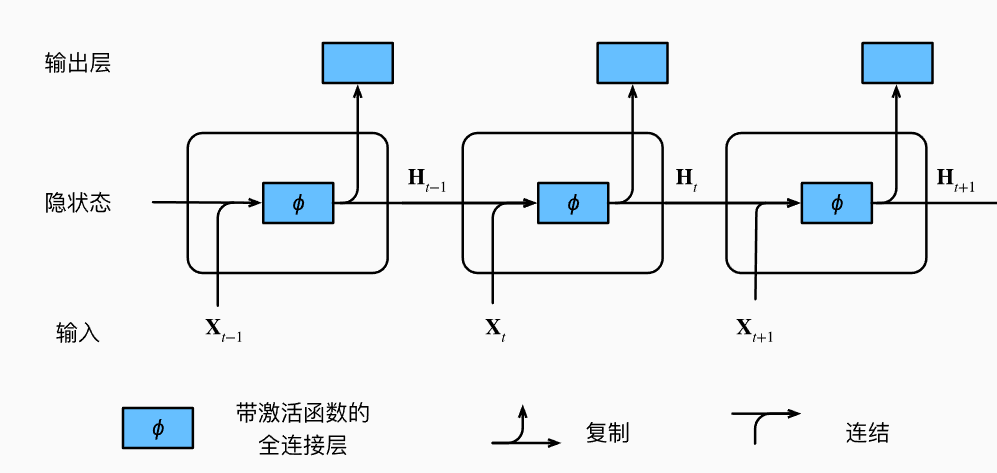
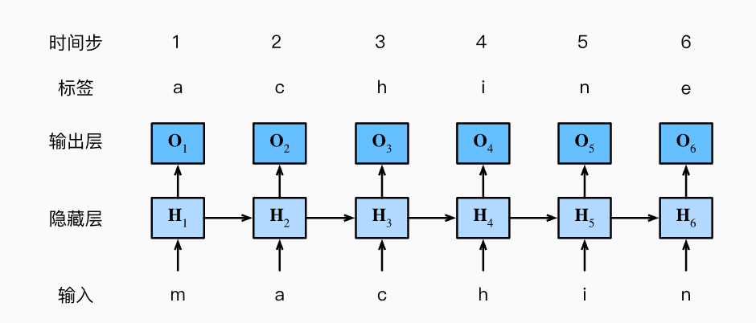
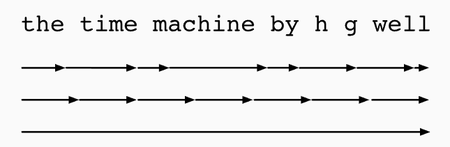
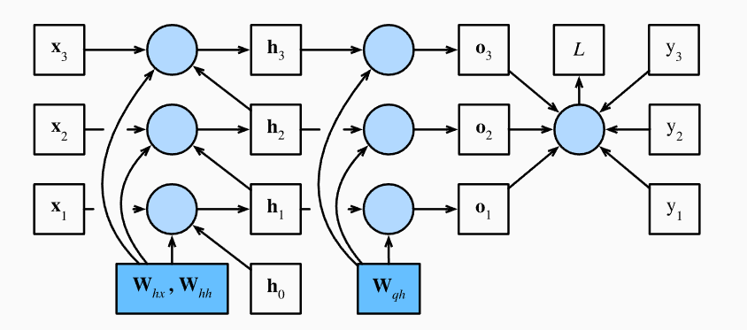

# 8.循环神经网络

目前为止，遇到过两种类型的数据：表格数据与图像数据。对于图像数据，我们设计了专门的卷积神经网络架构来为这种特殊的数据结构建模。

最重要的是，目前为止我们默认数据都来自于某种分布，并且所有样本都是独立同分布的。然而大多数的数据并非如此。例如，文章中的单词是按照顺序写的，如果顺序被随机地重排，就很难理解文章的原始意思。同样，视频中的图像帧、对话中的音频信号以及网站上的浏览行为都是有顺序的。因此，针对此类数据而设计特定的模型，效果可能会更好。

另一个问题来自这样一个事实：我们不仅可以接收一个序列作为输入，而是还可能期望继续猜测这个序列的后续。例如，一个任务是继续预测$2,4,6,8,10,...$。这在时间序列分析中是十分常见的，可以用来预测股市的波动等。同理，我们需要能够处理这些数据的特定模型。

简而言之，如果卷积神经网络能很好地处理空间信息，本章的循环神经网络（recurrent neural network，RNN）则可以更好地处理序列信息。RNN通过引入状态变量存储过去的信息与当前的输入，从而可以确定当前的输出。

许多使用RNN的例子都是基于文本数据的，因此本章将重点介绍语言模型。

在对序列数据进行更详细的回顾后，我们将介绍文本预处理的实用技术。然后，我们将讨论语言模型的基本概念，并将此讨论作为循环神经网络设计的灵感。最后，我们描述了循环神经网络的梯度计算方式，以探讨训练此类网络时可能遇到的问题。

## 8.1.序列模型

### 8.1.1.统计工具


处理序列数据需要统计工具和新的深度神经网络架构。简单起见，以如图所示股票价格为例。

其中，用$x_t$表示价格，即在时间步（time stamp）$t \in Z^+$时，观察到的价格$x_t$。应该注意到的是，$t$对于本文的序列通常是离散的，并在整数或其子集上变化。假设一个交易员想在$t$日的股市中表现良好，于是通过以下途径预测$x_t$：
$$
x_t \sim P(x_t \mid x_{t-1}, \ldots, x_1).
$$

#### 8.1.1.1.自回归模型

为了实现这个预测，交易员可以使用回归模型。仅有一个主要问题：输入数据的数量。输入$x_{t-1},...,x_1$本身因$t$而异。也就是说，输入数据的数量这个数字将会跟随我们遇到的数据量的增加而增加，因此需要一个近似方法来使这个计算变得更容易处理。本章后面的大部分内容将围绕着如何有效估计$P(x_t|x_{t-1},...,x_1)$展开。简单来说，归结分为以下两种策略：

1. 假设在现实情况下相当长的序列$x_{t-1},...,x_1$可能是不必要的，因此我们只需要满足某个长度为$\tau$的时间跨度，即使用观测序列$x_{t-1},...,x_{t-\tau}$。当下获得的最直接的好处就是参数的数量总是不变的，至少在$t>\tau$时如此，这就使得我们能够训练一个上面提及的深层网络。这种模型被称为***自回归模型***（auto regressive models），因为它们是对自己执行回归。
2. 第二种策略，如下图所示，是保留一些对过去预测的总结$h_t$，并且同时更新预测$\hat{x_t}$和总结$h_t$。这就产生了基于$\hat{x_t}=P(x_t\mid h_t)$估计$x_t$，以及公式$h_t=g(h_{t-1},x_{t-1})$更新的模型。由于$h_t$从未被观测到，这类模型也被称为***隐变量自回归模型***（latent auto regressive models）。


这两种情况都有一个显而易见的问题：如何生成训练数据？一个经典的方法是使用历史观测来预测下一个未来观测。显然，我们不指望时间会停滞不前。然而，一个常见的假设是虽然特定值$x_t$可能会改变，但是序列本身的动力学不会改变。这样的假设是合理的，因为新的动力学一定受新的数据影响，而我们不可能用目前所掌握的数据来预测新的动力学。统计学家称不变的动力学为静止的（stationary）。因此，整个序列的估计值都将通过以下的方式获得：
$$
P(x_1, \ldots, x_T) = \prod_{t=1}^T P(x_t \mid x_{t-1}, \ldots, x_1).
$$
注意，如果我们处理的是离散的对象（如单词），而不是连续的数字，则上述的考虑仍然有效。唯一的差别是，对于离散的对象，我们需要使用分类器而不是回归模型来估计$P(x_t \mid x_{t-1},...,x_1)$。

#### 8.1.1.2.马尔可夫模型

回想一下，在自回归模型的近似法中，我们使用$x_{t-1},...,x_\tau$而不是$x_{t-1},...,x_1$来估计$x_t$。只要这种是近似精确的，我们就说序列满足马尔可夫条件（Markov condition）。特别是，如果$\tau = 1$，得到一个一阶马尔可夫模型（first-order Markov model），$P(x)$由下式给出：
$$
P(x_1,...,x_T) = \prod_{t=1}^TP(x_t \mid x_{t-1})当P(x_1\mid x_0)=P(x_1)
$$
当假设$x_t$仅是离散值时，这样的模型特别棒，因为在这种情况下，使用动态规划可以沿着马尔可夫链精确地计算结果。例如我们可以高效地计算$P(x_{t+1}\mid x_{t-1})$：
$$
P(x_{t+1}\mid x_{t-1})=\frac{\sum_{x_t}P(x_{t+1},x_t,x_{t-1})}{P(x_{t-1})}\\
=\frac{\sum_{x_t}P(x_{t+1}\mid x_t,x_{t-1})P(x_t,x_{t-1})}{P(x_{t-1})}\\
={\sum_{x_t}P(x_{t+1}\mid x_t,x_{t-1})P(x_t\mid x_{t-1})}\\
=\sum_{x_t}{P(x_{t+1}\mid x_t)P(x_t\mid x_{t-1})}
$$
在推导过程中，利用到了一阶马尔可夫模型的$P(x_{t+1}\mid x_t,x_{t+1})= P(x_{t+1}\mid x_t)$。

隐马尔科夫模型中的动态规划超过了本节的范围，而动态规划的计算工具已在控制算法与强化学习算法广泛使用。

#### 8.1.1.3.因果关系

原则上，将$P(x_1,...,x_T)$倒序展开也没什么问题。基于条件概率公式，总是可以写出：
$$
P(x_1,...,x_T) =\prod_{t=T}^1P(x_t\mid x_{t+1},...,x_T)
$$
事实上，如果基于一个马尔可夫模型，我们还可以得到一个反向的条件概率分布。然然在很多情况下，数据存在一个自然的方向，即在时间上是前进的。

很明显，未来的事件不能影响过去。因此，如果我们改变$x_t$，可能会影响未来发生的事情$x_{t+1}$，但不能反过来。也就是说，如果我们改变$x_t$，基于过去的分布不会改变。因此，解释$P(x_{t+1}\mid x_t)$比解释$P(x_t\mid x_{t+1})$更容易。例如，在某些情况下，对于某些可加性噪声$\epsilon$，显然我们可以找到$x_{t+1}=f(x_t)+\epsilon$，而反之则不行。

### 8.1.2.训练

使用正弦函数和一些可加性噪声来生成序列数据，时间步为$1,2,...,1000$。

```python
import torch
from torch import nn
T = 1000
time = torch.arrange(1,T+1,dtype=torch.float32)
x = torch.sin(0.01*time) + torch.normal(0,0.2,(T,))
```

接下来将这个序列转换为模型的特征-标签（feature-label）对。基于嵌入维度$\tau$，我们将数据映射为数据对$y_t=x_t$和$\mathbf{x}_t=[x_{t-\tau},...,x_{t-1}]$。这比我们提供的数据样本少了$\tau$个，因为我们没有足够的历史记录来描述前$\tau$个数据样本。一个简单的解决方法是：如果有足够长的序列就丢弃这几项；另一个方法是用零填充序列。

在这里，我们仅用前600个“特征-标签”对进行训练：

```python
tau = 4
features = torch.zeros((T - tau, tau))
for i in range(tau):
    features[:, i] = x[i: T - tau + i]
labels = x[tau:].reshape((-1, 1))

batch_size, n_train = 16, 600
# 只有前n_train个样本用于训练
train_iter = d2l.load_array((features[:n_train], labels[:n_train]),
                            batch_size, is_train=True)
```

在这里，使用一个简单的训练架构：一个具有两个全连接层的多层感知机，使用ReLU损失函数和平方损失。

```python
def init_weights(m):
    if type(m) ==nn.Linear:
        nn.init.xavier_uniform_(m.weight)
def get_net():
    net = nn.Sequential(
        nn.Linear((4,10)),
        nn.ReLU(),
        nn.Linear((10,1))
    )
    net.apply(init_weights)
    return net
loss = nn.MSELoss(reduction='none')
```

后续训练部分省略。

```cmd
epoch 1, loss: 0.076846
epoch 2, loss: 0.056340
epoch 3, loss: 0.053779
epoch 4, loss: 0.056320
epoch 5, loss: 0.051650
```

### 8.1.3.预测

由于训练损失很小，我们期望模型有很小的工作效果。

首先，检查模型预测下一个时间步的能力，也就是单步预测（one-step-ahead prediction）。

```python
onestep_preds = net(features)
```

结果如图：


即使预测的时间步超过了600+4（n_train+tau），其结果依然可靠。

但有一个问题是，如果数据观察序列的时间步只到了604，我们需要一步步向前：
$$
\begin{split}\hat{x}_{605} = f(x_{601}, x_{602}, x_{603}, x_{604}), \\
\hat{x}_{606} = f(x_{602}, x_{603}, x_{604}, \hat{x}_{605}), \\
\hat{x}_{607} = f(x_{603}, x_{604}, \hat{x}_{605}, \hat{x}_{606}),\\
\hat{x}_{608} = f(x_{604}, \hat{x}_{605}, \hat{x}_{606}, \hat{x}_{607}),\\
\hat{x}_{609} = f(\hat{x}_{605}, \hat{x}_{606}, \hat{x}_{607}, \hat{x}_{608}),\\
\ldots\end{split}
$$
通常，对于直到$x_t$的观测序列，其在时间步$t+k$处的预测$\hat{x}_{t+k}$称为k步预测（k-step-ahead-prediction）。

由于这里的序列观察到了$x_{604}$，它的k步预测是$\hat{x}_{604+k}$。接下来使用预测的数据来进行多步预测：

```python
multistep_preds = torch.zeros(T)
multistep_preds[:n_train + tau] = x[:n_train+tau]
for i in range(n_train+tau,T):
    multistep_preds[i] = net(
        multistep_preds[i-tau:i].reshape((1,-1))
    )
```


如图所示，绿色的预测并不理想。经过几个预测步骤后，预测的结果很快会衰减到一个常数。这是由于错误的积累：假设在步骤1后，我们积累了一些错误$\epsilon_1 = \bar\epsilon$。于是，步骤2的输入被扰动了$\epsilon_1$，结果积累的误差是依照次序的$\epsilon_2=\bar \epsilon+c\epsilon_1$，其中c是某个常数。后续的预测以此类推。因此，误差可能会相当快地偏离真实的观测结果。

经过测试后，可以发现4步预测看起来效果不错，但超过这个跨度的任何预测几乎都是无效的。

### 8.1.4.小结

- 时序模型中，当前数据跟之前观察到的数据相关。
- 自回归模型使用自身过去数据来预测未来。
- 马尔可夫模型假设当前只与最近少数数据相关，从而简化模型。
- 潜变量模型使用潜变量来概括历史信息。


## 8.2.文本预处理

对于序列数据处理问题，我们评估了所需统计工具和预测时面临的挑战。这样的数据存在许多种形式，文本是最常见例子之一。一篇文章可以被简单地看作一串单词序列，甚至是一串字符序列。本节将解析文本的常见预处理步骤，通常包括：

1. 将文本作为字符串加载到内存中。
2. 将字符串拆分为词元（如单词和字符）。
3. 建立一个词表，将拆分的词元映射到数字索引。
4. 将文本转换为数字索引，方便模型操作。

本节用到的包：

```python
import collections
import re
```

### 8.2.1.读取数据集

首先从H.G.Well的时光机器中加载文本。这是个相当小的语料库，仅有30000多个单词，现实的文档集合可能会包含数十亿个单词。

下面的函数将数据集读取到由多条文本行组成的列表中，其中每条文本都是一个字符串。简单起见，这里忽略了标点符号与字母大写。

```python
#@save
d2l.DATA_HUB['time_machine'] = (d2l.DATA_URL + 'timemachine.txt',
                                '090b5e7e70c295757f55df93cb0a180b9691891a')

def read_time_machine():  #@save
    """将时间机器数据集加载到文本行的列表中"""
    with open(d2l.download('time_machine'), 'r') as f:
        lines = f.readlines()
    return [re.sub('[^A-Za-z]+', ' ', line).strip().lower() for line in lines]

lines = read_time_machine()
print(f'# 文本总行数: {len(lines)}')
print(lines[0])
print(lines[10])
```

### 8.2.2.词元化

下面的tokenize函数，将文本行列表（lines）作为输入，列表中的每个元素是一个文本序列（如一个文本行）。每个文本序列又被拆分成一个词元列表，词元（token）是文本的基本单位。最后，返回一个由词元列表组成的列表，其中每个词元都是一个字符串（string）。

> 在英文语境里，词元一般要么是词（word），要么是字符（character）。

```python
def tokenize(lines, token='word'):  #@save
    """将文本行拆分为单词或字符词元"""
    if token == 'word':
        return [line.split() for line in lines]
    elif token == 'char':
        return [list(line) for line in lines]
    else:
        print('错误：未知词元类型：' + token)

tokens = tokenize(lines)
for i in range(11):
    print(tokens[i])
```

```python
['the', 'time', 'machine', 'by', 'h', 'g', 'wells']
[]
[]
[]
[]
['i']
[]
[]
['the', 'time', 'traveller', 'for', 'so', 'it', 'will', 'be', 'convenient', 'to', 'speak', 'of', 'him']  
['was', 'expounding', 'a', 'recondite', 'matter', 'to', 'us', 'his', 'grey', 'eyes', 'shone', 'and']     
['twinkled', 'and', 'his', 'usually', 'pale', 'face', 'was', 'flushed', 'and', 'animated', 'the']        
```

### 8.2.3.词表

词元的类型是字符串，而模型需要的输入是数字，因此这种类型不方便模型使用。

现在构建一个字典，通常也叫词表（vocabulary），用来将字符串类型的词元映射到从0开始的数字索引中。

我们先将训练集中所有文档合并在一起，对它们的唯一词元进行统计，得到的统计结果称之为语料（corpus）。然后根据每个唯一词元的出现频率，为其分配一个数字索引。很少出现的词元通常被移除，这可以降低复杂性。

另外，语料库中不存在或已删除的任何词元都将映射到一个特定的未知词元“<unk>”。

我们可以选择增加一个列表，用于保存被保留的词元，例如：填充词元”<pad>“，序列开始词元"<bos>"，序列结束”<eos>“。

```python
class Vocab:  #@save
    """文本词表"""
    def __init__(self, tokens=None, min_freq=0, reserved_tokens=None):
        if tokens is None:
            tokens = []
        if reserved_tokens is None:
            reserved_tokens = []
        # 按出现频率排序
        counter = count_corpus(tokens)
        self._token_freqs = sorted(counter.items(), key=lambda x: x[1],
                                   reverse=True)
        # 未知词元的索引为0
        self.idx_to_token = ['<unk>'] + reserved_tokens
        self.token_to_idx = {token: idx
                             for idx, token in enumerate(self.idx_to_token)}
        for token, freq in self._token_freqs:
            if freq < min_freq:
                break
            if token not in self.token_to_idx:
                self.idx_to_token.append(token)
                self.token_to_idx[token] = len(self.idx_to_token) - 1

    def __len__(self):
        return len(self.idx_to_token)

    def __getitem__(self, tokens):
        if not isinstance(tokens, (list, tuple)):
            return self.token_to_idx.get(tokens, self.unk)
        return [self.__getitem__(token) for token in tokens]

    def to_tokens(self, indices):
        if not isinstance(indices, (list, tuple)):
            return self.idx_to_token[indices]
        return [self.idx_to_token[index] for index in indices]

    @property
    def unk(self):  # 未知词元的索引为0
        return 0

    @property
    def token_freqs(self):
        return self._token_freqs

def count_corpus(tokens):  #@save
    """统计词元的频率"""
    # 这里的tokens是1D列表或2D列表
    if len(tokens) == 0 or isinstance(tokens[0], list):
        # 将词元列表展平成一个列表
        tokens = [token for line in tokens for token in line]
    return collections.Counter(tokens)
```

```python
vocab = Vocab(tokens)
print(list(vocab.token_to_idx.items())[:10])
```

```cmd
[('<unk>', 0), ('the', 1), ('i', 2), ('and', 3), ('of', 4), ('a', 5), ('to', 6), ('was', 7), ('in', 8), ('that', 9)]
```

由于进行了排序，高频词的索引更小。

```python
for i in [0,10]:
    print("文本：",tokens[i])
    print("索引",vocab[tokens[i]])
```

```cmd
文本： ['the', 'time', 'machine', 'by', 'h', 'g', 'wells']
索引 [1, 19, 50, 40, 2183, 2184, 400]
文本： ['twinkled', 'and', 'his', 'usually', 'pale', 'face', 'was', 'flushed', 'and', 'animated', 'the']
索引 [2186, 3, 25, 1044, 362, 113, 7, 1421, 3, 1045, 1]
```

### 8.2.4.整合

在使用上述函数时，我们将所有功能打包到load_corpus_time_machine函数。该函数返回corpus（词元索引列表）和vocab（时光机器语料库的词表）。这里做出的改变是：

1. 为了简化后续章节训练，使用字符而非单词进行词元化。
2. 返回的corpus仅处理为单个列表，而非使用多词元列表构成的一个列表。

```python
def load_corpus_time_machine(max_tokens=-1):
    lines = read_time_machine()
    tokens = tokenize(lines,'char')
    vocab = Vocab(tokens)
    corpus = [vocab[token] for line in tokens for toke in line]
    if max_tokens>0:
        corpus = corpus[:max_tokens]
    return corpus,vocab
```

> 首先将文本词元化，接着将词元化的文本变成词表，然后把所有词元映射成索引得到corpus。

### 8.2.5.小结

- 文本是序列数据的最常见形式之一。
- 为了对文本进行预处理，我们常将文本拆分为词元，构建词表将词元字符串映射为数字索引，并将文本数据转换为词元索引以供模型操作。


## 8.3.语言模型和数据集

在上一节，我们了解了如何把文本数据映射为词元，以及将这些词元可以视为一系列离散的观测，例如单词或字符。

假设长度为$T$的文本序列中的词元依然是$x_1,x_2,...,x_T$。于是，$x_t(1\leq t \leq T)$可以被认为是文本序列在时间步$t$处的观测或标签。

在给定这样的文本序列时，***语言模型（language model）的目标是估计序列的联合概率***：
$$
P(x_1,x_2,...,x_T)
$$
例如，只需要一次抽取一个词元$x_t \sim P(x_t\mid x_{t-1},...,x_1)$，一个理想的语言模型可以基于模型本身生成自然文本。从这样的模型中提取的文本都将作为自然语言来传递。只需要基于前面的对话片段中的文本就能生成一个有意义的对话，但显然距离设计这样的系统还很遥远。

尽管如此，语言模型依然在语音识别、文档摘要生成算法等领域中有应用。

### 8.3.1.学习语言模型

第一个问题是如何对文档，或是一个词元序列进行建模。

假设在单词级别对文本数据进行词元化，从基本概率规则开始：
$$
P(x_1,x_2,...,x_T)=\prod^T_{t=1}P(x_t\mid x_1,...,x_{t-1})
$$
例如，包含了四个单词的一个文本序列的概率是：
$$
P(deep,learning,is,good)=P(deep)\times P(learning\mid deep)\\ \times P(is\mid deep,learning)\times P(good\mid deep,learning,is)
$$
为了训练语言模型，我们需要计算单词的概率，以及给定前面几个单词后出现某个单词的条件概率。这些概率本质就是模型的参数。

首先，假设训练数据集是一个大型的文本语料库。

训练数据集中词的概率可以根据给定词的相对词频来计算。例如，可以将估计值$\hat P(deep)$计算为任何以单词“deep”开头的句子的概率。一种稍微不太精确的方法是统计单词“deep“在数据集中的出现次数，然后将其除以整个语料库中的单词总数。这种方法效果不错，特别是对于频繁出现的单词。

接下来，可以尝试估计：
$$
\hat P(learning\mid deep)=\frac{n(deep,learning)}{n(deep)}
$$
其中$n(x)$和$n(x,x')$分别是单个单词和连续单词对的出现次数。

但由于连续单词对"deep learning"的出现频率要低得多，所以估计这类单词正确的概率要困难得多。特别是对于不常见的单词组合，想要找到足够的出现次数来获得准确的估计可能都不容易。

而对于三个或更多的单词组合，情况会变更糟。许多合理的三单词组合可能是存在的，但在数据集中却找不到。除非我们提供某种解决方案。将这些单词组合指定为非零计数，否则将无法在语言模型中使用它们。如果数据集很小，或者单词非常罕见，那么这类单词出现一次的机会可能都找不到。

一种常见的策略是执行某种形式的拉普拉斯平滑（Laplace smoothing），具体方法是在所有计数中添加一个小常量。用$n$表示训练集中的单词总数，用$m$表示唯一单词的数量。此解决方案有助于处理单元素问题，例如通过：
$$
\hat P(x)=\frac{n(x)+\epsilon_1/m}{n+\epsilon_1}\\
\hat P(x'\mid x)=\frac{n(x,x')+\epsilon_2\hat P(x')}{n(x)+\epsilon_2}\\
\hat P(x''\mid x,x')=\frac{n(x,x',x'')+\epsilon_3\hat P(x'')}{n(x,x')+\epsilon_3}
$$
其中，$\epsilon_1,\epsilon_2,\epsilon_3$是超参数。以$\epsilon_1$为例：当$\epsilon_1=0$时，不应用平滑；当$\epsilon_1$接近正无穷时，$\hat P(x)$接近均匀概率分布$\frac{1}{m}$。

然而，这样的模型很容易变得无效。原因在下面的词频分析部分可见。

### 8.3.2.马尔可夫模型与$n$元语法

在讨论包含深度学习的解决方案之前，我们需要了解更多的概念和术语。

回想一下对于马尔可夫模型的讨论，并且应用于语言模型。如果$P(x_{t+1}\mid x_t,...,x_1)=P(x_{t+1}\mid x_t)$，则序列上的分布满足一阶马尔可夫性质。阶数越高，对应的依赖关系越长。这种性质推导出了许多可以应用于序列建模的近似公式：
$$
P(x_1,x_2,x_3,x_4)=P(x_1)\times P(x_2)\times P(x_3)\times P(x_4)\\
P(x_1,x_2,x_3,x_4)=P(x_1)\times P(x_2\mid x_1)\times P(x_3\mid x_2)\times P(x_4\mid x_3)\\
P(x_1,x_2,x_3,x_4)=P(x_1)\times P(x_2\mid x_1)\times P(x_3\mid x_1,x_2)\times P(x_4\mid x_2,x_3)
$$
涉及一个、两个、三个变量的概率公式分别被称为一元语法（unigram）、二元语法（bigram）和三元语法（trigram）模型。

> 一元语法的$\tau=0$，二元$\tau=1$，三元$\tau=2$

当序列很长时，文本量不够大，很可能$n(x_1,...,x_T)\leq1$，使用马尔可夫假设可以缓解这个问题。

### 8.3.3.自然语言统计

根据time machine数据集构建词表，并打印10个最常用的单词。

```python
import random
import torch
from d2l import torch as d2l
tokens = d2l.tokenize(d2l.read_time_machine())

corpus = [token for line in tokens for token in line]
vocab = d2l.Vocab(corpus)
print(vocab.token_freqs[:10])
```

```cmd
[('the', 2261), ('i', 1267), ('and', 1245), ('of', 1155), ('a', 816), ('to', 695), ('was', 552), ('in', 541), ('that', 443), ('my', 440)]
```

最流行的词看起来比较无聊，这些词通常被称为停用词（stop words），因此可以被过滤掉。尽管如此，它们本身仍然是有意义的，我们仍然会在模型中使用它们。

> stop words的含义是，不会对整个文本理解产生太大作用的词。

可以画图看每个token出现的概率(x_scale与y_scale用的都是log)：


词频（更严谨的说，是词的出现次数）以一种明确的方式衰减。将前几个单词作为例外消除后，剩余的所有单词大致遵循双对数坐标图上的一条直线。这意味着单词的频率满足齐普夫定律（Zipf's law），即对第$i$个最常用单词的频率$n_i$为：
$$
n_i \propto \frac{1}{i^\alpha},
$$
等价于：
$$
\log n_i = -\alpha\log i+c
$$
其中$\alpha$是刻画分布的指数，$c$是常数。

这告诉我们，想要通过计数统计和平滑来建模单词是不可行的，因为这样建模会大大高估尾部单词（也就是不常用单词）的频率。

接下来，看看其他词元组合（二元、三元语法）的频率是否会与一元语法表现出相同的行为模式。

```python
bigram_tokens = [pair for pair in zip(corpus[:-1],corpus[1:])]
bigram_vocab = d2l.Vocab(bigram_tokens)
print(bigram_vocab.token_freqs[:10])
```

```cmd
[(('of', 'the'), 309), (('in', 'the'), 169), (('i', 'had'), 130), (('i', 'was'), 112), (('and', 'the'), 109), (('the', 'time'), 102), (('it', 'was'), 99), (('to', 'the'), 85), (('as', 'i'), 78), (('of', 'a'), 73)]
```

在十个最频繁的词对中，有九个是由两个停用词组成的，只有一个与"the time"有关。

接下来进一步看看三元语法的频率是否表现出相同的行为方式：

```python
trigram_tokens = [triple for triple in zip(corpus[:-2],corpus[1:-1],corpus[2:])]
trigram_vocab = d2l.Vocab(trigram_tokens)
print(trigram_vocab.token_freqs[:10])
```

```cmd
[(('the', 'time', 'traveller'), 59), (('the', 'time', 'machine'), 30), (('the', 'medical', 'man'), 24), (('it', 'seemed', 'to'), 16), (('it', 'was', 'a'), 15), (('here', 'and', 'there'), 15), (('seemed', 'to', 'me'), 14), (('i', 'did', 'not'), 14), (('i', 'saw', 'the'), 13), (('i', 'began', 'to'), 13)]
```

直观对比三种模型中的词元频率：


可以观察出：

1. 除了一元语法词，单词序列也遵循齐普夫定律，单指数$\alpha$更小。
2. 词表中$n$元组的数量不大，说明语言中存在相当多结构，给了我们应用模型的希望。
3. 很多$n$元组很少出现，使得拉普拉斯平滑很不适合语言建模。作为替代，我们将使用基于深度学习的模型。

### 8.3.4.读取长序列数据

由于序列数据本质上是连续的，因此我们在处理这个数据时，需要解决这个问题。

在8.1节中，当序列太长不能被模型一次性全部处理时，我们可能希望拆分这样的序列方便模型读取。

在介绍该模型之前，先看一下整体策略。假设我们将使用神经网络来训练语言模型，模型中的网络一次处理具有预定义长度（例如n个时间步）的一个小批量序列。现在的问题是，如何随机生成一个小批量数据的特征与标签以供读取。

由于文本序列可以是任意长的，于是任意长的序列可以被我们划分为具有相同时间步数的子序列。当训练神经网络时，这样的小批量子序列将被输入到模型中。假设网络一次只处理具有$n$个时间步的子序列。下图画出了从原始文本序列获得子序列的所有不同的方式，n=5，并且每个时间步的词元对应一个字符。


因为我们可以选择任意偏移量来指示初始位置，所以我们有相当大的自由度。对于上图的子序列，选择哪一个都同样的好。然而，如果只选择一个偏移量，那么用于训练网络的、所有可能的子序列的覆盖范围是有限的。因此，我们可以从随机偏移量开始划分序列，以同时获得覆盖性（coverage）和随机性（randomness）。

下面，我们将描述如何实现随机采样（random sampling）和顺序分区（sequeantial partitioning）策略。

#### 8.3.4.1.随机采样

在随机采样中，每个样本都是在原始的长序列上任意捕获的子序列。在迭代过程中，来自两个相邻的、随机地、小批量中的子序列不一定在原始序列上相邻。对于语言建模，目标是基于目前为止我们看到的词元来预测下一个词元，因此标签是移位了一个词元的原始序列。

下面的代码每次可以从数据中随机生成一个小批量。在这里，参数`batch_size`指定了每个小批量中子序列样本的数目，参数`num_steps`是每个子序列中预定义的时间步数。

```python
def seq_data_iter_random(corpus,batch_size,num_steps):
    corpus = corpus[random.randint(0,num_steps-1):] #随机丢弃几个词元，相当于随机化偏移k
    num_subseqs = (len(corpus)-1)//num_steps  #计算丢弃后可分割的序列数量
    initial_indices = list(range(0,num_subseqs*num_steps,num_steps)) #每个序列的起始索引
    random.shuffle(initial_indices)  #打乱每个序列的起始索引
    def data(pos):
        return corpus[pos:pos+num_steps] #可以得到pos为起始的长度为num_steps的子序列
    num_batches = num_subseqs // batch_size  #计算batch数量
    for i in range(0,batch_size*num_batches,batch_size): #每个i是0，batch_size,2batch_size...
        initial_indices_per_batch = initial_indices[i:i+batch_size]
        # 该轮次的索引是initial_indices中i到i+batch_size的部分，有batch_size个子序列
        X = [data(j) for j in initial_indices_per_batch]
        Y = [data(j+1) for j in initial_indices_per_batch]
        yield torch.tensor(X),torch.tensor(Y)
        # yield将函数变成生成器
```

> 这里的Y并非是一个词元，而是与X大小相同的一个序列。

下面生成一个从0到34的序列。假设批量大小设为2，时间步数为5，意味着我们可以生成$\lfloor (35 - 1) / 5 \rfloor= 6$个“特征-标签”子序列对。

```python
my_seq = list(range(35))
for X,Y in seq_data_iter_random(my_seq,2,5):
    print("X:",X,"\n","Y:",Y)
```

```cmd
X: tensor([[ 2,  3,  4,  5,  6],
        [27, 28, 29, 30, 31]]) 
 Y: tensor([[ 3,  4,  5,  6,  7],
        [28, 29, 30, 31, 32]])
X: tensor([[12, 13, 14, 15, 16],
        [ 7,  8,  9, 10, 11]])
 Y: tensor([[13, 14, 15, 16, 17],
        [ 8,  9, 10, 11, 12]])
X: tensor([[17, 18, 19, 20, 21],
        [22, 23, 24, 25, 26]])
 Y: tensor([[18, 19, 20, 21, 22],
        [23, 24, 25, 26, 27]])
```

> 为什么是生成6个：特征-标签”序列对？
>
> 首先，虽然这个函数是随机采样，但在单次应用这个函数时，其内部的初始偏置就已经固定，故内部的子序列就已经切好，共有$\lfloor \frac{n-1}{t}\rfloor$个序列。在这个函数生成器中，每次返回batch_size组数据。
>
> 为什么Y的大小不是1而是与X相同？
>
> 就拿X: tensor([[ 2,  3,  4,  5,  6], Y: tensor([[ 3,  4,  5,  6,  7],这组数据举例：
>
> 其预测并非是，用X=[2,3,4,5,6]预测Y=[7]，而是用[2]预测3，[2,3]预测[4]，[2,3,4]预测[5]，以此类推，最多预测5步。

随机采样的特点是，同一个batch中，不同batch之间的子序列并不相邻，是随机打乱的。

#### 8.3.4.2.顺序分区

在迭代过程中，除了对原始序列可以随机抽样之外，还可以保证两个相邻小批量中的子序列在原始序列上也是相邻的。这种策略在基于小批量的迭代过程中保留了拆分的子序列的顺序，因此也被称为顺序分区。

```python
def seq_data_iter_sequential(corpus,batch_size,num_steps):
    offset = random.randint(0,num_steps)
    num_tokens = ((len(corpus)-offset-1)//batch_size)*batch_size
    Xs = torch.tensor(corpus[offset:offset+num_tokens])
    Ys = torch.tensor(corpus[offset+1:offset+1+num_tokens])
    Xs,Ys = Xs.reshape(batch_size,-1),Ys.reshape(batch_size,-1)
    num_batches = Xs.shape[1]//num_steps
    for i in range(0,num_steps*num_batches,num_steps):
        X = Xs[:,i:i+num_steps]
        Y = Ys[:,i:i+num_steps]
        yield X,Y
```

在顺序分区算法中，迭代期间来自两个相邻小批量中的子序列在原始序列中相邻。

```python
for X,Y in seq_data_iter_sequential(my_seq,batch_size=2,num_steps=5):
    print('X:',X,'\nY:',Y)
```

```cmd
X: tensor([[ 1,  2,  3,  4,  5],
        [17, 18, 19, 20, 21]]) 
Y: tensor([[ 2,  3,  4,  5,  6],
        [18, 19, 20, 21, 22]])
X: tensor([[ 6,  7,  8,  9, 10],
        [22, 23, 24, 25, 26]])
Y: tensor([[ 7,  8,  9, 10, 11],
        [23, 24, 25, 26, 27]])
X: tensor([[11, 12, 13, 14, 15],
        [27, 28, 29, 30, 31]])
Y: tensor([[12, 13, 14, 15, 16],
        [28, 29, 30, 31, 32]])
```

接下来，将上面两个采样函数包装到一个类中，以便稍后可以将其用作数据迭代器。

```python
class SeqDataLoader:
    def __init__(self,batch_size,num_steps,use_random_iter,max_tokens):
        if use_random_iter:
            self.data_iter_fn = d2l.seq_data_iter_random
        else:
            self.data_iter_fn = d2l.seq_data_iter_sequential
        self.corpus,self.vocab = d2l.load_corpus_time_machine(max_tokens)
        self.batch_size,self.num_steps = batch_size,num_steps
    def __iter__(self):
        return self.data_iter_fn(self.corpus,self.batch_size,self.num_steps)
```

最后定义了一个函数load_data_time_machine，它同时返回数据迭代器和词表。

```python
def load_data_time_machine(batch_size,num_steps,use_random_iter=False,max_tokens=10000):
    data_iter = SeqDataLoader(batch_size,num_steps,use_random_iter,max_tokens)
    return data_iter,data_iter.vocab
```

### 8.3.5.小结

- 语言模型是NLP的关键，其目的是估计文本序列的联合概率。
- 使用统计方法时采用$n$元语法。
- 读取长序列的主要方式是随机采样和顺序分区。在迭代过程中，后者可以保证来自两个相邻小批量中的子序列在原始序列上也是相邻的。


## 8.4.循环神经网络

在8.3节中介绍了n元语法模型，其中单词$x_t$在时间步$t$的条件概率仅取决于前面$n-1$个单词。

对于时间步$t-(n-1)$前的单词，如果我们想将其可能产生的影响合并到$x_t$上，需要增加$n$，然而模型参数的数量也会随之呈指数增长，因为词表$\mathcal{V}$需要存储$|\mathcal{V}|^n$个数字，因此与其将$P(x_t\mid x_{t-1},...,x_{t-n+1})$模型化，不如使用隐变量模型：
$$
P(x_t\mid x_{t-1},...,x_1) \approx P(x_t\mid h_{t-1})
$$
其中$h_{t-1}$是隐状态（hidden state），也称为隐藏变量（hidden variable），它存储了到时间步$t-1$的序列信息。通常，我们可以基于当前$x_t$和先前隐状态$h_{t-1}$来计算时间步$t$处的任何时间的隐状态：
$$
h_t = f(x_t,h_{t-1})
$$
对于该式中的函数$f$，隐变量模型不是近似值。$h_t$是可以仅仅存储到目前为止观察到的所有数据，然而这样的操作可能使计算和存储的代价都变得昂贵。

值得注意的是，隐藏层和隐状态指的是两个截然不同的概念。隐藏层是从输入到输出的路径上（从观测角度理解）的隐藏的层，而隐状态是在给定步骤所做的任何事情（以技术角度定义）的输入，并且这些状态只能通过先前时间步的数据计算。

循环神经网络（recurrent neural networks，RNNs）是具有隐状态的神经网络。

### 8.4.1.无隐状态的神经网络

这里首先回顾多层感知机模型。

考虑只有单隐藏层的多层感知机。设隐藏层的激活函数为$\phi$，给定一个小批量样本$\mathbf{X}\in \mathbb{R}^{n\times d}$，其中批量大小为$n$，输入维度为$d$，则隐藏层的输出$\mathbf{H}\in \mathbb{R}^{n\times h}$通过下式计算：
$$
\mathbf{H} = \phi(\mathbf{X}\mathbf{H}_{xh}+\mathbf{b}_h)
$$
该式中，隐藏层权重参数为$\mathbf{W}_{xh}\in \mathbb{R}^{d\times h}$，偏置参数为$\mathbf{b}_h\in \mathbb{R}^{1\times h}$，隐藏单元数目为$h$。接下来将隐藏变量$\mathbf{H}$用作输出层的输入，则：
$$
\mathbf{O}= \mathbf{H}\mathbf{W}_{hq}+\mathbf{b}_q
$$
$\mathbf{O}\in \mathbb{R}^{n\times q}$是输出变量，$\mathbf{W}_{hq}\in \mathbb{R}^{h\times q}$是权重参数，$\mathbf{b}_q \in \mathbb{R}^{1\times q}$是输出层的偏置参数。如果是分类问题，则可以用softmax($\mathbf{O}$)来计算输出类别的概率分布。

### 8.4.2.有隐状态的循环神经网络

假设我们在时间步t有小批量输入$\mathbf{X}_t\in \mathbb{R}^{n\times d}$。换言之，对于$n$个序列样本的小批量，$\mathbf{X}_t$的每一行对应于来自该序列的时间步$t$处的一个样本。

接下来，用$\mathbf{H}_t \in \mathbb{R}^{n\times h}$表示时间步$t$的隐藏变量。与MLP不同的是，这里保存了前一个时间步的隐藏变量$\mathbf{H}_{t-1}$，并引入了一个新的权重参数$\mathbf{W}_{hh}\in \mathbb{R}^{h\times h}$，来描述如何在当前时间步中使用前一个时间步的隐藏变量。

具体讲，***当前时间步的隐藏变量由当前时间步的输入与前一个时间步的隐藏变量一起计算得出***：
$$
\mathbf{H}_t=\phi(\mathbf{X}_t\mathbf{W}_{xh}+\mathbf{H}_{t-1}\mathbf{W}_{hh}+\mathbf{b}_h)
$$
这里添加了一项$\mathbf{H}_{t-1}\mathbf{H}_{hh}$，从而实例化了$h_t = f(x_t,h_{t-1})$。

从相邻两时间步的隐藏变量$\mathbf{H}_t$与$\mathbf{H}_{t-1}$之间的关系可知，这些变量捕获并保留了序列直到当前时间步的历史信息，如同当前时间步下神经网络的状态或记忆一样，因此这样的隐藏变量被称为***隐状态***（hidden state）。

由于当前时间步中，隐状态使用的定义与前一个时间步中使用的定义相同，因此$\mathbf{H}_t$的计算是循环的（recurrent）。于是基于循环计算的隐状态神经网络被命名为循环神经网络（recurrent neural network）。在RNN中执行$\mathbf{H}_t$计算的层被称为循环层（recurrent layer）。

有许多不同的方法构建循环神经网络，由$\mathbf{H}_t=\phi(\mathbf{X}_t\mathbf{W}_{xh}+\mathbf{H}_{t-1}\mathbf{W}_{hh}+\mathbf{b}_h)$定义的隐状态的循环神经网络是非常常见的一种。对于时间步$t$，输出层的输出类似于MLP中的计算：
$$
\mathbf{O}_t=\mathbf{H}_t\mathbf{W}_{hq}+\mathbf{b}_q
$$
循环神经网络的参数包括隐藏层的权重$\mathbf{W}_{xh}\in \mathbb{R}^{d\times h}$，$\mathbf{W}_{hh}\in \mathbb{R}^{h\times h}$和偏置$\mathbf{b}_h\in \mathbb{R}^{1\times h}$，以及输出层的权重$\mathbf{W}_{hq}\in \mathbb{R}^{h\times q}$和偏置$\mathbf{b}_q\in \mathbb{R}^{1\times q}$。

即使在不同的时间步，RNN也总是使用这些模型参数。因此，RNN的参数开销不会随着时间步的增加而增加。

如图，展示了RNN在三个相邻时间步的计算逻辑。



在任意时间步$t$，隐状态的计算可以被视为：

1. 拼接当前时间步$t$的输入$\mathbf{X}_t$和前一时间步$t-1$的隐状态$\mathbf{H}_{t-1}$
2. 将拼接的结果送入带有激活函数$\phi$的全连接层。全连接层的输出是当前时间步$t$的隐状态$\mathbf{H}_t$

在本节的例子中，模型参数是$\mathbf{W}_{xh}$和$\mathbf{W}_{hh}$的拼接，以及$\mathbf{b}_h$的偏置。当前时间步$t$的隐状态$\mathbf{H}_t$将参与计算下一时间步$t+1$的隐状态$\mathbf{H}_{t+1}$。而且$\mathbf{H}_t$还将送入全连接输出层，用于计算当前时间步$t$的输出$\mathbf{O}_t$。

刚刚提到，隐状态中$\mathbf{X}_t\mathbf{W}_{xh}+\mathbf{H}_{t-1}\mathbf{W}_{hh}$的计算，相当于$\mathbf{X}_t和\mathbf{H}_{t-1}$的拼接与$\mathbf{W}_{xh}$和$\mathbf{W}_{hh}$的拼接的矩阵乘法。这一性质可以通过数学证明，但接下来通过简单的代码来说明它：

首先定义矩阵X、W_xh、H和W_hh，它们的形状分别是(3,1),(1,4),(3,4),(4,4)。将X乘以W_xh，H乘以W_hh，然后将这两个乘法相加，得到一个形状为(3,4)的矩阵。

```python
import torch
X,W_xh = torch.normal(0,1,(3,1)),torch.normal(0,1,(1,4))
H,W_hh = torch.normal(0,1,(3,4)),torch.normal(0,1,(4,4))
Y = torch.matmul(X,W_xh)+torch.matmul(H,W_hh)
print(Y.data)
```

现在，沿列（轴1）拼接X和H，沿行（轴0）拼接W_xh和W_hh。这两个拼接分别产生形状为(3,5)和(5,4)的矩阵。再将这两个拼接的矩阵相乘，形状为(3,4)。

```python
torch.matmul(torch.cat((X,H),dim=1),torch.cat((W_xh,W_hh),dim=0))
```

```python
Z = torch.matmul(torch.cat((X,H),dim=1),torch.cat((W_xh,W_hh),dim=0))
print(Z)
print(Y==Z)
```

```cmd
tensor([[-1.5674,  1.4154,  0.8663,  1.4253],
        [ 3.3785,  1.9613, -2.3250, -2.9744],
        [ 0.9109, -1.2797,  2.7764,  0.8073]])
tensor([[-1.5674,  1.4154,  0.8663,  1.4253],
        [ 3.3785,  1.9613, -2.3250, -2.9744],
        [ 0.9109, -1.2797,  2.7764,  0.8073]])
tensor([[ True,  True,  True, False],
        [ True,  True, False,  True],
        [ True,  True,  True,  True]])
```

### 8.4.3.基于RNN的字符级语言模型

回想8.3节的语言模型，我们的目标是根据过去的和当前的词元预测下一个词元，因此我们将原始序列移位一个词元作为标签。

接下来，看一下如何使用循环神经网络构建语言模型。设小批量大小为1，批量中文本序列为“machine”。为了简化后续部分的训练，考虑使用字符级语言模型（character-level language model），将文本词元化为字符而非单词。

如图，展示了如何通过基于字符级语言建模的循环神经网络，使用当前和先前的字符预测下一个字符。



在训练过程中，我们对每个时间步的输出层的输出进行softmax操作，然后利用交叉熵损失计算模型输出和标签之间的误差。由于隐藏层中隐状态的循环计算，图中第三个时间步的输出$\mathbf{O}_3$由文本序列“m”“a”和"c"确定。由于训练数据中这个文本序列的下一个字符是"h"，因此第三个时间步的损失将取决于下一个字符的概率分布，而下一个字符是基于特征序列"m""a""c"和这个时间步的标签“h”生成的。

在实践中，我们使用批量大小为$n>1$，每个词元都由一个$d$维向量表示。因此，在时间步$t$的输入$\mathbf{X}_T$是一个$n\times d$矩阵。

### 8.4.4.困惑度（Perplexity）

最后，考虑如何度量语言模型的质量，这将在后续部分中用于评估基于RNN的模型。

一个好的语言模型能够用高度准确的词元来预测接下来看到什么。

考虑不同的语言模型对于“It is raining...”的续写：

1. It is raining outside.
2. It is raining banana tree.
3. It is raining piouw; kcj pwepoiut.

显然例1最合理、逻辑最连贯。虽然这个模型可能没有很准确地反映出后续词的语义，但该模型已经能捕捉到跟在后面的是哪类单词。

例2则糟糕的多，因为其产生了一个无意义的续写。尽管如此，该模型已经学会了如何拼写单词，以及单词之间某种程度的相关性。

例3表明了训练不足的模型是无法正确地拟合数据的。

我们可以通过计算序列的似然概率来度量模型的质量。但这是一个难以理解、难以比较的数字。因为较短的序列比较长的序列更有可能出现，因此评估模型产生长篇小说的可能性不可避免地比短篇小说的可能性小得多。而缺少的可能性值相当于平均数。

根据信息论的知识，一个更好的语言模型能让我们更准确地预测下一个词元，因此，它应该允许我们在压缩序列时花费更少的比特。

> 这里的压缩，指的是用模型所学的概率分布更高效地表示语言数据。

所以我们可以通过一个序列中所有的$n$个词元的交叉熵损失的平均值来衡量：
$$
\frac{1}{n}\sum_{t=1}^n {-\log P(x_t \mid x_{t-1},...,x_1)}
$$
其中$P$由语言模型给出，$x_t$是在时间步$t$从该序列观察到的实际词元。这使得不同长度的文档的性能具有可比性。

由于历史原因，一般用困惑度（perplexity）衡量模型的好坏，它是交叉熵损失的指数：
$$
\exp(-\frac{1}{n} \sum_{t=1}^n \log P(x_t\mid x_{t-1},...,x_1))
$$
困惑度最好的理解是“下一个词元的实际选择数的调和平均数”。

1. 在最好的情况下，模型总是完美的估计标签词元的概率为1，这种情况下，模型的困惑度为1。
2. 在最坏的情况下，模型总是预测标签词元的概率为0。在这种情况下，困惑度是正无穷大。
3. 在基线上，该模型的预测是词表所有可用词元的均匀分布。在这种情况下，困惑度等于词表中唯一词元的数量。事实上，如果在没有任何压缩的情况下存储序列，这将是我们能做到最好的编码方式。因此这种方式提供了一个重要的上限，而任何实际模型都必须超越这个上限。

### 8.4.5.小结

- 对隐状态使用循环计算的神经网络称为循环神经网络(RNN)。
- RNN的隐状态可以捕获直到当前时间步序列的历史信息。
- RNN模型的参数数量不会随着时间步的增加而增加。
- RNN的输出取决于当下的输入与前一段时间的隐变量。
- 通常使用困惑度来衡量语言模型的好坏。


## 8.5.RNN的从零开始实现

本节将根据8.4节中的描述，从头开始基于RNN实现字符级语言模型。

首先读取数据集。

```python
import math
import torch
from torch import nn
from torch.nn import functional as F
from d2l import torch as d2l

batch_size ,num_steps = 32,35
train_iter,vocab = d2l.load_data_time_machine(batch_size,num_steps)
```

### 8.5.1.独热编码

回想一下，train_iter中，每个词元都表示为一个数字索引，将这些索引直接输入神经网络可能导致学习变得困难。

我们通常将每个词元表示为更具表现力的特征向量，最简单的表示称为独热编码（one-hot encoding）。

简言之，将每个索引映射为相互不同的单位向量：假设词表中不同词元的数目为N，词元索引的范围为0到N-1。如果词元的索引是整数$i$，那么我们将创建一个长度为$N$的全0向量，并将第i个元素设置为1。此向量是原始词元的一个独热向量。

我们每次采样的小批量数据形状是二维张量：（批量大小，时间步数）。one_hot函数将这样一个小批量数据转换成三维张量，张量最后一个维度等于词表大小。

我们经常转换输入的维度，以便获得形状为（时间步数，批量大小，词表大小）的输出。这使得能够更方便地通过最外层的维度，一步步地更新小批量数据的隐状态。

### 8.5.2.初始化模型参数

接下来初始化RNN模型的模型参数。隐藏单元数num_hiddens是一个可调的超参数。训练语言模型时，输入和输出来自相同的词表，因此它们具有相同的维度，即词表大小。

```python
def get_params(vocab_size,num_hiddens,device):
    num_inputs = num_outputs = vocab_size
    def normal(shape):
        return torch.randn(size = shape,device=device)*0.01
    W_xh = normal((num_inputs,num_hiddens))
    W_hh = normal((num_hiddens,num_hiddens))
    b_h = torch.zeros((num_hiddens),device=device)
    W_hq = normal((num_hiddens,num_outputs))
    b_q = normal((num_outputs),device=device)
    params = [W_xh,W_hh,b_h,W_hq,b_q]
    for param in params:
        param.requires_grad_(True)
    return params
```

### 8.5.3.循环神经网络模型

为了定义RNN模型，首先需要一个init_rnn_state函数在初始化时返回隐状态。这个函数的返回是一个张量，全用0填充，形状为(批量大小，隐藏单元数)。

```python
def init_rnn_state(batch_size,num_hiddens,device):
    return (torch.zeros((batch_size,num_hiddens),device=device))
```

下面的rnn函数定义了如何在一个时间步内计算隐状态和输出。RNN模型通过inputs最外层的维度实现循环，以便逐时间步更新小批量数据的隐状态H。此外，使用tanh函数作为激活函数，当元素在实数上满足均匀分布时，tanh函数的平均值为0。

```python
def rnn(inputs,state,params):
    W_xh,W_hh,b_h,W_hq,b_q = params
    H, = state
    outputs=[]
    for X in inputs:
        H = torch.tanh(torch.mm(X,W_xh)+torch.mm(H,W_hh)+b_h)
        Y = torch.mm(H,W_hq)+b_q
        outputs.append(Y)
    return torch.cat(outputs,dim=0),(H,)  
```

接下来创建一个类来包装这些函数，并存储从0开始实现的RNN模型参数。

```python
class RNNModelScratch:
    def __init__(self,vocab_size,num_hiddens,device,get_params,init_state,forward_fn):
        self.vocab_size,self.num_hiddens = vocab_size,num_hiddens
        self.params = get_params(vocab_size,num_hiddens,device)
        self.init_state,self.forward_fn = init_state,forward_fn
    def __call__(self,X,state):
        X = F.one_hot(X.T,self.vocab_size).type(torch.float32)
        return self.forward_fn(X,state,self.params)
    def begin_state(self,batch_size,device):
        return self.init_state(batch_size,self.num_hiddens,device)
```

> X的形状是(batch_size,时间步数)，X.T则为（时间步数，batch_size），独热后为（时间步数，batch_size，vocab_size)

检查输出的维度形状：

```python
X=torch.arange(10).reshape((2,5))
num_hiddens = 512
net = RNNModelScratch(len(vocab),num_hiddens,d2l.try_gpu(),get_params,init_rnn_state,rnn)
state = net.begin_state(X.shape[0],d2l.try_gpu())
Y,new_state = net(X.to(d2l.try_gpu()),state)
print(Y.shape,'\n',new_state[0].shape)
```

```cmd
torch.Size([10, 28]) 
torch.Size([2, 512])
```

可以看到，输出形状是（时间步数×批量大小，词表大小），而隐状态形状保持不变，即（批量大小，隐藏单元数）。

### 8.5.4.预测

首先定义预测函数来生成prefix之后的新字符，其中prefix是用户提供的包含多个字符的字符串。在循环遍历prefix中的开始字符时，我们不断地将隐状态传递到下一个时间步，但是不生成任何输出，这被称为预热（warm-up）期，因为在此期间模型会自我更新（例如更新隐状态），但不会进行预测。

预热期结束后，隐状态的值通常比刚开始的初始值更适合预测，从而预测字符并输出它们。

```python
def predict_ch8(prefix, num_preds, net, vocab, device):  #@save
    """在prefix后面生成新字符"""
    state = net.begin_state(batch_size=1, device=device)
    outputs = [vocab[prefix[0]]]
    get_input = lambda: torch.tensor([outputs[-1]], device=device).reshape((1, 1))
    for y in prefix[1:]:  # 预热期
        _, state = net(get_input(), state)
        outputs.append(vocab[y])
    for _ in range(num_preds):  # 预测num_preds步
        y, state = net(get_input(), state)
        outputs.append(int(y.argmax(dim=1).reshape(1)))
    return ''.join([vocab.idx_to_token[i] for i in outputs])
```

现在我们可以测试predict_ch8函数，将前缀指定为time traveller，并基于这个前缀生成10个后续字符。因为还没有训练网络，所以会产生荒谬的预测。

```python
print(predict_ch8("time traveller",10,net,vocab,d2l.try_gpu()))
```

```cmd
time travellergggggggggg
```

### 8.5.5.梯度裁剪

对于长度为$T$的序列，我们迭代在这$T$个时间步上的梯度，将会在反向传播过程中产生长度为$O(T)$的矩阵乘法链。

当$T$较大时，可能会导致数值不稳定，例如梯度爆炸或梯度消失。因此，RNN往往需要额外的方式来支持稳定训练。

一般来说，当解决优化问题时，我们对模型采用更新步骤。假设在向量形式的$x$中，或者在小批量数据的负梯度$g$方向上。

例如，使用$\eta > 0$作为学习率时，在一次迭代中，我们将$x$更新为$x-\eta g$。如果我们假设目标函数$f$表现良好，即$f$在常数$L$下是利普希茨连续的。也就是说，对于任意$x$和$y$，都有：
$$
|f(x)-f(y)| \leq L||x-y||
$$
在这种形式下，可以安全地假设：如果我们通过$\eta g$更新参数向量，则：
$$
|f(x)-f(x-\eta g)|\leq L\eta||g||
$$
这意味着我们不会观察到超过$L\eta||g||$的变化。这是双刃剑，一方面，它限制了取得进展的速度；另一方面，它限制了模型朝错误方向变换的速度。

有时梯度可能很大，使得优化算法无法收敛。在这种情况下，可以通过降低$\eta$的学习率来解决这个问题。但如果我们很少得到很大的梯度，在这种情况下，降低$\eta$就不是一件好事。一个流行的替代方法是，通过将梯度$g$投影回给定半径的球来裁剪梯度$g$：
$$
\mathbf{g} \leftarrow \min\left(1, \frac{\theta}{\|\mathbf{g}\|}\right) \mathbf{g}.
$$
这一操作后，梯度范数永远不会超过$\theta$，并且更新后的梯度完全与$g$的原始方向对齐。

它还有一个副作用，即限制任何给定的小批量数据（以及其中任何给定的样本）对参数的影响，这也赋予了模型一定的稳定性。

梯度裁剪同样是一个快速修复梯度爆炸的方法，虽然不能完全解决问题，但它是众多有效的技术之一。

> 梯度裁剪就是把梯度向量的范数限制在一个给定大小范围内。

### 8.5.6.训练

在训练模型前，首先定义一个函数在一个一个迭代周期内训练模型。它与我们训练先前的模型有三个不同之处。

1. 序列模型的不同采样方法（随机采样和顺序分区）将导致隐状态初始化的差异。
2. 我们在更新模型参数之前裁剪梯度，其目的在于，即使在某个点发生了梯度爆炸，也能保证模型不会发散。
3. 我们用困惑度评价模型，这样的度量确保了不同长度的序列具有可比性。

具体讲，当选择顺序分区时，我们只在每个迭代周期的开始位置初始化隐状态。由于下一个小批量数据中的第$i$个子序列样本与当前第$i$个子序列样本相邻，因此当前小批量数据最后一个样本的隐状态可以用于初始化下一个小批量数据第一个样本的隐状态。这样，存储在隐状态中序列的历史数据可以在一个迭代周期内流经相邻的子序列。

然而，在任何一点隐状态的计算，都依赖于同一迭代周期中前面所有的小批量数据，这使得梯度计算变得复杂。为了降低计算量，在处理任意一个小批量数据之前，我们首先需要分离梯度，使得隐状态的梯度计算总是限制在一个小批量数据的时间步内。

当使用随机抽样时，因为每个样本都是在一个随机位置抽样的，因此需要为每个迭代周期重新初始化隐状态。

具体训练代码省略，详见高级API。

### 8.5.7.小结

- 一个简单的RNN语言模型包括输入编码，循环神经网络模型和输出生成。
- RNN模型在训练前需要初始化状态，随机采样和顺序划分的初始化方式不同。
- 当使用顺序划分时，需要分离梯度以减小运算量。
- 在进行任何预测之前，模型都需要通过预热期进行自我更新，获得比初始状态更好的隐状态。
- 梯度裁剪可以防止梯度爆炸，但不能防止梯度消失。


## 8.6.RNN的简洁实现

本节展示如何使用深度学习框架的高级API。

首先读取时光机器数据集。

```python
import torch 
from torch import nn
from torch.nn import functional as F
from d2l import torch as d2l

batch_size,num_steps=32,35
train_iter,vocab = d2l.load_data_time_machine(batch_size,num_steps)
```

### 8.6.1.定义模型

我们构造一个具有256个隐藏单元的单隐藏层循环神经网络rnn_layer。

```python
num_hiddens = 256
rnn_layer = nn.RNN(len(vocab),num_hiddens)
```

> ```python
> torch.nn.RNN(input_size,hidden_size,num_layers=1)
> ```
>
> 其输入的形状是(time_steps,batch_size,input_size)，其中input_size指的是每个时间步的处理后词元向量大小。
>
> 对于输出:
>
> ```python
> output,hn = rnn(x)
> ```
>
> output包含每个时间步的输出，形状是(time_steps,batch_size,hidden_size)
>
> hn是最后一个时间步的隐藏状态，形状是(num_layers,batch_size,hidden_size)

我们使用张量来初始化隐状态，它的形状是(隐藏层数，批量大小，隐藏单元数)

```python
state = torch.zeros((1,batch_size,num_hiddens))
```

通过一个隐状态和输入，我们就可以用更新后的隐状态计算输出。

需要注意的是，`rnn_layer`的输出不涉及输出层的计算：它是指每个时间步的隐状态，这些隐状态可以用作后续输出层的输入。

接下来定义RNNModel类：

```python
class RNNModel(nn.Module):
    def __init__(self,rnn_layer,vocab_size,**kwargs):
        super().__init__(**kwargs)
        self.rnn = rnn_layer
        self.vocab_size = vocab_size
        self.num_hiddens = self.rnn.hidden_size

        if not self.rnn.bidirectional:
            self.num_directions = 1
            self.linear = nn.Linear(self.num_hiddens,self.vocab_size)
        else:
            self.num_directions = 2
            self.linear = nn.Linear(self.num_hiddens*2,self.vocab_size)
    def forward(self,inputs,state):
        X = F.one_hot(inputs.T.long(),self.vocab_size)
        X = X.to(torch.float32)
        Y,state = self.rnn(X,state)
        # Y出来之后是num_layer,batch_size,num_hiddens
        output = self.Linear(Y.reshape((-1,Y.shape[-1])))
        return output,state
    def begin_state(self,device,batch_size=1):
        if not isinstance(self.rnn,nn.LSTM):
            return torch.zeros((self.num_directions*self.rnn.num_layers,batch_size,
                                self.num_hiddens),device=device)
        else:
            return (torch.zeros((self.num_directions*self.rnn.num_layers,
                                 batch_size,self.vocab_size),device=device),
                                 torch.zeros((self.num_directions*self.rnn.num_layers,batch_size,self.num_hiddens),device=device))
```

> 关于`nn.RNN`的返回值Y与state：
>
> 其中Y的形状是(num_steps,batch_size,hidden_size)。其代表的是RNN中最后一层的输出结果。
>
> 而state的形状是(num_layer,batch_size,hidden_size)，其代表的是每一层的隐状态。


### 8.6.2.训练与预测

略

### 8.6.3.小结

- 高级API的RNN层返回一个输出和一个更新后的隐状态，我们还需要计算整个模型的输出层。


## 8.7.通过时间反向传播

我们在前文中反复提到梯度爆炸或梯度消失，以及需要对RNN分离梯度。本节将更深入地探讨序列模型反向传播的细节，以及相关的数学原理。

循环神经网络中的前向传播相对简单。通过时间反向传播（backpropagation through time，BPTT）实际上是循环神经网络中反向传播技术中的一个特定应用。它要求我们将循环神经网络的计算图一次展开一个时间步，以获得模型变量和参数之间的依赖关系。然后基于链式法则应用反向传播来计算和存储梯度。

由于序列可能相当长，因此依赖关系也可能相当长。例如，某个1000个字符的序列，其第一个词元可能对最后位置的词元产生重大影响，它需要的时间和内存都太多，计算上不可行。

### 8.7.1.循环神经网络的梯度分析

我们从描述一个RNN工作原理的简化模型开始，此模型忽略了隐状态的特性及其更新方式的细节。这里的数学表示没有明确地区分标量、向量和矩阵。

我们将时间步$t$的隐状态表示为$h_t$，输入表示为$x_t$，输出表示为$o_t$。由于输入和隐状态可以拼接后与隐藏层中的一个权重变量相乘。因此，我们分别使用$w_h$和$w_o$来表示隐藏层和输出层的权重，每个时间步的隐状态和输出可以写为：
$$
h_t=f(x_t,h_{t-1},w_h)\\
o_t=g(h_t,w_o)
$$
其中，$f$和$g$分别是隐藏层和输出层的变换。因此，我们有一个链：
$$
...,(x_{t-1},h_{t-1},o_{t-1}),(x_t,h_t,o_t),...
$$
它们通过循环计算彼此依赖。前向传播相当简单，一次一个时间步的遍历三元组$(x_t,h_t,o_t)$，然后通过一个目标函数在所有$T$个时间步内评估输出$o_t$和对应标签$y_t$之间的差异：
$$
L(x_1,...,x_T,y_1,...,y_T,w_h,w_o)=\frac{1}{T}\sum_{t=1}^Tl(y_t,o_t)
$$
对于反向传播则会有一些问题，当我们计算目标函数$L$关于参数$w_h$的梯度时，按照链式法则：
$$
\begin{split}\begin{aligned}\frac{\partial L}{\partial w_h}  & = \frac{1}{T}\sum_{t=1}^T \frac{\partial l(y_t, o_t)}{\partial w_h}  \\& = \frac{1}{T}\sum_{t=1}^T \frac{\partial l(y_t, o_t)}{\partial o_t} \frac{\partial g(h_t, w_o)}{\partial h_t}  \frac{\partial h_t}{\partial w_h}.\end{aligned}\end{split}
$$
该式中，前两项很容易计算，而第三项则需要递归地计算$w_h$对$h_t \ \ \forall t$的影响。$h_t$既依赖于$h_{t-1}$，又依赖于$w_h$，其中$h_{t-1}$的计算也依赖于$w_h$。因此，使用链式法则产生：
$$
\frac{\partial{h_t}}{\partial{w_h}}=\frac{\partial f(x_t,h_{t-1},w_h)}{\partial w_h}+\frac{\partial{f(x_t,h_{t-1},w_h)}}{\partial{h_{t-1}}}\times \frac{\partial{h_{t-1}}}{\partial{w_h}}
$$
为了导出上述梯度，假设我们有三个序列$\{a_t\}$$\{b_t\}$$\{c_t\}$，当$t=1,2,...$时，序列满足$a_0=0$且$a_t=b_t+c_t\times a_{t-1}$，对于$t\geq1$，容易得出：
$$
a_t=b_t+\sum_{i=1}^{t-1}(\prod_{j=i+1}^{t}c_j)b_i
$$
代入：
$$
a_t=\frac{\partial h_t}{\partial w_h}\\
b_t=\frac{\partial{f(x_t,h_{t-1},w_h)}}{\partial w_h}\\
c_t=\frac{\partial{f(x_t,h_{t-1},w_h)}}{\partial{h_{t-1}}}
$$
则：
$$
\frac{\partial{h_t}}{\partial{w_h}}=\frac{\partial{f(x_t,h_{t-1},w_h)}}{\partial{w_h}}+\sum_{i=1}^{t-1}(\prod_{j=i+1}^t \frac{\partial f(x_j,h_{j-1},w_h)}{\partial{h_{j-1}}})\times\frac{\partial{f(x_i,h_{i-1},w_h)}}{\partial{w_h}}
$$
则可以通过该式，使用链式法则递归地计算$\frac{\partial{h_t}}{\partial{w_h}}$，但当$t$很大时，这个链会变得很长，计算效率低。

#### 8.7.1.1.完全计算

完全计算，即为计算上式中每一项的总和。然而这种计算极其缓慢，并且可能会发生梯度爆炸，因为初始条件的微小变化就可能对结果产生巨大的影响。

这意味着，初始条件的微小变化可能会导致输出结果发生不成比例的巨大变化，这对于我们想要估计的模型来说是不可取的，因为我们在寻找的是能够很好地泛化高稳定模型的估计器。

综上，这种模型在实践中几乎从未使用。

#### 8.7.1.2.截断时间步

我们也可以在$\tau$步后截断求和运算。这会带来真实梯度的近似，只需将求和终止为$\frac{\partial h_{t-\tau}}{\partial{w_h}}$。这种方式在实践中表现很好。

它通常被称为截断的通过时间反向传播。这样做导致该模型主要侧重于短期影响，而不是长期影响，这在现实中是可取的，因为他会将估计值偏向更简单、稳定的模型。

### 8.7.1.3.随机截断

最后，我们可以用一个随机变量替换$\partial h_t/\partial w_h$，该随机变量在预期中是正确的，但是会截断序列。

这个随机变量是通过使用序列$\xi_t$来实现的，序列预定义了$0\leq \pi_t\leq1$（$\pi_t$是个提前确定好的超参数），其中$P(\xi_t=0)=1-\pi_t$且$P(\xi_t=\pi_t^{-1})=\pi_t$，因此$E[\xi_t]=1$。

我们将其作为一个控制是否截断的随机变量，加入到梯度传播的计算中：
$$
z_t=\frac{\partial{f(x_t,h_{t-1},w_h)}}{\partial{w_h}}+\xi_t\frac{\partial{f(x_t,h_{t-1},w_h)}}{\partial{h_{t-1}}}\times \frac{\partial{h_{t-1}}}{\partial{w_h}}
$$

> 在这个式子中，$\partial{h_{t-1}}/\partial{w_h}$的使用并不准确，因为除了在这一时间步外，其他时间步也应该应用随机变量$\xi_t$来判断是否截断，或许使用$z_{t-1}$更合理。

 易得$E[\xi_t]=\partial{h_t}/\partial{w_h}$。每当$\xi_t=0$时，递归计算终止在这个$t$时间步。

这导致了不同长度序列的加权和，其中长序列出现的很少，所以将适当的加大权重。

#### 8.7.1.4.比较策略



如图，在使用RNN通过时间反向传播分析文本中的字符时：

1. 当采用随机截断策略时，文本被划分为不同长度的片段。
2. 当采用常规截断时，文本被分解为相同长度的子序列。
3. 当采用完全计算时，产生了在计算上不可行的表达式。

> 我觉得这里不甚合理。因为文本的划分，即batch的构建在一开始就完成了，由于输入输出形状的要求，每个样本的长度都是固定的。
>
> 首先明确，每个时间步都有一个输出$o_t$，都有一个隐状态$h_t$，都有一个输入$x_t$。$x_t$通过与$h_{t-1}$的运算得到$h_t$，$h_t$计算得到$o_t$，$o_t$与$y_t$通过计算得到$l_t$，$L$是所有时间步的$l_t$的汇总。
>
> 这里讨论的是计算梯度$\partial L/\partial{w_h}$。在计算该梯度时，需要计算每个时间步$\forall t \leq T$$\partial h_t/\partial w_h$，其中$w_h$是$w_{hh},w_{hx}$通过某种方式的拼接。则三种策略的区别应该在于，在相同的给定节点回看，其梯度传播的深度大小。若选择完全计算，则需要传播到第一个时间步。若选择常规截断，则只需递归计算$\tau$个时间步内的梯度，若选择随机截断，则梯度递归计算深度不定。

虽然随机截断理论上具有吸引力，但其在实践中的表现并不比常规截断更好。

首先，在对过去若干个时间步进行反向传播后，观测结果足以捕获实际的依赖关系。其次，增加的方差抵消了时间步数越多越精确的事实。第三，我们想要的是只具有短范围交互的模型，常规截断已经足够。

### 8.7.2.通过时间反向传播的细节

讨论完一般性原则后，接下来我们聚焦通过时间反向传播的细节。

与前文不同，接下来将展示如何计算目标函数相对于所有分解模型参数的梯度。为保持简单，考虑一个没有偏置的循环神经网络，其在隐藏层中的激活函数使用恒等映射。对于时间步$t$，设单个样本输入及其标签分别为$\mathbf{x}_t\in \mathbb{R}^d$和$y_t$。计算隐状态$\mathbf{h}_t\in \mathbb{R}^h$和输出$\mathbf{o}_t\in \mathbb{R}^q$的方式为：
$$
\mathbf{h}_t=\mathbf{W}_{hx}\mathbf{x}_t+\mathbf{W}_{hh}\mathbf{h}_{t-1}\\
\mathbf{o}_t=\mathbf{W}_{qh}\mathbf{h}_t
$$
其中的权重参数$\mathbf{W}_{hx}\in \mathbb{R}^{h\times d}$，$\mathbf{W}_{hh}\in \mathbb{R}^{h\times h}$，$\mathbf{W}_{qh}\in \mathbb{R}^{q\times h}$。

用$l(o_t,y_t)$表示时间步$t$处的损失函数，则目标函数的总损失是：
$$
L = \frac{1}{T}\sum_{t=1}^T l(\mathbf{o}_t,\mathbf{y}_t)
$$
该模型中的参数是$\mathbf{W}_{hx}$、$\mathbf{W}_{hh}$、$\mathbf{W}_{qh}$，则训练该模型，需要对这些参数进行梯度运算：$\partial L/\partial \mathbf{W}_{hx}$、$\partial L/\partial \mathbf{W}_{hh}$、$\partial L/\partial \mathbf{W}_{qh}$。

我们可以为模型绘制一个计算图，如图：



其中为着色的方框表示变量，着色的方框表示参数，圆表示运算符。

根据图中的依赖关系，我们可以沿箭头相反方向遍历计算图，依次计算和存储梯度。为了灵活地表示链式法则中不同形状的矩阵、向量和标量的乘法，这里继续使用曾在4.7.节中使用的prod运算符。

在任意时间步$t$，目标函数关于模型输出的微分：
$$
\frac{\partial L}{\partial{\mathbf{o}_t}}=\frac{\partial{l(\mathbf{o}_t,y_t)}}{T \cdot \partial \mathbf{o}_t} \in \mathbb{R}^q
$$
那么，我们可以计算目标函数关于输出层中参数$\mathbf{W}_{qh}$的梯度：$\partial{L}/\partial{\mathbf{W}_{qh}}\in \mathbb{R}^{q\times h}$。目标函数$L$通过$\mathbf{o}_1,...,\mathbf{o}_T$依赖于$\mathbf{W}_{qh}$。根据链式法则：
$$
\frac{\partial L}{\partial{\mathbf{W}_{qh}}}=\sum_{t=1}^T prod(\frac{\partial{L}}{\partial \mathbf{o}_t},\frac{\partial \mathbf{o}_t}{\partial \mathbf{W}_{qh}})=\sum_{t=1}^T\frac{\partial{L}}{\partial{\mathbf{o}_t}}\mathbf{h}_t^\mathrm{T}
$$
接下来，在最后的时间步$T$中，目标函数$L$仅通过$\mathbf{o}_T$依赖于隐状态$\mathbf{h}_T$。因此，我们通过使用链式法则可以容易地得到梯度$\partial{L}/\partial{\mathbf{h}_T} \in \mathbb{R}^h$：
$$
\frac{\partial L}{\partial \mathbf{h}_T} = \text{prod}\left(\frac{\partial L}{\partial \mathbf{o}_T}, \frac{\partial \mathbf{o}_T}{\partial \mathbf{h}_T} \right) = \mathbf{W}_{qh}^\top \frac{\partial L}{\partial \mathbf{o}_T}.
$$

> 关于这里的矩阵计算，可以关注目标矩阵的形状。例如$\partial{L}/\partial{\mathbf{h}_T} \in \mathbb{R}^h$，其形状为$h\times 1$，又由于$\partial{L}/\partial{\mathbf{o}_T} \in \mathbb{R}^q$，则可以预见到的是，结果中第一个矩阵的形状应为$h\times q$，第二个为$q\times h$。想要判断$\partial{\mathbf{o}_T}/\partial{\mathbf{h}_T}$的值（即不考虑矩阵的转置、形状）并不困难，其应该是$W_{qh}$，由于$\mathbf{W}_{qh}$的形状为$q\times h$，则需要进行转置。
>
> 其他式子类似。

当目标函数$L$通过$\mathbf{h}_{t+1}$和$\mathbf{o}_t$依赖$\mathbf{h}_t$时，对任意时间步$t\leq T$都变得棘手。根据链式法则，隐状态的梯度$\partial{L}/\partial{\mathbf{h}_t} \in \mathbb{R}^h$在任何时间步骤$t\leq T$时都可以递归地计算为：
$$
\frac{\partial L}{\partial \mathbf{h}_t} = \text{prod}\left(\frac{\partial L}{\partial \mathbf{h}_{t+1}}, \frac{\partial \mathbf{h}_{t+1}}{\partial \mathbf{h}_t} \right) + \text{prod}\left(\frac{\partial L}{\partial \mathbf{o}_t}, \frac{\partial \mathbf{o}_t}{\partial \mathbf{h}_t} \right) = \\\mathbf{W}_{hh}^\top \frac{\partial L}{\partial \mathbf{h}_{t+1}} + \mathbf{W}_{qh}^\top \frac{\partial L}{\partial \mathbf{o}_t}.
$$
为了进行分析，对于任何时间步$1\leq t\leq T$展开递归计算：
$$
\frac{\partial L}{\partial \mathbf{h}_t}= \sum_{i=t}^T {\left(\mathbf{W}_{hh}^\top\right)}^{T-i} \mathbf{W}_{qh}^\top \frac{\partial L}{\partial \mathbf{o}_{T+t-i}}.
$$
这个简单的线性例子中已经展现出了长序列模型的一些关键问题：它陷入到$\mathbf{W}_{hh}^T$的潜在的非常大的幂中。在这个幂中，小于1的特征值将会消失，大于1的特征值将会发散，这在数值上是不稳定的，表现形式为梯度消失或梯度爆炸。解决此问题的一种方法，按照需要截断时间步长的尺寸，如8.7.1中所述。实际上这种截断是通过在给定数量的时间步之后分离梯度来实现的。在更复杂的模型（如LSTM）中，会有其他机制缓解这一问题。

最后，目标函数$L$通过隐状态$\mathbf{h}_1,...,\mathbf{h}_T$，依赖于隐藏层中的模型参数$\mathbf{W}_{hx}$和$\mathbf{W}_{hh}$。则可得到关于参数的梯度：
$$
\begin{split}\begin{aligned}
\frac{\partial L}{\partial \mathbf{W}_{hx}}
&= \sum_{t=1}^T \text{prod}\left(\frac{\partial L}{\partial \mathbf{h}_t}, \frac{\partial \mathbf{h}_t}{\partial \mathbf{W}_{hx}}\right)
= \sum_{t=1}^T \frac{\partial L}{\partial \mathbf{h}_t} \mathbf{x}_t^\top,\\
\frac{\partial L}{\partial \mathbf{W}_{hh}}
&= \sum_{t=1}^T \text{prod}\left(\frac{\partial L}{\partial \mathbf{h}_t}, \frac{\partial \mathbf{h}_t}{\partial \mathbf{W}_{hh}}\right)
= \sum_{t=1}^T \frac{\partial L}{\partial \mathbf{h}_t} \mathbf{h}_{t-1}^\top,
\end{aligned}\end{split}
$$
其中$\partial{L}/\partial{\mathbf{h}_t}$是由上文推导公式递归计算得到，是影响数值稳定性的关键量。

由于通过时间反向传播是反向传播在循环神经网络中的应用方式，所以循环神经网络交替使用前向传播和通过时间反向传播。通过时间反向传播依次计算并存储上述梯度。具体而言，存储的中间值会被重复使用，以避免重复计算，例如存储$\partial{L}/\partial{\mathbf{h}_t}$，以便计算$\partial{L}/\partial{\mathbf{W}_{hx}}$和$\partial{L}/\partial{\mathbf{W}_{hh}}$。

### 8.7.3.小结

- 通过时间反向传播仅仅适用于反向传播在具有隐状态的序列模型。
- 截断是计算方便性和数值稳定性的需要。截断包括规则截断和随机截断。
- 矩阵的高次幂可能导致神经网络特征值的发散或消失，将以梯度爆炸或梯度消失的形式表现。
