# 9.现代循环神经网络

前一章我们介绍了RNN的基础知识，这种网络可以更好地处理序列数据。我们在文本数据上实现了基于RNN的语言模型，但是对于当今各种各样的序列问题，这些技术并不够用。

例如，RNN在实践中的一个常见问题是数值不稳定性。尽管我们已经用梯度裁剪等技巧缓解这个问题，但仍需要设计更复杂的序列模型来进一步处理它。

具体来说，我们将引入两个广泛使用的网络，即门控循环单元（gated recurrent units，GRU）和长短期记忆网络（long short-term memory，LSTM）。然后，我们将基于一个单项隐藏层来扩展循环神经网络架构。我们将描述具有多个隐藏层的深层架构，并讨论基于前向和后向循环计算的双向设计。现代循环网络经常采用这种扩展。在解释这些RNN的变体时，我们将继续考虑第8章中的语言建模问题。

事实上，语言建模只揭示了序列学习能力的冰山一角。在各种序列学习问题中，如自动语音识别、文本到语音转换和机器翻译，输入和输出都是任意长度的序列。为了阐述如何拟合这种类型的数据，我们将以机器翻译为例介绍基于RNN的“编码器-解码器”架构和束搜索，并用它们来生成序列。

## 9.1.门控循环单元（GRU）

在8.7.节中，我们讨论了如何在RNN中计算梯度，以及矩阵连续乘积可以导致梯度消失或梯度爆炸的问题。下面我们简单思考一下这种梯度异常在实践中的意义：

- 在某些情况下，早期观测值对预测所有未来观测值具有非常重要的意义。考虑一个极端情况：第一个观测值包含一个校验和，目标是在序列的末尾辨别校验和是否正确。在这种情况下，第一个词元的影响至关重要。我们希望有某些机制能够在一个记忆元里存储重要的早期信息。如果没有这样的机制，我们将不得不给这个观测值指定一个非常大的梯度，因为它会影响所有后续的观测值。
- 我们可能还会遇到这样的情况：一些词元没有相关的观测值。例如，在对网页内容进行情感分析时，一些辅助HTML代码与网页传达的情绪无关。我们希望有一些机制能够跳过隐状态表示中的此类词元。
- 我们可能会遇到这样的情况：序列的各个部分存在逻辑中断。例如，书的章节之间可能有过渡存在，或者证券的熊市和牛市之间可能会有过渡存在。在这种情况下，最好有一种方法来重置我们的内部状态。

学术界提出了许多方法解决这类问题，其中最早的方法是“长短期记忆”（long-short-term memory，LSTM）。门控循环单元（gated recurrent unit，GRU）是一个稍微简化的变体，通常能够提供同等的效果，并且计算速度明显更快。由于GRU相对简单，先从GRU讲起。

### 9.1.1.门控隐状态

门控循环单元与普通循环神经网络之间的关键区别在于：前者支持隐状态的门控。这意味着模型有专门的机制来确定该何时更新隐状态，以及该何时重置隐状态。这些机制是可学习的，并且能够解决上述问题。

例如，如果第一个词元非常重要，模型将学会在第一次观测后不更新隐状态。同时，模型也可以学会跳过不相关的临时观测。最后模型还将学会在需要的时候重置隐状态。

#### 9.1.1.1.重置门和更新门

首先介绍重置门（reset gate）和更新门（update gate）。我们把它们设计成（0，1）区间中的向量，这样我们就可以进行凸组合。

重置门允许我们控制“可能还想记住”的过去状态的数量；更新门允许我们控制新状态中有多少个是旧状态的副本。

我们从构造这些门控开始。下图描述了门控循环单元中的重置门和更新门的输入，输入是由当前时间步的输入和前一时间步的隐状态给出。两个门的输出是由使用sigmoid激活函数的两个全连接层给出。

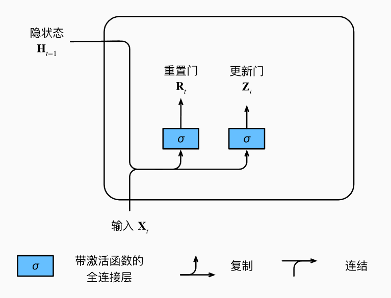

我们来看一下门控循环单元的数学表达。对于给定时间步$t$，假设输入是一个小批量$\mathbf{X}_t \in \mathbb{R}^{n\times d}$（样本数量$n$，输入个数$d$），上一个时间步的隐状态是$\mathbf{H}_{t-1}\in \mathbb{R}^{n\times h}$（隐藏单元个数$h$）。那么重置门$\mathbf{R}_t\in \mathbb{R}^{n\times h}$和更新门$\mathbf{Z}_t\in \mathbb{R}^{n\times h}$的计算如下所示：
$$
\mathbf{R}_t=\sigma(\mathbf{X}_t\mathbf{W}_{xr}+\mathbf{H}_{t-1}\mathbf{W}_{hr}+\mathbf{b}_r)\\
\mathbf{Z}_t=\sigma(\mathbf{X}_t\mathbf{W}_{xz}+\mathbf{H}_{t-1}\mathbf{W}_{hz}+\mathbf{b}_z)
$$
其中$\mathbf{W}_{xr},\mathbf{W}_{xz}\in \mathbb{R}^{d\times h}$和$\mathbf{W}_{hr},\mathbf{W}_{hz}\in \mathbb{R}^{h\times h}$是权重参数，$\mathbf{b}_r,\mathbf{b}_z \in \mathbb{R}^{1\times h}$是偏置参数。

> 在这个式子中，$\mathbf{X}_t$是给定时间步的输入，代表有n个行，每行都是同一时间步的输入（或许是one-hot后的token）。
>
> $R_t/Z_t$的形状是$n\times h$，有n个行，每行代表每个隐藏单元的重置/更新情况。

#### 9.1.1.2.候选隐状态

接下来，让我们将重置门$\mathbf{R}_t$与常规隐状态更新机制集成，得到在时间步$t$的候选隐状态（candidate hidden state）$\tilde{\mathbf{H}}_t \in \mathbb{R}^{n \times h}$。
$$
\tilde{\mathbf{H}}_t=tanh(\mathbf{X}_t\mathbf{W}_{xh}+(\mathbf{R}_t\odot \mathbf{H}_{t-1})\mathbf{W}_{hh}+\mathbf{b}_h)
$$
其中$\mathbf{W}_{xh}\in \mathbb{R}^{d\times h}$和$\mathbf{W}_{hh}\in \mathbb{R}^{h\times h}$是权重参数，$\mathbf{b}_h\in \mathbb{R}^{1\times h}$是偏置项。符号$\odot$是Hadamard积（按元素乘积）运算符。在这里，我们可以使用tanh非线性激活函数来确保候选隐状态中的值保持在区间$(-1,1)$中。

与常规RNN中的隐状态相比，$\mathbf{R}_t$和$\mathbf{H}_{t-1}$的元素相乘可以减少以往状态的影响。每当重置门$\mathbf{R}_t$中的项接近1时，我们会得到一个与普通RNN无异的网络。对于重置门$\mathbf{R}_t$中所有接近于0的项，候选隐状态是以$\mathbf{X}_t$作为输入的MLP的结果。因此，任何预先存在的隐状态会被重置为默认值。

如图，说明了应用重置门后的计算流程。

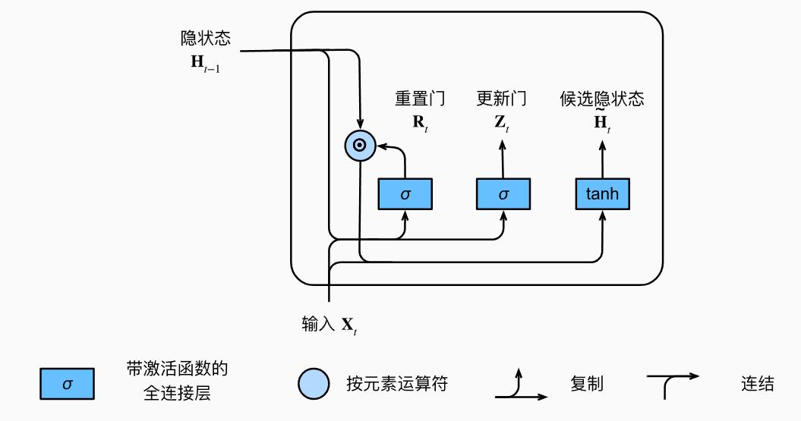

> 先用H和X计算得到重置门R，再用R、H、X计算得到候选隐状态$\tilde{H}$。

#### 9.1.1.3.隐状态

上述计算结果只是候选隐状态，我们仍需要结合更新门$\mathbf{Z}_t$的效果。这一步确定新的隐状态$\mathbf{H}_t\in \mathbb{R}^{n\times h}$在多大程度上来自旧状态$\mathbf{H}_{t-1}$和新的候选状态$\tilde{\mathbf{H}}_t$。更新门$\mathbf{Z}_t$仅需要在$\mathbf{H}_{t-1}$和$\tilde{\mathbf{H}}_t$之间进行按元素的凸组合就可以实现这个目标。

因此，门控循环单元的最终更新公式是：
$$
\mathbf{H}_t=\mathbf{Z}_t \odot\mathbf{H}_{t-1}+(1-\mathbf{Z}_t)\odot \tilde{\mathbf{H}}_t
$$
每当更新门接近于1时，模型就倾向于保留旧状态。此时，来自$\mathbf{X}_t$的信息基本被忽略，从而有效地跳过了依赖链条中的时间步$t$。相反，当$\mathbf{Z}_t$接近于0时，新的隐状态$\mathbf{H}_t$就会更接近于候选隐状态$\tilde{\mathbf{H}}_t$。

这些设计可以帮助我们处理RNN中的梯度消失问题，并更好地捕获时间步距离很长的序列的依赖关系。例如，如果整个子序列的每个时间步的更新门都接近于1，则无论序列长度如何，在序列起始时间步的旧隐状态将很容易保留并传递到序列结束。

下图说明了更新门起作用后完整的计算流：

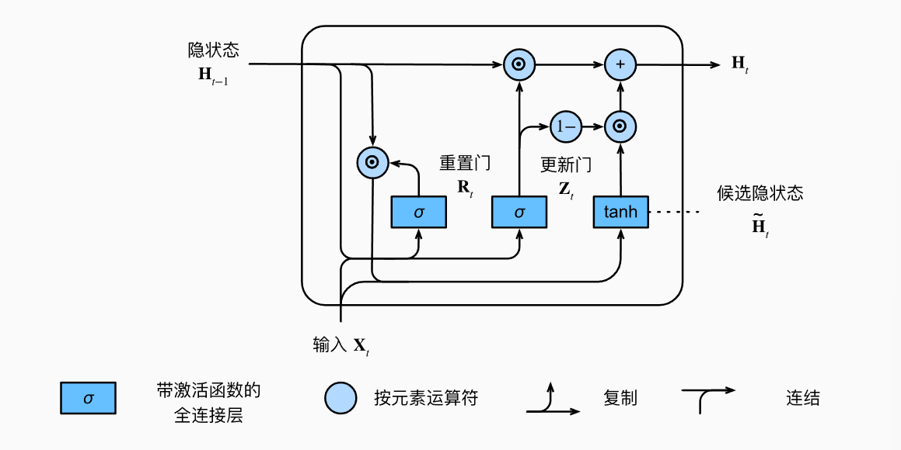

总之，GRU具有以下两个显著特征：

- 重置门有助于捕获序列中的短期依赖关系
- 更新门有助于捕获序列中的长期依赖关系

### 9.1.2.从零开始实现

首先读取time machine 数据集。

```python
import torch
from torch import nn
from d2l import torch as d2l

batch_size,num_steps = 32,35
train_iter,vocab = d2l.load_data_time_machine(batch_size,num_steps)
```

#### 9.1.2.1.初始化模型参数

下一步是初始化模型参数。我们从标准差为0.01的高斯分布中提取权重，并将偏置设为0，超参数num_hiddens定义隐藏单元的数量，实例化与更新门、重置门、候选隐状态和输出层相关的所有权重和偏置。

```python
def get_params(vocab_size,num_hiddens,device):
    num_inputs = num_outputs = vocab_size

    def normal(shape):
        return torch.randn(size=shape,device=device) * 0.01
    def three():
        return (normal((num_inputs,num_hiddens))
                ,normal(num_hiddens,num_outputs)
                ,torch.zeros(num_hiddens,device=device))
    W_xz , W_hz,b_z = three()
    W_xr , W_hr,b_r = three()
    W_xh , W_hh,b_h = three()
    W_hq = normal((num_hiddens,num_outputs))
    b_q = torch.zeors(num_outputs,device=device)
    params = [W_xz,W_hz,b_z,W_xr,W_hr,b_r,W_xh,W_hh,b_h,W_hq,b_q]
    for param in params:
        param.requires_grad_(True)
    return params
```

#### 9.1.2.2.定义模型

现在我们将定义隐状态的初始化函数init_gru_state。此函数返回一个形状为(batch_size,num_hiddens)的张量，张量值全为0。

```python
def init_gru_state(batch_size,num_hiddens,device):
    return (torch.zeros((batch_size,num_hiddens),device=device),)
```

现在准备定义门控循环单元模型，模型的架构与基本的RNN基本一致，只是更新公式更复杂。

```python
def gru(inputs,state,params):
    W_xz,W_hz,b_z,W_xr,W_hr,b_r,W_xh,W_hh,b_h,W_hq,b_q=params
    H, = state
    outputs = []
    for X in inputs:
        Z = torch.sigmoid((X @ W_xz)+(H@W_hz)+b_z)
        R = torch.sigmoid((X @ W_xr)+(H @ W_hr)+b_r)
        H_tilda = torch.tanh((X@W_xh)+(H@W_hh)+b_h)
        H = Z*H +(1-Z)*H_tilda
        Y = H @ W_hq + b_q
        outputs.append(Y)
    return torch.cat(outputs,dim=0),(H,)
```

#### 9.1.2.3.训练与预测

略

### 9.1.3.简洁实现

高级API包含了前文介绍的所有配置细节，所以我们可以直接实例化门控循环单元模型。这段代码的运行速度快得多，因为它使用的是编译好的运算符而非python来处理之前阐述的许多细节。

```python
num_inputs = vocab.size
gru_layer = nn.GRU(num_inputs,num_hiddens)
model = d2l.RNNModel(gru_layer,len(vocab))
```

### 9.1.4.小结

- GRU可以更好地捕获时间步距离很长的序列上的依赖关系。
- 重置门有助于捕获序列中的短期依赖关系
- 更新门有助于捕获序列中的长期依赖关系
- 重置门打开时，门控循环单元包含基本RNN；更新门打开时，GRU可以跳过当前子序列带来的隐状态的更新。


## 9.2.长短期记忆网络（LSTM）

隐变量模型一直存在着长期信息保存和短期输入缺失的问题。解决这一问题的最早方法之一是长短期存储器（long-short-term memory,LSTM）。它有许多与GRU一样的属性。长短期记忆网络的设计比GRU稍微复杂一些，却比GRU早出现了近20年。

### 9.2.1.门控记忆元

LSTM的设计灵感来自于计算机的逻辑门。LSTM引入了记忆元（memory cell）或称为单元（cell）。有些文献认为记忆元是隐状态的一种特殊类型，***它们与隐状态有相同的形状***，其设计目的是用于记录附加的信息。

为了控制记忆元，我们需要许多门。其中一个门用来从单元输出条目，我们将其称为输出门（output gate）。另外一个门用于决定何时将数据读入单元，我们将其称为输入门（input gate）。我们还需要一种机制来重置单元的内容，由遗忘门（forget gate）来管理，这种设计的动机与GRU相同，能够通过专用机制决定什么时候记忆或忽略隐状态的输入。

#### 9.2.1.1.输入门、遗忘门和输出门

与GRU相同，***当前时间步的输入和前一个时间步的隐状态***将作为数据送入LSTM的门中，如图所示，它们由三个具有sigmoid激活函数的全连接层处理，以计算输入门、遗忘门和输出门的值。因此，这三个门的值都在$(0,1)$的范围内。

> sigmoid将输入映射到$(0,1)$
>
> tanh将输入映射到$(-1,1)$
>
> ReLU将输入映射到$(0,+\infin)$

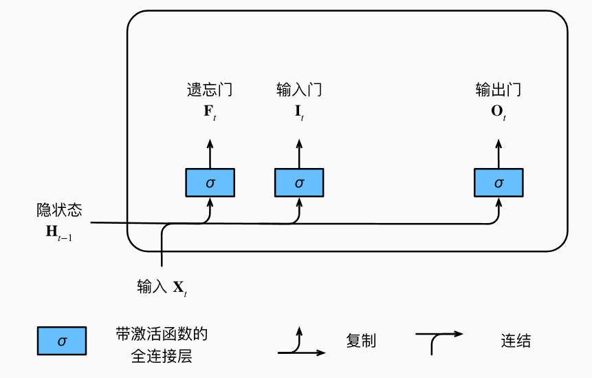

假设有$h$个隐藏单元，批量大小为$n$，输入数为$d$。因此，输入为$\mathbf{X}_t\in \mathbb{R}^{n\times d}$，前一时间步的隐状态为$\mathbf{H}_{t-1}\in \mathbb{R}^{n\times h}$。相应的，时间步的$t$的门定义如下：输入门是$\mathbf{I}_t \in \mathbb{R}^{n\times h}$，遗忘门是$\mathbf{F}_t \in \mathbb{R}^{n\times h}$，输出门是$\mathbf{O}_t \in \mathbb{R}^{n\times h}$，它的计算方法如下：
$$
\mathbf{I}_t = \sigma(\mathbf{X}_t\mathbf{W}_{xi}+\mathbf{H}_{t-1}\mathbf{W}_{hi}+\mathbf{b}_t)\\
\mathbf{F}_t = \sigma(\mathbf{X}_t\mathbf{W}_{xf}+\mathbf{H}_{t-1}\mathbf{W}_{hf}+\mathbf{b}_f)\\
\mathbf{O}_t=\sigma(\mathbf{X}_t\mathbf{W}_{xo}+\mathbf{H}_{t-1}\mathbf{W}_{ho}+\mathbf{b}_o)
$$
其中$\mathbf{W}_{xi}$，$\mathbf{W}_{xf}$，$\mathbf{W}_{xo}\in\mathbb{R}^{d\times h}$和$\mathbf{W}_{hi},\mathbf{W}_{hf},\mathbf{W}_{ho}\in \mathbb{R}^{h\times h}$是权重参数，$\mathbf{b}_i,\mathbf{b}_f,\mathbf{b}_o\in \mathbb{R}^{1\times h}$是偏置参数。

#### 9.2.1.2.候选记忆元

先介绍候选记忆元（candidate memory cell）$\tilde{\mathbf{C}}_t\in \mathbb{R}^{n\times h}$。它的计算与上面描述的三个门的计算类似，但使用tanh函数作为激活函数，函数的值范围为$(-1,1)$。其在时间步$t$处的公式为：
$$
\tilde{\mathbf{C}}_t=tanh(\mathbf{X}_t\mathbf{W}_{xc}+\mathbf{H}_{t-1}\mathbf{W}_{hc}+\mathbf{b}_c)
$$
其中$\mathbf{W}_{xc}\in \mathbb{R}^{d\times h}$和$\mathbf{W}_{hc}\in \mathbb{R}^{h\times h}$是权重参数，$\mathbf{b}_c\in \mathbb{R}^{1\times h}$是偏置参数。

整体计算如图所示：

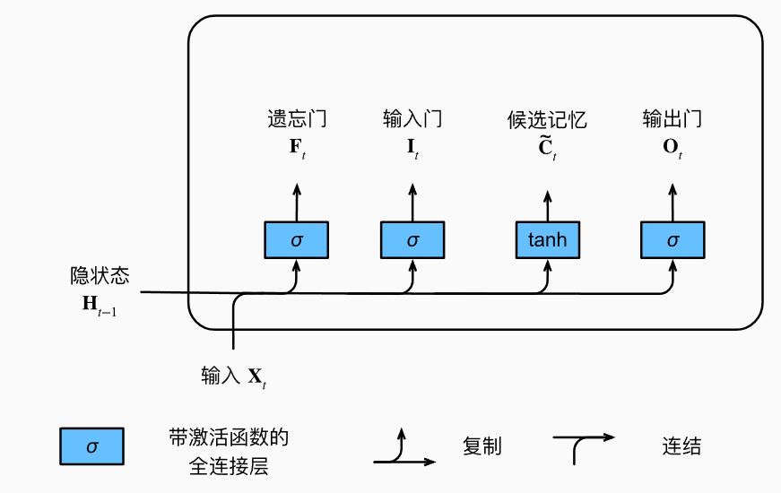

#### 9.2.1.3.记忆元

在门控循环单元中，有一种机制来控制输入和遗忘（跳过）。类似地，在LSTM中，也有两个门用于相同的目的：输入门$\mathbf{I}_t$控制采用多少来自$\tilde{\mathbf{C}}_t$的新数据，而遗忘门$\mathbf{F}_t$控制保留多少过去的记忆元$\mathbf{C}_{t-1}\in \mathbb{R}^{n\times h}$的内容。

使用按元素乘法，得：
$$
\mathbf{C}_t=\mathbf{F}_t\odot\mathbf{C}_{t-1}+\mathbf{I}_t\odot\tilde{\mathbf{C}}_t
$$
如果遗忘门始终为1且输入门始终为0，则过去的记忆元$\mathbf{C}_{t-1}$将随时间被保存并传递到当前时间步。引入这种设计是为了缓解梯度消失问题，以便更好地捕获序列中的长距离依赖关系。

> 为什么需要记忆元？
>
> 首先，记忆元可以缓解梯度消失。记忆元的引入使得信息可以跨多个时间步传递而不被逐渐遗忘。而隐状态可能随着时间步的增加而逐渐减弱，但记忆元提供了一个“长期储存”的机制，允许网络在较长的序列中保持重要的信息。
>
> 记忆元是LSTM克服传统RNN在处理长序列问题时梯度消失问题的关键，它允许信息在多个时间步之间传递，保持长期的记忆。

这样就得到了计算记忆元的流程图：

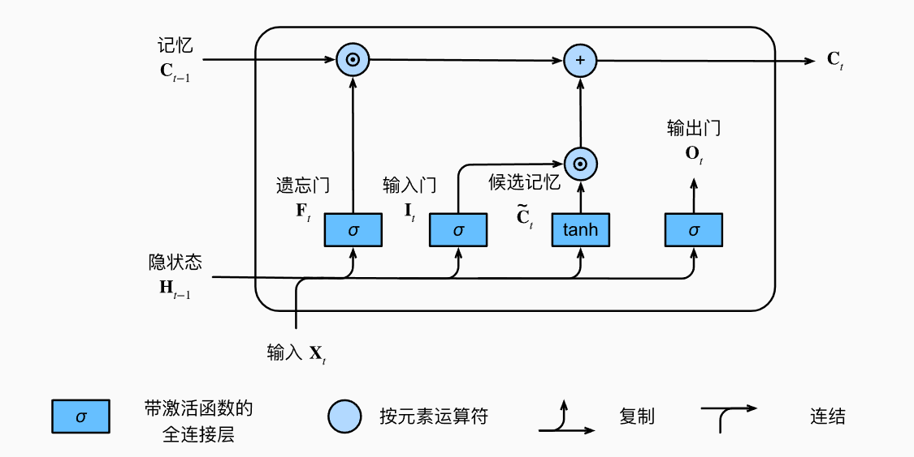

#### 9.2.1.4.隐状态

最后需要定义如何计算隐状态$\mathbf{H}_t\in \mathbb{R}^{n\times h}$，在这里输出门发挥作用。在LSTM中，它仅仅是记忆元的tanh门控版本。这就确保了$\mathbf{H}_t$的值始终在区间$(-1,1)$内：
$$
\mathbf{H}_t=\mathbf{O}_t \odot tanh(\mathbf{C}_t)
$$
只要输出门接近1，我们就能有效地将所有记忆信息传递给预测部分，而对于输出门接近0，我们只保留记忆元内的所有信息，而不需要更新隐状态。

如图，提供了数据流的图形化演示：

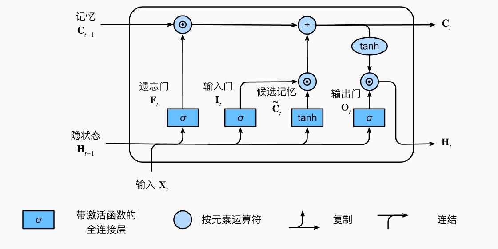

### 9.2.2.从零开始实现

首先加载time machine数据集。

```python
import torch
from d2l import torch as d2l
from torch import nn
batch_size,num_steps=32,35
train_iter,vocab=d2l.load_data_time_machine(batch_size,num_steps)
```

#### 9.2.2.1.初始化模型参数

接下来需要定义和初始化模型参数。如前所述，超参数num_hiddens定义了隐藏单元的数量。我们按照标准差0.01的高斯分布初始化，并将偏置项设为0。

```python
def get_lstm_params(vocab_size,num_hiddens,device):
    num_inputs = num_outputs = vocab_size

    def normal(shape):
        return torch.randn(size=shape,device=device)*0.01
    def three():
        return(
            normal((num_inputs,num_hiddens)),
            normal((num_hiddens,num_outputs)),
            torch.zeros(num_hiddens,device=device)
        )
    W_xi,W_hi,b_i = three()
    W_xo,W_ho,b_o = three()
    W_xf,W_hf,b_f = three()
    W_xc,W_hc,b_c = three()
    W_hq = normal((num_hiddens,num_outputs),device = device)
    b_q = torch.zeros(num_outputs,device=device)
    params = [W_xi,W_hi,b_i,W_xo,W_ho,b_o,W_xf,W_hf,b_f,W_xc,W_hc,b_c,W_hq,b_q]
    for param in params:
        param.requires_grad_(True)
    return params
```

> torch.randn()是生成在均值为0，方差为1的正态分布。
>
> torch.rand()是生成一个均匀分布的随机数，数值范围在[0,1）之间。
>
> torch.randint()是生成一个整数类型的随机数，数值范围在[low,high）之间。
>
> ```python
> torch.randint(low, high, size, dtype=None, device=None, requires_grad=False)
> ```
>
> torch.normal()与torch.randn()都是生成正态分布，但torch.normal可以指定均值和方差。

#### 9.2.2.2.定义模型

在初始化函数时，长短期记忆网络的隐状态需要返回一个额外的记忆元，单元的值为0，形状为(batch_size,num_hiddens)。

```python
def init_lstm_state(batch_size,num_hiddens,device):
    return (torch.zeros((batch_size,num_hiddens),device=device),
            torch.zeros((batch_size,num_hiddens),device=device))
```

实际模型定义与前述相同：提供三个门和一个额外的记忆单元。值得注意的是，只有隐状态会传递到输出层，而记忆元$\mathbf{C}_t$不参与输出计算。

```python
def lstm(inputs,state,params):
    W_xi,W_hi,b_i,W_xo,W_ho,b_o,W_xf,W_hf,b_f,W_xc,W_hc,b_c,W_hq,b_q=params
    (H,C) = state
    outputs = []
    for X in inputs:
        I = torch.sigmoid((X @ W_xi)+(H@W_hi)+b_i)
        F = torch.sigmoid((X @ W_xf)+(H @ W_hf)+b_f)
        O = torch.sigmoid((X @ W_xo)+ (H @ W_ho) + b_o)
        C_tilda = torch.tanh( X@W_xc+H@W_hc+b_c)
        C = F*C + I*C_tilda
        H = O* torch.tanh(C)
        Y = (H@W_hq)+b_q
        outputs.append(Y)
    return torch.cat(Y,dim=0),(H,C)
```

#### 9.2.2.3.训练与预测

略

#### 9.2.3.简洁实现

使用高级API，我们可以直接实例化LSTM模型。与GRU相同，高级API中的LSTM使用的是编译好的运算符而非python，因此运行速度快得多。

```python
num_inputs = len(vocab)
lstm_layer = nn.LSTM(num_inputs,num_hiddens)
```

LSTM是典型的具有重要状态控制的隐变量自回归模型。多年来已经提出了其许多变体，例如：多层、残差连接、不同类型的正则化。然而，由于序列的长距离依赖性，训练LSTM和其他序列模型（如GRU）的成本很高。在后续内容中我们将介绍更高级的替代模型，如Transformer。

### 9.2.4.小结

- LSTM有三种门：输入门、遗忘门、输出门
- LSTM的隐藏层输出包括隐状态和记忆元。只有隐状态会传递到输出层，而记忆元属于内部信息。
- LSTM可以缓解梯度消失和梯度爆炸。


## GRU与LSTM小结

GRU与LSTM在某些地方较为相似，在此进行一个简单的总结

GRU：门控循环单元（gated recurrent unit）

LSTM：长短期记忆网络（long-short-term memory）

### GRU

GRU的隐藏层内部有两个新变量：重置门R和更新门Z。

在每个时间步$t$，GRU会根据该时间步的输入$X_t\in \mathbb{R}^{n\times d}$与上一时间步的隐变量$h_{t-1}\in \mathbb{R}^{n\times h}$计算重置门$\mathbf{R}_t\in \mathbb{R}^{n\times h}$和更新门$\mathbf{Z}_t\in \mathbb{R}^{n\times h}$，并应用sigmoid激活函数使其值域为$(0,1)$：
$$
R_t = \mathbf{sigmoid}(\mathbf{X}_t \mathbf{W}_{xr}+\mathbf{H}_{t-1}\mathbf{W}_{hr}+\mathbf{b}_r)\\
Z_t = \mathbf{sigmoid}(\mathbf{X}_t \mathbf{W}_{xz}+\mathbf{H}_{t-1}\mathbf{W}_{hz}+\mathbf{b}_z)\\
$$
随后，GRU会计算候选隐状态$\tilde{H}_t\in \mathbb{R}^{n\times h}$，应用tanh激活函数，其值域为$(-1,1)$公式为：
$$
\tilde{\mathbf{H}}_t = \mathbf{tanh}(\mathbf{X}_t\mathbf{W}_{xh}+(\mathbf{H}_{t-1}\odot \mathbf{R}_t)\mathbf{W}_{hh}+\mathbf{b}_t)
$$
在这一过程中，上一时间步的隐状态$\mathbf{H}_{t-1}$与重置门$\mathbf{R}_t$进行逐元素乘法。重置门$\mathbf{R}_t$的值越接近0，则说明需要丢弃之前的隐状态，则候选隐状态越接近于$\mathbf{X}_t$的MLP输出结果。

随后，GRU会根据上一时间步的隐状态$\mathbf{H}_{t-1}$、当前时间步的候选隐状态$\tilde{\mathbf{H}}_t$和更新门$\mathbf{Z}_t$计算当前时间步的隐状态$\mathbf{H}_t$：
$$
\mathbf{H}_t = \mathbf{H}_{t-1} \odot \mathbf{Z}_t+(1-\mathbf{Z}_t)\odot \tilde{\mathbf{H}}_t
$$
其中，更新门$\mathbf{Z}_t$越接近于0，则$\mathbf{H}_t$受候选隐状态的影响越大。

### LSTM

在LSTM的隐藏层内部有四个新变量：输入门$\mathbf{I}$、遗忘门$\mathbf{F}$，输出门$\mathbf{O}$和记忆元$\mathbf{C}$。

在每个时间步，LSTM会首先计算$\mathbf{I}_t\in \R^{n\times h}$，$\mathbf{F}_t \in \R^{n \times h}$,$\mathbf{O}_t\in \R^{n\times h}$。
$$
\mathbf{I}_t=\sigma(\mathbf{X}_t\mathbf{W}_{xi}+\mathbf{H}_{t-1}\mathbf{W}_{hi}+\mathbf{b}_i)\\
\mathbf{F}_t = \sigma(\mathbf{X}_t\mathbf{W}_{xf}+\mathbf{H}_{t-1}\mathbf{W}_{hf}+\mathbf{b}_f)\\
\mathbf{O}_t =\sigma(\mathbf{X}_t\mathbf{W}_{xo}+\mathbf{H}_{t-1}\mathbf{W}_{ho}+\mathbf{b}_o)
$$
与此同时，LSTM会计算候选记忆元$\tilde{\mathbf{C}}_t\in \R^{n\times h}$：
$$
\tilde{\mathbf{C}}_t=tanh(\mathbf{X}_t\mathbf{W}_{xc}+\mathbf{H}_{t-1}W_{hc}+b_c)
$$
随后，LSTM会根据当前时间步的遗忘门$\mathbf{F}_t$和输入门$\mathbf{I}_t$计算当前时间步的记忆元$\mathbf{C}_t\in \R^{n\times h}$。
$$
\mathbf{C}_t=\mathbf{I}_t \odot \tilde{\mathbf{C}}_t+\mathbf{F}_t\odot C_{t-1}
$$
最后用当前时间步的记忆元与输出门计算$\mathbf{H}_t\in \R^{n\times h}$：
$$
\mathbf{H}_t=\mathbf{O}_t \odot tanh(\mathbf{C}_t)
$$
在LSTM中，$\mathbf{C}_t$相当于另一个隐状态，但这个隐状态不会传递到输出层，只会随着时间步在隐藏层进行传递。

### 比较

#### GRU的优点

1. GRU的优点：比LSTM少了一个门，参数更少，计算效率更高，训练速度也更快。
2. GRU结构比LSTM更简单，更新门和重置门直接作用于隐状态的方式更加直接，在实际应用中可能更容易调试。
3. GRU的参数更少，通常在小数据集上表现更好。

#### LSTM的优点

1. 记忆能力更强：LSTM有独立的记忆元来存储长期信息，这使得它在处理长时间依赖时比GRU更有效。
2. 更多控制：LSTM有更多的门，使得在调节信息流方面有更高的自由度。
3. 适用于长序列：在处理非常长的序列或长期依赖问题时，LSTM通常能更好地保持过去的记忆。

综上：

- 较小的数据集，且任务较为简单，长时间依赖性要求不高时，GRU可能是更好的选择。
- 如果数据集很大，或序列的长时间依赖性更强时，需要更细致的控制和更强的记忆力时，LSTM更好。


## 9.3.深度循环神经网络

目前为止，我们只讨论了具有一个单向隐藏层的循环神经网络。其中，隐变量和观测值与具体的函数形式的交互方式是相当随意的。只要交互类型建模具有足够的灵活性，就不是一个大问题。

然而，对一个单层来说，这可能具有相当的挑战性。在之前的线性模型中，我们通过更多的层来解决这个问题。在RNN中，首先需要确定如何添加更多的层，以及在哪里添加额外的非线性。

事实上，我们可以将多层RNN堆叠在一起，通过对几个简单层的组合，产生一个灵活的机制。特别是，数据可能与不同层的堆叠有关。例如，我们希望保持有关金融市场状况的宏观数据可用，而微观数据只记录较短期的时间动态。

如图，描述了一个具有L个隐藏层的深度循环神经网络，每个隐状态都连续地传递到当前层的下一个时间步和下一层的当前时间步。

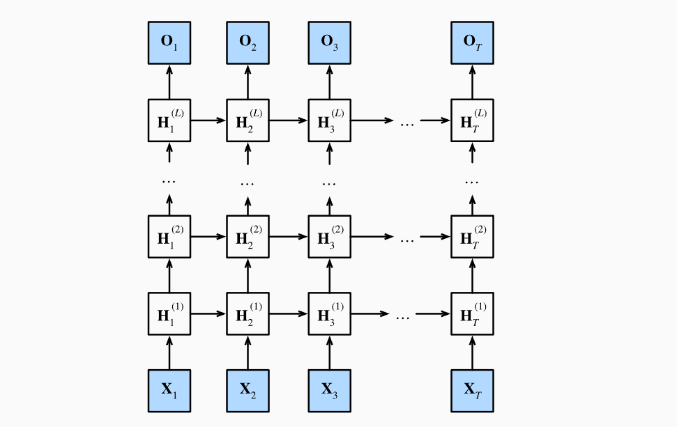

### 9.3.1.函数依赖关系

我们可以把深度架构中的函数依赖关系形式化，这个架构是由L个隐藏层构成。后续的讨论将聚焦于经典的循环神经网络模型上，但这些讨论也适用于其他序列模型。

假设在时间步$t$有一个小批量的输入数据$\mathbf{X}_t\in \R^{n\times d}$。同时将$l^{th}$隐藏层（$l=1,...,L$）的隐状态设为$\mathbf{H}_t^{(l)}\in \R^{n\times h}$，输出层变量设为$\mathbf{O}_t\in\R^{n\times q}$。设置$\mathbf{H}_t^{(0)}=\mathbf{X}_t$，第$l$个隐藏层的隐状态使用激活函数$\phi_l$，则：
$$
\mathbf{H}_t^{(l)}=\phi_l(\mathbf{H}_t^{(l-1)}\mathbf{W}_{xh}^{(l)}+\mathbf{H}_{t-1}^{(l)})\mathbf{W}_{hh}^{(l)}+\mathbf{b}_h^{(l)})
\tag 1
$$
其中，权重为$\mathbf{W}_{xh}^{(l)}\in \R^{h\times h}$，$\mathbf{W}_{hh}^{(l)}\in \R^{h\times h}$和偏置$\mathbf{b}_h^{(l)}\in \R^{1\times h}$都是第$l$个隐藏层的模型参数。

最后，输出层的计算仅基于第$L$个隐藏层最终的隐状态：
$$
\mathbf{O}_t=\mathbf{H}_t^{(L)}\mathbf{W}_{hq}+\mathbf{b}_q
$$
其中，权重$\mathbf{W}_{hq}\in \R^{h \times q}$和偏置$\mathbf{b}_q\in \R^{1\times q}$都是输出层的模型参数。

与MLP相同，隐藏层数目$L$与隐藏单元数目$h$都是超参数。另外，使用GRU或LSTM的隐状态来代替公式(1)中的隐状态，可以很容易地得到深度门控循环神经网络或深度长短期记忆神经网络。

### 9.3.2.简洁实现

实现多层RNN所需的许多逻辑细节在高级API中都是现成的，以LSTM为例，只需指定层的数量，而不是使用单一层这一默认值。

```python
lstm_layer = nn.LSTM(num_inputs,num_hiddens,num_layers)
```

### 9.3.3.小结

- 在深度循环神经网络中，隐状态的信息被传递到***当前层的下一时间步***和***下一层的当前时间步***。
- 有许多不同风格的深度RNN，如LSTM，GRU，或经典循环神经网络。这些模型都在深度学习框架的高级API中涵盖。
- 总体来说，深度RNN需要大量的调参（如学习率和修剪）来确保合适的收敛，模型的初始化需要慎重。


## 9.4.双向循环神经网络

在序列学习中，我们以往假设的目标是：在给定观测的情况下，对下一个输出进行建模。虽然这是一个典型情景，但不是唯一的。

考虑以下三个在文本序列中填空的任务：

- 我___。
- 我___饿了。
- 我___饿了，我可以吃半头猪。

根据可获得的信息量，我们可以用不同的词填空，如“很高兴”，“不”，“非常”。很明显，每个短语的“下文”传达了重要信息，而这些信息关乎到选择哪个词来填空，所以无法利用这一点的序列模型将在相关任务上表现不佳。

例如，如果要做好命名实体识别（例如识别“Green”是“格林先生”还是”绿色“），不同长度的上下文范围重要性是相同的。

为了获得一些解决问题的灵感，我们先迂回到概率图模型。

### 9.4.1.隐马尔可夫模型中的动态规划

如果我们想用概率图模型来解决这个问题，可以设计一个隐变量模型：在任意时间步$t$，假设存在某个隐变量$h_t$，通过概率$P(x_t \mid h_t)$控制我们观测到的$x_t$。此外，任何$h_t \to h_{t+1}$转移都是由一些状态转移概率$P(h_{t+1}\mid h_t)$给出的。这个概率图模型就是一个隐马尔可夫模型（hidden Markov model，HMM），如图：

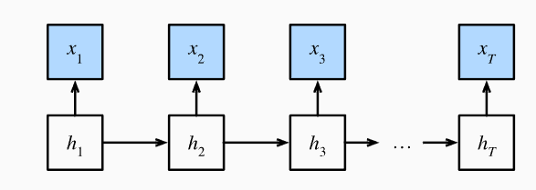

对于有$T$个观测值的序列，我们在观测状态和隐状态上具有以下联合概率分布：
$$
P(x_1,...,x_T,h_1,...,h_T)=\prod_{t=1}^TP(h_t\mid h_{t-1})P(x_t\mid h_t),where P(h_1\mid h_0)=P(h_1) \\
\tag 1
$$
现在，假设我们观测到除了$x_j$以外的所有$x_i$，并且我们的目标是计算$P(x_j\mid x_{-j})$，其中$x_{-j}=(x_1,...,x_{j-1},x_{j+1},...,x_T)$。由于$P(x_j\mid x_{-j})$中没有隐变量，因此我们考虑对$h_1,...,h_{T}$选择构成的所有可能的组合进行求和。

如果任何$h_i$可以接受$k$个不同的值（k是有限实数），这意味着我们需要对$k^T$个项求和，这显然过于复杂，因此考虑采用动态规划。

我们考虑对隐变量$h_1,...,h_T$的依次求和，根据公式(1)：
$$
\begin{split}\begin{aligned}
    &P(x_1, \ldots, x_T) \\
    =& \sum_{h_1, \ldots, h_T} P(x_1, \ldots, x_T, h_1, \ldots, h_T) \\
    =& \sum_{h_1, \ldots, h_T} \prod_{t=1}^T P(h_t \mid h_{t-1}) P(x_t \mid h_t) \\
    =& \sum_{h_2, \ldots, h_T} \underbrace{\left[\sum_{h_1} P(h_1) P(x_1 \mid h_1) P(h_2 \mid h_1)\right]}_{\pi_2(h_2) \stackrel{\mathrm{def}}{=}}
    P(x_2 \mid h_2) \prod_{t=3}^T P(h_t \mid h_{t-1}) P(x_t \mid h_t) \\
    =& \sum_{h_3, \ldots, h_T} \underbrace{\left[\sum_{h_2} \pi_2(h_2) P(x_2 \mid h_2) P(h_3 \mid h_2)\right]}_{\pi_3(h_3)\stackrel{\mathrm{def}}{=}}
    P(x_3 \mid h_3) \prod_{t=4}^T P(h_t \mid h_{t-1}) P(x_t \mid h_t)\\
    =& \dots \\
    =& \sum_{h_T} \pi_T(h_T) P(x_T \mid h_T).
\end{aligned}\end{split}
$$

> 看不懂这里的推导，直接跳到架构部分吧

### 9.4.2.双向模型

如果我们希望在RNN中拥有一种机制，使之能够提供与隐马尔可夫模型类似的前瞻能力，我们就需要修改RNN的设计。

这在概念上很容易，只需要增加一个“从最后一个词元开始从后向前运行的RNN”，而不是只有一个在前向模式下“从第一个词元开始运行”的RNN。双向循环神经网络（bidirectional RNNs）添加了反向传递信息的隐藏层，以便灵活地处理此类信息。如图，描述了具有单个隐藏层的双向循环神经网络的架构。

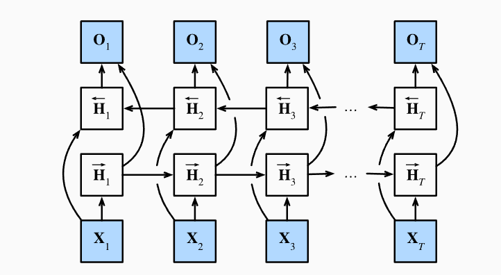

#### 9.4.2.1.定义

对于任意时间步$t$，给定一个小批量的输入数据$\mathbf{X}_t\in \R^{n\times d}$，并且令隐藏层激活函数为$\phi$。在双向架构中，我们设该时间步的前向和反向隐状态分别为$\overrightarrow{\mathbf{H}}_t \in \mathbb{R}^{n \times h}$和$\overleftarrow{\mathbf{H}}_t \in \R^{n\times h}$。前向和反向隐状态的更新如下：
$$
\begin{split}\begin{aligned}
\overrightarrow{\mathbf{H}}_t &= \phi(\mathbf{X}_t \mathbf{W}_{xh}^{(f)} + \overrightarrow{\mathbf{H}}_{t-1} \mathbf{W}_{hh}^{(f)}  + \mathbf{b}_h^{(f)}),\\
\overleftarrow{\mathbf{H}}_t &= \phi(\mathbf{X}_t \mathbf{W}_{xh}^{(b)} + \overleftarrow{\mathbf{H}}_{t+1} \mathbf{W}_{hh}^{(b)}  + \mathbf{b}_h^{(b)}),
\end{aligned}\end{split}
$$
接下来，将前向隐状态$\overrightarrow{\mathbf{H}}_t$和反向隐状态$\overleftarrow{\mathbf{H}}_t$连接起来，获得需要送入输出层的隐状态$\mathbf{H}_t\in \R^{n\times 2h}$。在具有多个隐藏层的深度双向循环神经网络中，该信息作为输入传递到下一个双向层。最后，输出层计算得到的输出为$\mathbf{O}_t\in \R^{n\times q}$：
$$
\mathbf{O}_t=\mathbf{H}_t\mathbf{W}_{hq}+\mathbf{b}_q
$$
这里权重矩阵$\mathbf{H}_{hq}\in \R^{2h\times q}$和偏置$\mathbf{b}_q$是输出层的模型参数。事实上，这两个方向可以拥有不同数量的隐藏单元（即深度循环网络中的输出隐变量的输出维度不一定翻倍）。

#### 9.4.2.2.模型的计算代价及其应用

双向循环神经网络的一个关键代价是：使用来自序列两端的信息来估计输出。也就是说，我们使用来自过去和未来的观测信息来观测当前的观测。但是在对下一个词元进行预测的情况下，这样的模型不符合我们的需要。因为在预测下一个词元时，我们不知道下一个词元的下文，所以不会得到很好的精度。具体地说，在训练期间，我们能够利用过去和未来的数据来估计现在空缺的词；而在测试期间，我们只有过去的数据，因此精度会很差。

另一个严重问题是，双向循环神经网络的计算速度很慢，其主要原因是网络的前向传播需要在双向层中进行向前和向后的递归，并且网络的反向传播还依赖于前向传播的结果，因此梯度求解有一个很长的链。

双向层的使用在实践中很少，并且仅用于部分场合，如完形填空，词元注释，以及作为序列处理流水线的一个步骤对序列进行编码。

### 9.4.3.双向循环神经网络的错误应用

由于双向循环网络使用了过去和未来的数据，所以我们不能盲目地将这一语言模型用于任何预测任务。尽管模型产出的困惑度是合理的，该模型预测未来词元的能力可能存在严重缺陷。

以下仅展示如何在高级API中使用双向循环神经网络。

```python
lstm_layer = nn.LSTM(num_inputs,num_hiddens,num_layers,bidirectional=True)
```

### 9.4.4.小结

- 在双向循环神经网络中，每个时间步的隐状态是由当前时间步的前后数据共同决定的。
- 双向循环神经网络主要用于序列编码和给定双向上下文的观测估计。
- 由于梯度链更长，因此双向循环神经网络的训练代价很高。


## 9.5.机器翻译与数据集

语言模型是NLP的关键，而机器翻译是语言模型最成功的基准测试。因为机器翻译正是将输入序列转换成输出序列的序列转换模型（sequence transduction）的核心问题。

序列转换模型在各类现代人工智能应用中发挥着至关重要的作用，因此，我们将其作为本章剩余部分与第十章的重点。为此，本节将介绍机器翻译问题及其后文需要使用的数据集。

机器翻译（machine translation）指的是序列从一种语言自动翻译成另一种语言。这个研究领域可以追溯到数字计算机发明后不久的20世纪40年代，特别是在二战中使用计算机破解语言编码。几十年来，在使用神经网络进行端到端学习的兴起之前，统计学方法一直在这一领域占据主导地位。因为统计机器翻译（statistical machine learning）涉及了翻译模型和语言模型等组成部分的统计分析，因此基于神经网络的方法通常被称为神经机器翻译（neural machine translation），用于将两种翻译模型区分开来。

本节的关注点是神经网络机器翻译方法，强调端到端的学习。机器翻译的数据集是由源语言和目标语言的文本序列对组成的。因此，我们需要一种完全不同的方法来预处理机器翻译数据集。下面，来看一下如何将与预处理后的数据加载到小批量中用于训练。

### 9.5.1.下载和预处理数据集

首先，下载一个由Tatoeba项目的双语句子对组成的“英-法”数据集，数据集中的每一行都是制表符分隔的文本序列对，序列对由英文文本序列和翻译后的法语文本序列组成。

每个文本序列可能是一个句子，也可能是包含多个句子的一个段落。在这个将英语翻译成法语的机器翻译问题中，英语是源语言（source language），法语是目标语言（target language）。

```python
import torch
from torch import nn
from d2l import torch as d2l

```

下载数据集后，原始数据样本需要经过几个预处理步骤。例如，用空格代替不间断空格（non-breaking space），使用小写字母替换大写字母，并在单词和标点符合之间插入空格（便于将标点单独作为一个token）。

```python
def preprocess_nmt(text):
    def no_space(char,prev_char):
        return char in set(',.!?') and prev_char !=' '
    text = text.replace('\u202f',' ').replace('\xa0',' ').lower()
    out = [' '+char if i>0 and no_space(char,text[i-1]) else char for i,char in enumerate(text)]
    return ''.join(out)
text = preprocess_nmt(raw_text)
print(text[:80])
```

### 9.5.2.词元化

与之前使用的字符级词元化不同，在机器翻译中，我们更倾向于单词级词元化（最先进的模型可能采用更高级的词元化技术）。下面的tokenize_nmt函数对前num_examples个文本序列对进行词元化，其中每个词元要么是一个词，要么是一个标点符号。此函数返回两个词元列表source和target：source[i]是源语言第$i$个文本序列的词元列表，target[i]是目标语言第$i$个文本序列的次元列表。

```python
def tokenize_nmt(text,num_examples=None):
    source,target=[],[]
    for i,line in enumerate(text.split('\n')):
        if num_examples and i>num_examples:
            break
        parts = line.split('\t')
        if len(parts) == 2:
            source.append(parts[0].split(' '))
            target.append(parts[1].split(' '))
    return source,target
source,target = tokenize_nmt(text)
source[:6],target[:6]
```

接下来可以绘制每个文本序列包含的词元数量的直方图，在这个简单数据集中，大多数的文本序列的词元数量少于20个。

### 9.5.3.词表

由于机器翻译数据集由语言对组成，因此我们可以分别为源语言和目标语言构建两个词表。使用单词级词元化时，词表大小将明显大于使用字符级词元化的词表大小。为了缓解这一问题，这里我们将出现次数小于2次的低频率词元视为相同的未知("`<unk>`")词元。除此之外，还制定了额外的特别词元，例如在小批量时用于将序列填充到相同长度的填充词元("`<pad>`")，以及序列的开始词元("`<bos>`")和结束词元("`<eos>")。

```python
src_vocab = d2l.Vocab(source,min_freq=2,reserved_tokens=['<pad>','<bos>','<eos>'])
```

### 9.5.4.加载数据集

在语言模型中的序列样本都有一个固定的长度，无论这个样本是一个句子的一部分还是跨越了多个句子的一个片断。这个固定长度由num_steps（时间步数或词元数量）参数指定。在机器翻译中，每个样本都是由源和目标组成的文本序列对，其中的每个文本样本可能具有不同的长度。

为了提高计算效率，我们仍然可以通过截断（truncation）和填充（padding）方式实现一次只处理一个小批量的文本序列。假设同一个小批量中的每个序列都应该具有相同的长度num_steps，那么如果文本序列的词元数目少于num_steps时，我们将继续在其末尾添加特定的"`<pad>`"词元，直到其长度达到num_steps。反之，我们将截断文本序列，只取其前num_steps个词元，并且丢弃剩余词元。这样每个文本序列将具有相同的长度，以便以相同形状的小批量进行加载。

```python
def truncate_pad(line,num_steps,padding_token):
    if len(line)>num_steps:
        return line[:num_steps]
    return line +[padding_token]*(num_steps-len(line))
a=truncate_pad(src_vocab[source[0]],10,src_vocab['<pad>'])
```

现在我们定义一个函数，可以将文本序列转换成小批量数据集用于训练。我们将特定的"`<eos>`"词元添加到所有句子的末尾，用于表示序列的结束（end of sequence）。当模型通过一个词元接一个词元地生成序列进行预测时，生成的"`<eos>`"词元说明完成了序列输出。此外，还需要记录每个文本序列的长度，统计长度时排除了填充词元。

```python
#@save
def build_array_nmt(lines, vocab, num_steps):
    """将机器翻译的文本序列转换成小批量"""
    lines = [vocab[l] for l in lines]
    lines = [l + [vocab['<eos>']] for l in lines]
    array = torch.tensor([truncate_pad(
        l, num_steps, vocab['<pad>']) for l in lines])
    valid_len = (array != vocab['<pad>']).type(torch.int32).sum(1)
    return array, valid_len
```

### 9.5.5.训练模型

最后定义load_data_nmt函数返回数据迭代器、源语言和目标语言的词表。

```python
#@save
def load_data_nmt(batch_size, num_steps, num_examples=600):
    """返回翻译数据集的迭代器和词表"""
    text = preprocess_nmt(read_data_nmt())
    source, target = tokenize_nmt(text, num_examples)
    src_vocab = d2l.Vocab(source, min_freq=2,
                          reserved_tokens=['<pad>', '<bos>', '<eos>'])
    tgt_vocab = d2l.Vocab(target, min_freq=2,
                          reserved_tokens=['<pad>', '<bos>', '<eos>'])
    src_array, src_valid_len = build_array_nmt(source, src_vocab, num_steps)
    tgt_array, tgt_valid_len = build_array_nmt(target, tgt_vocab, num_steps)
    data_arrays = (src_array, src_valid_len, tgt_array, tgt_valid_len)
    data_iter = d2l.load_array(data_arrays, batch_size)
    return data_iter, src_vocab, tgt_vocab
```

### 9.5.6.小结

- 机器翻译指的是将文本序列从一种语言转换为另一种语言
- 使用单词级词元化时的词表大小明显大于使用字符级词元化的词表大小。为了缓解这一问题，我们可以将低频词元全部视为相同的未知词元。
- 通过截断和填充文本序列，可以保证所有的文本序列都具有相同的长度，以便小批量的方式加载。


## 9.6.编码器-解码器架构

机器翻译是序列转换模型的一个核心问题，其输入和输出都是长度可变的序列。为了处理这种类型的输入和输出，我们可以设计一个包含两个主要组件的架构。

第一个组件是一个编码器（encoder）：它接受一个长度可变的序列作为输入，并将其转换为具有固定形状的编码状态。

第二个组件是解码器（decoder）：它将固定形状的编码形状映射到长度可变的序列。

这被称为编码器-解码器（encoder-decoder）架构，如图所示：

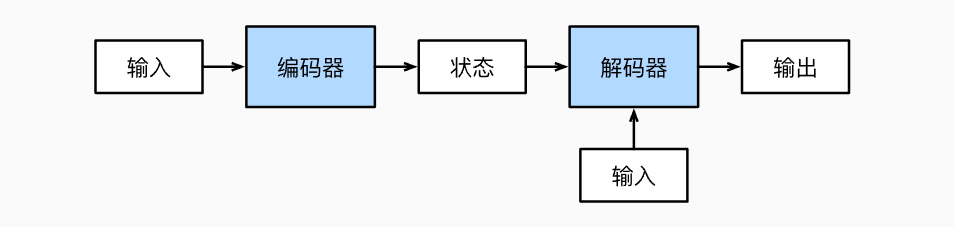

以英语到法语的机器翻译为例：给定一个英文的输入序列。首先，这种”编码器-解码器“架构将长度可变的输入序列编码成一个”状态“，然后对该状态进行解码，一个词元接着一个词元地生成翻译后的序列作为输出。

由于”编码器-解码器“是形成后续章节中不同序列转换模型的基础，因此本节将这个架构转换为接口方便后面的代码实现。

### 9.6.1.编码器

在编码器接口中，我们只指定长度可变的序列作为编码器的输入X。任何继承自Encoder基类的模型将完成代码实现。

```python
from torch import nn
class Encoder(nn.Module):
    def __init__(self,**kwargs):
        super().__init__(**kwargs)
    def forward(self,X,*args):
        raise NotImlementedError
```

### 9.6.2.解码器

在下面的解码器接口中，我们新增一个init_state函数，用于将编码器的输出(enc_outputs)转换为编码后的状态。注意，此步骤可能需要额外的输入，例如输入序列的有效长度。

为了逐个生成长度可变的词元序列，解码器在每个时间步都会将输入和编码后的状态映射成当前时间步的输出词元。

```python
class Decoder(nn.Module):
    def __init__(self,**kwargs):
        super().__init__(**kwargs)
    def init_state(self,enc_outputs,*args):
        raise NotImplementedError
    def forward(self,X,state):
        raise NotImplementedError
```

### 9.6.3.合并编码器和解码器

”编码器-解码器“架构包含了一个编码器和一个解码器，并且还拥有可选的额外参数。在前向传播中，编码器的输出用于生成编码状态，这个状态又被编码器作为其输入的一部分。

```python
class EncoderDecoder(nn.Module):
    def __init__(self,encoder,decoder,**kwargs):
        super().__init__(**kwargs)
        self.encoder = encoder
        self.decoder = decoder
    def forward(self,enc_X,dec_X,*args):
        enc_outputs = self.encoder(enc_X,*args)
        dec_state = self.decoder.init_state(enc_outputs,*args)
        return self.decoder(dec_X,dec_state)
```

### 9.6.4.小结

- ”编码器-解码器“架构可以将长度可变的序列作为输入和输出，因此适用于机器翻译等序列转换问题。
- 编码器将长度可变的序列作为输入，并将其转换为具有固定形状的编码状态。
- 解码器将具有固定形状的编码状态映射为长度可变的序列。


## 9.7.序列到序列学习（seq2seq）

机器翻译中的输入序列和输出序列都是长度可变的，为了解决这一问题，我们设计了一个通用的"编码器-解码器"架构。本节，我们将使用两个RNN的编码器和解码器，并将其应用于序列到序列（sequence to sequence）类的学习任务。

遵循编码器-解码器架构的设计原则，循环神经网络编码器使用长度可变的序列作为输入，将其转换为固定形状的隐状态。换言之，输入序列的信息被编码到循环神经网络编码器的隐状态中。为了连续生成输出序列的词元，独立的循环神经网络解码器是基于输入序列的编码信息和输出序列已经看见或者生成的词元来预测下一个词元。如图演示了如何在机器翻译中使用两个RNN进行序列到序列学习。

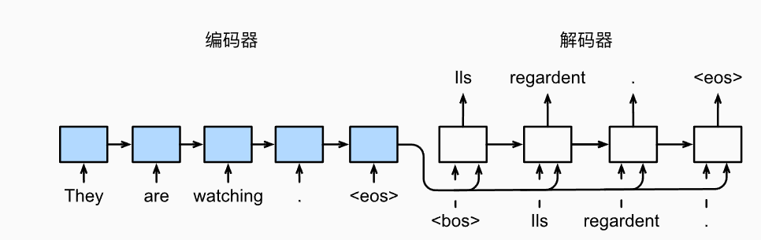

在图中，特定的"`<eos>`"表示序列结束词元。一旦输出序列生成此词元，模型就会停止预测。

在RNN的第一个时间步，有两个特殊的需要注意的设计决定：

1. 每一个输入都伴随着一个特殊的标志序列开始的token"`<bos>`"。
2. 在解码器的每个时间步，我们可能会把编码器的最后一个时间步的隐状态喂给解码器。

在一些其他的设计中，RNN encoder最后的隐状态只会在解码器的第一个时间步被用作初始化解码器的隐状态。

```python
import collections
import math
import torch
from torch import nn
from torch.nn import functional as F
from d2l import torch as d2l
```

### 9.7.1.Teacher Forcing

在输入序列上运行编码器相对直接，但处理解码器的输入与输出的时候需要更多注意。最常见的方式被称为***teacher forcing***。

在这种方式中，原始的目标序列(token labels)被作为译码器的输入。更准确地说，特殊的`<bos>`token和原始目标序列（去掉最后的token）被连接后作为解码器的输入，而解码器的输出（用于训练的标签）则是原始目标序列右移一个词元的结果。

> 看不懂了，这是英文版里的内容。

### 9.7.2.编码器

编码器可以把任意长度的输入序列转换为固定形状的上下文变量$\mathbf{c}$。

考虑一个单序列的例子（batch_size=1），假设输入序列是$x_1,...,x_T$，其中$x_t$是第$t^{th}$个token。

在时间步$t$，RNN把输入特征向量$\mathbf{x}_t$和隐状态$h_{t-1}$转换为当前时间步的隐状态$h_t$。我们可以使用函数$f$来描述这种RNN循环层的转换：
$$
\mathbf{h}_t = f(\mathbf{x}_t,\mathbf{h}_{t-1})
$$
通常来说，编码器把所有时间步的隐状态通过选定的函数$\mathbf{q}$转换为上下文变量：
$$
\mathbf{c}=\mathbf{q}(\mathbf{h}_1,...,\mathbf{h}_T)
$$
比如，在上图中，上下文变量就仅仅是编码器的最后一个时间步的隐状态$\mathbf{h}_T$。

在这个例子中，我们使用单向RNN来设计编码器，因此隐状态仅仅取决于当前时间步前的输入序列。我们还可以使用双向RNN来设计编码器，在这种情况下，隐状态取决于当前时间步之前和之后的子序列（包括当前时间步的输入），也就是说编码整个序列的信息。

现在来实现RNN编码器。注意到我们使用一个嵌入层（embedding layer）来获得输入序列中任意一个token的特征向量。嵌入层的权重是一个矩阵，矩阵的行数对应vocab_size，列数对应特征向量的维度(embed_size）。对于索引为i的输入token，嵌入层访问权重矩阵的第$i$行来返回它的特征向量。

接下来我们用多层GRU实现一个编码器。

```python
class Seq2SeqEncoder(d2l.Encoder):
    def __init__(self,vocab_size,embed_size,num_hiddens,num_layers,dropout=0,**kwargs):
        super(Seq2SeqEncoder,self).__init__(**kwargs)
        self.embedding = nn.Embedding(vocab_size,embed_size)
        self.rnn = nn.GRU(embed_size,num_hiddens,num_layers,dropout=dropout)
    def forward(self,X,*args):
        X = self.embedding(X)
        X = X.permute(1,0,2)
        output,state = self.rnn(X)
        return output,state
```

接下来我们实例化上述编码器的实现：我们使用一个两层门控循环单元编码器，其隐藏单元数为16。给定一小批量的输入序列X（批量大小为4，时间步为7）。在完成所有时间步后，最后一层的隐状态的输出是一个张量（output由编码器的循环层返回），其形状为（时间步数，批量大小，隐藏单元数）。

```python
encoder = Seq2SeqEncoder(vocab_size=10,embed_size=8,num_hiddens=16,num_layers=2)
encoder.eval()
X = torch.zeros((4,7),dtype = torch.long)
output,state = encoder(X)
output.shape
```

```cmd
torch.Size([7, 4, 16])
```

由于这里使用GRU,所以在最后一个时间步的多层隐状态的形状是隐藏层数量、批量大小和隐藏单元数量。如果是LSTM，state中还将包含记忆元信息。

### 9.7.2.解码器

编码器输出的上下文变量$\mathbf{c}$对整个输入序列的$x_1,...,x_T$进行编码。

来自训练数据集的输出序列$y_1,y_2,...,y_{T'}$，对于每个时间步$t'$（与输入序列或编码器的时间步$t$不同），解码器输出$y_{t'}$的概率取决于先前的输出子序列$y_1,...,y_{t'-1}$和上下文变量$\mathbf{c}$，即$P(y_{t'}\mid y_1,...,y_{t'-1},\mathbf{c})$。

为了在序列上模型化这种条件概率，我们可以使用另一个RNN作为解码器。在输出序列上的任意时间步$t'$，循环神经网络将来自上一时间步的输出$y_{t'-1}$和上下文变量$\mathbf{c}$作为其输入，然后在当前时间步将它们和上一隐状态$s_{t'-1}$转换为隐状态$s_{t'}$。因此，可以使用函数$g$来表示解码器的隐藏层的变换：
$$
s_{t'}=g(y_{t'-1},\mathbf{c},s_{t'-1})
$$
在获得解码器的隐状态后，我们可以使用输出层和softmax操作来计算在时间步$t'$时输出$y_{t'}$的条件概率分布$P(y_{t'}\mid y_1,...,y_{t'-1},\mathbf{c})$。

根据该图：


当实现解码器时，我们直接使用编码器最后一个时间步的隐状态来初始化解码器的隐状态。这就要求***使用RNN实现的编码器和解码器具有相同数量的层和隐藏单元***。为了进一步包含经过编码的输入序列的信息，上下文变量在所有的时间步与解码器的输入进行拼接（concatenate）。为了预测输出词元的概率分布，在RNN解码器的最后一层使用全连接层来变换隐状态。

```python
class Seq2SeqDecoder(d2l.Decoder):
    def __init__(self,vocab_size,embed_size,num_hiddens,num_layers,dropout=0,**kwargs):
        super(Seq2SeqDecoder,self).__init__(**kwargs)
        self.embedding = nn.Embedding(vocab_size,embed_size)
        self.rnn = nn.GRU(embed_size+num_hiddens,num_hiddens,num_layers,dropout=dropout)
        self.dense = nn.Linear(num_hiddens,vocab_size)
    def init_state(self,enc_outputs,*args):
        return enc_outputs[1]
    def forward(self,X,state):
        X = self.embedding(X).permute(1,0,2)
        context = state[-1].repeat(X.shape[0],1,1)
        X_and_context = torch.concat((X,context),dim=2)
        output,state = self.rnn(X_and_context,state)
        output = self.dense(output).permute(1,0,2)
        return output,state
```

现在用与上文中的Encoder相同的超参数实例化Decoder。

```python
decoder = Seq2SeqDecoder(vocab_size=10,embed_size=8,num_hiddens=16,num_layers=2)
decoder.eval()
state = decoder.init_state(encoder(X))
output,state = decoder(X,state)
print(output.shape,'\n',state.shape)
```

```cmd
torch.Size([4, 7, 10]) 
torch.Size([2, 4, 16])
```

总之，上述RNN“编码器-解码器”模型中的各层如图所示：

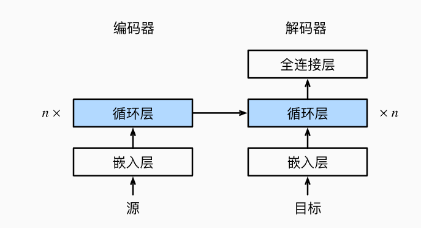

### 9.7.3.损失函数

在每个时间步，解码器预测了输出词元的概率分布。类似于语言模型，可以使用softmax获得分布，并计算交叉熵损失函数来进行优化。

回想在预处理数据时，为了保证不同长度的序列可以以相同形状的小批量加载，我们将特定的填充词元添加到序列的末尾，但我们应该将填充词元的预测排除在损失函数的计算之外。

为此，我们可以使用下面的sequence_mask函数，通过零值化屏蔽不相干的项，以便后续任何不相关预测都是与零的乘积，结果都等于零。例如，如果两个序列的有效长度（不包含填充词元）分别为1和2，则第一个序列的第一项和第二个序列的前两项之后的剩余项将被清除为零。

```python
def sequence_mask(X,valid_len,value=0):
    maxlen = X.size(1)
    mask = torch.arange((maxlen),dtype=torch.float32,device=X.device)[None,:]<valid_len[:,None]
    X[~mask]=value
    return X
X = torch.tensor([[1,2,3],[4,5,6]])
print(sequence_mask(X,torch.tensor([1,2])))
```

```cmd
tensor([[1, 0, 0],
        [4, 5, 0]])
```

现在，我们可以通过扩展softmax交叉熵损失来遮蔽不相关的预测。最初，所有预测词元的掩码都设置为1。一旦给定了有效长度，与填充词元对应的掩码将被设置为0。最后，将所有词元的损失乘以掩码，以过滤掉损失中填充词元产生的不相关预测。

```python
class MaskedSoftmaxCELoss(nn.CrossEntropyLoss):
    def forward(self,pred,label,valid_len):
        weights = torch.ones_like(label)
        weights = sequence_mask(weights,valid_len)
        self.reduction='none'
        unweighted_loss = super(MaskedSoftmaxCELoss,self).forward(pred.permute(0,2,1),label)
        weighted_loss = (unweighted_loss*weights).mean(dim=1)
        return weighted_loss
```

> pred的形状是(batch_size,num_steps,num_hiddens)，
>
> 在pytorch中，二维的CELoss要求输入形状是(batch_size,num_classes)，对三维的要求是(batch_size,num_classes,num_steps)
>
> 因此，在计算父类CELoss时需要调整输入维度顺序。

### 9.7.4.训练

训练过程中，特定的序列开始词元("`<bos>`")和原始的输出序列（不包括序列结束词元"`<eos>"）拼接在一起作为解码器的输入。这被称为强制教学（teacher forcing），因为原始的输出序列（词元的标签）被送入解码器。或者，将来自上一时间步的预测得到的词元作为解码器的当前输入。

> 这里的意思是，teahcer forcing是将真实的输出结果作为解码器的输入，这样能使模型训练更快收敛。
>
> 即，输入为：
>
> 输入序列：<bos>, y1, y2, y3, ...
> 标签序列：y1, y2, y3, y4, ...
>
> 也可以使用解码器的输出作为下一时间步的输入，在预测阶段使用的就是这种方式。

具体的训练代码省略。

### 9.7.5.预测

为了采用一个接着一个词元的方式预测输出序列，每个解码器当前时间步的输入都将来自于前一时间步的预测词元。与训练类似，序列开始词元”`<bos>`“在初始时间步被输入到解码器中。预测过程如图所示，当输出序列的预测出现"`<eos>`"词元时，预测就结束了。

### 9.7.6.预测序列的评估

我们可以通过与真实的标签序列进行比较来评估预测序列。虽然BLEU（bilingual evaluation understudy）最早用于评估机器学习的翻译结果，但现在它已经被广泛用于测量许多应用的输出序列的质量。

原则上说，对于预测序列中的任意$n$元语法（n-grams），BLEU的评估都是这个$n$元语法是否出现在标签序列中。

BLEU定义为：
$$
\exp(\min(0,1-\frac{len_{label}}{len_{pred}}))\prod_{n=1}^{k}p_n^{1/2^n}
$$
其中$len_{label}$表示标签序列中的词元数和$len_{pred}$表示预测序列中的词元数，$k$是用于匹配的最长的$n$元语法。另外，用$p_n$表示$n$元语法的精确度，它是预测序列与标签序列中匹配的$n$元语法的数量，第二个是预测序列中$n$元语法数量的比值。

具体地说，给定标签序列A,B,C,D,E,F和预测序列A,B,B,C,D,我们有$p_1=4/5$(只match到一个B)，$p_2=3/4,p_3=1/3,p_4=0$。

根据BLEU的定义，***当预测序列与标签序列完全相同时，BLEU为1***。此外，由于$n$元语法越长则匹配难度越大，所以BLEU为更长的$n$元语法的准确度分配更大的权重。具体来说，当$p_n$固定时，$p_n^{1/2^n}$会随着$n$的增长而增加（原始论文使用$p_n^{1/n}$）。***由于预测的序列越短，获得的$p_n$值越高，所以BLEU公式中乘法项之前的系数用于惩罚较短的预测序列***。

例如，当$k=2$时，给定标签序列A,B,C,D,E,F和预测序列A,B，尽管$p_1=p_2=1$，惩罚因子$\exp(1-6/2)\approx0.14$会降低BLEU。

### 9.7.7.小结

- 根据”编码器-解码器“架构的设计，我们可以使用两个RNN来设计一个序列到序列学习的模型。
- 在实现编码器和解码器时，我们可以使用多层RNN。
- 我们可以使用遮蔽（mask）来过滤不相关的计算，例如计算损失时。
- 在”编码器-解码器“训练中，teacher-forcing强制教学方法将原始输出序列（而非预测结果）输入解码器。
- BLEU是一种常用的评估方法，它通过测量预测序列和标签序列之间的$n$元语法的匹配度来评估预测。


## 9.8.束搜索

在Seq2Seq中，我们逐个预测输出序列，直到预测序列中出现特定的序列结束词（”`<eos>`"）。本节将首先介绍贪心搜索（greedy search）策略，并探讨其存在的问题，然后对比其他替代策略：穷举搜索（exhaustive search）和束搜索（beam search）。

在正式介绍贪心搜索之前，首先使用与9.7节中相同的数学符号定义搜索问题：

在任意时间步$t'$，解码器输出$y_{t'}$的概率取决于时间步$t'$之前的输出子序列$y_1,...,y_{t'-1}$和对输入序列的信息进行编码的上下文变量$\mathbf{c}$。为了量化计算代价，用$\mathcal{Y}$表示输出词表，其中包含"`<eos>`"，所以这个词汇集合的基数$|\mathcal{Y}|$就是词表的大小。我们还可以将输出序列的最大词元数指定为$\mathbf{T}'$。因此，我们的目标是从所有$\mathcal{O}(|\mathcal{Y}|^{T'})$个可能的输出序列中寻找理想的输出。当然，对于所有输出序列，在`<eos>`后的部分将在实际输出中被丢弃。

### 9.8.1.贪心搜索

先来看一个简单的策略：贪心搜索。对于输出序列的每一时间步$t'$，我们都基于贪心搜索从$\mathcal{Y}$中找到具有最高条件概率的词元，即：
$$
y_{t'} = \operatorname*{argmax}_{y \in \mathcal{Y}} P(y \mid y_1, \ldots, y_{t'-1}, \mathbf{c})
$$
一旦输出序列中包含了`<eos>`或达到其最大长度$T'$，则输出完成。

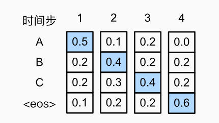

如图，假设输出中有四个词元”A“,"B","C"和"`<eos>`"。每个时间步下的四个数字分别表示在该时间步生成A，B，C，`<eos>`的条件概率。在每个时间步，贪心搜索选择具有最高条件概率的词元。在图中，预测的输出序列是A,B,C,`<eos>`，这个输出序列的条件概率为：$0.5\times 0.4\times0.4\times0.6=0.048$。

但贪心算法存在一些问题。现实中，最优序列（optimal sequence）应该是最大化$\prod_{t'=1}^{T'}P(y_{t'}\mid y_1,...,y_{t'-1},\mathbf{c})$值的输出序列，这是基于输入序列生成输出序列的条件概率。然而贪心算法无法保证得到最优序列。

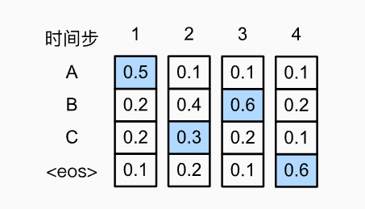

如图所示的例子阐述了这个问题。在时间步2，我们选择了具有第二高条件概率的词元C。由于时间步3所基于时间步1和2处的输出子序列已经从AB变为AC，则时间步3处的每个词元的条件概率也发生了改变。假设在时间步3选择B，于是时间步4基于前三个时间步的输出ACB为条件，与之前的ABC不同，因此，时间步4生成每个词元的条件概率发生了改变。

最后，输出序列ACB`<eos>`的条件概率为：$0.5\times0.3\times0.6\times0.6=0.054$，大于使用贪心算法得出的输出序列。这个例子说明，贪心搜索获得的输出序列不一定是最佳序列。

### 9.8.2.穷举搜索

如果目标是获得最优序列，也可以考虑穷举搜索（exhaustive search）：穷举地列出所有可能的输出序列及其条件概率，然后计算条件概率最高的一个。

使用穷举搜索的计算量$\mathcal{O}(|\mathcal{Y}|^{T'})$可能会很大。例如，当$|\mathcal{Y}|=10000$和$T'=10$时，我们需要评估$10000^{10}$个序列，现有的计算机几乎不可能计算它。然而，贪心搜索的计算量$\mathcal{O}(|\mathcal{Y}|T')$通常显著地小于穷举搜索。

### 9.8.3.束搜索

关于选取哪种序列搜索策略最佳，如果精度最重要，则选用穷举搜索较好，如果计算成本最重要，则采用贪心搜索较好。而束搜索的实际应用则介于这两个极端之间。

束搜索（beam search）是贪心搜索的一个改进版本。它有一个超参数，名为束宽（beam size）$k$。在时间步1，我们选择具有最高条件概率的$k$个词元。这$k$个词元将分别是$k$个候选输出序列的第一个词元。在随后的每个时间步，基于上一时间步的$k$个输出序列，继续从$k|\mathcal{Y}|$个可能的选择中挑出具有最高条件概率的$k$个候选输出序列。

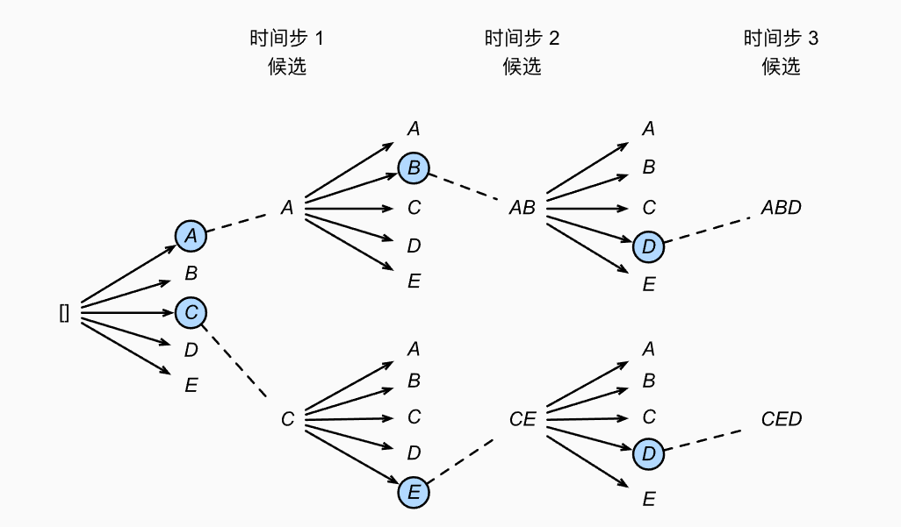

如图展示了束搜索的过程。假设输出词表只包含五个元素：$\mathcal{Y}={A,B,C,D,E}$，其中有一个是`<eos>`。设置束宽为2，输出序列的最大长度为3。在时间步1，假设具有最高条件概率$P(y_1\mid\mathbf{c})$的词元是A和C。

在时间步2，我们计算所有$y_2\in \mathcal{Y}$为：
$$
P(A,y_2\mid \mathbf{c})=P(A\mid \mathbf{c})P(y_2\mid A,\mathbf{c})\\
P(C,y_2\mid\mathbf{c})=P(C\mid \mathbf{c})P(y_2\mid C,\mathbf{c})
$$
在这十个值里，我们挑选最大的两个，例如$P(A,B\mid \mathbf{c})$和$P(C,E\mid \mathbf{c})$。然后在时间步3，我们继续计算所有$y_3\in \mathcal{Y}$为：
$$
\begin{split}\begin{aligned}P(A, B, y_3 \mid \mathbf{c}) = P(A, B \mid \mathbf{c})P(y_3 \mid A, B, \mathbf{c}),\\P(C, E, y_3 \mid \mathbf{c}) = P(C, E \mid \mathbf{c})P(y_3 \mid C, E, \mathbf{c}),\end{aligned}\end{split}
$$
从这十个值中选择最大的两个，即$P(A,B,D\mid \mathbf{c})$和$P(C,E,D\mid \mathbf{c})$，会得到六个候选输出序列：A，C，AB，CE，ABD，CED。

基于这六个序列，我们获得最终候选输出序列集合。然后选择其中条件概率乘积最高的序列作为输出序列：
$$
\frac{1}{L^\alpha} \log P(y_1, \ldots, y_{L}\mid \mathbf{c}) = \frac{1}{L^\alpha} \sum_{t'=1}^L \log P(y_{t'} \mid y_1, \ldots, y_{t'-1}, \mathbf{c}),
$$
其中$L$是最终候选序列的长度，$\alpha$通常设置为0.75。因为一个较长的序列的求和中会有更多的对数项，因此分母中的$L^{\alpha}$用于惩罚长序列。

束序列的计算量为$\mathcal{O}(k|\mathcal{Y}|T')$，这个结果介于贪心搜索和穷举搜索之间。实际上贪心搜索可以看作一种束宽为1的特殊类型的束搜索。

通过灵活地选择束宽，束搜索可以在正确率和计算代价之间进行权衡。

### 9.8.4.小结

- 序列搜索策略包括贪心搜索、穷举搜索和束搜索。
- 贪心搜索所选取序列的计算量最小，但精度相对较低。
- 穷举搜索所选取序列的精度最高，但计算量最大。
- 束搜索通过灵活选择束宽，在正确率和计算代价之间进行权衡。


