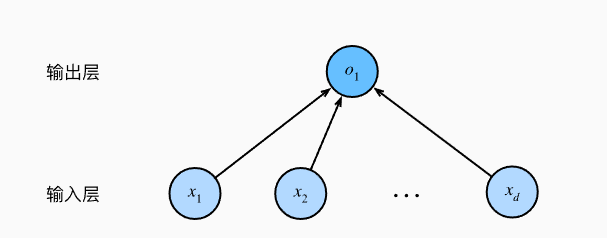
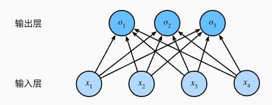

# 2.预备知识


## 2.1数据操作

### 2.11 入门

```python
import torch
x = torch.arange(12) 
# 创建一个行向量x，这个行向量包含从0开始的前12个整数
print(x)
# tensor([ 0,  1,  2,  3,  4,  5,  6,  7,  8,  9, 10, 11])
```

可以通过张量的shape属性访问张量的形状。

```python
print(x.shape)
# torch.Size([12])
```

如果只想知道张量的总数，即形状的所有元素乘积，可以检查他的大小（size）。

```python
print(x.numel())
# 12
```

想要改变一个张量的形状而不改变元素数量和元素值，可以调用reshape函数。

```python
X = x.reshape(3, 4)
print(X)
# tensor([[ 0,  1,  2,  3],
#         [ 4,  5,  6,  7],
#         [ 8,  9, 10, 11]])
```

我们不需要通过手动指定每个维度来改变形状。 也就是说，如果我们的目标形状是（高度,宽度）， 那么在知道宽度后，高度会被自动计算得出，。 在上面的例子中，为了获得一个3行的矩阵，我们手动指定了它有3行和4列。 幸运的是，我们可以通过`-1`来调用此自动计算出维度的功能。 即我们可以用`x.reshape(-1,4)`或`x.reshape(3,-1)`来取代`x.reshape(3,4)`。

```python
Y= x.reshape(-1,4)
Z = x.reshape(3,-1)
print(Y.shape,Z.shape)
# torch.Size([3, 4]) torch.Size([3, 4])
```

有时，我们希望使用全0、全1、其他常量，或者从特定分布中随机采样的数字来初始化矩阵。 我们可以创建一个形状为（2,3,4）的张量，其中所有元素都设置为0。代码如下：

全0：

```python
X=torch.zeros(2,3,4)
print(X)
# tensor([[[0., 0., 0., 0.],
#          [0., 0., 0., 0.],
#          [0., 0., 0., 0.]],
#
#         [[0., 0., 0., 0.],
#          [0., 0., 0., 0.],
#          [0., 0., 0., 0.]]])
```

全1：

```python
Y=torch.ones(2,3,4)
print(Y)
```

有时我们想通过从某个特定的概率分布中随机采样来得到张量中每个元素的值。 例如，当我们构造数组来作为神经网络中的参数时，我们通常会随机初始化参数的值。 以下代码创建一个形状为（3,4）的张量。*** 其中的每个元素都从均值为0、标准差为1的标准高斯分布（正态分布）中随机采样***。

```python
Z=torch.randn(3, 4)
print(Z)
# tensor([[ 1.3945, -1.3954, -0.1719, -0.8006],
#         [-0.9903,  1.2498,  0.8310, -1.7149],
#         [-1.6048, -0.5111, -2.6971,  0.3204]])
```

我们还可以通过提供包含数值的Python列表（或嵌套列表），来为所需张量中的每个元素赋予确定值。 在这里，最外层的列表对应于轴0，内层的列表对应于轴1。

```python
q=torch.tensor([[2, 1, 4, 3], [1, 2, 3, 4], [4, 3, 2, 1]])
print(q)
# tensor([[2, 1, 4, 3],
#         [1, 2, 3, 4],
#         [4, 3, 2, 1]])
```

### 2.1.2运算符

对于任意具有相同形状的张量， 常见的标准算术运算符（`+`、`-`、`*`、`/`和`**`（求幂））都可以被升级为按元素运算。 我们可以在同一形状的任意两个张量上调用按元素操作。

```python
x = torch.tensor([1.0, 2, 4, 8])
y = torch.tensor([2, 2, 2, 2])
print(x + y, x - y, x * y, x / y, x ** y)
# (tensor([ 3.,  4.,  6., 10.]),
#  tensor([-1.,  0.,  2.,  6.]),
#  tensor([ 2.,  4.,  8., 16.]),
#  tensor([0.5000, 1.0000, 2.0000, 4.0000]),
#  tensor([ 1.,  4., 16., 64.]))
```

“按元素”方式可以应用更多的计算，包括像求幂这样的一元运算符。

```python
torch.exp(x)
# tensor([2.7183e+00, 7.3891e+00, 5.4598e+01, 2.9810e+03])
```

除了按元素计算外，我们还可以执行线性代数运算，包括向量点积和矩阵乘法。在2.3节中解释。

我们也可以把多个张量*连结*（concatenate）在一起， 把它们端对端地叠起来形成一个更大的张量。 我们只需要提供张量列表，并给出沿哪个轴连结。 下面的例子分别演示了当我们沿行（轴-0，形状的第一个元素） 和按列（轴-1，形状的第二个元素）连结两个矩阵时，会发生什么情况。 我们可以看到，第一个输出张量的轴-0长度（6）是两个输入张量轴-0长度的总和（3+3）； 第二个输出张量的轴-1长度（8）是两个输入张量轴-1长度的总和（4+4）。

```python
X = torch.arange(12, dtype=torch.float32).reshape((3,4))
Y = torch.tensor([[2.0, 1, 4, 3], [1, 2, 3, 4], [4, 3, 2, 1]])
print(X,'\n',Y)
print(torch.cat((X, Y), dim=0),"\n", torch.cat((X, Y), dim=1))
# tensor([[ 0.,  1.,  2.,  3.],
#         [ 4.,  5.,  6.,  7.],
#         [ 8.,  9., 10., 11.]]) 
#  tensor([[2., 1., 4., 3.],
#         [1., 2., 3., 4.],
#         [4., 3., 2., 1.]])
# tensor([[ 0.,  1.,  2.,  3.],
#         [ 4.,  5.,  6.,  7.],
#         [ 8.,  9., 10., 11.],
#         [ 2.,  1.,  4.,  3.],
#         [ 1.,  2.,  3.,  4.],
#         [ 4.,  3.,  2.,  1.]]) 
# tensor([[ 0.,  1.,  2.,  3.,  2.,  1.,  4.,  3.],
#         [ 4.,  5.,  6.,  7.,  1.,  2.,  3.,  4.],
#         [ 8.,  9., 10., 11.,  4.,  3.,  2.,  1.]])
```

有时，我们想通过*逻辑运算符*构建二元张量。 以`X == Y`为例： 对于每个位置，如果`X`和`Y`在该位置相等，则新张量中相应项的值为1。 这意味着逻辑语句`X == Y`在该位置处为真，否则该位置为0。

```python
print(X==Y)
# tensor([[False,  True, False,  True],
#         [False, False, False, False],
#         [False, False, False, False]])
```

对张量中的所有元素进行求和，会产生一个单元素张量。

```python
print(X.sum())
# tensor(66.)
```

### 2.1.3广播机制

在上面的部分中，我们看到了如何在相同形状的两个张量上执行按元素操作。 在某些情况下，即使形状不同，我们仍然可以通过调用 *广播机制*（broadcasting mechanism）来执行按元素操作。 这种机制的工作方式如下：

1. 通过适当复制元素来扩展一个或两个数组，以便在转换之后，两个张量具有相同的形状；
2. 对生成的数组执行按元素操作。

在大多数情况下，我们将沿着数组中长度为1的轴进行广播，如下例子：

```python
a = torch.arange(3).reshape((3, 1))
b = torch.arange(2).reshape((1, 2))
print(a,'\n', b)
# tensor([[0],
#         [1],
#         [2]]) 
#  tensor([[0, 1]])

```

由于`a`和`b`分别是3×1和1×2矩阵，如果让它们相加，它们的形状不匹配。 我们将两个矩阵*广播*为一个更大的3×2矩阵，如下所示：矩阵`a`将复制列， 矩阵`b`将复制行，然后再按元素相加。

```python
print(a+b)
# tensor([[0, 1],
#         [1, 2],
#         [2, 3]])
```

### 2.1.4索引与切片

张量中的元素可以通过索引访问。第一个元素的索引是0，最后一个元素的索引是-1。

我们可以用`[-1]`选择最后一个元素，可以用`[1:3]`选择第二个和第三个元素：

```python
print(X[-1],'\n',X[1:3])
# tensor([ 8.,  9., 10., 11.]) 
# tensor([[ 4.,  5.,  6.,  7.],
#         [ 8.,  9., 10., 11.]])
```

除读取外，我们还可以通过指定索引来将元素写入矩阵

```python
X[1, 2] = 9
print(X)
# tensor([[ 0.,  1.,  2.,  3.],
#         [ 4.,  5.,  9.,  7.],
#         [ 8.,  9., 10., 11.]])
```

如果我们想为多个元素赋值相同的值，我们只需要索引所有元素，然后为它们赋值。 例如，`[0:2, :]`访问第1行和第2行，其中“:”代表沿轴1（列）的所有元素。 虽然我们讨论的是矩阵的索引，但这也适用于向量和超过2个维度的张量。

```python
X[0:2, :] = 12
print(X)
# tensor([[12., 12., 12., 12.],
#         [12., 12., 12., 12.],
#         [ 8.,  9., 10., 11.]])
```

### 2.1.5节省内存

运行一些操作可能会导致为新结果分配内存。 例如，如果我们用`Y = X + Y`，我们将取消引用`Y`指向的张量，而是指向新分配的内存处的张量。

在下面的例子中，我们用Python的`id()`函数演示了这一点， 它给我们提供了内存中引用对象的确切地址。 运行`Y = Y + X`后，我们会发现`id(Y)`指向另一个位置。 这是因为Python首先计算`Y + X`，为结果分配新的内存，然后使`Y`指向内存中的这个新位置。

```python
before = id(Y)
Y = Y + X
print(id(Y) == before)
# False
```

这可能是不可取的，原因有两个：

1. 首先，我们不想总是不必要地分配内存。在机器学习中，我们可能有数百兆的参数，并且在一秒内多次更新所有参数。通常情况下，我们希望原地执行这些更新；
2. 如果我们不原地更新，其他引用仍然会指向旧的内存位置，这样我们的某些代码可能会无意中引用旧的参数。

我们可以使用切片表示法将操作的结果分配给先前分配的数组，例如`Y[:] = <expression>`。 为了说明这一点，我们首先创建一个新的矩阵`Z`，其形状与另一个`Y`相同， 使用`zeros_like`来分配一个全0的块。

```python
Z = torch.zeros_like(Y)
print('id(Z):', id(Z))
Z[:] = X + Y
print('id(Z):', id(Z))
# id(Z): 2184907389984
# id(Z): 2184907389984
```

### 2.1.6转换为其他Python对象

将深度学习框架定义的张量转换为NumPy张量（`ndarray`）很容易，反之也同样容易。 torch张量和numpy数组将共享它们的底层内存，就地操作更改一个张量也会同时更改另一个张量。

```python
A = X.numpy()
B = torch.tensor(A)
print(type(A), type(B))
# <class 'numpy.ndarray'> <class 'torch.Tensor'>
```

要将大小为1的张量转换为Python标量，我们可以调用`item`函数或Python的内置函数。

```python
a = torch.tensor([3.5])
a, a.item(), float(a), int(a)
# (tensor([3.5000]), 3.5, 3.5, 3)
```

## 2.2数据预处理

本节我们将简要介绍使用`pandas`预处理原始数据，并将原始数据转换为张量格式的步骤。

### 2.2.1读取数据集

首先创建一个人工数据集，并存储在CSV（逗号分隔值）文件 `../data/house_tiny.csv`中。 以其他格式存储的数据也可以通过类似的方式进行处理。 下面我们将数据集按行写入CSV文件中。

```python
import os

os.makedirs(os.path.join('..', 'data'), exist_ok=True) 
#".."表示上级目录，exist_ok=True让makedirs在目标文件夹已经存在时不会报错。
data_file = os.path.join('..', 'data', 'house_tiny.csv') #data_file = ../data/house_tiny.csv
with open(data_file, 'w') as f:
    f.write('NumRooms,Alley,Price\n')  # 列名
    f.write('NA,Pave,127500\n')  # 每行表示一个数据样本
    f.write('2,NA,106000\n')
    f.write('4,NA,178100\n')
    f.write('NA,NA,140000\n')
```

```python
import pandas as pd
data = pd.read_csv(data_file)
print(data)
#    NumRooms Alley   Price
# 0       NaN  Pave  127500
# 1       2.0   NaN  106000
# 2       4.0   NaN  178100
# 3       NaN   NaN  140000
```

### 2.2.2处理缺失值

注意，“NaN”项代表缺失值。 为了处理缺失的数据，典型的方法包括*插值法*和*删除法*， 其中插值法用一个替代值弥补缺失值，而删除法则直接忽略缺失值。 在这里，我们将考虑插值法。

通过位置索引`iloc`，我们将`data`分成`inputs`和`outputs`， 其中前者为`data`的前两列，而后者为`data`的最后一列。 

对于`inputs`中缺少的`数值`，我们用同一列的均值替换“NaN”项。

```python
inputs, outputs = data.iloc[:, 0:2], data.iloc[:, 2]
inputs = inputs.fillna(inputs.mean())
print(inputs)
#    NumRooms Alley
# 0       3.0  Pave
# 1       2.0   NaN
# 2       4.0   NaN
# 3       3.0   NaN
```

对于`类别值`或`离散值`，我们将“NaN”视为一个类别。 由于“巷子类型”（“Alley”）列只接受两种类型的类别值“Pave”和“NaN”， `pandas`可以自动将此列转换为两列“Alley_Pave”和“Alley_nan”。 巷子类型为“Pave”的行会将“Alley_Pave”的值设置为1，“Alley_nan”的值设置为0。 缺少巷子类型的行会将“Alley_Pave”和“Alley_nan”分别设置为0和1。

```python
inputs = pd.get_dummies(inputs, dummy_na=True)
print(inputs)
#    NumRooms  Alley_Pave  Alley_nan
# 0       3.0           1          0
# 1       2.0           0          1
# 2       4.0           0          1
# 3       3.0           0          1
```

> dummy_na的作用是让值为NaN的单独成列。

### 2.2.3转换为张量格式

现在`inputs`和`outputs`中的所有条目都是数值类型，它们可以转换为张量格式。

```python
X = torch.tensor(inputs.to_numpy(dtype=float))
y = torch.tensor(outputs.to_numpy(dtype=float))
print(X,'\n', y)
# tensor([[3., 1., 0.],
#         [2., 0., 1.],
#         [4., 0., 1.],
#         [3., 0., 1.]], dtype=torch.float64) 
# tensor([127500., 106000., 178100., 140000.], dtype=torch.float64)
```

## 2.3线性代数

### 2.3.1标量

标量由只有一个元素的张量表示。

```python
x = torch.tensor(3.0)
y = torch.tensor(2.0)
```

### 2.3.2向量

向量可以被视为标量值组成的列表。 这些标量值被称为向量的*元素*（element）或*分量*（component）。

通过一维张量表示向量。一般来说，张量可以具有任意长度，取决于机器的内存限制。

```python
x = torch.arange(4)
```

我们可以使用下标来引用向量的任一元素，例如可以通过x~i~来引用第i个元素。

列向量是向量的默认方向。

#### 2.3.2.1长度、维度和形状

向量只是一个数字数组，就像每个数组都有一个长度一样，每个向量也是如此。 在数学表示法中，如果我们想说一个向量x由n个实值标量组成， 可以将其表示为x∈R^n^。 向量的长度通常称为向量的*维度*（dimension）。

与普通的Python数组一样，我们可以通过调用Python的内置`len()`函数来访问张量的长度。

```python
len(x)
```

当用张量表示一个向量（只有一个轴）时，我们也可以通过`.shape`属性访问向量的长度。 形状（shape）是一个元素组，列出了张量沿每个轴的长度（维数）。 对于只有一个轴的张量，形状只有一个元素。

```python
x.shape
# torch.Size([4])
```

### 2.3.3矩阵

正如向量将标量从零阶推广到一阶，矩阵将向量从一阶推广到二阶。 矩阵，我们通常用粗体、大写字母来表示 （例如，**X**、**Y**和**Z**）， 在代码中表示为具有两个轴的张量。

数学表示法使用A∈R^m×n^ 来表示矩阵A，其由m行和n列的实值标量组成。 我们可以将任意矩阵A∈R^m×n^视为一个表格， 其中每个元素a~ij~属于第i行第j列。

对于任意A∈R^m×n^， A的形状是（m,n）或m×n。 当矩阵具有相同数量的行和列时，其形状将变为正方形； 因此，它被称为*方阵*（square matrix）。

当调用函数来实例化张量时， 我们可以通过指定两个分量m和n来创建一个形状为m×n的矩阵。

```python
A = torch.arange(20).reshape(5, 4)
# tensor([[ 0,  1,  2,  3],
#         [ 4,  5,  6,  7],
#         [ 8,  9, 10, 11],
#         [12, 13, 14, 15],
#         [16, 17, 18, 19]])
```

当我们交换矩阵的行和列时，结果称为矩阵的*转置*（transpose）。 通常用a^⊤^来表示矩阵的转置，如果B=A^⊤^， 则对于任意i和j，都有b~ij~=a~ji~。 

现在在代码中访问矩阵的转置。

```python
A.T
```

作为方阵的一种特殊类型，*对称矩阵*（symmetric matrix）A等于其转置：A=A^⊤^。 

尽管单个向量的默认方向是列向量，但在表示表格数据集的矩阵中， 将每个数据样本作为矩阵中的行向量更为常见。

### 2.3.4张量

就像向量是标量的推广，矩阵是向量的推广一样，我们可以构建具有更多轴的数据结构。 张量（本小节中的“张量”指代数对象）是描述具有任意数量轴的n维数组的通用方法。 例如，向量是一阶张量，矩阵是二阶张量。张量的索引机制（例如X~ijk~）与矩阵类似。

当我们开始处理图像时，张量将变得更加重要，图像以n维数组形式出现， 其中3个轴对应于高度、宽度，以及一个*通道*（channel）轴， 用于表示颜色通道（红色、绿色和蓝色）。 现在先将高阶张量暂放一边，而是专注学习其基础知识。

```python
X = torch.arange(24).reshape(2, 3, 4)
```

### 2.3.5张量算法的基本性质

标量、向量、矩阵和任意数量轴的张量（本小节中的“张量”指代数对象）有一些实用的属性。 例如，从按元素操作的定义中可以注意到，任何按元素的一元运算都不会改变其操作数的形状。 同样，给定具有相同形状的任意两个张量，任何按元素二元运算的结果都将是相同形状的张量。 例如，将两个相同形状的矩阵相加，会在这两个矩阵上执行元素加法。

```python
A = torch.arange(20, dtype=torch.float32).reshape(5, 4)
B = A.clone()  # 通过分配新内存，将A的一个副本分配给B
```

具体而言，两个矩阵的按元素乘法称为*Hadamard积*（Hadamard product）（数学符号⊙）。

```python
A * B
```

将张量乘以或加上一个标量不会改变张量的形状，其中张量的每个元素都将与标量相加或相乘。

```python
a = 2
X = torch.arange(24).reshape(2, 3, 4)
X*a
```

### 2.3.6降维

我们可以对任意张量进行的一个有用的操作是计算其元素的和。

```python
x = torch.arange(4, dtype=torch.float32)
x, x.sum()
```

默认情况下，调用求和函数会沿所有的轴降低张量的维度，使它变为一个标量。 我们还可以指定张量沿哪一个轴来通过求和降低维度。 以矩阵为例，为了通过求和所有行的元素来降维（轴0），可以在调用函数时指定`axis=0`。 由于输入矩阵沿0轴降维以生成输出向量，因此输入轴0的维数在输出形状中消失。

```python
A = torch.arange(20, dtype=torch.float32).reshape(5, 4)
print(A)
A_sum_axis0 = A.sum(axis=0)
print(A_sum_axis0)
# tensor([[ 0.,  1.,  2.,  3.],
#         [ 4.,  5.,  6.,  7.],
#         [ 8.,  9., 10., 11.],
#         [12., 13., 14., 15.],
#         [16., 17., 18., 19.]])
# tensor([40., 45., 50., 55.])
```

> 我对于沿axis=0的理解是，轴0是行，运算就是∑A[ i ] [ j ], j相同，最后的结果就是沿着上下（列）求和。

指定`axis=1`将通过汇总所有列的元素降维（轴1）。因此，输入轴1的维数在输出形状中消失。

```python
A_sum_axis1 = A.sum(axis=1)
print(A_sum_axis1)
# tensor([ 6., 22., 38., 54., 70.])
```

沿着行和列对矩阵求和，等价于对矩阵的所有元素进行求和。

```python
A.sum(axis=[0, 1])  # 结果和A.sum()相同
```

一个与求和相关的量是*平均值*（mean或average）。 我们通过将总和除以元素总数来计算平均值。 在代码中，我们可以调用函数来计算任意形状张量的平均值。

```python
A.mean(), A.sum() / A.numel() #这两种效果相同
# (tensor(9.5000), tensor(9.5000))
```

同样，计算平均值的函数也可以沿指定轴降低张量的维度。

```python
A.mean(axis=0), A.sum(axis=0) / A.shape[0]
(tensor([ 8.,  9., 10., 11.]), tensor([ 8.,  9., 10., 11.]))
```

#### 2.3.6.1非降维求和

```python
sum_A = A.sum(axis=1, keepdims=True)
sum_A
tensor([[ 6.],
        [22.],
        [38.],
        [54.],
        [70.]])
```

由于`sum_A`在对每行进行求和后仍保持两个轴，我们可以通过广播将`A`除以`sum_A`。

```python
A / sum_A
# tensor([[0.0000, 0.1667, 0.3333, 0.5000],
#         [0.1818, 0.2273, 0.2727, 0.3182],
#         [0.2105, 0.2368, 0.2632, 0.2895],
#         [0.2222, 0.2407, 0.2593, 0.2778],
#         [0.2286, 0.2429, 0.2571, 0.2714]])
```

如果我们想沿某个轴计算`A`元素的累积总和， 比如`axis=0`（按行计算），可以调用`cumsum`函数。 此函数不会沿任何轴降低输入张量的维度。

```python
A.cumsum(axis=0)
# tensor([[ 0.,  1.,  2.,  3.],
#         [ 4.,  6.,  8., 10.],
#         [12., 15., 18., 21.],
#         [24., 28., 32., 36.],
#         [40., 45., 50., 55.]])
```

> 这里是累积总和，比如cumsum[1] [0] = A[0] [0]+A[1] [0]

### 2.3.7 点积（Dot Product)

向量的点积

```python
y = torch.ones(4, dtype = torch.float32)
torch.dot(x, y)
# tensor(6.)
```

对于向量来说，与下式相同。

```python
torch.sum(x * y)
```

### 2.3.8矩阵-向量积

在代码中使用张量表示矩阵-向量积，我们使用`mv`函数。 当我们为矩阵`A`和向量`x`调用`torch.mv(A, x)`时，会执行矩阵-向量积。 注意，`A`的列维数（沿轴1的长度）必须与`x`的维数（其长度）相同。

```python
A.shape, x.shape, torch.mv(A, x)
# (torch.Size([5, 4]), torch.Size([4]), tensor([ 14.,  38.,  62.,  86., 110.]))
```

## 2.5自动微分

深度学习框架通过自动计算导数，即*自动微分*（automatic differentiation）来加快求导。 实际中，根据设计好的模型，系统会构建一个*计算图*（computational graph）， 来跟踪计算是哪些数据通过哪些操作组合起来产生输出。 自动微分使系统能够随后反向传播梯度。 这里，*反向传播*（backpropagate）意味着跟踪整个计算图，填充关于每个参数的偏导数。

### 2.5.1一个简单的例子

作为一个演示例子，假设我们想对函数y=2x^⊤^x关于列向量x求导。 首先，我们创建变量`x`并为其分配一个初始值

```python
x = torch.arange(4.0)
```

在我们计算y关于x的梯度之前，需要一个地方来存储梯度。 重要的是，我们不会在每次对一个参数求导时都分配新的内存。 因为我们经常会成千上万次地更新相同的参数，每次都分配新的内存可能很快就会将内存耗尽。 注意，一个标量函数关于向量x的梯度是向量，并且与x具有相同的形状。

```python
x.requires_grad_(True)  # 等价于x=torch.arange(4.0,requires_grad=True)
x.grad  # 默认值是None
```

```python
y = 2 * torch.dot(x, x)
print(y)
# tensor(28., grad_fn=<MulBackward0>)
```

`x`是一个长度为4的向量，计算`x`和`x`的点积，得到了我们赋值给`y`的标量输出。 接下来，通过调用反向传播函数来自动计算`y`关于`x`每个分量的梯度，并打印这些梯度。

```python
y.backward()
print(x.grad)
# tensor([ 0.,  4.,  8., 12.])
```

函数y=2x^⊤^x关于x的梯度应为4x。 让我们快速验证这个梯度是否计算正确。

```python
x.grad == 4 * x
# tensor([True, True, True, True])
```

现在计算`x`的另一个函数。

```python
# 在默认情况下，PyTorch会累积梯度，我们需要清除之前的值
x.grad.zero_()
y = x.sum()
y.backward()
print(x.grad)
# tensor([1., 1., 1., 1.])
```

### 2.5.2非标量变量的反向传播

当`y`不是标量时，向量`y`关于向量`x`的导数的最自然解释是一个矩阵。 对于高阶和高维的`y`和`x`，求导的结果可以是一个高阶张量。

然而，虽然这些更奇特的对象确实出现在高级机器学习中（包括深度学习中）， 但当调用向量的反向计算时，我们通常会试图计算一批训练样本中每个组成部分的损失函数的导数。 这里，我们的目的不是计算微分矩阵，而是单独计算批量中每个样本的偏导数之和。

```python
# 对非标量调用backward需要传入一个gradient参数，该参数指定微分函数关于self的梯度。
# 本例只想求偏导数的和，所以传递一个1的梯度是合适的
x.grad.zero_()
y = x * x
# 等价于y.backward(torch.ones(len(x)))
y.sum().backward()
x.grad
```

### 2.5.3分离计算

有时，我们希望将某些计算移动到记录的计算图之外。 例如，假设`y`是作为`x`的函数计算的，而`z`则是作为`y`和`x`的函数计算的。 想象一下，我们想计算`z`关于`x`的梯度，但由于某种原因，希望将`y`视为一个常数， 并且只考虑到`x`在`y`被计算后发挥的作用。

这里可以分离`y`来返回一个新变量`u`，该变量与`y`具有相同的值， 但丢弃计算图中如何计算`y`的任何信息。 换句话说，梯度不会向后流经`u`到`x`。 因此，下面的反向传播函数计算`z=u*x`关于`x`的偏导数，同时将`u`作为常数处理， 而不是`z=x*x*x`关于`x`的偏导数。

```python
x.grad.zero_()
y = x * x
u = y.detach()
z = u * x

z.sum().backward()
x.grad == u  # tensor([True, True, True, True])
```

# 3.线性神经网络

## 3.1线性回归

### 3.1.1线性回归的基本元素

#### 3.1.1.1线性模型

线性假设是指目标（房屋价格）可以表示为特征（面积和房龄）的加权和，如下面的式子：
$$
\text{price} = w_{\text{area}} \cdot \text{area} + w_{\text{age}} \cdot \text{age} + b
$$
$w_{\text{area}}$ 和$w_{\text{age}}$称为权重(weight),权重决定了每个特征对于我们预测值的影响。

b称为偏置(bias)、偏移量(offset)或截距(intercept。偏置是指当所有特征都取值为0时，预测值应该为多少。如果没有偏置项，模型的表达能力将受到限制。

严格来说，上述公式是输入特征的一个 *仿射变换*（affine transformation）。 仿射变换的特点是通过加权和对特征进行*线性变换*（linear transformation）， 并通过偏置项来进行*平移*（translation）。

给定一个数据集，我们的目标是寻找模型的权重w和偏置b， 使得根据模型做出的预测大体符合数据里的真实价格。 输出的预测值由输入特征通过*线性模型*的仿射变换决定，仿射变换由所选权重和偏置确定。

而在机器学习领域，我们通常使用的是高维数据集，建模时采用线性代数表示法会比较方便。 当我们的输入包含d个特征时，我们将预测结果 $\hat{y}$（通常使用“尖角”符号表示y的估计值）表示为：
$$
\hat{y} = w_1 x_1 + \cdots + w_d x_d + b.
$$
将所有特征放到向量x∈R^d^中， 并将所有权重放到向量w∈R^d^中， 我们可以用点积形式来简洁地表达模型：
$$
\hat{y} = \mathbf{w}^T \mathbf{x} + b.
$$
向量x对应于单个数据样本的特征。 用符号表示的矩阵X∈R^n×d^ 可以很方便地引用我们整个数据集的n个样本。 其中，X的每一行是一个样本，每一列是一种特征。

对于特征集合X，预测值$\hat{y}$∈R^n^ 可以通过矩阵-向量乘法表示为：
$$
\hat{y} = Xw + b
$$
这个过程的求和使用广播机制。

给定训练数据特征X和对应的已知标签y， 线性回归的目标是找到一组权重向量w和偏置b： 当给定从X的同分布中取样的新样本特征时， 这组权重向量和偏置能够使得新样本预测标签的误差尽可能小。

虽然我们相信给定x预测y的最佳模型会是线性的， 但我们很难找到一个有n个样本的真实数据集，其中对于所有的1≤i≤n，y(i)完全等于w^⊤^x^(i)^+b。 无论我们使用什么手段来观察特征X和标签y， 都可能会出现少量的观测误差。 因此，即使确信特征与标签的潜在关系是线性的， 我们也会加入一个噪声项来考虑观测误差带来的影响。

在开始寻找最好的*模型参数*（model parameters）w和b之前， 我们还需要两个东西： （1）一种模型质量的度量方式； （2）一种能够更新模型以提高模型预测质量的方法。

#### 3.1.1.2损失函数

损失函数(loss function)能够量化目标的实际值与预测值之间的差距。通常我们会选择非负数作为损失，且数值越小表示损失越小，完美预测时损失为0。

回归问题中最常用的损失函数是平方误差函数。$\hat{y}^{(i)}$表示样本i的预测值，${y}^{(i)}$表示相应的真实标签。平方误差可定义为：
$$
l^{(i)}(w, b) = \frac{1}{2} (\hat{y}^{(i)} - y^{(i)})^2.
$$
常数$\frac{1}{2}$不会带来本质的差别，但这样在形式上稍微简单一些 （因为对损失函数求导后常数系数为1）。

为了度量模型在整个数据集上的质量，计算在训练集n个样本上的损失均值：
$$
L(w, b) = \frac{1}{n} \sum_{i=1}^{n} l^{(i)}(w, b) = \frac{1}{n} \sum_{i=1}^{n} \frac{1}{2} (w^T x^{(i)} + b - y^{(i)})^2.
$$
训练模型时，希望找到一组参数(w^*^,b^*^)，能够使L(w,b)最小，即：
$$
w^*, b^* = \arg\min_{w,b} L(w, b).
$$

#### 3.1.1.3解析解

线性回归的解可以用一个公式简单的表示出来，这类解叫做解析解。

首先，我们将偏置b合并到参数w中，合并方法是在包含所有参数的矩阵中附加一列。

省去推导过程，解为： 
$$
w^* = (X^T X)^{-1} X^T y.
$$
但并非所有问题都存在解析解，导致它无法广泛应用在深度学习中。

#### 3.1.1.4随机梯度下降

在许多任务上，那些难以优化的模型效果要更好。 因此，弄清楚如何训练这些难以优化的模型是非常重要的。

梯度下降最简单的用法是计算损失函数（数据集中所有样本的损失均值）关于模型参数的导数（这里也可称之为梯度）。但实际中执行可能会非常慢，因为每次更新参数前必须遍历整个数据集，因此通常会在每次需要计算更新的时候随机抽取一小批样本，这种变体叫做**小批量随机梯度下降**（minibatch stochastic gradient descent）

每次迭代时，首先随机抽样一个小批量的$\mathcal{B}$,它由***固定数量***的训练样本组成。然后计算小批量的平均损失关于模型参数的导数（梯度）。最后将梯度乘以一个预先确定的正数η，并从当前参数的值中减掉。

用数学公式表示为：（$\partial$表示偏导数）
$$
(\mathbf{w}, b) \gets (\mathbf{w}, b) - \frac{\eta}{|\mathcal{B}|} \sum_{i \in \mathcal{B}} \partial_{(\mathbf{w}, b)} l^{(i)} (\mathbf{w}, b).
$$

> 算法步骤如下：
>
> 1. 初始化模型参数的值。
> 2. 从数据集中随机抽取小批量样本并且在负梯度方向上更新参数，不断迭代这一步骤。

$|\mathcal{B}|$表示每个小批量中的样本数，也成为批量大小(batch size)。η称为学习率(learning rate)。批量大小和学习率是手动预先指定的。这些可以调整但不在训练过程中更新的参数称为超参数(hyperparameter)。

调参(hyperparameter tuning)是选择超参数的过程。超参数通常是根据训练迭代训练迭代结果来调整的，而训练迭代结果是在独立的验证数据集(validation dataset)上评估得到的。

训练了预先确定的若干迭代次数后（或满足某些其他条件后），我们记录下模型参数的估计值，表示为$\hat{w},\hat{b}$。但即使函数确实是线性且无噪声的，这些估计值也不会使损失函数真正得到最小值。因为算法会使得损失向最小值缓慢收敛，但却不能在有限的步数内非常精确地达到最小值。

线性回归恰好是一个在整个域中只有一个最小值的学习问题。 但是对像深度神经网络这样复杂的模型来说，损失平面上通常包含多个最小值。 深度学习实践者很少会去花费大力气寻找这样一组参数，使得在*训练集*上的损失达到最小。 事实上，更难做到的是找到一组参数，这组参数能够在我们从未见过的数据上实现较低的损失， 这一挑战被称为*泛化*（generalization）。

#### 3.1.1.5用模型进行预测

给定“已学习”的线性回归模型$\mathbf{\hat{w}}^T \mathbf{x} + \hat{b}$，现在我们可以通过房屋面积x~1~和房龄x~2~来估计一个（未包含在训练数据中的）新房屋价格。 给定特征估计目标的过程通常称为*预测*（prediction）或*推断*（inference）。

### 3.1.2矢量化加速

在训练我们的模型时，我们经常希望能够同时处理整个小批量的样本。 为了实现这一点，需要我们对计算进行矢量化， 从而利用线性代数库，而不是在Python中编写开销高昂的for循环。

为了说明矢量化为什么如此重要，我们考虑对向量相加的两种方法。 我们实例化两个全为1的10000维向量。 在一种方法中，我们将使用Python的for循环遍历向量； 在另一种方法中，我们将依赖对`+`的调用。

```python
n = 10000
a = torch.ones([n])
b = torch.ones([n])
```

具体测试代码省略，可以观察到，使用重载的+运算符来计算按元素的和远快于使用for循环每次执行一位加法。

矢量化代码通常会带来数量级的加速。 另外，我们将更多的数学运算放到库中，而无须自己编写那么多的计算，从而减少了出错的可能性。

### 3.1.3正态分布与平方损失

接下来通过对噪声分布的假设来解读平方损失目标函数。

正态分布和线性回归之间的关系很密切。 正态分布（normal distribution），也称为*高斯分布*（Gaussian distribution）， 简单的说，若随机变量x具有均值μ和方差σ^2^（标准差σ），其正态分布概率密度函数如下：
$$
p(x) = \frac{1}{\sqrt{2\pi\sigma^2}} \exp \left( -\frac{1}{2\sigma^2} (x - \mu)^2 \right).
$$
改变均值会产生沿x轴的偏移，增加方差将会分散分布、降低峰值。

==***后面的看不懂***==

### 3.1.4从线性回归到深度网络

#### 3.1.4.1

在下图中，我们将线性回归模型描述为一个神经网络，该图只显示连接模式，隐去了权重和偏置的值。



如图所示的神经网络中，输入为x~1~,x~2~,...,x~d~，因此输入层中的输入数（或称特征维度，feature dimensionality）为d。网络输出为o~1~，因此输出层中的输出数是1。

需要注意的是，输入值都是已给定的，且只有一个计算神经元。我们通常在计算层数时不考虑输入层，即该图中神经网络的层数为1。我们可以将线性回归模型视为仅由单个人工神经元组成的神经网络，或称为单层神经网络。

对于线性回归，每个输入都与每个输出相连，这种变换称为全连接层（fully-connected layer）或称为稠密层（dense layer）。

## 3.2线性回归的从零开始实现。

> 这一节将从零开始实现整个方法， 包括数据流水线、模型、损失函数和小批量随机梯度下降优化器。 虽然现代的深度学习框架几乎可以自动化地进行所有这些工作，但从零开始实现可以确保我们真正知道自己在做什么。 同时，了解更细致的工作原理将方便我们自定义模型、自定义层或自定义损失函数。 在这一节中，我们将只使用张量和自动求导。 在之后的章节中，我们会充分利用深度学习框架的优势，介绍更简洁的实现方式。

```python
import random
import torch
from d2l import torch as d2l
```

### 3.2.1生成数据集

为了简单起见，我们将根据带有噪声的线性模型构造一个人造数据集。 我们的任务是使用这个有限样本的数据集来恢复这个模型的参数。 我们将使用低维数据，这样可以很容易地将其可视化。 在下面的代码中，我们生成一个包含1000个样本的数据集， 每个样本包含从标准正态分布中采样的2个特征。 我们的合成数据集是一个矩阵X∈R^1000×2^。

我们将使用线性模型参数 w = [2,-3.4]^T^、b = 4.2和噪声项$\epsilon$生成数据集及其标签：
$$
y = Xw + b + \epsilon.
$$
$\epsilon$可以视为模型预测和标签时的潜在观测误差。在这里我们认为标准假设成立，即ϵ服从均值为0的正态分布。 为了简化问题，我们将标准差设为0.01。 下面的代码生成合成数据集。

```python
def synthetic_data(w, b, num_examples):  #@save
    """生成y=Xw+b+噪声"""
    X = torch.normal(0, 1, (num_examples, len(w))) #num_examples x len(w)
    y = torch.matmul(X, w) + b
    y += torch.normal(0, 0.01, y.shape)
    return X, y.reshape((-1, 1)) #变成 ? x 1

true_w = torch.tensor([2, -3.4])
true_b = 4.2
features, labels = synthetic_data(true_w, true_b, 1000)
```

> ```python
> torch.normal(mean, std, size, *, generator=None, out=None)
> ```
>
> `torch.normal()` 用于从**正态分布（高斯分布）**中生成随机数，并以张量的形式返回。
>
> mean:均值（可以是单个数值或是张量）
>
> std:标准差（可以说单个数值或是张量）
>
> size()：生成的张量形状（仅在mean和std是标量时使用）
>
> ---
>
> 
>
> ```python
> torch.matmul(input, other, *, out=None) → Tensor
> ```
>
> `torch.matmul()` 主要用于矩阵乘法（Matrix Multiplication），它支持 **向量-向量、矩阵-向量、矩阵-矩阵** 等不同类型的乘法运算。它可以自动根据输入张量的维度调整运算方式。
>
> | 参数    | 说明                           |
> | ------- | ------------------------------ |
> | `input` | 第一个张量（可以是向量或矩阵） |
> | `other` | 第二个张量（可以是向量或矩阵） |
> | `out`   | 可选参数，指定存放结果的张量   |
>
> 1. 向量与向量相乘：点积
> 2. 矩阵与向量相乘：矩阵-向量乘法
> 3. 矩阵与矩阵相乘：矩阵乘法

注意，`features`中的每一行都包含一个二维数据样本， `labels`中的每一行都包含一维标签值（一个标量）。

### 3.2.2读取数据集

训练模型时要对数据集进行遍历，每次抽取一小批量样本，并使用它们来更新我们的模型。 由于这个过程是训练机器学习算法的基础，所以有必要定义一个函数， 该函数能打乱数据集中的样本并以小批量方式获取数据。

```python
def data_iter(batch_size, features, labels):
    num_examples = len(features)    #获得数据的数量
    indices = list(range(num_examples))   #列表[0-num_examples-1]
    # 这些样本是随机读取的，没有特定的顺序
    random.shuffle(indices)     #打乱索引列表
    for i in range(0, num_examples, batch_size):    #0~num_examples，batch_size步长   
        batch_indices = torch.tensor(
            indices[i: min(i + batch_size, num_examples)])   
        	#把indice[i:min(1+batch_size,num_examples)]变成张量，是有batch_size个元素的索引列表
        yield features[batch_indices], labels[batch_indices]
```

> ```python
> random.shuffle(list)
> ```
>
> 该函数可以用来打乱一个列表，注意其并非创建一个新列表，而是在原先列表的基础上修改。
>
> ---
>
> 
>
> ```python
> yield
> ```
>
> 在 Python 中，`yield` 关键字用于创建 **生成器（generator）**。它的作用类似于 `return`，但不会终止函数的执行，而是 **暂停** 代码的运行，并在下一次调用时从暂停的地方继续执行。
>
> ## 1. `yield` vs. `return`
>
> | 特性           | `return`               | `yield`                    |
> | -------------- | ---------------------- | -------------------------- |
> | 作用           | 直接返回值，并终止函数 | 暂停函数执行，并返回值     |
> | 返回类型       | 普通值                 | 生成器对象（generator）    |
> | 是否可继续执行 | 否，函数终止           | 是，下次 `next()` 继续执行 |
>
> ## 2. `yield` 的基本用法
>
> ```
> python复制编辑def my_generator():
>     print("执行到第 1 步")
>     yield 1
>     print("执行到第 2 步")
>     yield 2
>     print("执行到第 3 步")
>     yield 3
> 
> # 创建生成器对象
> gen = my_generator()
> 
> # 依次获取 yield 返回的值
> print(next(gen))  # 执行到第 1 步，返回 1
> print(next(gen))  # 执行到第 2 步，返回 2
> print(next(gen))  # 执行到第 3 步，返回 3
> ```
>
> **输出：**
>
> ```
> 复制编辑执行到第 1 步
> 1
> 执行到第 2 步
> 2
> 执行到第 3 步
> 3
> ```
>
> > **注意**：每次调用 `next(gen)`，代码会从 `yield` 语句的**上次暂停处继续执行**。
>
> `yield` 用于创建生成器，使函数可以 **暂停执行**，并在需要时继续执行。
>  ✅ 适用于 **大规模数据处理**（如深度学习中的数据加载）。
>  ✅ **节省内存**，不会一次性返回所有数据，而是按需生成。

通常，我们利用GPU并行运算的优势，处理合理大小的“小批量”。 每个样本都可以并行地进行模型计算，且每个样本损失函数的梯度也可以被并行计算。 GPU可以在处理几百个样本时，所花费的时间不比处理一个样本时多太多。

我们直观感受一下小批量运算：读取第一个小批量数据样本并打印。 每个批量的特征维度显示批量大小和输入特征数。 同样的，批量的标签形状与`batch_size`相等。

```python
batch_size = 10

for X, y in data_iter(batch_size, features, labels):
    print(X, '\n', y)
    break
```

```
tensor([[ 0.3659,  0.2387],
        [ 0.4875,  2.2545],
        [-0.2113,  1.1963],
        [ 0.0507,  0.6895],
        [ 0.4157,  0.7875],
        [-0.9061,  1.2096],
        [-0.4747,  0.5704],
        [ 0.4208, -0.1846],
        [ 1.1956, -2.3339],
        [ 0.0032,  1.2743]]) 
 tensor([[ 4.1212],
        [-2.4826],
        [-0.2767],
        [ 1.9448],
        [ 2.3533],
        [-1.7318],
        [ 1.2997],
        [ 5.6858],
        [14.5299],
        [-0.1249]])
```

当我们运行迭代时，我们会连续地获得不同的小批量，直至遍历完整个数据集。 上面实现的迭代对教学来说很好，但它的执行效率很低，可能会在实际问题上陷入麻烦。 例如，它要求我们将所有数据加载到内存中，并执行大量的随机内存访问。 在深度学习框架中实现的内置迭代器效率要高得多， 它可以处理存储在文件中的数据和数据流提供的数据。

### 3.2.3初始化模型参数

在开始用小批量随机梯度下降优化我们的模型参数之前， 我们需要先有一些参数。 在下面的代码中，我们通过从均值为0、标准差为0.01的正态分布中采样随机数来初始化权重， 并将偏置初始化为0。

```python
w = torch.normal(0, 0.01, size=(2,1), requires_grad=True)
b = torch.zeros(1, requires_grad=True)
```

在初始化参数之后，我们的任务是更新这些参数，直到这些参数足够拟合我们的数据。 每次更新都需要计算损失函数关于模型参数的梯度。 有了这个梯度，我们就可以向减小损失的方向更新每个参数。

### 3.2.4定义模型

要计算线性模型的输出， 我们只需计算输入特征X和模型权重w的矩阵-向量乘法后加上偏置b。

```python
def linreg(X, w, b):  #@save
    """线性回归模型"""
    return torch.matmul(X, w) + b
```

### 3.2.5定义损失函数

因为需要计算损失函数的梯度，所以我们应该先定义损失函数。 这里我们使用3.1中描述的平方损失函数。 在实现中，我们需要将真实值`y`的形状转换为和预测值`y_hat`的形状相同。

```python
def squared_loss(y_hat, y):  #@save
    """均方损失"""
    return (y_hat - y.reshape(y_hat.shape)) ** 2 / 2
```

### 3.2.6定义优化算法

使用小批量随机梯度下降

在每一步中，使用从数据集中随机抽取的一个小批量，然后根据参数计算损失的梯度。 接下来，朝着减少损失的方向更新我们的参数。 下面的函数实现小批量随机梯度下降更新。 该函数接受模型参数集合、学习速率和批量大小作为输入。每 一步更新的大小由学习速率`lr`决定。 因为我们计算的损失是一个批量样本的总和，所以我们用批量大小（`batch_size`） 来规范化步长，这样步长大小就不会取决于我们对批量大小的选择。

```python
def sgd(params, lr, batch_size):  #@save
    """小批量随机梯度下降"""
    with torch.no_grad():
        for param in params:
            param -= lr * param.grad / batch_size
            param.grad.zero_()
```

### 3.2.7训练

理解这段代码至关重要，因为从事深度学习后， 相同的训练过程几乎一遍又一遍地出现。 

在每次迭代中，我们读取一小批量训练样本，并通过我们的模型来获得一组预测。 计算完损失后，我们开始反向传播，存储每个参数的梯度。 最后，我们调用优化算法`sgd`来更新模型参数。

概括为以下循环：

* 初始化训练参数
* 重复以下训练，直到完成：
  * 计算梯度：$\mathbf{g} \leftarrow \partial_{(\mathbf{w},b)} \frac{1}{|\mathcal{B}|} \sum_{i \in \mathcal{B}} l(\mathbf{x}^{(i)}, y^{(i)}, \mathbf{w}, b)$
  * 更新参数：$\text{更新参数 } (\mathbf{w}, b) \leftarrow (\mathbf{w}, b) - \eta \mathbf{g}$

在每个*迭代周期*（epoch）中，我们使用`data_iter`函数遍历整个数据集， 并将训练数据集中所有样本都使用一次（假设样本数能够被批量大小整除）。 这里的迭代周期个数`num_epochs`和学习率`lr`都是超参数，分别设为3和0.03。 设置超参数很棘手，需要通过反复试验进行调整。 我们现在忽略这些细节，以后会在 [11节](https://zh.d2l.ai/chapter_optimization/index.html#chap-optimization)中详细介绍。

```python
lr = 0.03
num_epochs = 3
net = linreg
loss = squared_loss
for epoch in range(num_epochs): #迭代周期为3
    for X, y in data_iter(batch_size, features, labels):
        l = loss(net(X, w, b), y)  # X和y的小批量损失
        # 因为l形状是(batch_size,1)，而不是一个标量。l中的所有元素被加到一起，
        # 并以此计算关于[w,b]的梯度
        l.sum().backward()
        sgd([w, b], lr, batch_size)  # 使用参数的梯度更新参数
    with torch.no_grad():
        train_l = loss(net(features, w, b), labels)
        print(f'epoch {epoch + 1}, loss {float(train_l.mean()):f}')
```

> ```python
> torch.no_grad() 
> ```
>
> `torch.no_grad()` 是 PyTorch 中的一个上下文管理器（context manager），用于在不需要计算梯度时临时禁用自动求导。它的主要作用是减少内存占用并加快计算速度，通常在模型推理（inference）阶段使用。

真实参数和通过训练学到的参数确实非常接近。

```python
print(f'w的估计误差: {true_w - w.reshape(true_w.shape)}')
print(f'b的估计误差: {true_b - b}')
```

```
w的估计误差: tensor([ 3.8230e-04, -6.3181e-05], grad_fn=<SubBackward0>)
b的估计误差: tensor([0.0008], grad_fn=<RsubBackward1>)
```

## 3.3线性回归的简洁实现

> 由于数据迭代器、损失函数、优化器和神经网络层很常用， 现代深度学习库也为我们实现了这些组件。

### 3.3.1生成数据集

```python
import numpy as np
import torch
from torch.utils import data
from d2l import torch as d2l

true_w = torch.tensor([2, -3.4])
true_b = 4.2
features, labels = d2l.synthetic_data(true_w, true_b, 1000) #这不是个库函数,而是d2l定义的数据生成函数
```

### 3.3.2读取数据集

我们可以调用框架中现有的API来读取数据。 我们将`features`和`labels`作为API的参数传递，并通过数据迭代器指定`batch_size`。 此外，布尔值`is_train`表示是否希望数据迭代器对象在每个迭代周期内打乱数据。

```python
def load_array(data_arrays, batch_size, is_train=True):  #@save
    """构造一个PyTorch数据迭代器"""
    dataset = data.TensorDataset(*data_arrays)
    return data.DataLoader(dataset, batch_size, shuffle=is_train)

batch_size = 10
data_iter = load_array((features, labels), batch_size)
```

>```python
>dataset = TensorDataset(*tensors)
>```
>
>`torch.utils.data.TensorDataset` 是 PyTorch 提供的一个**数据集包装类**，用于将 **张量（Tensor）数据封装成 PyTorch 的数据集对象**，使其可以与 `DataLoader` 结合使用，方便进行小批量（mini-batch）训练。
>
>其参数tensors:多个tensor,他们的第一个维度(样本数)必须相同。
>
>---
>
>```python
>torch.utils.data.DataLoader(dataset, batch_size=1, shuffle=False, num_workers=0, drop_last=False, pin_memory=False)
>```
>
>1. dataset:传入 **数据集**（如 `TensorDataset`、自定义 `Dataset`）。
>
>2. batch_size:每次训练 **取 `batch_size` 个样本** 组成一个 batch,默认为1。
>
>3. shuffle（默认 `False`）:
>
>- `shuffle=True` → **随机打乱数据**，常用于 **训练集**。
>- `shuffle=False` → **按顺序读取数据**，常用于 **测试集**。

使用`data_iter`的方式与`3.2`中我们在中使用`data_iter`函数的方式相同。为了验证是否正常工作，让我们读取并打印第一个小批量样本。 与之前不同，这里我们使用`iter`构造Python迭代器，并使用`next`从迭代器中获取第一项。

```python
next(iter(data_iter))
```

### 3.3.3定义模型

对于标准深度学习模型，我们可以使用框架的预定义好的层。这使我们只需关注使用哪些层来构造模型，而不必关注层的实现细节。 我们首先定义一个模型变量`net`，它是一个`Sequential`类的实例。 `Sequential`类将多个层串联在一起。 当给定输入数据时，`Sequential`实例将数据传入到第一层， 然后将第一层的输出作为第二层的输入，以此类推。

在下面的例子中，我们的模型只包含一个层，因此实际上不需要`Sequential`。 但是由于以后几乎所有的模型都是多层的，在这里使用`Sequential`会让你熟悉“标准的流水线”。

在PyTorch中，全连接层在`Linear`类中定义。 值得注意的是，我们将两个参数传递到`nn.Linear`中。 第一个指定输入特征形状，即2，第二个指定输出特征形状，输出特征形状为单个标量，因此为1。

```python
# nn是神经网络的缩写
from torch import nn

net = nn.Sequential(nn.Linear(2, 1))
```

### 3.3.4初始化模型参数

在使用`net`之前，我们需要初始化模型参数。 如在线性回归模型中的权重和偏置。 深度学习框架通常有预定义的方法来初始化参数。 在这里，我们指定每个权重参数应该从均值为0、标准差为0.01的正态分布中随机采样， 偏置参数将初始化为零。

正如我们在构造`nn.Linear`时指定输入和输出尺寸一样， 现在我们能直接访问参数以设定它们的初始值。 我们通过`net[0]`选择网络中的第一个图层， 然后使用`weight.data`和`bias.data`方法访问参数。 我们还可以使用替换方法`normal_`和`fill_`来重写参数值。

```python
net[0].weight.data.normal_(0, 0.01)
net[0].bias.data.fill_(0)
```

### 3.3.5定义损失函数

计算均方误差使用的是`MSELoss`类，也称为平方L2范数。 默认情况下，它返回所有样本损失的平均值。

```python
loss = nn.MSELoss()
```

### 3.3.6定义优化函数

小批量随机梯度下降算法是一种优化神经网络的标准工具， PyTorch在`optim`模块中实现了该算法的许多变种。 当我们实例化一个`SGD`实例时，我们要指定优化的参数 （可通过`net.parameters()`从我们的模型中获得）以及优化算法所需的超参数字典。 小批量随机梯度下降只需要设置`lr`值，这里设置为0.03。

```python
trainer = torch.optim.SGD(net.parameters(), lr=0.03)
```

### 3.3.7训练

通过深度学习框架的高级API来实现我们的模型只需要相对较少的代码。 我们不必单独分配参数、不必定义我们的损失函数，也不必手动实现小批量随机梯度下降。 当我们需要更复杂的模型时，高级API的优势将大大增加。 当我们有了所有的基本组件，训练过程代码与我们从零开始实现时所做的非常相似。

回顾一下：在每个迭代周期里，我们将完整遍历一次数据集（`train_data`）， 不停地从中获取一个小批量的输入和相应的标签。 对于每一个小批量，我们会进行以下步骤:

- 通过调用`net(X)`生成预测并计算损失`l`（前向传播）。
- 通过进行反向传播来计算梯度。
- 通过调用优化器来更新模型参数。

为了更好的衡量训练效果，我们计算每个迭代周期后的损失，并打印它来监控训练过程。

```python
num_epochs = 3
for epoch in range(num_epochs):
    for X, y in data_iter:
        l = loss(net(X) ,y)        
        trainer.zero_grad()           #再每轮之前清空optimizer的梯度
        l.backward()
        trainer.step()
    l = loss(net(features), labels)
    print(f'epoch {epoch + 1}, loss {l:f}')
```

下面我们比较生成数据集的真实参数和通过有限数据训练获得的模型参数。 要访问参数，我们首先从`net`访问所需的层，然后读取该层的权重和偏置。 正如在从零开始实现中一样，我们估计得到的参数与生成数据的真实参数非常接近。

```python
w = net[0].weight.data
print('w的估计误差：', true_w - w.reshape(true_w.shape))
b = net[0].bias.data
print('b的估计误差：', true_b - b)
```

## 3.4Softmax回归

> 回归可以用于预测*多少*的问题。 比如预测房屋被售出价格，或者棒球队可能获得的胜场数，又或者患者住院的天数。
>
> 事实上，我们也对*分类*问题感兴趣：不是问“多少”，而是问“哪一个”：
>
> - 某个电子邮件是否属于垃圾邮件文件夹？
> - 某个用户可能*注册*或*不注册*订阅服务？
> - 某个图像描绘的是驴、狗、猫、还是鸡？
> - 某人接下来最有可能看哪部电影？
>
> 通常，机器学习实践者用*分类*这个词来描述两个有微妙差别的问题： 1. 我们只对样本的“硬性”类别感兴趣，即属于哪个类别； 2. 我们希望得到“软性”类别，即得到属于每个类别的概率。 这两者的界限往往很模糊。其中的一个原因是：即使我们只关心硬类别，我们仍然使用软类别的模型。

### 3.4.1分类问题

我们从一个图像分类问题开始。 假设每次输入是一个2×2的灰度图像。 我们可以用一个标量表示每个像素值，每个图像对应四个特征x~1~,x~2~,x~3~,x~4~。 此外，假设每个图像属于类别“猫”“鸡”和“狗”中的一个。

接下来，我们要选择如何表示标签。 我们有两个明显的选择：最直接的想法是选择y∈{1,2,3}， 其中整数分别代表狗猫鸡{狗,猫,鸡}。 这是在计算机上存储此类信息的有效方法。 如果类别间有一些自然顺序， 比如说我们试图预测婴儿儿童青少年青年人中年人老年人{婴儿,儿童,青少年,青年人,中年人,老年人}， 那么将这个问题转变为回归问题，并且保留这种格式是有意义的。

但是一般的分类问题并不与类别之间的自然顺序有关。统计学家很早以前就发明了一种表示分类数据的简单方法：*独热编码*（one-hot encoding）。

独热编码是一个向量，它的分量和类别一样多。 类别对应的分量设置为1，其他所有分量设置为0。 在我们的例子中，标签y将是一个三维向量， 其中(1,0,0)对应于“猫”、(0,1,0)对应于“鸡”、(0,0,1)对应于“狗”：$y \in \{(1,0,0), (0,1,0), (0,0,1)\}.$

### 3.4.2网络架构

为了估计所有可能类别的条件概率，我们需要一个有多个输出的模型，每个类别对应一个输出。

为了解决线性模型的分类问题，我们需要和输出一样多的*仿射函数*（affine function）。 每个输出对应于它自己的仿射函数。 在我们的例子中，由于我们有4个特征和3个可能的输出类别， 我们将需要12个标量来表示权重（带下标的w）， 3个标量来表示偏置（带下标的b）。 下面我们为每个输入计算三个*未规范化的预测*（logit）：o~1~、o~2~和o~3~。
$$
o_1 &= x_1 w_{11} + x_2 w_{12} + x_3 w_{13} + x_4 w_{14} + b_1, \\
    o_2 &= x_1 w_{21} + x_2 w_{22} + x_3 w_{23} + x_4 w_{24} + b_2, \\
    o_3 &= x_1 w_{31} + x_2 w_{32} + x_3 w_{33} + x_4 w_{34} + b_3.
$$
我们可以用下图来描述这个计算过程。 与线性回归一样，SoftMax回归也是一个单层神经网络，且SoftMax回归的输出层也是全连接层。



为了更简洁地表达模型，我们仍然使用线性代数符号。 通过向量形式表达为o=Wx+b， 这是一种更适合数学和编写代码的形式。 由此，我们已经将所有权重放到一个3×4矩阵中。 对于给定数据样本的特征x， 我们的输出是由权重与输入特征进行矩阵-向量乘法再加上偏置b得到的。

> Weight 3x4：每行代表一组权重

### 3.4.3全连接层参数开销

具体来说，对于任何具有d个输入和q个输出的全连接层， 参数开销为O(dq)，这个数字在实践中可能高得令人望而却步。 幸运的是，将d个输入转换为q个输出的成本可以减少到O(dq/n)， 其中超参数n可以由我们灵活指定，以在实际应用中平衡参数节约和模型有效性

### 3.4.4Softmax运算

我们希望模型的输出y^j^可以视为属于类j的概率， 然后选择具有最大输出值的类别argmax~j~y~j~作为我们的预测。 例如，如果y^1^、y^2^和y^3^分别为0.1、0.8和0.1， 那么我们预测的类别是2，在我们的例子中代表“鸡”。

不能将未规范化的预测o直接视作输出。因为将线性层的输出直接视为概率时存在一些问题： 一方面，我们没有限制这些输出数字的总和为1。 另一方面，根据输入的不同，它们可以为负值。

要将输出视为概率，我们必须保证在任何数据上的输出都是非负的且总和为1。 此外，我们需要一个训练的目标函数，来激励模型精准地估计概率。 例如， 在分类器输出0.5的所有样本中，我们希望这些样本是刚好有一半实际上属于预测的类别。 这个属性叫做*校准*（calibration）。

softmax函数能够将未规范化的预测变换为非负数并且总和为1，同时让模型保持可导的性质。 为了完成这一目标，我们首先对每个未规范化的预测求幂，这样可以确保输出非负。 为了确保最终输出的概率值总和为1，我们再让每个求幂后的结果除以它们的总和。如下式：
$$
\hat{\mathbf{y}} = \text{softmax}(\mathbf{o}) \quad \text{其中} \quad \hat{y}_j = \frac{\exp(o_j)}{\sum_k \exp(o_k)}
$$
这里，对于所有的j总有0≤y^j^≤1。 因此，$\hat{y}$可以视为一个正确的概率分布。 SoftMax运算不会改变未规范化的预测o之间的大小次序，只会确定分配给每个类别的概率。 因此，在预测过程中，我们仍然可以用下式来选择最有可能的类别。
$$
\arg\max_{j} \hat{y}_j = \arg\max_{j} o_j.
$$
尽管softmax是一个非线性函数，但softmax回归的输出仍然由输入特征的仿射变换决定。 因此，softmax回归是一个*线性模型*（linear model）。

### 3.4.5小批量样本的矢量化

为了提高计算效率并且充分利用GPU，我们通常会对小批量样本的数据执行矢量计算。 假设我们读取了一个批量的样本X， 其中特征维度（输入数量）为d，批量大小为n。 此外，假设我们在输出中有q个类别。 那么小批量样本的特征为$X \in \mathbb{R}^{n \times d}$， 权重为$W \in \mathbb{R}^{d \times q}$， 偏置为$b\in \mathbb{R}^{1\times q}$。SoftMax回归的矢量计算表达式为：
$$
O = XW + b\\
\hat{Y} = \text{softmax}(O)
$$
相对于一次处理一个样本， 小批量样本的矢量化加快了和X和W的矩阵-向量乘法。 由于X中的每一行代表一个数据样本， 那么SoftMax运算可以*按行*（row wise）执行： 对于O的每一行，我们先对所有项进行幂运算，然后通过求和对它们进行标准化。 XW+b的求和会使用广播机制， 小批量的未规范化预测O和输出概率$\hat{y}$都是形状为n×q的矩阵。

> X: n x d，则每行是一个数据
>
> W：d x q，每列对应一组向量
>
> O:每行是一组数据对应的结果

### 3.4.6损失函数

接下来，我们需要一个损失函数来度量预测的效果。 我们将使用最大似然估计。

#### 3.4.6.1对数似然

SoftMax函数给出了一个向量， 我们可以将其视为“对给定任意输入x的每个类的条件概率”。 例如，$\hat{y}_1 = P(y = \text{猫} \mid X)$。 假设整个数据集{X,Y}具有n个样本， 其中索引i的样本由特征向量x^(i)^和独热标签向量y^(i)^组成。 我们可以将估计值与实际值进行比较：
$$
P(Y \mid X) = \prod_{i=1}^{n} P(y^{(i)} \mid x^{(i)})
$$

> 左式是在X的情况下Y的概率。X有n个样本，所以就是每个样本情况下对应标签概率的连乘

根据最大似然估计，我们最大化P(Y∣X)，相当于最小化负对数似然：
$$
-\log P(Y \mid X) = \sum_{i=1}^{n} -\log P(y^{(i)} \mid x^{(i)}) = \sum_{i=1}^{n} l(y^{(i)}, \hat{y}^{(i)}).
$$
其中，对于任何标签y和模型预测$\hat{y}$，损失函数为：
$$
l(y, \hat{y}) = - \sum_{j=1}^{q} y_j \log \hat{y}_j
$$
该损失函数通常被称为*交叉熵损失*（cross-entropy loss）。由于y是一个长度为q的独热编码向量，所以除了一个项以外的所有项j都消失了。 由于所有$\hat{y}$都是预测的概率，所以它们的对数永远不会大于0。因此，如果正确地预测实际标签，即如果实际标签P(y∣x)=1，则损失函数不能进一步最小化。 注意，这往往是不可能的。 例如，数据集中可能存在标签噪声（比如某些样本可能被误标）， 或输入特征没有足够的信息来完美地对每一个样本分类。

#### 3.4.6.2Softmax及其导数

$$
l(y, \hat{y}) = - \sum_{j=1}^{q} y_j \log \frac{\exp(o_j)}{\sum_{k=1}^{q} \exp(o_k)}\\
= \sum_{j=1}^{q} y_j \log \sum_{k=1}^{q} \exp(o_k) - \sum_{j=1}^{q} y_j o_j\\
= \log \sum_{k=1}^{q} \exp(o_k) - \sum_{j=1}^{q} y_j o_j.
$$

> 网站里没讲，但我认为利用one-hot-encoding的性质，还可以继续化简为：
> $$
> = \log \sum_{k=1}^{q} \exp(o_k) - y_io_i (y_i=1)
> $$

考虑相对于任何未规范化的预测o~j~的导数，我们得到：
$$
\frac{\partial l(y, \hat{y})}{\partial o_j}= \frac{\exp(o_j)}{\sum_{k=1}^{q} \exp(o_k)} - y_j = \text{softmax}(o)_j - y_j.
$$
换句话说，导数是我们SoftMax模型分配的概率与实际发生的情况（由独热标签向量表示）之间的差异。 从这个意义上讲，这与我们在回归中看到的非常相似， 其中梯度是观测值y和估计值$\hat{y}$之间的差异。 这不是巧合，在任何指数族分布模型中 ，对数似然的梯度正是由此得出的。 这使梯度计算在实践中变得容易很多。

#### 3.4.6.3交叉熵损失

现在让我们考虑整个结果分布的情况，即观察到的不仅仅是一个结果。 对于标签y，我们可以使用与以前相同的表示形式。 唯一的区别是，我们现在用一个概率向量表示，如(0.1,0.2,0.7)， 而不是仅包含二元项的向量(0,0,1)。

 我们使用来$l(y, \hat{y}) = - \sum_{j=1}^{q} y_j \log \hat{y}_j$定义损失l， 它是所有标签分布的预期损失值。 此损失称为*交叉熵损失*（cross-entropy loss），它是分类问题最常用的损失之一。 本节我们将通过介绍信息论基础来理解交叉熵损失。 

### 3.4.7信息论基础

> 看不懂，感觉也不太重要，略去

### 3.4.8模型预测与评估

在训练SoftMax回归模型后，给出任何样本特征，我们可以预测每个输出类别的概率。

通常我们使用预测概率最高的类别作为输出类别。 如果预测与实际类别（标签）一致，则预测是正确的。 在接下来的实验中，我们将使用*精度*（accuracy）来评估模型的性能。 精度等于正确预测数与预测总数之间的比率。

## 3.5图像分类数据集

我们将使用Fashion-MNIST数据集。

```python
import torch
import torchvision
from torch.utils import data
from torchvision import transforms
from d2l import torch as d2l
```

 ### 3.5.1读取数据集

我们可以通过框架中的内置函数将Fashion-MNIST数据集下载并读取到内存中。

```python
# 通过ToTensor实例将图像数据从PIL类型变换成32位浮点数格式，
# 并除以255使得所有像素的数值均在0～1之间
trans = transforms.ToTensor()
mnist_train = torchvision.datasets.FashionMNIST(
    root="../data", train=True, transform=trans, download=True)
mnist_test = torchvision.datasets.FashionMNIST(
    root="../data", train=False, transform=trans, download=True)
```

Fashion-MNIST由10个类别的图像组成， 每个类别由*训练数据集*（train dataset）中的6000张图像 和*测试数据集*（test dataset）中的1000张图像组成。 因此，训练集和测试集分别包含60000和10000张图像。 测试数据集不会用于训练，只用于评估模型性能。

> ```python
> torchvision.datasets.FashionMNIST()
> ```
>
> 该句中的train参数，当train=true时，下载训练集，train=false时，下载测试集。

每个输入图像的高度和宽度均为28像素。 数据集由灰度图像组成，其通道数为1。 为了简洁起见，本书将高度h像素、宽度w像素图像的形状记为h×w或（h,w）。

```python
mnist_train[0][0].shape
```

```
torch.Size([1, 28, 28])
```

Fashion-MNIST中包含的10个类别，分别为t-shirt（T恤）、trouser（裤子）、pullover（套衫）、dress（连衣裙）、coat（外套）、sandal（凉鞋）、shirt（衬衫）、sneaker（运动鞋）、bag（包）和ankle boot（短靴）。 以下函数用于在数字标签索引及其文本名称之间进行转换。

```python
def get_fashion_mnist_labels(labels):  #@save
    """返回Fashion-MNIST数据集的文本标签"""
    text_labels = ['t-shirt', 'trouser', 'pullover', 'dress', 'coat',
                   'sandal', 'shirt', 'sneaker', 'bag', 'ankle boot']
    return [text_labels[int(i)] for i in labels]
```

> ```python
> [text_labels[int(i)] for i in labels]
> ```
>
> 这里是一个列表推导式：
>
> [表达式 for 变量 in 可迭代对象]   
>
> 等价于    
>
> ```python
> result = []
> for 变量 in 可迭代对象:
>     result.append(表达式)
> ```

创建一个函数来可视化这些样本

```python
def show_images(imgs, num_rows, num_cols, titles=None, scale=1.5):  #@save
    """绘制图像列表"""
    figsize = (num_cols * scale, num_rows * scale)
    _, axes = d2l.plt.subplots(num_rows, num_cols, figsize=figsize)
    axes = axes.flatten()
    for i, (ax, img) in enumerate(zip(axes, imgs)):
        if torch.is_tensor(img):
            # 图片张量
            ax.imshow(img.numpy())
        else:
            # PIL图片
            ax.imshow(img)
        ax.axes.get_xaxis().set_visible(False)
        ax.axes.get_yaxis().set_visible(False)
        if titles:
            ax.set_title(titles[i])
    return axes
```

> 不太想读怎么具体实现的了。参数里，`imgs`是tensor或者PIL数组，`num_rows`是有几行，`num_cols`是有几列

### 3.5.2读取小批量

为了使我们在读取训练集和测试集时更容易，我们使用内置的数据迭代器，而不是从零开始创建。 回顾一下，在每次迭代中，数据加载器每次都会读取一小批量数据，大小为`batch_size`。 通过内置数据迭代器，我们可以随机打乱了所有样本，从而无偏见地读取小批量。

```python
batch_size = 256

def get_dataloader_workers():  #@save
    """使用4个进程来读取数据"""
    return 4

train_iter = data.DataLoader(mnist_train, batch_size, shuffle=True,
                             num_workers=get_dataloader_workers())
```

### 3.5.3整合所有组件

现在我们定义`load_data_fashion_mnist`函数，用于获取和读取Fashion-MNIST数据集。 这个函数返回训练集和验证集的数据迭代器。 此外，这个函数还接受一个可选参数`resize`，用来将图像大小调整为另一种形状。

```python
def load_data_fashion_mnist(batch_size, resize=None):  #@save
    """下载Fashion-MNIST数据集，然后将其加载到内存中"""
    trans = [transforms.ToTensor()]
    if resize:
        trans.insert(0, transforms.Resize(resize))
    trans = transforms.Compose(trans)
    mnist_train = torchvision.datasets.FashionMNIST(
        root="../data", train=True, transform=trans, download=True)
    mnist_test = torchvision.datasets.FashionMNIST(
        root="../data", train=False, transform=trans, download=True)
    return (data.DataLoader(mnist_train, batch_size, shuffle=True,
                            num_workers=get_dataloader_workers()),
            data.DataLoader(mnist_test, batch_size, shuffle=False,
                            num_workers=get_dataloader_workers()))
```

> 关于`trans`的操作：
>
> ```python
> trans = [transforms.ToTensor()]
> ```
>
> trans是一个列表，列表里有一个`transforms.ToTensor()`，用于将图像从PIL类型转换成tensor
>
> ```python
> if resize:
>         trans.insert(0, transforms.Resize(resize))
> ```
>
> 如果resize!=NULL，那就在trans[0]插入`transforms.Resize(resize)`,用于改变图像大小。
>
> ```python
> trans = transforms.Compose(trans)
> ```
>
> `transforms.Compose()` **把多个转换组合成一个**，这样就可以 **一步执行所有转换**。

下面，我们通过指定`resize`参数来测试`load_data_fashion_mnist`函数的图像大小调整功能。

```python
train_iter, test_iter = load_data_fashion_mnist(32, resize=64)
for X, y in train_iter:
    print(X.shape, X.dtype, y.shape, y.dtype)
    break
```

```
torch.Size([32, 1, 64, 64]) torch.float32 torch.Size([32]) torch.int64
```

## 3.6Softmax回归的从零开始实现

就像我们从零开始实现线性回归一样， 我们认为softmax回归也是重要的基础，因此应该知道实现softmax回归的细节。 本节我们将使用刚刚在3.5节中引入的Fashion-MNIST数据集， 并设置数据迭代器的批量大小为256。

> 但我个人认为，现在基本都直接调包，掌握如何实现Softmax意义不大，所以本节笔记可能较为简略。

```python
import torch
from d2l import torch as d2l

batch_size = 256
train_iter, test_iter = d2l.load_data_fashion_mnist(batch_size)
```

### 3.6.1初始化模型参数

和之前线性回归的例子一样，这里的每个样本都将用固定长度的向量表示。 原始数据集中的每个样本都是28×28的图像。 本节将展平每个图像，把它们看作长度为784的向量。 

在SoftMax回归中，我们的输出与类别一样多。 因为我们的数据集有10个类别，所以网络输出维度为10。 因此，权重将构成一个784×10的矩阵， 偏置将构成一个1×10的行向量。 与线性回归一样，我们将使用正态分布初始化我们的权重`W`，偏置初始化为0。

```python
num_inputs = 784
num_outputs = 10

W = torch.normal(0, 0.01, size=(num_inputs, num_outputs), requires_grad=True)
b = torch.zeros(num_outputs, requires_grad=True)
```

### 3.6.2定义Softmax操作

给定一个矩阵`X`，我们可以对所有元素求和（默认情况下）。 也可以只求同一个轴上的元素，即同一列（轴0）或同一行（轴1）。 

如果`X`是一个形状为`(2, 3)`的张量，我们对列进行求和， 则结果将是一个具有形状`(3,)`的向量。 当调用`sum`运算符时，我们可以指定保持在原始张量的轴数，而不折叠求和的维度。 这将产生一个具有形状`(1, 3)`的二维张量。

```python
X = torch.tensor([[1.0, 2.0, 3.0], [4.0, 5.0, 6.0]])
X.sum(0, keepdim=True), X.sum(1, keepdim=True)
```

```python
(tensor([[5., 7., 9.]]),
 tensor([[ 6.],
         [15.]]))
```

实现SoftMax由三个步骤组成：

1. 对每个项求幂(使用exp)
2. 对每一行求和(小批量中每个样本是一行)，得到每个样本的规范化常数
3. 将每一行除以这个常数，确保结果和为一。

```python
def softmax(X):
    X_exp = torch.exp(X)
    partition = X_exp.sum(1, keepdim=True)
    return X_exp / partition  # 这里应用了广播机制
```

测试：

```python
X = torch.normal(0, 1, (2, 5))
X_prob = softmax(X)
print(X_prob,'\n',X_prob.sum(1))
```

```
tensor([[0.0477, 0.6078, 0.1058, 0.1572, 0.0815],
        [0.0154, 0.3511, 0.3672, 0.2073, 0.0591]]) 
 tensor([1., 1.])
```

### 3.6.3定义模型

下面的代码定义了输入如何通过网络映射到输出。 
注意，将数据传递到模型之前，我们使用`reshape`函数将每张原始图像展平为向量。

```python
def net(X):
    return softmax(torch.matmul(X.reshape((-1, W.shape[0])), W) + b)
```

### 3.6.4定义损失函数

接下来，我们实现3.4节中引入的交叉熵损失函数。 这可能是深度学习中最常见的损失函数，因为目前分类问题的数量远远超过回归问题的数量。


